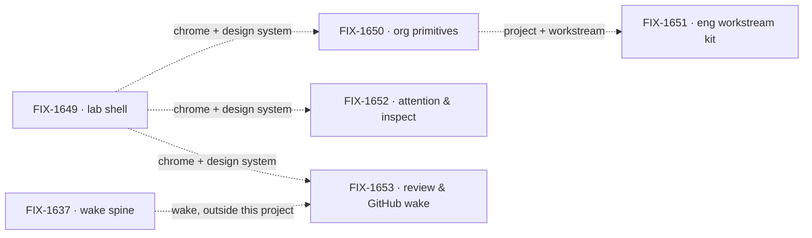

# Workforce App Lab

**Spec** · [Decisions](DECISIONS.md) · [Rules](BUSINESS-RULES.md) · [Plan](PLAN.md)

The Workforce app is the product surface Jake dogfoods: a Lab built completely on Workforce, with
one shell, one design system, and the org, workstream, attention and review surfaces a person
works in. Layer 2 vocabulary is not here; it stays in
[Workforce: Layer 2 Abstraction](https://linear.app/fixpoint-labs/project/workforce-layer-2-abstraction-9f5c6119ed12).

## The outcome

| | |
|---|---|
| **Winning when** | Jake runs his own work from the Lab: projects, workstreams, chat, attention and resources reached from one shell over live Workforce data, and DevForce and CyberForce run in it with no special wrapper |
| **The read** | Nav surfaces a person reaches in the Lab over live Workforce data, in the shared design system. Five named, zero today |
| **Now** | 0 done · 1 in flight · 4 not started. The shell (FIX-1649) is writing its epic spec; org primitives is the other Cycle 2 candidate; the other three are held |
| **Kill line** | If the Lab needs nouns of its own beside Workforce to be usable, the project is mis-shaped: the fix goes to Workforce, not into more Lab epics |

Above the fence is what this project builds; below it is what it consumes and never extends.
The fence is one test: a noun a second app would need goes to Workforce, not into the Lab.

## The epics — derived live 2026-09-29 23:06 UTC

| Epic | What it owns | State | Surface |
|---|---|---|---|
| [FIX-1649](https://linear.app/fixpoint-labs/issue/FIX-1649) · **lab shell** | The chrome, the new design system, nav to every surface, skinning of reused FSD components | **in flight**, epic spec being authored (Linear: Todo) | `epic/workforce-lab-shell`, no PR yet |
| [FIX-1650](https://linear.app/fixpoint-labs/issue/FIX-1650) · **org primitives** | Project, workstream as channel plus flow, CoS and Ops defaults, single user | *not started*, Cycle 2 candidate (Todo) | — |
| [FIX-1651](https://linear.app/fixpoint-labs/issue/FIX-1651) · **eng workstream kit** | Epic and issue thin sync, per-issue board, EM, Lead and specialist seats | *not started*, held (Backlog) | — |
| [FIX-1652](https://linear.app/fixpoint-labs/issue/FIX-1652) · **attention & inspect** | Needs-you, harness visibility, the resources list | *not started*, held (Backlog) | — |
| [FIX-1653](https://linear.app/fixpoint-labs/issue/FIX-1653) · **review & GitHub wake** | Review and GitHub wake as Layer 2 of the FIX-1637 wake spine | *not started*, held (Backlog) | — |

0 done · 1 in flight · 4 not started · 0 not filed. Every state is re-derived from Linear and the
epics' implementation PRs each refresh. **FIX-1649 reads Todo in Linear while its spec is being
written**; the table says *in flight* on the dispatch's word, and the next refresh re-reads it.

Every edge is soft, per the owner: none is a merge gate. The shell is first because every other
surface renders in it, and the eng kit waits on the workstream org primitives define.

## What this project is not

- **Not Layer 2 vocabulary.** Seat, channel, board and kind are decided in Layer 2 Abstraction;
  the Lab consumes them.
- **Not a Heartbeats, Paperclip or Grok Bot clone.** Their layout is a reference, not a target.
- **Not a Conductor or factory shell beside Workforce.** DevForce and CyberForce are Labs built on
  it, not siblings to it.
- **Not the kitchen-sink.** That stays the teach surface.
