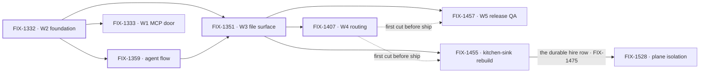

# Workforce: Layer 2 Abstraction

**Spec** · [Decisions](DECISIONS.md) · [Rules](BUSINESS-RULES.md) · [Plan](PLAN.md)

Layer 2 is the everyday API most people who use FSD will live in: Agents, Teams, and the
conventions that assemble them. It is transparently implemented on Layer 1 — no black box — but
the README, the docs and the common path lead with it. This project owns the vocabulary and the
epics that establish it.

## The outcome

| | |
|---|---|
| **Winning when** | Someone stands up a working team of agents from files alone — no TypeScript to declare a channel, a resource, or a skill — and Layer 1 stays fully available to anyone who wants past the conventions |
| **The read** | Layer 2 nouns that still require code to declare. Five at the start, and the count only moves when a convention ships with a reader and a proof |
| **Now** | **4 epics done** · 3 in flight · 1 not started. The floor is down: W3 and W4 both wrapped on Sep 20, so **every epic here that fenced its ship work on "after W4's first cut" is released**. Plane isolation passed its gate on Sep 23. 152 work issues, of which **75 sit under no epic** — the vocabulary era this project began in |
| **Kill line** | If real apps turn out to want to assemble Layer 2 themselves, this project is mis-shaped rather than unfinished: what changes is that the conventions become examples, not the remaining epic list |

Above the fence is what this project owns; below it is the substrate it assembles but does not
own. The fence is one question — *is there exactly one of it?* — and it is the test every epic
under this project is checked against.

## The epics — derived live 2026-09-24 00:01 UTC

| Epic | What it owns | State | Issues |
|---|---|---|---|
| [FIX-1332](https://linear.app/fixpoint-labs/issue/FIX-1332) · **W2 foundation** | Conventions, seat factory, thin Agent | **done** | 5/5 |
| [FIX-1359](https://linear.app/fixpoint-labs/issue/FIX-1359) · **default agent flow** | OOTB replaceable `agent` flow kind | **done** | 8/11 |
| [FIX-1351](https://linear.app/fixpoint-labs/issue/FIX-1351) · **W3 file surface** | Channels, resources, skills + a thin pentest lab | **done** | 19/20 |
| [FIX-1407](https://linear.app/fixpoint-labs/issue/FIX-1407) · **W4 routing** | Work routing & package cohesion | **done** | 7/9 |
| [FIX-1457](https://linear.app/fixpoint-labs/issue/FIX-1457) · **W5 release QA** | Three exit proofs that Layer 2 is ready to ship — Devtool reads a live hired Workforce, a DevForce Lab ships a real artifact, two seats collaborate | **in flight** | 3/8 |
| [FIX-1455](https://linear.app/fixpoint-labs/issue/FIX-1455) · **kitchen-sink rebuild** | The always-on reference consumer — durable hire, channels, shipped UI | **in flight** | 6/8 |
| [FIX-1528](https://linear.app/fixpoint-labs/issue/FIX-1528) · **plane isolation** | A private team stays in the org and with the person it was built for — every door into a hired seat | **in flight** — spec merged Sep 23, [#2103](https://github.com/fixpoint-labs/flow-state-dev/pull/2103) | 6/8 |
| [FIX-1333](https://linear.app/fixpoint-labs/issue/FIX-1333) · **W1 MCP door** | Client door over intake, boards, dispatcher | *not started* — **scope disputed** | — |

4 done · 3 in flight · 1 not started. Every number above is re-derived from Linear
and the epic PRs each refresh; none is carried forward.

**This is the case the two-source rule exists for, and each half caught one epic.** W4 reads
**done** from [#1905](https://github.com/fixpoint-labs/flow-state-dev/pull/1905), closed unmerged
01:02 UTC, while Linear says *In Review*. W3 was the mirror: Linear completed it at 01:05 and left
[#1718](https://github.com/fixpoint-labs/flow-state-dev/pull/1718) open until Sep 22, when it
closed and the two halves came to agree.
W2 and the agent flow wrapped the ordinary way; W5 is
[#1944](https://github.com/fixpoint-labs/flow-state-dev/pull/1944), amended by
[#2033](https://github.com/fixpoint-labs/flow-state-dev/pull/2033).

**Plane isolation passed its gate and is running.** Its spec merged to `main` at 23:58 UTC on
Sep 23 ([#2103](https://github.com/fixpoint-labs/flow-state-dev/pull/2103)) and Linear reads *In
Development*. Six of eight children are done: three shipped before the epic existed (FIX-1529 via
#2091, FIX-1525/1526 via #2079), both bugs have landed (FIX-1534 drain, FIX-1535 debug listing), and
FIX-1542 joined the set done. What is left is FIX-1538 — a hired seat's stored data per (org,
user), and the assembled proof — in spec, with the explore FIX-1522 in review. It closes the plane
gap for **hired seats only**; user planes wait on FIX-1486, outside this project.

**Both wraps are now folded.** What W3 and W4 settled for their siblings is in
[Decisions](DECISIONS.md) → *decided once*. What they **did not** settle is in the section below
it, kept separate on purpose: an unratified operating default, three items named out with no owner,
and a door whose owning issue reads Done while the code does not carry it. A wrap that recorded
those as answers would have manufactured four ratifications nobody gave.

**W5 is release QA now, not living assemblies.** The owner re-cut it on Sep 20 and Linear carries
the new title. W5 is done when three named exit proofs pass: **ER-Devtool**, a checklist green on a
live hired Workforce with no special wrapper; **ER-DevForce**, one DevForce path handing back a real
artifact; **ER-Collab**, two seats across a channel filing, assigning, draining and handing off,
observed in Devtool. That makes W5 the epic that **produces the evidence** this project's outcome is
read against. The DevForce and collab producers (FIX-1496, FIX-1497) read Done in Linear; the
Devtool checklist (FIX-1481) is in review. Rows 1–3 ride FIX-1320 and row 5 (FIX-1502, Backlog)
is blocked by FIX-1486, both outside this project; whether W5 exits on five rows of six is W5's
open question, not this one's. FIX-1467 is done; FIX-1468, FIX-1469 and FIX-1474
are backlog spin-offs, not proving legs. FIX-1458, people on the org chart, stays canceled.

**The kitchen-sink rebuild is an epic in its own right, by the owner's call on Sep 20.** FIX-1455
was filed Sep 19 as W5's child and un-parented the next day: the reference consumer is the
always-on Proof this project's outcome is read against — one app someone copies, standing up a
team from files. Its spec was approved Sep 21 ([#1978](https://github.com/fixpoint-labs/flow-state-dev/pull/1978)),
and six of eight children are done, including **durable hire** (FIX-1475), the roster row plane
isolation now fences. It was the second epic released by the floor coming down
([Decisions](DECISIONS.md) → *decided once*).

**W4 wrapped at 7 of 9 — growth, not a reopened set size.** The ratified five are all done;
FIX-1451 and FIX-1381 attached after the gate and are done too. What is left is two strays in
backlog — FIX-1460 (the fate of `unionAllowedTools`) and FIX-1461 (documenting
`registerCatalogTools`) — which the owner has said not to worry about, so they are **deliberately
deferred, not pending**. Whether the newcomers sat inside W4's exit gate was #1905's call and it
closed without saying; that orphan is carried in [Decisions](DECISIONS.md), still unresolved.

**W1's status comes from the issue; a second surface disagrees.** FIX-1333 has sat in **Todo**
since Sep 8 — never moved, nothing blocking it, priority **High**. The project's
[delivery countdown](https://linear.app/fixpoint-labs/document/workforce-delivery-countdown-e6b3b230c62d)
files it under *soft / follow-on*: **"W1 MCP (held) — not on the Workforce feature-complete
path."** Linear carries no hold, and the team has an **On Hold** status FIX-1333 is not in. *Not
started* and *out of scope* are different answers, so it stands as an ask:
[Decisions](DECISIONS.md) → Open.

**FIX-1359 is done with 8 of 11 issues closed** — a wrap that outran its children, or three issues
that should have left it. Left as Linear has it; the discrepancy is the signal.

Four heavy borders and three live nodes. **Plane isolation fences the hire row the kitchen-sink
rebuild made durable**, checked against FIX-1528's merged spec: it keeps FIX-1475's org-scoped
roster row and adds the owner pin to it, with no second store. FIX-1536, the reload fix under
FIX-1455, is related there, not re-parented.
**Both dotted edges have gone slack** — they carried the same condition, W4's first cut, and it
exists. W5 and the kitchen-sink rebuild are siblings, not a nesting, since Sep 20. W1,
depending on no file surface, remains the one epic that can sit unstarted without blocking
anything.

## What this project is not

- **Not where primitives live.** Blocks, resources, the task board's claim system and dispatch are
  Layer 1. They are assembled here and owned in `core` / `engine` / `orchestration`.
- **Not the implementation of Tasks, Skills internals, or Memory.** Those run in their own
  projects. This one owns the vocabulary and the few epics that establish the surfaces.
- **Not a lock on the model.** The vocabulary is ratified by concrete code shapes, not by
  agreement; see [Decisions](DECISIONS.md) → PD-4.
