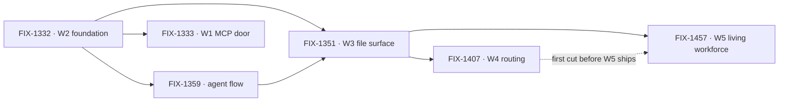

# Workforce: Layer 2 Abstraction

**Spec** · [Decisions](DECISIONS.md) · [Rules](BUSINESS-RULES.md) · [Plan](PLAN.md)

Layer 2 is the everyday API most people who use FSD will live in: Agents, Teams, and the
conventions that assemble them. It is transparently implemented on Layer 1 — no black box — but
the README, the docs and the common path lead with it. This project owns the vocabulary and the
epics that establish it.

## The outcome

| | |
|---|---|
| **Winning when** | Someone stands up a working team of agents from files alone — no TypeScript to declare a channel, a resource, or a skill — and Layer 1 stays fully available to anyone who wants past the conventions |
| **The read** | Layer 2 nouns that still require code to declare. Five at the start, and the count only moves when a convention ships with a reader and a proof |
| **Now** | 2 epics done · **2 in flight** · **1 at its objective gate** · 1 not started. W5 was filed Sep 19 as a sibling of W4, not a child of it. 101 work issues, of which **45 sit under no epic** — the vocabulary era this project began in |
| **Kill line** | If real apps turn out to want to assemble Layer 2 themselves, this project is mis-shaped rather than unfinished: what changes is that the conventions become examples, not the remaining epic list |

Above the fence is what this project owns; below it is the substrate it assembles but does not
own. The fence is one question — *is there exactly one of it?* — and it is the test every epic
under this project is checked against.

## The epics — derived live 2026-09-19 23:46 UTC

| Epic | What it owns | State | Issues |
|---|---|---|---|
| [FIX-1332](https://linear.app/fixpoint-labs/issue/FIX-1332) · **W2 foundation** | Conventions, seat factory, thin Agent | **done** | 5/5 |
| [FIX-1359](https://linear.app/fixpoint-labs/issue/FIX-1359) · **default agent flow** | OOTB replaceable `agent` flow kind | **done** | 7/11 |
| [FIX-1351](https://linear.app/fixpoint-labs/issue/FIX-1351) · **W3 file surface** | Channels, resources, skills + a thin pentest lab | **in flight** | 19/22 |
| [FIX-1407](https://linear.app/fixpoint-labs/issue/FIX-1407) · **W4 routing** | Work routing & package cohesion | **in flight** | 4/9 |
| [FIX-1457](https://linear.app/fixpoint-labs/issue/FIX-1457) · **W5 living workforce** | Humans in seats, and reference apps that run on the surface | *at its objective gate* | 0/2 |
| [FIX-1333](https://linear.app/fixpoint-labs/issue/FIX-1333) · **W1 MCP door** | Client door over intake, boards, dispatcher | *not started* — **scope disputed** | — |

2 done · 2 in flight · 1 at its gate · 1 not started. Every number above is re-derived from Linear
and the epic PRs each refresh; none is carried forward.

**The epic PRs are the other half of this table**, because an epic wraps by closing its PR unmerged
and leaves its Linear state alone. W2 and the agent flow read *done* that way
([#1664](https://github.com/fixpoint-labs/flow-state-dev/pull/1664),
[#1730](https://github.com/fixpoint-labs/flow-state-dev/pull/1730), closed unmerged); W3 is *in
flight* on [#1718](https://github.com/fixpoint-labs/flow-state-dev/pull/1718), W4 on
[#1905](https://github.com/fixpoint-labs/flow-state-dev/pull/1905). **W5 has no PR cell yet** —
`epic/living-workforce` carried none at this read, so the branch is the handle until one opens.

**W5 is a sibling of W4, not a stage inside it.** Filed Sep 19, at its objective gate: humans
occupying seats the same way agents do, and reference apps that run on the file surface rather than
demonstrate it. Two children — FIX-1458 (explore, runnable now) and FIX-1455, a nested child epic
for the kitchen-sink rebuild, held. Exploring and speccing are sanctioned now; **shipping is
soft-after W4's first cut** ([Plan](PLAN.md)).

**W4's count moved because the epic grew, not because its set size reopened.** The five the owner
ratified on Sep 19 stand at 3 of 5. Four children have been attached since: FIX-1451 (done),
FIX-1381 (in spec review), FIX-1460 and FIX-1461 (backlog) — so the live derivation returns
**4/9**. Whether the newcomers sit inside W4's exit gate is
[#1905](https://github.com/fixpoint-labs/flow-state-dev/pull/1905)'s call, not this table's.

**W1's status comes from the issue; a second surface disagrees.** FIX-1333 has sat in **Todo**
since Sep 8 — never moved, nothing blocking it, priority **High**. The project's
[delivery countdown](https://linear.app/fixpoint-labs/document/workforce-delivery-countdown-e6b3b230c62d)
files it under *soft / follow-on*: **"W1 MCP (held) — not on the Workforce feature-complete
path."** Linear carries no hold, and the team has an **On Hold** status FIX-1333 is not in. *Not
started* and *out of scope* are different answers, so it stands as an ask:
[Decisions](DECISIONS.md) → Open.

**FIX-1359 is done with 7 of 11 issues closed** — a wrap that outran its children, or four issues
that should have left it. Left as Linear has it; the discrepancy is the signal.

W2's conventions and seat factory are what everything else builds on. The dotted edge is the only
soft one — W5 explores now and waits on W4 only to ship — and W1, depending on no file surface, is
the one epic that can sit unstarted without blocking anything.

## What this project is not

- **Not where primitives live.** Blocks, resources, the task board's claim system and dispatch are
  Layer 1. They are assembled here and owned in `core` / `engine` / `orchestration`.
- **Not the implementation of Tasks, Skills internals, or Memory.** Those run in their own
  projects. This one owns the vocabulary and the few epics that establish the surfaces.
- **Not a lock on the model.** The vocabulary is ratified by concrete code shapes, not by
  agreement; see [Decisions](DECISIONS.md) → PD-4.
