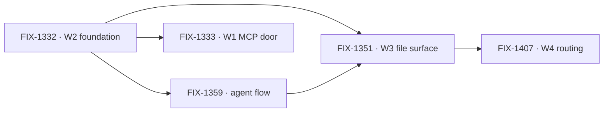

# Workforce: Layer 2 Abstraction

**Spec** · [Decisions](DECISIONS.md) · [Rules](BUSINESS-RULES.md) · [Plan](PLAN.md)

Layer 2 is the everyday API most people who use FSD will live in: Agents, Teams, and the
conventions that assemble them. It is transparently implemented on Layer 1 — no black box — but
the README, the docs and the common path lead with it. This project owns the vocabulary and the
epics that establish it.

## The outcome

| | |
|---|---|
| **Winning when** | Someone stands up a working team of agents from files alone — no TypeScript to declare a channel, a resource, or a skill — and Layer 1 stays fully available to anyone who wants past the conventions |
| **The read** | Layer 2 nouns that still require code to declare. Five at the start, and the count only moves when a convention ships with a reader and a proof |
| **Now** | 2 epics done · 1 in flight · 1 standing up its spec · 1 not started. 91 work issues, of which **40 still sit under no epic** — the vocabulary era this project began in, before the epic structure existed |
| **Kill line** | If real apps turn out to want to assemble Layer 2 themselves, this project is mis-shaped rather than unfinished: what changes is that the conventions become examples, not the remaining epic list |

Above the fence is what this project owns; below it is the substrate it assembles but does not
own. The fence is one question — *is there exactly one of it?* — and it is the test every epic
under this project is checked against.

## The epics — as of 2026-09-18

| Epic | What it owns | State | Issues |
|---|---|---|---|
| [FIX-1332](https://linear.app/fixpoint-labs/issue/FIX-1332) · **W2 foundation** | Conventions, seat factory, thin Agent | **done** | 5/5 |
| [FIX-1359](https://linear.app/fixpoint-labs/issue/FIX-1359) · **default agent flow** | OOTB replaceable `agent` flow kind | **done** | 7/11 |
| [FIX-1351](https://linear.app/fixpoint-labs/issue/FIX-1351) · **W3 file surface** | Channels, resources, skills + a thin pentest lab | **in flight** | 16/21 |
| [FIX-1407](https://linear.app/fixpoint-labs/issue/FIX-1407) · **W4 routing** | Work routing & package cohesion | *spec in progress* | 1/7 |
| [FIX-1333](https://linear.app/fixpoint-labs/issue/FIX-1333) · **W1 MCP door** | Client door over intake, boards, dispatcher | *not started* | — |

2 done · 1 in flight · 1 standing up its spec · 1 not started.

**The epic PRs are the other half of this table**, because an epic wraps by closing its PR unmerged
and leaves its Linear state alone. W2 and the agent flow read *done* that way
([#1664](https://github.com/fixpoint-labs/flow-state-dev/pull/1664),
[#1730](https://github.com/fixpoint-labs/flow-state-dev/pull/1730)); W3 is *in flight* on
[#1718](https://github.com/fixpoint-labs/flow-state-dev/pull/1718). W4's epic-spec is being written
on `epic/work-routing-package-cohesion` and **its PR number is not in yet** — the next refresh fills
that cell rather than guessing it.

**Two things in that table are worth reading twice.** The numbering is not the order — W1 was filed
the same day as W2 and has not started, while W2 finished in four days. And **FIX-1359 is marked
done with 7 of 11 issues closed**, which is either a wrap that outran its children or four issues
that should have moved out of it; it is recorded here as Linear has it rather than tidied, because
the discrepancy is the useful signal.

W2's conventions and seat factory are what everything else builds on. W1 is the one epic that does
not depend on the file surface, which is why it can sit unstarted without blocking anything.

## What this project is not

- **Not where primitives live.** Blocks, resources, the task board's claim system and dispatch are
  Layer 1. They are assembled here and owned in `core` / `engine` / `orchestration`.
- **Not the implementation of Tasks, Skills internals, or Memory.** Those run in their own
  projects. This one owns the vocabulary and the few epics that establish the surfaces.
- **Not a lock on the model.** The vocabulary is ratified by concrete code shapes, not by
  agreement; see [Decisions](DECISIONS.md) → PD-4.
