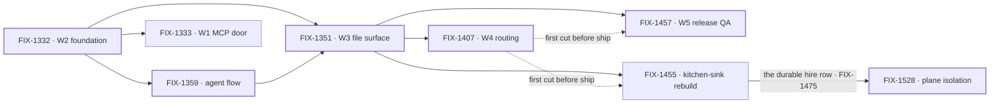

# Workforce: Layer 2 Abstraction

**Spec** · [Decisions](DECISIONS.md) · [Rules](BUSINESS-RULES.md) · [Plan](PLAN.md)

Layer 2 is the everyday API most people who use FSD will live in: Agents, Teams, and the
conventions that assemble them. It is transparently implemented on Layer 1 — no black box — but
the README, the docs and the common path lead with it. This project owns the vocabulary and the
epics that establish it.

## The outcome

| | |
|---|---|
| **Winning when** | Someone stands up a working team of agents from files alone — no TypeScript to declare a channel, a resource, or a skill — and Layer 1 stays fully available to anyone who wants past the conventions |
| **The read** | Layer 2 nouns that still require code to declare. Five at the start, and the count only moves when a convention ships with a reader and a proof |
| **Now** | **6 epics done** · 1 in flight · 1 not started. The floor is down: W3 and W4 both wrapped on Sep 20, so **every epic here that fenced its ship work on "after W4's first cut" is released**. Plane isolation wrapped on Sep 24, 8 of 8. **W5 wrapped the same day with all three exit proofs met**, so the release evidence this outcome is read against exists: a live hired Workforce read in Devtool, a DevForce path handing back a real artifact, two seats collaborating across a channel. The kitchen-sink rebuild is the one epic still running. 164 work issues, of which **84 have no parent**: the vocabulary era this project began in, now joined by the follow-ups two wraps left behind |
| **Kill line** | If real apps turn out to want to assemble Layer 2 themselves, this project is mis-shaped rather than unfinished: what changes is that the conventions become examples, not the remaining epic list |

Above the fence is what this project owns; below it is the substrate it assembles but does not
own. The fence is one question — *is there exactly one of it?* — and it is the test every epic
under this project is checked against.

## The epics — derived live 2026-09-24 19:40 UTC

| Epic | What it owns | State | Issues |
|---|---|---|---|
| [FIX-1332](https://linear.app/fixpoint-labs/issue/FIX-1332) · **W2 foundation** | Conventions, seat factory, thin Agent | **done** | 5/5 |
| [FIX-1359](https://linear.app/fixpoint-labs/issue/FIX-1359) · **default agent flow** | OOTB replaceable `agent` flow kind | **done** | 8/11 |
| [FIX-1351](https://linear.app/fixpoint-labs/issue/FIX-1351) · **W3 file surface** | Channels, resources, skills + a thin pentest lab | **done** | 19/20 |
| [FIX-1407](https://linear.app/fixpoint-labs/issue/FIX-1407) · **W4 routing** | Work routing & package cohesion | **done** | 9/9 |
| [FIX-1457](https://linear.app/fixpoint-labs/issue/FIX-1457) · **W5 release QA** | Three exit proofs that Layer 2 is ready to ship — Devtool reads a live hired Workforce, a DevForce Lab ships a real artifact, two seats collaborate | **done** — wrapped Sep 24 | 6/6 |
| [FIX-1455](https://linear.app/fixpoint-labs/issue/FIX-1455) · **kitchen-sink rebuild** | The always-on reference consumer — durable hire, channels, shipped UI | **in flight** | 7/13 |
| [FIX-1528](https://linear.app/fixpoint-labs/issue/FIX-1528) · **plane isolation** | A private team stays in the org and with the person it was built for — every door into a hired seat | **done** — wrapped Sep 24 | 8/8 |
| [FIX-1333](https://linear.app/fixpoint-labs/issue/FIX-1333) · **W1 MCP door** | Client door over intake, boards, dispatcher | *not started* — **scope disputed** | — |

6 done · 1 in flight · 1 not started. Every number above is re-derived from Linear
and the child implementation PRs each refresh; none is carried forward.

**The two halves now agree on every wrapped epic but one, and that one is by sequence.** W4's
Linear state caught up with its wrap on Sep 24 at 18:02 UTC, 9 of 9, after reading *In Review*
since [#1905](https://github.com/fixpoint-labs/flow-state-dev/pull/1905) closed on Sep 20. **W5
still reads *In Development* in Linear at this derivation**: the coordinator moves it to Done once
this update lands. Its six children are all Done and its wrap record is below, so the row reads
done on the wrap, not on the spec PR, which merged at direction approval.

**Plane isolation wrapped on Sep 24, all eight children merged.** Linear reads *Done*. The last
two children merged that day: FIX-1538, a hired seat's data per (org, person), with the assembled
proof ([#2127](https://github.com/fixpoint-labs/flow-state-dev/pull/2127), spec
[#2121](https://github.com/fixpoint-labs/flow-state-dev/pull/2121)), and the explore FIX-1522
([#2070](https://github.com/fixpoint-labs/flow-state-dev/pull/2070)). So did the amendment
[#2126](https://github.com/fixpoint-labs/flow-state-dev/pull/2126), which narrowed its ER-5 to what
FIX-1538 guarantees. `goals/hire-plane/keeps-a-private-team-in-the-org-it-was-built-in/` passes on
`main`. It closed the plane gap for **hired seats only**; user planes wait on FIX-1486, outside this
project. What it settled for its siblings is in [Decisions](DECISIONS.md) → *decided once*, and its
ER-12 is now PR-7. Its follow-ups sit in this project under no epic, and the fence still leans on
FIX-1503 outside it ([Plan](PLAN.md) → *Follow-ups with no epic*).

**Every wrap is folded.** What W3 and W4 settled for their siblings is in
[Decisions](DECISIONS.md) → *decided once*. What they **did not** settle is in the section below
it, kept separate on purpose: an unratified operating default, three items named out with no owner,
and a door whose owning issue reads Done while the code does not carry it. A wrap that recorded
those as answers would have manufactured four ratifications nobody gave.

**W5 wrapped on Sep 24 with all three exit proofs met**, six of six children Done (FIX-1467,
FIX-1481, FIX-1496, FIX-1497, FIX-1502, FIX-1547). **ER-DevForce** passed on
[#2051](https://github.com/fixpoint-labs/flow-state-dev/pull/2051) and was re-proved by FIX-1515
([#2073](https://github.com/fixpoint-labs/flow-state-dev/pull/2073)). **ER-Collab** passed on
[#2065](https://github.com/fixpoint-labs/flow-state-dev/pull/2065). **ER-Devtool** is met on its
defined terms, which are narrower than *six rows green live*: row 4 live
([#2066](https://github.com/fixpoint-labs/flow-state-dev/pull/2066)), row 5 live with the debug
endpoints off (FIX-1502, [#2147](https://github.com/fixpoint-labs/flow-state-dev/pull/2147), merged
19:00 UTC), row 6 by automated checks with its live read carried to the kitchen-sink rebuild, and
rows 1–3 riding FIX-1320 in another project. No W5 PR touched `core` or `contracts`. What W5
settled for its siblings is in [Decisions](DECISIONS.md) → *decided once*, and its follow-ups are
in [Plan](PLAN.md) → *Follow-ups with no epic*. The retained spec is `specs/epics/FIX-1457/`.

**The kitchen-sink rebuild is an epic in its own right, by the owner's call on Sep 20.** FIX-1455
was filed Sep 19 as W5's child and un-parented the next day: the reference consumer is the
always-on Proof this project's outcome is read against — one app someone copies, standing up a
team from files. Its spec was approved Sep 21 ([#1978](https://github.com/fixpoint-labs/flow-state-dev/pull/1978)),
and seven of thirteen children are done, including **durable hire** (FIX-1475), the roster row plane
isolation fenced. FIX-1527 (a manager seat that hires) and FIX-1500 (the human rail's org and seat
path) are in development, and both are where PR-7 bites. It was the second epic released by the floor coming down
([Decisions](DECISIONS.md) → *decided once*). **It now carries one of W5's debts**: the first real
hire declaring a `references/` document or an `ro` grant reads Devtool's row 6 live, and FIX-1469
moved under it from W5 at the wrap.

**W4 now reads 9 of 9.** The ratified five are done; FIX-1451 and FIX-1381 attached after the
gate, and the two strays the owner said not to worry about, FIX-1460 and FIX-1461, are Done too.
Whether the newcomers sat inside W4's exit gate was #1905's call and it closed without saying; that
orphan is carried in [Decisions](DECISIONS.md), still unresolved.

**W1's status comes from the issue; a second surface disagrees.** FIX-1333 has sat in **Todo**
since Sep 8 — never moved, nothing blocking it, priority **High**. The project's
[delivery countdown](https://linear.app/fixpoint-labs/document/workforce-delivery-countdown-e6b3b230c62d)
files it under *soft / follow-on*: **"W1 MCP (held) — not on the Workforce feature-complete
path."** Linear carries no hold, and the team has an **On Hold** status FIX-1333 is not in. *Not
started* and *out of scope* are different answers, so it stands as an ask:
[Decisions](DECISIONS.md) → Open.

**FIX-1359 is done with 8 of 11 issues closed** — a wrap that outran its children, or three issues
that should have left it. Left as Linear has it; the discrepancy is the signal.

Six heavy borders and one live node, the kitchen-sink rebuild. **Plane isolation fences the hire row the kitchen-sink
rebuild made durable**: it kept FIX-1475's org-scoped roster row and added the owner pin to it,
with no second store. FIX-1536, the reload fix under
FIX-1455, is related there, not re-parented.
**Both dotted edges have gone slack** — they carried the same condition, W4's first cut, and it
exists. W5 and the kitchen-sink rebuild are siblings, not a nesting, since Sep 20. W1,
depending on no file surface, remains the one epic that can sit unstarted without blocking
anything.

## What this project is not

- **Not where primitives live.** Blocks, resources, the task board's claim system and dispatch are
  Layer 1. They are assembled here and owned in `core` / `engine` / `orchestration`.
- **Not the implementation of Tasks, Skills internals, or Memory.** Those run in their own
  projects. This one owns the vocabulary and the few epics that establish the surfaces.
- **Not a lock on the model.** The vocabulary is ratified by concrete code shapes, not by
  agreement; see [Decisions](DECISIONS.md) → PD-4.
