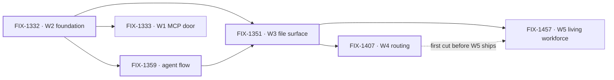

# Workforce: Layer 2 Abstraction

**Spec** · [Decisions](DECISIONS.md) · [Rules](BUSINESS-RULES.md) · [Plan](PLAN.md)

Layer 2 is the everyday API most people who use FSD will live in: Agents, Teams, and the
conventions that assemble them. It is transparently implemented on Layer 1 — no black box — but
the README, the docs and the common path lead with it. This project owns the vocabulary and the
epics that establish it.

## The outcome

| | |
|---|---|
| **Winning when** | Someone stands up a working team of agents from files alone — no TypeScript to declare a channel, a resource, or a skill — and Layer 1 stays fully available to anyone who wants past the conventions |
| **The read** | Layer 2 nouns that still require code to declare. Five at the start, and the count only moves when a convention ships with a reader and a proof |
| **Now** | **4 epics done** · 1 in flight · 1 not started. W4 and W3 wrapped three minutes apart on Sep 20. 101 work issues, of which **47 sit under no epic** — the vocabulary era this project began in |
| **Kill line** | If real apps turn out to want to assemble Layer 2 themselves, this project is mis-shaped rather than unfinished: what changes is that the conventions become examples, not the remaining epic list |

Above the fence is what this project owns; below it is the substrate it assembles but does not
own. The fence is one question — *is there exactly one of it?* — and it is the test every epic
under this project is checked against.

## The epics — derived live 2026-09-20 01:30 UTC

| Epic | What it owns | State | Issues |
|---|---|---|---|
| [FIX-1332](https://linear.app/fixpoint-labs/issue/FIX-1332) · **W2 foundation** | Conventions, seat factory, thin Agent | **done** | 5/5 |
| [FIX-1359](https://linear.app/fixpoint-labs/issue/FIX-1359) · **default agent flow** | OOTB replaceable `agent` flow kind | **done** | 7/11 |
| [FIX-1351](https://linear.app/fixpoint-labs/issue/FIX-1351) · **W3 file surface** | Channels, resources, skills + a thin pentest lab | **done** | 19/20 |
| [FIX-1407](https://linear.app/fixpoint-labs/issue/FIX-1407) · **W4 routing** | Work routing & package cohesion | **done** | 5/9 |
| [FIX-1457](https://linear.app/fixpoint-labs/issue/FIX-1457) · **W5 living workforce** | Humans in seats, and reference apps that run on the surface | **in flight** | 0/2 |
| [FIX-1333](https://linear.app/fixpoint-labs/issue/FIX-1333) · **W1 MCP door** | Client door over intake, boards, dispatcher | *not started* — **scope disputed** | — |

4 done · 1 in flight · 1 not started. Every number above is re-derived from Linear and the epic PRs
each refresh; none is carried forward.

**This refresh is the case the two-source rule exists for.** W4 reads **done** from
[#1905](https://github.com/fixpoint-labs/flow-state-dev/pull/1905) — closed unmerged 01:02 UTC —
while its Linear issue still says *In Development*, so a Linear-only read would have called it in
flight. W3 is the mirror: Linear completed it at 01:05 and left
[#1718](https://github.com/fixpoint-labs/flow-state-dev/pull/1718) open, which a PR-only read would
have missed. W2 and the agent flow wrapped the ordinary way
([#1664](https://github.com/fixpoint-labs/flow-state-dev/pull/1664),
[#1730](https://github.com/fixpoint-labs/flow-state-dev/pull/1730)). W5's cell, empty last refresh,
resolves to [#1944](https://github.com/fixpoint-labs/flow-state-dev/pull/1944).

**Neither wrap has been folded at this altitude.** A wrap is when an epic settles cross-epic
knowledge, and recording it belongs to the `update` action, not to a status refresh. W3's and W4's
*decided once* rows are **owed, not absent**: the status above is current, the decisions behind it
are not yet here.

**W5 is now the only epic building.** [#1944](https://github.com/fixpoint-labs/flow-state-dev/pull/1944)
carries `spec approved` and one folded review round. Neither child has started — FIX-1458 (explore)
and FIX-1455, a nested child epic that runs its own lifecycle and files no spec PR here (W5's
ER-15). Its ship half waited on W4's first cut, and **W4 has wrapped**, so that fence is W5's
sequencing call rather than a standing hold ([Plan](PLAN.md)).

**W4 wrapped at 5 of 9 — growth, not a reopened set size.** The ratified five stand at 4 of 5
(FIX-1405 in review, FIX-1430 spec-approved); FIX-1451 and FIX-1381 (done), FIX-1460 and FIX-1461
(backlog) attached after the gate. Whether the newcomers sat inside W4's exit gate was #1905's call
and it closed without saying; not resolved here.

**W1's status comes from the issue; a second surface disagrees.** FIX-1333 has sat in **Todo**
since Sep 8 — never moved, nothing blocking it, priority **High**. The project's
[delivery countdown](https://linear.app/fixpoint-labs/document/workforce-delivery-countdown-e6b3b230c62d)
files it under *soft / follow-on*: **"W1 MCP (held) — not on the Workforce feature-complete
path."** Linear carries no hold, and the team has an **On Hold** status FIX-1333 is not in. *Not
started* and *out of scope* are different answers, so it stands as an ask:
[Decisions](DECISIONS.md) → Open.

**FIX-1359 is done with 7 of 11 issues closed** — a wrap that outran its children, or four issues
that should have left it. Left as Linear has it; the discrepancy is the signal.

Four heavy borders and one live node: everything W5 was sequenced behind has now wrapped. The
dotted edge was the only soft one and it has gone slack — W4's first cut exists, so nothing
upstream is still holding W5's ship half. W1, depending on no file surface, remains the one epic
that can sit unstarted without blocking anything.

## What this project is not

- **Not where primitives live.** Blocks, resources, the task board's claim system and dispatch are
  Layer 1. They are assembled here and owned in `core` / `engine` / `orchestration`.
- **Not the implementation of Tasks, Skills internals, or Memory.** Those run in their own
  projects. This one owns the vocabulary and the few epics that establish the surfaces.
- **Not a lock on the model.** The vocabulary is ratified by concrete code shapes, not by
  agreement; see [Decisions](DECISIONS.md) → PD-4.
