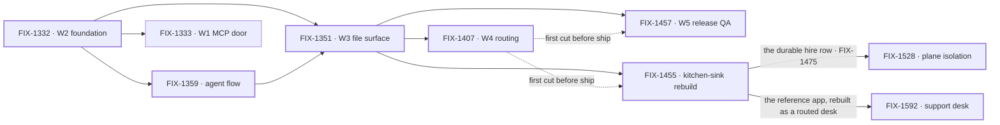

# Workforce: Layer 2 Abstraction

**Spec** · [Decisions](DECISIONS.md) · [Rules](BUSINESS-RULES.md) · [Plan](PLAN.md)

Layer 2 is the everyday API most people who use FSD will live in: Agents, Teams, and the
conventions that assemble them. It is transparently implemented on Layer 1 — no black box — but
the README, the docs and the common path lead with it. This project owns the vocabulary and the
epics that establish it.

## The outcome

| | |
|---|---|
| **Winning when** | Someone stands up a working team of agents from files alone — no TypeScript to declare a channel, a resource, or a skill — and Layer 1 stays fully available to anyone who wants past the conventions |
| **The read** | Layer 2 nouns that still require code to declare. Five at the start, and the count only moves when a convention ships with a reader and a proof |
| **Now** | **8 epics done** · 0 in flight · 1 not started. The support desk wrapped on Sep 29: in kitchen-sink a person asks one routed channel a question and, with no reload, the one specialist whose purpose fits starts work and answers there. The team is declared in five files, four `WORKER.md` and a `CHANNEL.md` that opts into routing; the app's TypeScript still wires the route's model and the escalation tool. **No epic is running.** W1 is the only one not done. 218 work issues, of which **114 have no parent** |
| **Kill line** | If real apps turn out to want to assemble Layer 2 themselves, this project is mis-shaped rather than unfinished: what changes is that the conventions become examples, not the remaining epic list |

Above the fence is what this project owns; below it is the substrate it assembles but does not
own. The fence is one question — *is there exactly one of it?* — and it is the test every epic
under this project is checked against.

## The epics — derived live 2026-09-29 00:40 UTC

| Epic | What it owns | State | Issues |
|---|---|---|---|
| [FIX-1332](https://linear.app/fixpoint-labs/issue/FIX-1332) · **W2 foundation** | Conventions, seat factory, thin Agent | **done** | 5/5 |
| [FIX-1359](https://linear.app/fixpoint-labs/issue/FIX-1359) · **default agent flow** | OOTB replaceable `agent` flow kind | **done** | 8/11 |
| [FIX-1351](https://linear.app/fixpoint-labs/issue/FIX-1351) · **W3 file surface** | Channels, resources, skills + a thin pentest lab | **done** | 19/20 |
| [FIX-1407](https://linear.app/fixpoint-labs/issue/FIX-1407) · **W4 routing** | Work routing & package cohesion | **done** | 9/9 |
| [FIX-1457](https://linear.app/fixpoint-labs/issue/FIX-1457) · **W5 release QA** | Three exit proofs that Layer 2 is ready to ship — Devtool reads a live hired Workforce, a DevForce Lab ships a real artifact, two seats collaborate | **done** — wrapped Sep 24 | 7/7 |
| [FIX-1455](https://linear.app/fixpoint-labs/issue/FIX-1455) · **kitchen-sink rebuild** | The always-on reference consumer — durable hire, channels, shipped UI | **done** — wrapped Sep 24 | 16/16 |
| [FIX-1528](https://linear.app/fixpoint-labs/issue/FIX-1528) · **plane isolation** | A private team stays in the org and with the person it was built for — every door into a hired seat | **done** — wrapped Sep 24 | 8/8 |
| [FIX-1592](https://linear.app/fixpoint-labs/issue/FIX-1592) · **support desk** | One support conversation in kitchen-sink, routed to the specialist whose purpose fits, answered live, each specialist keeping only its own cases | **done** — wrapped Sep 29 | 20/20 |
| [FIX-1333](https://linear.app/fixpoint-labs/issue/FIX-1333) · **W1 MCP door** | Client door over intake, boards, dispatcher | *not started* — **scope disputed** | — |

8 done · 0 in flight · 1 not started. Every number above is re-derived from Linear and the child
implementation PRs each refresh; none is carried forward.

**The two halves agree on every wrapped epic.** Each reads Done in Linear, and each wrap record
names its merged implementations; this pass re-checked the support desk's twenty one by one, and
each has its implementation PR merged. Two old gaps stay as Linear has them, because the
discrepancy is the signal: FIX-1359 is done with 8 of 11 closed, three Backlog issues that should
have left it or a wrap that outran them, and W3's twentieth is a Duplicate. The kitchen-sink
rebuild now reads 16 of 16: two fixes attached after its wrap, and FIX-1469 left it with no parent.

**The support desk wrapped on Sep 29, 20 of 20**, Done in Linear a minute after its closure,
FIX-1601, merged ([#2348](https://github.com/fixpoint-labs/flow-state-dev/pull/2348)). It ran as a
follow-on on the reference app, not a reopen of the rebuild. The owner hand-tested its first desk on
a real model on Sep 26 and it failed him: a reply only after a reload, a missing answer, a roster
of named seats with no jobs. On Sep 27 he had it rebuilt in the epic as a routed desk
([#2310](https://github.com/fixpoint-labs/flow-state-dev/pull/2310)): one channel, specialists
for devices, accounts and FSD, and a general fallback. The closure passed on one `main` commit,
reading the page before any reload, with seven controls each shown to break only its own part, a
real-model smoke, and a docs walk-through by an agent that had read no spec.

What it settled for its siblings is in [Decisions](DECISIONS.md) → *decided once*: who hears a
routed post, where a channel's lines live, and what the reference app shows. It added a
prohibition to [Rules](BUSINESS-RULES.md): no Workforce word in Layer 1. **It also reversed part of
a wrapped sibling.** Kitchen-sink no longer hires from the page or runs a manager seat that hires
(its D8, the owner's call); page hiring returns with FIX-1415. Its follow-ups sit under no epic
([Plan](PLAN.md) → *Follow-ups with no epic*), and one limit has no ticket at all: behind BullMQ a
routed channel keeps the post and nobody answers ([Decisions](DECISIONS.md) → *Recorded at the
wrap*, 6).

**Earlier wraps are folded.** What W3, W4, W5, plane isolation and the kitchen-sink rebuild
settled is in *decided once*. What W3 and W4 did **not** settle stays in the section after it,
apart, so no wrap manufactures a ratification nobody gave. W5's Devtool proof is met on its
defined terms, which are narrower than six rows green live: rows 1–3 ride FIX-1320 in another
project, and row 6 is proved only by automated checks. FIX-1469, which carries row 6's live read,
has no epic.

**W1's status comes from the issue; a second surface disagrees.** FIX-1333 has sat in **Todo**
since Sep 8, priority **High**, nothing blocking it. The project's
[delivery countdown](https://linear.app/fixpoint-labs/document/workforce-delivery-countdown-e6b3b230c62d)
files it under *soft / follow-on*: **"W1 MCP (held) — not on the Workforce feature-complete
path."** Linear carries no hold, and FIX-1333 is not in the team's **On Hold** status. *Not
started* and *out of scope* are different answers, and with every other epic done this one decides
whether the project has anything left to run: [Decisions](DECISIONS.md) → Open.

```mermaid
flowchart LR
  W2["FIX-1332 · W2 foundation"] --> AF["FIX-1359 · agent flow"]
  W2 --> W3["FIX-1351 · W3 file surface"]
  AF --> W3
  W3 --> W4["FIX-1407 · W4 routing"]
  W3 --> W5["FIX-1457 · W5 release QA"]
  W3 --> KS["FIX-1455 · kitchen-sink rebuild"]
  W4 -.->|"first cut before ship"| W5
  W4 -.->|"first cut before ship"| KS
  KS -->|"the durable hire row · FIX-1475"| PI["FIX-1528 · plane isolation"]
  KS -->|"the reference app, rebuilt as a routed desk"| SD["FIX-1592 · support desk"]
  W2 --> W1["FIX-1333 · W1 MCP door"]
  classDef done stroke-width:2px
  class W2,AF,W3,W4,W5,KS,PI,SD done
```

Eight heavy borders and no live node. Plane isolation and the support desk both build on the
kitchen-sink rebuild: one fenced the hire row it made durable, the other rebuilt the app on top of
it and cut part of what it shipped. Both dotted edges are slack, since W4's first cut exists. W1,
depending on no file surface, is the one epic that can sit unstarted without blocking anything.

## What this project is not

- **Not where primitives live.** Blocks, resources, the task board's claim system and dispatch are
  Layer 1. They are assembled here and owned in `core` / `engine` / `orchestration`.
- **Not the implementation of Tasks, Skills internals, or Memory.** Those run in their own
  projects. This one owns the vocabulary and the few epics that establish the surfaces.
- **Not a lock on the model.** The vocabulary is ratified by concrete code shapes, not by
  agreement; see [Decisions](DECISIONS.md) → PD-4.
