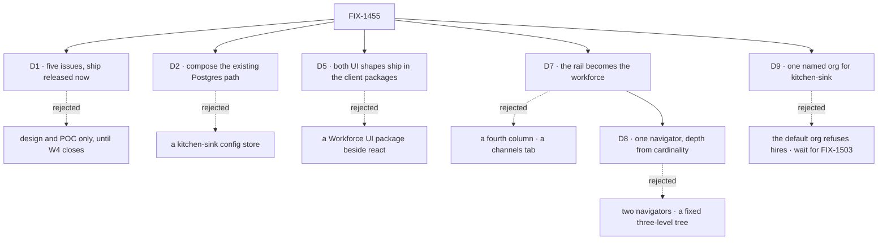

# FIX-1455 · Decisions

[Spec](SPEC.md) · **Decisions** · [Rules](BUSINESS-RULES.md) · [Plan](PLAN.md) · [Docs](DOCS.md) · [Evolution](EVOLUTION.md)

The calls that sit above any single issue. Six of them are locks the epic body and the Architect
already made — they are recorded here so no child reopens them, not re-argued. **Two are new:
[D7](#d7)**, what the app's persistent rail is for, and **[D8](#d8)**, how you browse the
workforce inside it. **[D9](#d9)**, which organization kitchen-sink runs under, came after the
merge. Those are the three to read.

## The tree

D3, D4 and D6 are vocabulary and invent-kill locks with no live alternative; they are cards
below rather than branches above.

## D1 · Five issues under one objective, and ship work is released now

| | |
|---|---|
| **Instead of** | Design and POC only, holding ship work until W4's epic closes · or four issues, folding the patterns shed into the UI row |
| **Because** | The epic body fences *ship* on "W3 floor or that W4 first-cut still open". Both are closed, verified 2026-09-20: FIX-1351 is Done (19 of 20 children Done, one Duplicate); FIX-1385, FIX-1405 and FIX-1408 are all Done. FIX-1407 remains In Review carrying only FIX-1461 (docs) and FIX-1460 (a dead-helper decision) — neither is the first cut |
| **Locks in** | Children may open implementation PRs, not only specs. If FIX-1407's two strays turn out to change the first cut, that is a re-gate on this card, not a per-child decision |

**What would change my mind:** evidence that W4's two open strays move a surface a child builds
on. Then this epic returns to design and POC and the fence goes back up.

**The set grew to seven on 2026-09-24**: FIX-1500 and FIX-1527 joined under
[ER-21](BUSINESS-RULES.md). That is the open set working, not a re-scope of this card. The
objective and the lifted fence are unchanged.

## D2 · Durable hire composes the persistence the app already has

| | |
|---|---|
| **Instead of** | A kitchen-sink-owned config store · a process-only roster that dies with the deploy (`openLab()`-shaped) |
| **Because** | A fifth persistence layer in the app that exists to teach the fourth is the worst possible lesson. The Postgres path is already wired in kitchen-sink for everything else it keeps |
| **Locks in** | FIX-1475 writes org-scoped state through the existing store. The file convention (`WORKER.md`, `CHANNEL.md`, a boards list) stays the *authoring* path; runtime hire writes durable state the next boot reloads. A child that finds the existing store cannot carry a shape comments up rather than adding one |

## D3 · Seat, Kind, Agent — and none of them is Layer 1

| | |
|---|---|
| **Instead of** | Minting Agent, Team, Channel or Board as an L1 type so the app has something concrete to render |
| **Because** | Workforce is Layer 2 on orchestration. A reference app that reaches past its own layer to make the demo easier teaches the layering is optional |
| **Locks in** | **Seat** = a hired durable worker instance, often its own session. **Kind** = a replaceable flow shape named by `WORKER.md` / `flow:`. **Agent** = a persistent identity with its own memory — not bound to a session, a channel or a flow. These words are what the UI labels say, not only what the docs say ([ER-6](BUSINESS-RULES.md)) |

## D4 · The reference teaches the shipped channel convention; boards are names in a file and drain is explicit

| | |
|---|---|
| **Instead of** | A `CHANNELS.md` family file, which the epic body named and **the framework does not read** · a ChannelFlow implementation per family · boards minted by a BoardFlow · seats that see every board on the channel |
| **Because** | Board v1 is settled upstream (FIX-1385/FIX-1922). A channel holds conversation; a seat does work. Which boards a seat drains is seat wiring, and making it ambient hides the one thing the example exists to show. And a reference app that teaches a convention nothing loads inverts its own objective |
| **Locks in** | The reference teaches **the pair that shipped**: a channel **kind** is TypeScript at `workforce/flows/channels/<kind>.ts`, picked up by `fsdev gen` into `channelKinds`; a channel **instance** is a `CHANNEL.md` under its team, naming its kind with an optional `flow:`. **Board v1 is unchanged and stays whole:** boards are a bare local name list in `CHANNEL.md` frontmatter, the framework mints a ledger per name, code wires drain only via `channelBoard` / `taskBoard`, an unattended board warns, and one factory carries the kind clones. FIX-1476 owns all of it — including writing the demo kinds as real `flows/channels/*.ts` files, not labels — and every other row consumes it without re-deciding it. Paths, frontmatter keys and the factory's shape are FIX-1476's spec, not this card — bounded by what `defineChannelFlow` can actually build, which is one kind name and no more ([recorded below](#custom-kind)) |

## D5 · Both UI shapes ship in the client packages; kitchen-sink only consumes

| | |
|---|---|
| **Instead of** | A third "Workforce UI" package beside `react` and `client` · leaving the components in the app and letting readers copy files |
| **Because** | The rebuild's value is that it can be imported, not that it can be admired. A shape that needs kitchen-sink-specific plumbing to work is a design finding for FIX-1477's spec, not a licence to leave it in the app |
| **Locks in** | **Inline** = renders from the session's item stream. **Resource-backed** = subscribes to a standing collection outside it. The split names the **source** a region reads, never how long its content lives: the items are durable, so an inline region still shows earlier channel turns and already-resolved approvals after a reload. **Where each ships:** Workforce-specific chrome — the navigator over channels and seats ([D8](#d8)), the roster, board columns — from `react` / `client`; generic conversation and item rendering from the `@flow-state-dev/ui` registry the app already consumes through `components/flow-state/`. `ui` is an existing package, not a third Workforce UI package, so routing to it satisfies [ER-9](BUSINESS-RULES.md) rather than breaching it. Kitchen-sink defines no UI API of its own; if it has to, that is a cross-cutting question and comes up here. **A component ships once.** Any component Labs or another consumer would also need is exported from its one package and imported there — not copied, and not re-exported through a second package. Two copies of a component with one behaviour is the same defect as a kitchen-sink-only UI API, reached from the other side |

## D6 · Patterns is shed as a dependency, and never bridged to seats

| | |
|---|---|
| **Instead of** | Keeping the dependency and plugging hired seats into `supervisor()` or another pattern factory to justify it |
| **Because** | A patterns "worker" is a block on a board inside one request. A Workforce worker is a hired seat — a durable flow instance, often another session. Bridging them collapses a multi-session roster and its channels into an in-process loop, which is exactly the thing the epic exists to demonstrate is different |
| **Locks in** | FIX-1478 audits every `@flow-state-dev/patterns` import in `apps/kitchen-sink` — today five files, all under `flows/chat-agent/` — maps each to a Workforce path or writes a one-line *keep because…*, and drops the package dependency only when no keep-notes remain. The patterns package itself is untouched |

**The five files are the audit surface; the collapse trigger counts *routes*.**
[FIX-1478's merged spec](../../issues/FIX-1478/SPEC.md) settled the unit and is the more specific
authority on it: three of five pattern-backed routes have an honest team path, so it did not fire.

## D7 · The persistent rail stops being a session list and becomes the workforce

| | |
|---|---|
| **Instead of** | A fourth column for channels · a tab strip inside the existing rail · a `/workforce` route beside `/` |
| **Because** | The app has exactly one persistent region and it is spent on a session list. A fourth column does not fit — the centre already loses its minimum below `sm`, and the right panel is 280–700px on its own. A tab strip hides whichever half you are not looking at, which is the opposite of a reference. A separate route says the workforce is a subsystem you visit, when the claim is that it is the app. Sessions do not disappear: a channel's history *is* the session list, scoped |
| **Locks in** | The rail is org → **channels and seats**, browsed through the one navigator [D8](#d8) settles — not a flat list of either. The right panel holds boards and **the roster**, and stops being conditional on build mode. **FIX-1477 renders every region**; the other two supply what fills them — FIX-1476 the channel and board convention and its data, FIX-1475 the durable roster. One owner for everything that renders is what keeps the three from finishing in a circle. Reversible cheaply until FIX-1477 merges, and not after |

Read it by column width, not by label. The rail keeps its width and changes its content; the
right panel stops being conditional on a mode. The centre survives unchanged, because the turn
stream is the one thing the app already gets right.

**The roster has one home: the right panel.** The rail carries the **seats half of the navigator**
— seat kinds, the instances under them, and the sessions under an instance, read from the same
collection and drilled through. It is navigation into the roster, not a second copy of it. The two
are not interchangeable and the figure draws the difference: the rail shows seat names you drill
through while `BOARDS + ROSTER` is the panel. A child that renders roster detail in the rail, or a
bare name list in the panel, has breached this card and not merely styled it differently.
**Drilling is not roster detail** — an expanded seat shows that seat's sessions, which is
navigation, and nothing about its load, its boards or its persona ([D8](#d8)).

**What would change my mind:** a rendered narrow-width pass showing the rail cannot hold the
channels half and the seats half together without one of them becoming a scroll-within-a-scroll.
Then the seats half leaves the rail entirely — the rail is channels only, and seats are reached
through the panel's roster. It does not move the roster, which is already there.

**Both halves ship.** That fallback never fired. FIX-1477 raised a different reason to hold the
seat half, and the owner answered **ship** ([below](#answered-seat-list)).

## D8 · One navigator, and its depth is read from the flow's cardinality

| | |
|---|---|
| **Instead of** | Two navigators, one per concern — FIX-1476 builds the channel one, FIX-1477 builds the seat one, and they diverge by the end of the first week · a hard-coded three-level tree, which is wrong for every channel · a `/workforce` route to hang a browser off, which [D7](#d7) already rejected · rebuilding the drill-down from scratch when [FIX-1324](https://linear.app/fixpoint-labs/issue/FIX-1324) shipped it in the devtool and it is Done |
| **Because** | The app has to browse flows that *have* instances: the kinds in the rail, the instances under a kind that has them, and that instance's sessions when you click in. The framework already answers *how deep* and the answer is one field. `FlowCardinality` is `"singleton" \| "collection"` (`packages/core/src/types/flow.ts`), and `resolveInstanceId` (`packages/core/src/flow/defineFlow.ts`) makes a `collection` flow demand an explicit instance id while a `singleton` defaults its id to its kind. A hired seat is a collection instance — `packages/workforce/src/agent-worker-flow.ts` declares `cardinality: "collection"` and `hireWorkforce()` returns one `FlowInstance` per seat, keyed by its manifest id. A channel kind is a singleton — `packages/workforce/src/channel/channel-flow.ts` declares it and states the rule in the same breath: *one kind is one instance, and a hundred channels are a hundred sessions on that one instance*. **The asymmetry is the whole point.** Seats are three levels — kind → seats → sessions. Channels are two — kind → sessions — because a channel **is** a session on a singleton instance. **A fake middle level for channels is an invent-kill**, not a tidiness preference: a uniform three-level tree would draw a single-node level above every channel list, inventing an instance the framework does not have. Two navigators are the same mistake from the other side — they encode the asymmetry twice and drift. Nobody declares which: `FlowListEntry` carries `id`, `kind` and `cardinality` out of `@flow-state-dev/client`, and the session list already branches on exactly that field — `packages/devtool/src/react/hooks/use-sessions.ts` sends `{ flowId }` for a collection and `{ flowKind: flowId }` for a singleton |
| **Locks in** | **One navigator component, parameterized by kind, deriving its depth from the flow's declared cardinality.** The rail hosts it, for channels and for seats alike. **FIX-1477 builds it — and integrates both halves of the rail with it; FIX-1476 consumes it** — the seam [ER-7](BUSINESS-RULES.md) already owns, sharpened rather than a new row, so no owner moves in the matrix. *Consuming* here means FIX-1476's convention is rendered through the navigator, **not** that FIX-1476 writes rail code: it ships no rail UI at all. Splitting the rendering between them is what put the two issues in a completion cycle in an earlier draft of [PLAN.md](PLAN.md). It ships from the client packages under [D5](#d5) (Workforce chrome → `react` / `client`) and is **resource-backed** in D5's sense: it reads the standing flow and session collections, never one session's item stream. **Depth is derived, never declared by the consumer.** A `depth` or `levels` prop — even a kitchen-sink-only one — is the invent-kill under [ER-9](BUSINESS-RULES.md) reached from a new side: it lets the app hold an opinion the framework already holds, and the first kind whose cardinality changes makes the app wrong and silent about it. **Two filters are fine; two implementations are not** — the rail may mount the component once with internal `CHANNELS` and `SEATS` sections, or mount it twice with different `kinds` filters, and FIX-1477 picks which. What it may not do is grow a second component per concern, because two wrappers called `ChannelList` and `SeatList` are the outcome this card exists to prevent, reached by renaming rather than by arguing. **The navigator is not org-scoped, and this epic does not make it so.** Verified on `origin/main`: the flow list is the global registry (`packages/engine/src/routes/http-handlers.ts` ≈381–397, and `FlowListEntry` carries no org), `ListSessionsOptions` has no org filter (`packages/client/src/session-client/sessions.ts` ≈31–38), `handleListSessions` filters by flow, user and **tenant** only (`packages/engine/src/routes/session-routes.ts` ≈58–72), and **the org is missing from the listing shape, not from the system**: `SessionSummary` has no `orgId` (`packages/client/src/types/index.ts` ≈132–147) while `SessionDetail` extends it and adds one (same file, ≈152–153), and a session is stamped with an org at create time (`session-routes.ts` ≈192, derived from the principal per BP-031). That is what makes this a **listing-contract gap rather than a data-model gap** — and why post-filtering is not a workaround: a navigator would have to fetch detail per session to learn the org, which is the N+1 on the exact path the lazy-load note in [PLAN.md](PLAN.md) exists to prevent. The precise consequence, stated no wider than the code supports: `handleListSessions` filters by **tenant and user**, so the exposure is **between organizations inside a single tenant**, not across tenants — a user whose sessions span two orgs in one tenant sees both under one kind. **Org-scoped flow and session inventory is a prerequisite, and it is not in this set** — it is [FIX-1486](https://linear.app/fixpoint-labs/issue/FIX-1486), filed against the engine/client substrate under the *Framework simplification & cleanup* project, which **blocks FIX-1477's org-aware behaviour only**. It sits alongside [FIX-1442](https://linear.app/fixpoint-labs/issue/FIX-1442) (*org is never optional*, a flat related issue with no sub-issues), not under it. Both are consumed rather than owned here ([ER-17](BUSINESS-RULES.md)). The navigator ships tenant-scoped and `DOCS.md` says so in its limits; it does **not** publish an `orgId` prop the stack cannot honour, because a reference app that documents a silently-failing filter inverts the objective this set exists for. **Reversible cheaply until FIX-1477 merges**; after that it is a published component API with consumers outside this repo ([ER-24](BUSINESS-RULES.md)) |

**A promotion of the drill-down; the kind level above it is new work.** Spine item 3 is lifting a
proven pattern out of the devtool into packages people can import — but *proven* covers two of the
three levels, not all three, and overselling that is how a real cost goes unbudgeted. FIX-1324
shipped the **instance → sessions drill-down and the cardinality branch**, and those come across
whole. The **grouping level above them is new**: today's navigator list is deliberately flat over instances —
*"two copies of one kind are two rows here"* (`packages/devtool/src/react/components/navigator/flow-list.tsx`)
— so gathering rows under their kind is the part FIX-1477 adds. The navigator pattern exists in
`packages/devtool` only; `packages/client` and `packages/react` have no instance-list surface today,
which is why this is a promotion rather than a re-export.

**What would change my mind:** the same narrow-width evidence [D7](#d7) names, one level lower — a
rendered pass showing three levels of indentation cannot be read in a 256px rail. Then the rail
stops at kind → instances and a seat's sessions are reached from the panel, which costs the rail a
level and costs the card nothing else: the depth is still derived, and it is still one component.

## D9 · Kitchen-sink's host names one organization, the fallback for every flow without a resolver of its own

| | |
|---|---|
| **Instead of** | **B** · leave kitchen-sink on the framework's default organization, where every hire is refused · **C** · wait for [FIX-1503](https://linear.app/fixpoint-labs/issue/FIX-1503), verified identity by default, which will replace this resolver anyway |
| **Because** | A hired seat's address begins with its organization, and `seatAddress` refuses `__fsd_default_org__`: it is not a legal address segment (`packages/workforce/src/roster/rows.ts`, `validateSegment` in `packages/workforce/src/loader/segments.ts`). Kitchen-sink authenticates nobody, so every principal resolved to that default and **every hire in the stock app was refused**: FIX-1500's rail hire and FIX-1527's mara alike. B ships a reference whose headline action fails. C holds both rows on an epic still in spec review in another project |
| **Locks in** | Kitchen-sink's host resolves every principal of a flow without its own resolver to **one named, non-default organization**, set by host code and never read from caller input (BP-031). `workforce-admin` keeps its own credential check, and its tokens are pinned to that same organization. `weekly-digest`'s scheduled path is the one exception: it runs as `org_test`, and it never hires or reads the roster. **An anonymous visitor to a kitchen-sink deployment can hire and fire seats in that organization.** The mechanism is specced in the FIX-1500 and FIX-1527 amendment (branch `spec/FIX-1500-1527-amend-named-org`), not here. FIX-1503 replaces the resolver when it lands |

Decided by the product owner on 2026-09-24, choosing A.

**What would change my mind:** FIX-1503 landing before the amendment ships, so C costs nothing.
Or a kitchen-sink deployment reachable by people who must not hire, where B's refusal is the
safer default.

## Who owns what

![Who owns what: seven cross-cutting rules against the seven issues in the set, each rule with exactly one decides or builds cell and consumes cells elsewhere. The served-workforce rule is built by FIX-1429 and consumed by FIX-1475, FIX-1500 and FIX-1527; the durable-roster rule is built by FIX-1475, rendered by FIX-1477 and consumed by FIX-1500 and FIX-1527; the channel and board convention is decided by FIX-1476 and rendered by FIX-1477; the two UI shapes are built by FIX-1477 and consumed by FIX-1475, FIX-1476 and FIX-1500; one recipe per job is built by FIX-1478; the vocabulary rule is defined by FIX-1476 and consumed by every other row; and the shell regions rule is decided by the epic and built by FIX-1477, consumed by FIX-1475, FIX-1476 and FIX-1500](figures/ownership.svg)

Every rule has exactly one owner. A cell that says *consumes* is a place a child must not
re-decide — the seam, not a wait. ER-6 and ER-7 are the two rows to check on any refresh: they
bind three or more children each, and an owner moving there moves a figure too. FIX-1500 and
FIX-1527 own no rule here; the seam between them is [in the plan](PLAN.md#coordination-seams-to-watch).

## Decided in review, recorded so no child reopens them

- **FIX-1455 is not a W5 item.** It was un-parented from FIX-1457 on 2026-09-20 by the owner and
  is an epic in its own right under *Workforce: Layer 2 Abstraction*. W5's description carries
  the amendment. No child re-parents it, and no child treats W5's set table as its own.
- **The ship fence is lifted, with the evidence on [D1](#d1).** A child that reads the epic
  body's "soft-after W4 first-cut" line and stops is reading a superseded state.
- **FIX-1429 has no spec and never will.** It is a `Bug` and takes the direct route
  ([orchestration.md](../../../docs/contributing/orchestration.md) → "Which issues get a
  spec"). Its empty spec-PR cell in the set table is correct. Its own open question — async
  `fsdev.config` boot versus a post-construction `createFlowState` registry — is the
  implementer's, resolved toward durable hire, and is *not* an epic-level fork.
- **Runtime channel-admin verbs are not in this set.** FIX-1415 is parked and adjacent. FIX-1476
  teaches the declarative convention and no worker-facing admin verbs.
- **A component ships once, not twice** — recorded on FIX-1477 from the project-spec pass. It
  follows from spine item 3 and the invent-kill on a kitchen-sink-only UI, so it is a
  confirmation rather than a new call: a component Labs or another consumer would also need is
  imported from its one package, not copied or re-exported through a second.
  FIX-1477 owns it under [D5](#d5) and [ER-9](BUSINESS-RULES.md); no child re-opens it.
- **`CHANNELS.md` does not exist; the reference teaches the shipped pair.** The epic body locks
  a `CHANNELS.md` kind/family file and the first draft of [D4](#d4) carried it. There are **zero
  occurrences of it anywhere on `origin/main`** outside this spec. What shipped (FIX-1352) is a
  channel *kind* as TypeScript at `workforce/flows/channels/<kind>.ts`, gathered into
  `channelKinds` by `fsdev gen`, and a channel *instance* as a `CHANNEL.md` under its team with
  an optional `flow:` — published in
  [code-on-disk.md](../../../apps/docs/docs/workforce/code-on-disk.md) and
  [channels.md](../../../apps/docs/docs/workforce/channels.md). The Architect ruled on the epic
  PR; it is not a fork for the owner, because writing `CHANNELS.md` into a reference app would
  fork the published tree. D4 is rewritten to the shipped pair. **Board v1 is untouched by that
  rewrite** — the name list, the explicit per-seat drain, the unattended warning and the single
  factory are all still locked — and FIX-1476 writes the demo kinds as real
  `flows/channels/*.ts` files rather than labels.
- **[D8](#d8) was stamped by the Architect on the amendment PR**
  ([#1986](https://github.com/fixpoint-labs/flow-state-dev/pull/1986)), which settled three
  things so no child reopens them: the seam is **ER-7's already** — FIX-1477 builds, FIX-1476
  consumes — and needs no rule of its own; a consumer-declared **depth or `levels` prop** is
  [ER-9](BUSINESS-RULES.md) seen from another side; and D8 **extends** [D7](#d7) rather than
  superseding it. `FlowNavigator` stands as a placeholder name for FIX-1477 to settle. **This is
  a review stamp, not the gate** — the owner signed D8 off by merging
  [#1986](https://github.com/fixpoint-labs/flow-state-dev/pull/1986) on 2026-09-21.

- **A channel running a kind of its own cannot hold boards — and "a kind of its own" means a
  whole second ChannelFlow.** `defineChannelFlow` takes no `kind` parameter (its options are
  exactly `notify`, `boards`, `inventory`) and calls `defineFlow({ kind: CHANNEL_KIND })` on the
  literal `"channel"`, so **one factory can only ever produce one kind name** —
  [`channel-flow.ts`](../../../packages/workforce/src/channel/channel-flow.ts), whose header
  says it outright: *the one channel kind the framework ships*. A custom kind is therefore a
  hand-written `defineFlow` carrying its own state schema and post/read graph — D4's own
  invent-kill, a ChannelFlow implementation per kind, reached from the other side — and it is
  board-incapable, because `withBoards` is deliberately off `ChannelKind`, `holdsBoards()` gates
  it, and `channelInstances` refuses `boards:` by name
  ([`channel-binder.ts`](../../../packages/workforce/src/channel/channel-binder.ts)). The
  published page said this before the fence was written: a standup, a direct message and an
  announcement channel are all channels on the one built-in kind, told apart by their members
  and their charter ([channels.md](../../../apps/docs/docs/workforce/channels.md)). FIX-1476's
  worked example shows the drain on a built-in-kind channel; a shape of the example, not a fork.
- **Shell region detail is FIX-1477's, not the epic's.** The first draft carried four shell
  figures and a long narrative in `SPEC.md`. Cursor's simplify pass, `second-look` and the
  Architect all read that as issue altitude, and the owner's approval took the Architect's call.
  **[D7](#d7)'s outcome is unchanged** — the rail becomes the workforce, and the before/after is
  pinned beside the card. What moved is the *detail*: the region-tag map, the shed and the
  narrow-width order stay authored evidence in `figures/` and are **inherited by FIX-1477**,
  which owns the regions narrative under [ER-7](BUSINESS-RULES.md). No figure was deleted, and
  the yielding order remains fixed here rather than in any one child.
- **"Inline" is a source, not a lifetime — and this corrects the epic body.** The epic body
  says *inline UI = request/stream-local*, and the first draft of [D5](#d5) and
  [`shell-regions.svg`](figures/shell-regions.svg) carried that phrase forward. It is wrong
  about the code: `Conversation` and `RequestGroupRenderer` render the **full persisted
  `session.items`**, `Approval` reconstructs a resolution from that same persisted stream, and
  [`streaming.md`](../../../docs/architecture/streaming.md) makes most item types durable. Read
  the old way, FIX-1477 would have shipped a channel that drops earlier turns and resolved
  approval receipts on reload — the opposite of what a durable-hire reference is for. Inline
  names **which source a region reads** (the session's item stream) against resource-backed
  (a standing collection); both survive a reload. A technical correction, not a scope change:
  no issue gains or loses work, and no owner moves.

## What the end-state POC showed

None built. The division into issues rests on one seam that a POC could test — whether the shell
regions in [D7](#d7) can be built by three children in parallel without one of them owning the
other two's layout — and that question is cheaper to answer by having FIX-1477 ship the
components first than by sketching an end state. If the coordinator dispatches one later, this
section takes its four lines.

## Answered

All four were the owner's. The first two were answered on 2026-09-20: *"Approved, I'm good with
Architects recommendations for any remaining open questions"*
([PR #1978](https://github.com/fixpoint-labs/flow-state-dev/pull/1978#issuecomment-5753189267)),
formalized by the Architect's follow-up
([review](https://github.com/fixpoint-labs/flow-state-dev/pull/1978#pullrequestreview-5261975115)).
The last two came up from children after the merge ([ER-19](BUSINESS-RULES.md)). Nothing here
is reopened by a child.

### 1 · FIX-1475's durability proof is scoped to runtime hire — **closed**

**The call: runtime hire only.** The proof is *hire a team while the app is running; redeploy;
the seats and the roster are still there*. Channels and boards stay declared in files for this
set. Runtime channel administration is **not** brought in: ER-16 stands unchanged and
[FIX-1415](https://linear.app/fixpoint-labs/issue/FIX-1415) stays parked and out of the set.

**What moved.** [ER-2](BUSINESS-RULES.md) and [ER-22](BUSINESS-RULES.md) are amended to ask for
runtime hire rather than a runtime-created channel, which is the contradiction that opened this
question. The file-declared channel's boards are still materialized, drained and warned about —
FIX-1476's half of the proof is unchanged, because it never depended on runtime creation.

**The cost of being wrong**, recorded so it is not rediscovered: the reference app under-promises
for a cycle, and FIX-1415 comes in as a follow-up. That was the cheaper side, and it is the side
taken. **FIX-1475 is unblocked** — it no longer waits on this question.

### 2 · The five stale kitchen-sink tickets — **closed, split two ways**

**Stays open.** [FIX-1372](https://linear.app/fixpoint-labs/issue/FIX-1372) (skill activator sees
an empty catalog on the first turn of a fresh session). An empty catalog on the first turn is a
correctness bug whether the shell changes or not, so the rebuild does not answer it. It is
**verified against the rebuilt app at wrap** ([PLAN.md → Wrap](PLAN.md#wrap)); if it still
reproduces, it is fixed on its own ticket, not folded here.

**Close as superseded by this set.** [FIX-420](https://linear.app/fixpoint-labs/issue/FIX-420)
(input toolbar consolidation with a `+` menu) and
[FIX-472](https://linear.app/fixpoint-labs/issue/FIX-472) (memory-attribution pill) both describe
the control strip and chrome that [D7](#d7) reallocates and FIX-1478 sheds.
[FIX-429](https://linear.app/fixpoint-labs/issue/FIX-429) (org-scope showcase with
projects-as-collection) is the resource-backed showcase FIX-1477 ships properly, against a real
roster rather than a demo collection. [FIX-540](https://linear.app/fixpoint-labs/issue/FIX-540)
(realtime voice client plus kitchen-sink integration) is a surface the rebuild removes; it
returns as its own ticket if it is wanted, not as a leg of the reference app.

**Linear triage is PM/LM's, not this set's.** These five are recorded as decided here and none
of them is re-stated, re-parented or edited in Linear by this epic or any child
([ER-17](BUSINESS-RULES.md), [ER-21](BUSINESS-RULES.md)). The epic names itself as the
superseder when the four are closed.

### 3 · The rail's seat list, although the flow list is public: **answered, ship**

FIX-1477 raised it as its spec's one Open fork
([DECISIONS → Open](../../issues/FIX-1477/DECISIONS.md#open), and the PLAN check that asks
whether it has been answered), recommending *hold*. The owner chose **ship**:
[#2113](https://github.com/fixpoint-labs/flow-state-dev/pull/2113) merged on 2026-09-23 with
`SHOW_SEATS_IN_RAIL = true` in `apps/kitchen-sink/app/page.tsx`. [D7](#d7) stands whole.

**What it locks in.** The seat rows come from the flow list, which is answered without a
credential and carries no organization. So every hired seat's id, which names its organization,
is listed to anyone who can load the page. Hiding the rows would not have closed that. The
fences are [FIX-1486](https://linear.app/fixpoint-labs/issue/FIX-1486) (org-scoped listing) and
[FIX-1503](https://linear.app/fixpoint-labs/issue/FIX-1503) (a gated `/api/flows`). Turning
the rows off is one constant.

### 4 · Which organization kitchen-sink runs under: **answered, A**

One named organization, on 2026-09-24. Recorded as [D9](#d9), with what lost and what it locks in.

## How it got here

- **Drafted (Sep 20)** — five issues under one objective; the epic body's spine and invent-kills
  taken as locked; the ship fence verified lifted; D7 added as the one new cross-cutting call,
  because the interface figures could not be drawn without answering it.
- **Review round 1 (Sep 20)** — four findings folded. *Inline* was redefined as a source rather
  than a lifetime, correcting a phrase inherited from the epic body. D4 was rewritten onto the
  shipped channel pair after the Architect ruled that `CHANNELS.md` does not exist, with Board
  v1 kept whole. The roster was given one home. ER-24 joined the wrap gate. D5 gained the
  package routing and dropped a stale `W5` reference. Two questions went up to the owner.
- **Migrated and folded (Sep 20)** — the set moved from the branch-slug path to
  `specs/epics/FIX-1455/` under the retained-spec policy, gaining the required
  [`DOCS.md`](DOCS.md) and, because it supersedes four earlier decisions,
  [`EVOLUTION.md`](EVOLUTION.md). The owner's two answers were folded: the durability proof
  scoped to runtime hire (ER-2 and ER-22 amended), and the five stale tickets split. The shell
  narrative was trimmed to epic altitude with its figures retained for FIX-1477.
- **Merged, then amended — D8 (Sep 21)** — the set merged at
  [`10d5eb9b`](https://github.com/fixpoint-labs/flow-state-dev/commit/10d5eb9b11155f1991574114a651c87c22581731)
  on [PR #1978](https://github.com/fixpoint-labs/flow-state-dev/pull/1978), which is the review
  record and is never reopened. One amendment followed, from fresh `main` on
  [PR #1986](https://github.com/fixpoint-labs/flow-state-dev/pull/1986): [D8](#d8), the fourth
  cross-cutting call, answering what D7 left unstated — how you get from a kind to an instance
  to a session. **One navigator, depth read from the flow's declared `cardinality`.** It
  **extends** D7 rather than superseding it, so no owner moved: [ER-7](BUSINESS-RULES.md)
  carries the navigator and [ER-9](BUSINESS-RULES.md) gains the prohibition on a
  consumer-declared depth, rather than a new rule being minted. Three review passes folded — the
  Architect stamped it, Cursor approved the direction, and Codex found two structural problems:
  an `orgId` prop the listing contract cannot honour (removed, and the tenant-scoped limit
  stated instead, with [FIX-1486](https://linear.app/fixpoint-labs/issue/FIX-1486) filed outside
  this set), and a completion cycle between FIX-1476 and FIX-1477 (broken by giving FIX-1477
  every rendering surface). The lineage is in [EVOLUTION.md](EVOLUTION.md)'s post-merge table.
  **D8 is signed off** — the owner merged
  [#1986](https://github.com/fixpoint-labs/flow-state-dev/pull/1986) on 2026-09-21, which is what
  released FIX-1476 and FIX-1477 into spec.
- **Amended — the set grows, two answers recorded (Sep 24)** — a follow-up PR from `main`.
  FIX-1500 and FIX-1527 joined under [ER-21](BUSINESS-RULES.md), with rows, lanes and
  ownership columns. The seat list was answered *ship* on
  [#2113](https://github.com/fixpoint-labs/flow-state-dev/pull/2113), and [D9](#d9) records
  the owner's named-organization call. The lineage is in [EVOLUTION.md](EVOLUTION.md).
