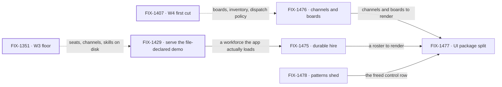

# FIX-1455 · Kitchen-sink rebuild: the Workforce reference people copy

**Spec** · [Decisions](DECISIONS.md) · [Rules](BUSINESS-RULES.md) · [Plan](PLAN.md) · [Docs](DOCS.md) · [Evolution](EVOLUTION.md)

Epic · 5 issues · Workforce: Layer 2 Abstraction · Goal 1, validate through real usage

## Five teams, before and after

| A team that… | Today | After this epic |
|---|---|---|
| **clones the reference app to learn Workforce** | Finds a chat app with four modes and a thinking-style menu. The workforce is a folder nothing serves | Opens it and sees a hired team, its channels, and its boards |
| **hires a team and redeploys** | The roster dies with the process | It is still there on the next boot, out of the Postgres the app already uses |
| **builds a Workforce UI of its own** | Copies kitchen-sink's components, because that is the only place they exist | Imports them from the client packages. Kitchen-sink imports the same ones |
| **wires a seat to a board** | Has no example at all | Has one channel kind, one named instance, and a seat that drains a subset — plus a warning for the board nobody watches |
| **wants to know which recipe to copy** | Finds a patterns recipe beside a Workforce one for the same job | Finds one, and a written reason wherever patterns stays |

**Why now.** The L2 surface a reference app would teach now exists: the W3 floor
([FIX-1351](https://linear.app/fixpoint-labs/issue/FIX-1351)) is Done, and W4's first cut —
boards ([FIX-1385](https://linear.app/fixpoint-labs/issue/FIX-1385)), inventory
([FIX-1405](https://linear.app/fixpoint-labs/issue/FIX-1405)), dispatch policy
([FIX-1408](https://linear.app/fixpoint-labs/issue/FIX-1408)) — is Done. The epic body fenced
*ship* work behind both; as of 2026-09-20 that fence is lifted ([D1](DECISIONS.md#d1)). The
cost of waiting is not a missing demo. The argument for building the file convention the way we
did is that it survives a production build, and the only app that could test that claim never
imported the generated module: after a real `pnpm build`, `desk-clerk` and `desk-note` appeared
in **0** compiled chunks against **5** each for the three wired kinds. The reference app is
where that claim is either true or merely asserted — and on
[#1989](https://github.com/fixpoint-labs/flow-state-dev/pull/1989) it is now **true**: FIX-1429
wires the module in, both kinds compile into **3** chunks each, and the goal check
`code-comes-from-files-alone` moved off `NOT RUN` to **PASS** — the set's first proven goal.

## What's in the box

Everything in the box is what a team gets by cloning the app. The fence at the bottom is what
keeps it a *consumer*: nothing in this epic ships an API that only kitchen-sink can call
([D2](DECISIONS.md#d2), [D5](DECISIONS.md#d5)).

## How the shell makes room

The app has two routes and one persistent region: a 256px rail spent entirely on a session
list. There is no channel list, no seat roster and no board anywhere in it. That is the
real-estate contest this epic resolves, and the calls the epic body had not already made.
[D7](DECISIONS.md#d7) makes it, and pins the before-and-after beside the card.
[D8](DECISIONS.md#d8) makes the second half of it: what fills the rail is **one navigator**, and
how deep it drills is read from each flow's declared `cardinality` rather than declared by the
app — which is why seats are three levels and channels are two. The regions themselves — their
hooks, their tags, their narrow-width order — are FIX-1477's, under
[ER-7](BUSINESS-RULES.md).

## The set · as of 2026-09-21

This table is the live one. It is refreshed on the epic PR as issues move; the plan and the
figures point here rather than repeating it.

| Issue | What it delivers | Why the set needs it | Status |
|---|---|---|---|
| [FIX-1429](https://linear.app/fixpoint-labs/issue/FIX-1429) · **bug** | The file-declared workforce demo is served over the app's real HTTP route | Nothing else in the set can stand on a workforce the app never loads. It is also the only row that tests the file convention against a real build | **Done** · [PR #1989](https://github.com/fixpoint-labs/flow-state-dev/pull/1989) merged · goal PASS · direct route, no spec PR |
| [FIX-1475](https://linear.app/fixpoint-labs/issue/FIX-1475) | A team hired at runtime — its seats and roster — survives a redeploy, on the Postgres the app already uses | The substance. "Durable" is the whole difference between a reference and a demo | **In Development** · spec [#1990](https://github.com/fixpoint-labs/flow-state-dev/pull/1990) merged · FIX-1429 cleared · implementing in two PRs, packages first |
| [FIX-1476](https://linear.app/fixpoint-labs/issue/FIX-1476) | The shipped channel pair — a kind as `flows/channels/<kind>.ts`, an instance as `CHANNEL.md` — one ChannelFlow factory, board v1 seat drain | Without it there is no worked example of how a seat reaches the boards it is meant to watch — and no visible warning for the ones nobody watches | **In Spec Dev** · D8 signed off, the hold lifted |
| [FIX-1477](https://linear.app/fixpoint-labs/issue/FIX-1477) | Inline and resource-backed components shipped in the client packages — including the one navigator the rail hosts ([D8](DECISIONS.md#d8)), and every region that renders, both halves of the rail included | The one row that makes the rebuild reusable rather than admirable. Without it every reader copies kitchen-sink files | **In Spec Dev** · D8 signed off, the hold lifted |
| [FIX-1478](https://linear.app/fixpoint-labs/issue/FIX-1478) | `@flow-state-dev/patterns` dropped as a kitchen-sink dependency where Workforce covers it | A reference app teaching two recipes for one job teaches neither | **Spec Approved** · spec [#1988](https://github.com/fixpoint-labs/flow-state-dev/pull/1988) merged · implementation queued on the concurrency cap |

1 done · 4 in flight · 0 not started. Four are substance and one (FIX-1429) is a bug the set
stands on — and it is the row that has already proven the claim in *why now*.

**Is five really four?** FIX-1478 is the row to weigh: shedding patterns changes no behaviour a
user can see, and the audit could ride along inside FIX-1477. It stays separate because it is
the only row whose deliverable is a *deletion*, and deletions that ride along with a feature are
the ones that get dropped when the feature runs long. Its collapse trigger — *fold into FIX-1477
if the audit finds fewer than three surfaces with an honest Workforce path* — **is settled, and
it did not fire. The unit is the route, not the file.** FIX-1478's merged spec
([#1988](https://github.com/fixpoint-labs/flow-state-dev/pull/1988)) counts three of five
pattern-backed routes with an honest team path, clearing the bar by one. Counted by file the
answer is two and the trigger fires — moving one route into its own file would flip it while
changing nothing a person sees. On the unit,
[that spec](../../issues/FIX-1478/SPEC.md) is the more specific authority.

## How the issues flow into each other

An edge is what one issue hands the next. A heavy border is done. Dashed edges come from other
epics and are consumed, not owned. FIX-1429 → FIX-1475 was the set's one hard block and is now
**satisfied** — FIX-1429 is done, so nothing in the set is blocked. FIX-1477 is last by
preference, not by dependency — it can begin against today's shapes and absorb the other rows'
surfaces as they land.

## What stays as it is

- **Runtime channel-admin verbs** — create, delete, invite. That is
  [FIX-1415](https://linear.app/fixpoint-labs/issue/FIX-1415), parked, and adjacent. This epic
  is the declarative convention only.
- **The `@flow-state-dev/patterns` package itself.** FIX-1478 sheds a *consumer's* dependency;
  it does not dissolve the package or shrink its API.
- **`/devtool`.** Observing a run as it unfolds is a different surface with no child here.
- **DevForce and CyberForce.** They stay finish-line Labs beside kitchen-sink, never inside it.
- **Org identity.** [FIX-1442](https://linear.app/fixpoint-labs/issue/FIX-1442) is soft-related
  and consumed; this set does not re-decide it.

## Sign off

1. **[D1](DECISIONS.md#d1) · Five issues, one objective, ship released now.** The fence the
   epic body set is verified lifted. If wrong: a cycle spent on a reference app while the L2
   surface underneath it still moves, and every row is re-specced against a changed floor.
2. **[D7](DECISIONS.md#d7) · The persistent rail stops being a session list and becomes the
   workforce.** The new call — the epic body did not make it. If wrong: the first thing anyone
   sees in the reference app is the wrong thing, and three children have already built against
   it. Reversible for about a day's work after FIX-1477 lands, and not after.
3. **[D2](DECISIONS.md#d2) · Durable hire composes the existing Postgres persistence; no
   kitchen-sink store.** If wrong: a fifth config persistence layer exists and the reference app
   teaches it. This is an invent-kill from the epic body, restated because it is the one a child
   is most likely to breach quietly.
4. **[D8](DECISIONS.md#d8) · One navigator, and its depth is read from the flow's declared
   `cardinality`.** The fourth cross-cutting call, **signed off** when the owner merged
   [#1986](https://github.com/fixpoint-labs/flow-state-dev/pull/1986) on 2026-09-21 — which is
   what released FIX-1476 and FIX-1477 into spec. If wrong: two navigators that diverge, or a
   depth the app declares and the framework contradicts. Reversible cheaply until FIX-1477
   merges, and not after.

**Open: none.** Both questions were answered by the owner on 2026-09-20
([PR #1978](https://github.com/fixpoint-labs/flow-state-dev/pull/1978#issuecomment-5753189267)),
taking the Architect's recommendations. **FIX-1475's durability proof is scoped to runtime
hire** — seats and the roster — so [ER-2](BUSINESS-RULES.md) and [ER-22](BUSINESS-RULES.md) no
longer ask for a runtime-created channel that [ER-16](BUSINESS-RULES.md) forbids; runtime
channel administration stays parked under
[FIX-1415](https://linear.app/fixpoint-labs/issue/FIX-1415) and out of this set. **The five
stale kitchen-sink tickets split**:
[FIX-1372](https://linear.app/fixpoint-labs/issue/FIX-1372) stays open and is verified against
the rebuilt app at wrap; [FIX-420](https://linear.app/fixpoint-labs/issue/FIX-420),
[FIX-472](https://linear.app/fixpoint-labs/issue/FIX-472),
[FIX-429](https://linear.app/fixpoint-labs/issue/FIX-429) and
[FIX-540](https://linear.app/fixpoint-labs/issue/FIX-540) close as superseded by this set.
Both in full: [DECISIONS.md → Answered](DECISIONS.md#open).

The reasoning and what lost: [DECISIONS.md](DECISIONS.md). The rules every child obeys:
[BUSINESS-RULES.md](BUSINESS-RULES.md). The order the work runs in: [PLAN.md](PLAN.md). The
reader-facing prose the set owes: [DOCS.md](DOCS.md). What it supersedes:
[EVOLUTION.md](EVOLUTION.md).
