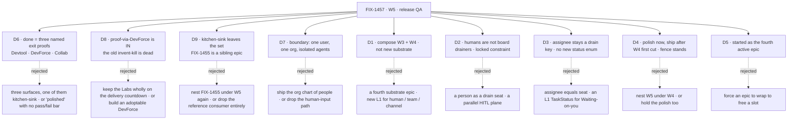

# FIX-1457 · Decisions

[Spec](SPEC.md) · **Decisions** · [Rules](BUSINESS-RULES.md) · [Plan](PLAN.md) · [Docs](DOCS.md) · [Evolution](EVOLUTION.md)

The calls above any single issue in W5: what was chosen, what lost, what each locks in.
**Recalibrated by the owner on 2026-09-20 (18:05Z)** — the epic's identity changed, not just its
set. [D6](#d6) was rewritten: W5 is **release QA**, and the done condition is **three named exit
proofs**. [D8](#d8) and [D9](#d9) are new and both are reversals of standing fences.
[D7](#d7), [D2](#d2), [D3](#d3) stand unchanged; [D4](#d4) is restated and **its ship fence still
stands**; [D5](#d5)'s arithmetic changed again.

## The tree

## D6 · W5 is Workforce release QA, and done is three named exit proofs

> **Owner recalibration, 2026-09-20:** W5 is *"Workforce release QA / polish — get L2 tested and
> proven ready to ship."* North star: *"Workforce is feature-complete enough that a finish-line Lab
> (DevForce) can actually build something with seats collaborating across channel(s), and Devtool can
> inspect that world without special wrappers."* **Rewritten** from the earlier *three surfaces*
> framing, whose first leg was kitchen-sink.

| | |
|---|---|
| **Instead of** | The three *surfaces* — reference app, live view, real configuration — whose first leg has now left the set · or a "polish" epic with no pass/fail bar, which is how *looks good* becomes a done condition |
| **Because** | A QA epic's whole product is **evidence**, and evidence has to be falsifiable. Three named proofs each say what must pass and on what: the inspector is green on a live hire, a Lab shipped something real, two seats collaborated. Each can fail; *polished* cannot |
| **Locks in** | **[ER-Devtool](BUSINESS-RULES.md#er-devtool), [ER-DevForce](BUSINESS-RULES.md#er-devforce), [ER-Collab](BUSINESS-RULES.md#er-collab)** replace ER-19, which is retired. Every proof runs against a **live hired Workforce** ([ER-3](BUSINESS-RULES.md)) and composes rather than extends ([ER-4](BUSINESS-RULES.md)). **The set is open** ([ER-23](BUSINESS-RULES.md)) — and **two of the three still have no producer**, which is [Open 1](#open) |

**What would change my mind:** a ship date inside this cycle that the three proofs cannot fit. Then
the bar is cut deliberately to one proof and the other two become named launch follow-ups — not
quietly dropped, which is the failure mode this card exists to prevent.

## D8 · Proof-via-DevForce is in — the invent-kill that said otherwise is dead

> **A reversal, stated as one.** The standing invent-kill read *"don't treat W5 as build DevForce"*.
> The recalibration kills it explicitly: *"Proof-via-DevForce is **in**. Old invent-kill… is
> **dead**. Build the thinnest DevForce path that produces a real artifact; stop there."*

| | |
|---|---|
| **Instead of** | Keeping the finish-line Labs wholly on the delivery countdown, so W5 proves Workforce without ever running one · or admitting DevForce and letting it grow into an adoptable Lab product |
| **Because** | *A Lab as product* and *a Lab as evidence* were conflated in the old fence. The north star is a Lab that **actually builds something** — that is the only claim a launch rests on, and it cannot be made without running one. The cost control is thinness, not exclusion |
| **Locks in** | **The thinnest path that produces a real artifact, and it stops there** ([ER-11](BUSINESS-RULES.md)). Unbounded Lab product delivery stays out; **W5 is not "rebuild the whole Lab product"**; **CyberForce stays out** this cycle. *Which* artifact counts is the EM's cut leaning on the owner, and is **not blocking** |

**Why this is not an ask.** The owner reversed the fence in their own words and set the replacement
bound in the same sentence. Re-asking would be asking them to decide twice.

## D9 · Kitchen-sink leaves the set — FIX-1455 is a sibling epic, not a child

> **Owner recalibration:** *"Kitchen-sink is out — [FIX-1455](https://linear.app/fixpoint-labs/issue/FIX-1455)
> owns the reference consumer rebuild,"* and **nesting it under W5 again** is now a named invent-kill.

| | |
|---|---|
| **Instead of** | Keeping FIX-1455 as a held child epic inside the set (where it sat until today) · or dropping the reference consumer entirely because it is no longer W5's |
| **Because** | A reference app someone clones is a **product surface**; the three exit proofs are **QA**. They have different owners, different gates and different finish lines, and running one inside the other is what made W5 read as a kitchen-sink epic twice |
| **Locks in** | FIX-1455 is **soft-related**, runs its own lifecycle, and **carries no row in the set table** ([ER-15](BUSINESS-RULES.md) rewritten, [ER-24](BUSINESS-RULES.md) new). **Three rules were re-owned** rather than left pointing at a row that is gone: [ER-1](BUSINESS-RULES.md) → the ER-Collab producer, [ER-2](BUSINESS-RULES.md) → the ER-Devtool producer, [ER-3](BUSINESS-RULES.md) rewritten from *the reference app runs* to *every proof runs on a live hired Workforce* |

**One consequence, flagged not fixed.** [FIX-1469](https://linear.app/fixpoint-labs/issue/FIX-1469)
was filed today saying *"upgrade kitchen-sink so Workforce is visible in action is now a leg of W5's
done condition."* That leg left with this card, so **the issue's kitchen-sink half is stale** and
belongs to FIX-1455. Its `goals/` labs half stands on its own. Routing is the owner's.

## D7 · The boundary — one user, one org, isolated agents; the org chart of people grows in later

> **Owner call, 2026-09-20**, in the session that canceled FIX-1458 and closed
> [#1955](https://github.com/fixpoint-labs/flow-state-dev/pull/1955) unmerged. **Unchanged by the
> recalibration**, which reaffirms humans-in-seats as cancelled.

| | |
|---|---|
| **Instead of** | Shipping the **org chart of people** — several principals, an audience routing between them, a durable `reviewedBy:` · or dropping the human-input path entirely once its explore was canceled |
| **Because** | The wide cut had exactly **one** child able to prove it, and that child is canceled. One user, one org is also the honest boundary for what W3 and W4 built: the isolation they delivered is **between agents**, not between people |
| **Locks in** | The human-input path stays, narrowed: a seat parks, and the person answers through a flow action carrying **the request's existing principal** ([ER-1](BUSINESS-RULES.md)). No child builds multi-human machinery ([ER-22](BUSINESS-RULES.md)); deferrals are in [Grow into later](#later) |

## D1 · W5 composes Workforce L2; it is not a fourth substrate epic

| | |
|---|---|
| **Instead of** | A fourth substrate epic that adds the L1 a composition turns out to want · or a second Collab epic dressed as W5 |
| **Because** | The feature-complete bar is a **claim about what already exists**. A substrate epic would move the bar instead of testing it — and under a QA label that is invisible until it has shipped |
| **Locks in** | Every proof composes existing pieces. A proof that needs new L1 has found a **gap in W3 or W4** and comments up ([ER-5](BUSINESS-RULES.md), [ER-17](BUSINESS-RULES.md), [ER-25](BUSINESS-RULES.md) new) |

**What would change my mind:** the Devtool checklist finding that inventory or parked-row reasons
cannot be rendered without a new L1 type. Two of its six rows fail today and
[FIX-1481](https://linear.app/fixpoint-labs/issue/FIX-1481) is the child that will hit them, so this
is live, not theoretical — and [ER-8](BUSINESS-RULES.md) says a failing row is never passed with a status value.

## D2 · Humans are not board drainers — a locked constraint, no longer a fork

> **Settled, and off the sign-off surface.** Flipped by the owner on 2026-09-20; the same day
> FIX-1458 — the only child that would have designed against it — was canceled. The recalibration
> re-lists it among the live invent-kills.

| | |
|---|---|
| **Instead of** | **Dead, and stays dead** — a person as a drain seat claiming rows beside the agents (*Model A*) · HITL as ambient approval tools with no org identity · a parallel human work plane · `assignee` ≡ a person |
| **Because** | A task needs human review **while a non-human owns the work**, and even when a person supplies something the flow still decides what it means — **the flow owns the machine**. People drive through actions, not by draining a queue |
| **Locks in** | A **non-human seat owns the task** and **parks it with a reason**. The human acts through a flow action carrying the request's existing principal. **No Human L1, no parallel HITL plane, no assignee-equals-person** ([ER-6](BUSINESS-RULES.md)) |

## D3 · Board assignee stays a drain key, and no L1 enum grows for a human's state

| | |
|---|---|
| **Instead of** | Collapsing board assignee and the seat registry into one noun · adding `waiting_on_you` and `idle` to L1 `TaskStatus` |
| **Because** | The assignee is *who a row drains to*; the seat is *who exists on the roster*. They resolve to each other and a merge is irreversible. **Waiting on you** is already expressible — parked, with a reason |
| **Locks in** | Waiting-on-you is a **view** over existing status plus seat runtime — **including in Devtool** ([ER-8](BUSINESS-RULES.md)). Checklist row 4 is this rule's live test |

## D4 · Polish starts now; ship waits on W4's first cut — **the fence stands**

| | |
|---|---|
| **Instead of** | Nesting W5 under W4 and starting nothing · or holding the polish work along with the ship work |
| **Because** | W5 is a **sibling** of W4: the W3→W4→W5 chain is a sequence of outcomes, not containment. Ship work composes the W4 first cut, so building against a floor in motion means rebuilding it. Polish composes nothing in motion, so holding it buys nothing |
| **Locks in** | **Restated 2026-09-20 and it still stands** — *"soft-after W4 first-cut for ship,"* *"do not start W5 ship while W4 first-cut is open,"* *"polish may start now."* [FIX-1407](https://linear.app/fixpoint-labs/issue/FIX-1407) is **In Review**, not closed, so [ER-10](BUSINESS-RULES.md) fences a ship ticket today. **This corrects the previous version of this card**, which recorded the fence as *lifted* on 2026-09-20 |

## D5 · W5 started as the fourth active epic, against a cap of two

| | |
|---|---|
| **Instead of** | Forcing W3 ([#1718](https://github.com/fixpoint-labs/flow-state-dev/pull/1718)), W4 ([#1905](https://github.com/fixpoint-labs/flow-state-dev/pull/1905)) or LAB-162 ([#1612](https://github.com/fixpoint-labs/flow-state-dev/pull/1612)) to wrap to free a slot |
| **Because** | The board was already at three open epic PRs when W5 opened. The owner chose the breach on 2026-09-19 rather than wrap an epic early and cost it real closure quality |
| **Locks in** | The cap is knowingly breached, not forgotten. **The arithmetic moved again**: W5's *in-flight* work is still **zero** — one child Done and four in Backlog (FIX-1468, FIX-1469, FIX-1474, FIX-1481), two proofs unfiled — so the slot costs nothing today and will cost real capacity the moment anything in Backlog starts or [Open 1](#open) is answered |

## Who owns what

![Who owns what: a matrix of six cross-cutting rules against the three exit-proof rows of the set — the Devtool checklist, the DevForce proof path and the multi-seat collab scenario — plus a fourth column for the finished exploration FIX-1467. The Devtool column is now held by FIX-1481; the other two proof columns are drawn as unfiled placeholder columns. ER-1's owner is the collab producer; ER-2's is FIX-1481, the Devtool producer; ER-3's is the DevForce producer; ER-4 is marked builds it in the Devtool column and builds if filed in the other two; ER-18 is marked MET by FIX-1467; and the done condition splits into three rules, each sitting in its own column — the Devtool one marked HELD because a child is filed and nothing has run, the other two marked NO CHILD. A note records that FIX-1481 holds ER-Devtool's rows 4 to 6 while rows 1 to 3 ride FIX-1320, that kitchen-sink FIX-1455 no longer has a column because it left the set, that ER-1, ER-2 and ER-3 were re-owned rather than left pointing at it, and that ER-15 was rewritten and ER-19 retired. The figure's aria-label carries every cell.](figures/ownership.svg)

**Two empty cells on the diagonal are the finding.** Each exit proof is its own rule in its own
column; ER-Devtool reads **HELD** and the other two read **NO CHILD** — the done condition is owned
in one part of three, and proved in none. **Held is not passed**: FIX-1481 is Backlog, it covers
rows 4–6, and rows 1–3 ride an epic W5 does not run.

**Three owners moved when kitchen-sink left, and none was left empty** ([D9](#d9)). ER-1 → the
ER-Collab producer, ER-2 → the ER-Devtool producer, and ER-3 was **rewritten** from *the reference
app runs and comes back* to *every proof runs on a live hired Workforce*, owned by the ER-DevForce
producer. A rule pointing at a row that has left the set is a rule nobody holds.

**Six rules need a column; the other nineteen don't** — thirteen prohibitions, four run-the-set
rules and two further proofs bind every row equally.

## Grow into later — deferred, with a revisit condition

**Parked on purpose. These are not [Open](#open) questions** — nobody will answer them this epic, and
a row that reads as open invites a child to answer it. The owner's general condition is **when
multi-user or sign-off pain is real**.

| Deferred | Why it is not in the cut | Comes back when |
|---|---|---|
| **Multi-user** — a second principal in an org, and the walls between them | [D7](#d7) | A second person needs different permissions in the same org |
| **The org chart of people** as a product | It was FIX-1458's to shape, and FIX-1458 is canceled | Multi-user lands, or a customer asks who owes a sign-off |
| **Originator ≠ reviewer**, **durable `reviewedBy:`**, **multi-principal walls** | All need two principals to mean anything | With multi-user |
| **The kitchen-sink rebuild** | [D9](#d9) — not deferred by W5, **owned elsewhere**. [FIX-1455](https://linear.app/fixpoint-labs/issue/FIX-1455) runs it now | Never returns here. It is a sibling's work, not a parked one |
| **CyberForce, as a parallel thin proof** | [D8](#d8) admits DevForce as the proof and stops there. The recalibration lists *whether CyberForce gets a parallel thin proof this cycle* as **still open and not blocking** | The owner or HoE says so; DevForce proving first makes it cheap |

## Decided in review, recorded so no child reopens them

**Round 1 (2026-09-20)** — greptile, cursor, codex and `second-look` on head `1d9218e`.

- **A done condition names a producer per leg.** Round 1 gave the single condition a provisional
  owner so a coordinator could tell whether to file or wrap. Applying that per leg is what exposed
  first two, and now **all three**, unowned legs ([Open 1](#open)).
- **An exploration may not exit with a downstream-blocking wall open** ([ER-18](BUSINESS-RULES.md)).
  **Now met** — FIX-1467 merged answering the noun (`references/`), the migration
  (`clearShadowedReferences`) and the grant model.
- **The proofs require org-bound execution.** Narrowed by [D7](#d7) to *which* org identity, not
  whether one is owed. [FIX-1442](https://linear.app/fixpoint-labs/issue/FIX-1442) stays a
  wrap-gating input.
- **ER-20 gains a wrap-time sweep of the shipped child diffs**, now also covering
  [ER-25](BUSINESS-RULES.md) — substrate arriving under a polish label.
- **Salvaged from the canceled explore**, so it does not die with
  [#1955](https://github.com/fixpoint-labs/flow-state-dev/pull/1955): its POC established that **a
  session belongs to one user**, so a board a person answers into **cannot be session-scoped to the
  seat's session**; the ledger is org-scoped. True at one user as well as many. It lands directly on
  **checklist rows 3 and 5** — Devtool must read boards and inventory **across** sessions, which is
  exactly where both rows are session-scoped today.

## What the end-state POC showed

**None was built, and nothing since has changed that.** The question it answers — *does the division
into issues hold once it's all there?* — needs a division to test, and **two of three** proof rows
are still unfiled. FIX-1481's filing supplies one third of a division, not a division.
**Revisit the moment the remaining two gaps are filed** ([Open 1](#open)), before any of them starts
building: whether the collab scenario is separable from the DevForce path at all, and whether
ER-Devtool's six rows survive being split across two epics, is exactly what a rough end-state
falsifies.

## How it got here

- **Drafted (Sep 19)** — from Jake's spine, the Cycle PM stamp and the Architect EM fences. D5
  records the epic-slot breach.
- **Review round 1 folded (Sep 20)** — the done condition gained an owner and org identity, ER-18 a
  downstream-blocking clause, ER-20 a wrap-time check. The objective did not move.
- **Objective gate taken, then D2 flipped (Sep 20)** — approved in the morning, D2 superseded the
  same day.
- **First re-cut (Sep 20, 15:48)** — FIX-1458 canceled, the boundary set ([D7](#d7)), the objective
  restated as *polish and prove* on three surfaces.
- **Owner recalibration (Sep 20, 18:05) — the identity changed, not just the set.** W5 became
  **release QA**. **ER-19 retired** and replaced by three named exit proofs, [D6](#d6) rewritten
  around them. **[D8](#d8)**: proof-via-DevForce is in and the invent-kill against it is **dead** —
  a reversal, recorded as one. **[D9](#d9)**: kitchen-sink left the set, so **ER-15 was rewritten**,
  **ER-1, ER-2 and ER-3 were re-owned**, and **ER-24** (no re-nesting) and **ER-25** (no substrate
  under a polish label) were added. **ER-18 recorded as met** by FIX-1467's merge rather than left
  standing open. **[D4](#d4) corrected**: the previous version called the ship fence *lifted*; the
  recalibration restates it as standing, and FIX-1407 is In Review. **ER-9 widened** to name *collab
  RC as the whole of W5*. **ER-11 re-narrowed** around the thinnest DevForce path. **The
  [ER-Devtool checklist was drafted](BUSINESS-RULES.md#devtool-checklist)** — six pass/fail rows
  against what the surfaces expose today, two of which **fail as written**. **FIX-1468 and FIX-1469**
  entered the set table, which had never carried them, both marked *not a proving leg*. All three
  figures redrawn. **Not review feedback and not a review round: `reviewRounds` is unchanged.**
- **Two children filed, and the set table caught up (Sep 20–21).**
  **[FIX-1481](https://linear.app/fixpoint-labs/issue/FIX-1481)** is the **first filed exit-proof
  producer**: it takes [Sign-off 1](SPEC.md#sign-off)'s recommendation, owning checklist rows 4–6
  while rows 1–3 ride [FIX-1320](https://linear.app/fixpoint-labs/issue/FIX-1320) — enacted three
  and three, not the four and four the ask estimated, and still the owner's to correct.
  **[FIX-1474](https://linear.app/fixpoint-labs/issue/FIX-1474)** is soft-related polish and its own
  body keeps it **out** of ER-Collab's gate. Every surface that restated *zero producers* was
  re-derived with them: the set table and its counts, the box, the path and the ownership matrix,
  ER-2's owner, ER-Devtool's and ER-Collab's *proved by* cells, D5's arithmetic and
  [Open 1](#open). **Not review feedback and not a review round.**
- **Migrated to the retained-spec contract (Sep 21).** The set moved from
  `spec/_epics/living-workforce/` to `specs/epics/FIX-1457/` and gained the two documents the
  contract requires, [DOCS.md](DOCS.md) and [EVOLUTION.md](EVOLUTION.md). **The epic PR now merges
  after the objective gate** rather than staying open for the epic's life
  ([orchestration.md](../../../docs/contributing/orchestration.md#merging-and-amending-a-spec)).
  No decision, rule or scope changed in the move.

## Open

**One, and it is structural.**

1. **Two of the three exit proofs have no producer, and the third has a ticket and no run.**
   [ER-DevForce](BUSINESS-RULES.md#er-devforce) and [ER-Collab](BUSINESS-RULES.md#er-collab) have no
   ticket, no spec and no owner. [ER-Devtool](BUSINESS-RULES.md#er-devtool) is held by
   [FIX-1481](https://linear.app/fixpoint-labs/issue/FIX-1481) — Backlog, covering rows 4–6, with
   rows 1–3 riding [FIX-1320](https://linear.app/fixpoint-labs/issue/FIX-1320), an epic W5 does not
   run. The set's one finished child, FIX-1467, was **never a proving leg**, and FIX-1468, FIX-1469
   and FIX-1474 are not legs either — so W5 has begun to staff its objective and has proved none of
   it. Not a question about the objective; a question about whether the epic is staffed to reach it.
   **Filing is the owner's**, and per [ER-23](BUSINESS-RULES.md) it is normal course, not a
   re-scope.

**Not open, deliberately.** The recalibration's *Still open* items — the exact Devtool checklist
rows, which DevForce artifact counts, whether CyberForce gets a parallel thin proof — are marked by
the owner as **not blocking EM start on polish**. The checklist rows are
[drafted](BUSINESS-RULES.md#devtool-checklist) as the EM's work; the other two lean on the owner when
the DevForce child is cut. Carrying them here as Open would invite a child to answer them.
