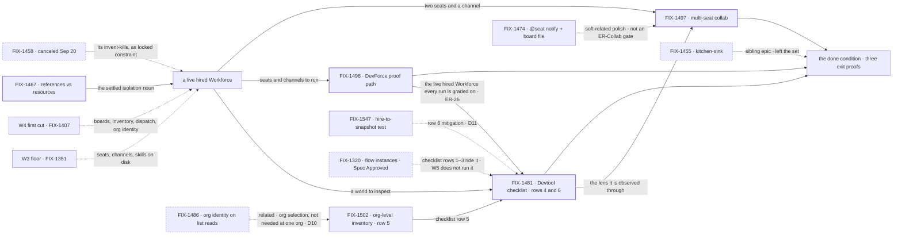

# FIX-1457 · W5: Workforce release QA — Devtool, a DevForce proof, multi-seat collab

**Spec** · [Decisions](DECISIONS.md) · [Rules](BUSINESS-RULES.md) · [Plan](PLAN.md) · [Docs](DOCS.md) · [Evolution](EVOLUTION.md)

Epic · **an open set · two exit proofs passed; ER-Devtool is row 4 live, row 5 in spec, row 6 carried** ·
Workforce: Layer 2 Abstraction · Goal 1 — foundation honesty / validate through real usage

> **Recalibrated by the owner on 2026-09-20 (18:05Z).** W5 is **Workforce release QA / polish** —
> get L2 tested and proven ready to ship. The done condition is **three named exit proofs**
> ([D6](DECISIONS.md#d6)), replacing the previous three-surfaces framing. **Kitchen-sink left the
> set** ([D9](DECISIONS.md#d9)); **proof-via-DevForce came in** ([D8](DECISIONS.md#d8)), reversing a
> standing invent-kill. The owner's words for the north star: *"Workforce is feature-complete enough
> that a finish-line Lab (DevForce) can actually build something with seats collaborating across
> channel(s), and Devtool can inspect that world without special wrappers."*

## Four teams, before and after

| A team that… | Today | After this epic |
|---|---|---|
| **is deciding whether Workforce is ready to ship** | "Ready" is a claim standing on architecture documents. Nothing has run a workforce and produced anything | Three named proofs, each pass/fail: the inspector is green, a Lab shipped a real artifact, two seats collaborated |
| **needs to watch what its workers are doing** | Opens a session and reads its stream. There is no roster, no channel list and no board browser — and a parked row's reason is inside a JSON expander | Opens Devtool on a live hired Workforce and reads the roster, the channels, the boards, the inventory and the parked rows, **without a special wrapper** |
| **wants to know a workforce can actually build something** | The Labs have a first build slice and no end-to-end run. Whether seats can ship a work product is untested | One DevForce path completes and hands back a **real artifact** — code, a PR, a work product — with seats and channels used honestly |
| **runs more than one seat** | Multi-seat is a composition the docs describe | ≥2 seats across ≥1 channel: work filed, assigned, drained, and a cross-seat handoff observed |

**Why now.** W3 made a Workforce **describable** and W4 made work **reach** a seat. Both ended in a
claim about what exists. Nothing between them and a launch is more substrate
([D1](DECISIONS.md#d1)) — it is **evidence**, and evidence is what a QA epic produces.

## What's in the box

![What's in the box: the objective is Workforce release QA, and the box holds three named exit proofs — ER-Devtool, a documented Devtool checklist green on a live hired Workforce; ER-DevForce, one DevForce path completing with a real artifact; and ER-Collab, two or more seats across at least one channel filing, assigning, draining and handing off. As of 2026-09-24 two are drawn as passed and one as held: ER-DevForce passed on September 22 with FIX-1496, on one automated leg pushed to a bare clone, the credentialed pull-request leg documented as the human release run; ER-Collab passed on September 22 with FIX-1497, the handoff observed in Devtool; ER-Devtool, held by FIX-1481 and FIX-1502, has row 4 passed live, row 5 in spec with FIX-1502, row 6 proved by automated checks with its live read carried, and rows 1 to 3 riding FIX-1320. Beneath the box sits the unchanged substrate they compose and must not extend: boards, inventory, manager-queue, org identity, dispatch honesty, and the references-versus-resources split FIX-1467 settled. A boundary line reads one user, one org. To the side, kitchen-sink FIX-1455 is drawn outside the box as a sibling epic that left the set, and below it a box headed decided September 24, the owner's calls: row 5 is a channel session's view of the whole organization, D10, and row 6's live read waits for a real hire with a sealed document, D11. Below, a grow-into-later band, and below a fence, everything the set refuses to build — including the invent-kills the recalibration added and the one it killed. The figure's aria-label carries every item.](figures/end-state.svg)

**Two slots hold a result, and the third is held.** That is what the figure is for: the done
condition is three proofs, ER-DevForce and ER-Collab **passed** on 2026-09-22, and ER-Devtool is
**not yet green** — row 4 passed live, row 5 is FIX-1502's to build ([D10](DECISIONS.md#d10)), and
row 6 is proved by automated checks without a live read ([D11](DECISIONS.md#d11)).
Beneath them is the substrate they compose and may not extend ([ER-4](BUSINESS-RULES.md)).
Kitchen-sink sits **outside** the box — a sibling epic, not a member ([D9](DECISIONS.md#d9)).

## The set · as of 2026-09-24

A dated snapshot of the reviewed scope, and **an open set** ([ER-23](BUSINESS-RULES.md)).
**Filing a child is the normal course of this epic, not a re-scope** — on 2026-09-22 three more
were filed, and on 2026-09-24 one more, [FIX-1547](https://linear.app/fixpoint-labs/issue/FIX-1547).
Live state is in Linear and the implementation PRs.

| Issue | What it delivers | Why the set needs it | Status |
|---|---|---|---|
| [FIX-1481](https://linear.app/fixpoint-labs/issue/FIX-1481) · Devtool checklist | **ER-Devtool** (with FIX-1502) — the six-area checklist green on a live hired Workforce: roster, channels, boards, inventory, parked rows, resources + references, **with no special wrapper** | The inspector is how the other two proofs are observed at all. Without it, "it worked" is asserted from a log | **Done** · spec [#2025](https://github.com/fixpoint-labs/flow-state-dev/pull/2025), code [#2032](https://github.com/fixpoint-labs/flow-state-dev/pull/2032) and [#2039](https://github.com/fixpoint-labs/flow-state-dev/pull/2039), live run [#2066](https://github.com/fixpoint-labs/flow-state-dev/pull/2066). Owns **rows 4 and 6** — parked reasons, references vs resources — and **verifies all six**. **Row 4 passed live.** **Row 6 is proved by its automated checks and not read live** ([D11](DECISIONS.md#d11)). **Row 5 is [FIX-1502](https://linear.app/fixpoint-labs/issue/FIX-1502)'s**, not its own: the 2026-09-20 three-and-three split was **corrected on 2026-09-22**. **Rows 1–3 ride [FIX-1320](https://linear.app/fixpoint-labs/issue/FIX-1320)**, an epic W5 does not run |
| [FIX-1502](https://linear.app/fixpoint-labs/issue/FIX-1502) · org-level inventory view | **ER-Devtool row 5** — a reader and view over `inventory/seats/*`, `inventory/channels/*`, `inventory/members/*`, so *who exists* and *who is in which channel* are answerable for a live org | The row FIX-1481's deferral left with no owner. Filed so the checklist is not silently five rows of six | **In Spec Dev** · filed 2026-09-22. **Built in W5** ([D10](DECISIONS.md#d10), owner, 2026-09-24): row 5 is a **channel session's view of the whole organization**, which the 2026-09-22 POC settlement showed the production read already serves, cross-org isolated. **No longer blocked by [FIX-1486](https://linear.app/fixpoint-labs/issue/FIX-1486)** — the Linear relation is now *related*, because FIX-1486 is org *selection*, which a one-user, one-org deployment does not need. **Row 5's reader is not the [ER-25](BUSINESS-RULES.md) growth the owner fenced** — org *selection* is |
| [FIX-1496](https://linear.app/fixpoint-labs/issue/FIX-1496) · DevForce proof path | **ER-DevForce** — the **thinnest** DevForce path that completes and produces a **real artifact**, seats and channels used honestly | A reference app shows Workforce *can* run. A Lab shipping a work product is the evidence a launch claim rests on | **Done · ER-DevForce PASS** · spec [#2023](https://github.com/fixpoint-labs/flow-state-dev/pull/2023), code and graded run [#2051](https://github.com/fixpoint-labs/flow-state-dev/pull/2051), which stood the live hire up ([ER-26](BUSINESS-RULES.md#er-26) met). Its BR-10 and BR-17 gate was re-proved by FIX-1515 ([#2073](https://github.com/fixpoint-labs/flow-state-dev/pull/2073)). A four-gap delta on `goals/devforce-lab/`, not a new Lab tree. **Which artifact counts is cut**: one automated leg pushing to a bare clone, the credentialed PR leg documented as the human release run ([ER-DevForce](BUSINESS-RULES.md#er-devforce)) |
| [FIX-1497](https://linear.app/fixpoint-labs/issue/FIX-1497) · multi-seat collab scenario | **ER-Collab** — one graded scenario: ≥2 seats across ≥1 channel, work filed → assigned → drained, and a cross-seat handoff or reply **observed in Devtool** | Multi-seat is the composition W3 and W4 exist to enable and the one nothing has run | **Done · ER-Collab PASS** · graded run [#2065](https://github.com/fixpoint-labs/flow-state-dev/pull/2065), the handoff read on the shipped DevTool. Was held behind [FIX-1481](https://linear.app/fixpoint-labs/issue/FIX-1481) — *observed in Devtool* is what made it depend on ER-Devtool. Composes boards ([FIX-1385](https://linear.app/fixpoint-labs/issue/FIX-1385)), inventory ([FIX-1405](https://linear.app/fixpoint-labs/issue/FIX-1405)), manager-queue ([FIX-1430](https://linear.app/fixpoint-labs/issue/FIX-1430)) |
| [FIX-1547](https://linear.app/fixpoint-labs/issue/FIX-1547) · row 6 hire-to-snapshot test | A test that a hired team's `references/` document reaches the debug snapshot as `writable: false` | **The mitigation for row 6's deferred live read** ([D11](DECISIONS.md#d11)): no hired tree declares a sealed document, so the path from a hire to the mark is covered by a test until a real hire has one | **In Development** · filed 2026-09-24. **Not a proving leg** — row 6's live read moves to the first real hire with a `references/` document or an `ro` grant, noted on [FIX-1455](https://linear.app/fixpoint-labs/issue/FIX-1455) |
| [FIX-1467](https://linear.app/fixpoint-labs/issue/FIX-1467) · `references/` vs `resources/` | The isolation convention: read-only handbooks ambient by tree, mutable resources by explicit grant | Settled the noun before anything teaches it. **Not a proving leg** — it never advanced the done condition | **Done · merged 2026-09-20.** Noun is `references/`, migration is `clearShadowedReferences`, grant model settled. **[ER-18](BUSINESS-RULES.md) is met** by it |
| [FIX-1468](https://linear.app/fixpoint-labs/issue/FIX-1468) · `ReadOnlyResourceRef` | A handle type that omits `writeContent` for read-only documents | FIX-1467's deliberately-deferred type change. Additive, independent | **Backlog** · filed 2026-09-20 as a spin-off. **Not a proving leg** |
| [FIX-1469](https://linear.app/fixpoint-labs/issue/FIX-1469) · `goals/` labs migration + KS documents | Decides the `goals/` labs document migration; would give kitchen-sink workforce documents | FIX-1467's deferred step S7. **Its kitchen-sink half is now stale** — it was filed while "upgrade kitchen-sink" was a W5 leg, and that leg left with [D9](DECISIONS.md#d9) | **Backlog** · filed 2026-09-20. **Not a proving leg.** Its KS half belongs to [FIX-1455](https://linear.app/fixpoint-labs/issue/FIX-1455); flagged, not moved |
| [FIX-1474](https://linear.app/fixpoint-labs/issue/FIX-1474) · composed `@seat` notify + board file | A named path to notify another seat **while** filing on a board, composing the existing channel, dispatch and board primitives | Release polish for real collab. **Explicitly not an ER-Collab gate** — its own body keeps ER-Collab on today's separate paths until this lands | **Backlog** · filed 2026-09-20. **Not a proving leg.** Soft-related. Its own invent-kills forbid a new message-board package as W5 substrate ([ER-25](BUSINESS-RULES.md)) |
| ~~[FIX-1458](https://linear.app/fixpoint-labs/issue/FIX-1458)~~ · humans-in-seats | Would have shaped the multi-person org chart | **Canceled 2026-09-20**, [#1955](https://github.com/fixpoint-labs/flow-state-dev/pull/1955) closed unmerged. Kept so a reader sees it was considered and dropped | **Canceled** · not re-specced, not reopened, no longer a child |

**4 done (3 proof-producers, 1 exploration) · 1 proof-producer in spec (FIX-1502) · 1 row-6
mitigation in development (FIX-1547) · 2 backlog spin-offs · 1 backlog polish child · 0 named gaps
· 1 canceled.**

**Two proofs passed, and the third has one row left to build.** ER-DevForce and ER-Collab passed on
2026-09-22, after FIX-1496 stood a live hire up; ER-Devtool's row 4 passed live the same day. What
is left: **row 5**, which the owner ruled on 2026-09-24 is a channel session's view of the whole
organization, so FIX-1502 builds it in W5 and waits on nothing outside it ([D10](DECISIONS.md#d10));
**row 6**, proved by automated checks, its live read carried to the first real hire with a sealed
document ([D11](DECISIONS.md#d11)); and **rows 1–3**, which ride FIX-1320. FIX-1467 is Done and it
settled a convention; it did not advance the done condition, and saying so is the point of its row.
FIX-1468, FIX-1469, FIX-1474 and FIX-1547 are not legs either.
**Kitchen-sink is not in this table by design** — FIX-1455 is a sibling epic, soft-related, running
its own lifecycle ([D9](DECISIONS.md#d9), [ER-15](BUSINESS-RULES.md)).

## How the issues flow into each other

An edge is what one node hands the next. **No node in the chain is a placeholder any more** — the
two `FIX-XXX` gaps became FIX-1496 and FIX-1497 on 2026-09-22, and row 5 gained FIX-1502. A heavy
border is done and a dashed one is outside the set; the children not yet done are drawn plain.
**As of 2026-09-24 FIX-1481, FIX-1496 and FIX-1497 are done.** FIX-1496 handed the checklist the
**live hired Workforce its run is graded on** ([ER-26](BUSINESS-RULES.md#er-26), met), and FIX-1502
hands it row 5. **FIX-1486 no longer blocks FIX-1502**: the owner read row 5 as a channel session's
view of the organization ([D10](DECISIONS.md#d10)), so that edge is *related*, not a block; the
dashed FIX-1320 edge for rows 1–3 still holds. **Row 6 has a new dashed edge in**: FIX-1547's test,
the mitigation for its deferred live read ([D11](DECISIONS.md#d11)). FIX-1474 hangs off collab as
polish, not as a gate. Kitchen-sink is dashed and outside the chain: it hands the set nothing and
the set owes it nothing — it only carries the note that row 6's live read goes to the first real
hire with a `references/` document or an `ro` grant.

## What stays as it is

- **Kitchen-sink** ([FIX-1455](https://linear.app/fixpoint-labs/issue/FIX-1455)) — a **sibling**
  epic on its own lifecycle. Not a child, not in the set, not specced here
  ([D9](DECISIONS.md#d9)).
- **The substrate.** Boards ([FIX-1385](https://linear.app/fixpoint-labs/issue/FIX-1385)), inventory
  ([FIX-1405](https://linear.app/fixpoint-labs/issue/FIX-1405)), manager-queue
  ([FIX-1430](https://linear.app/fixpoint-labs/issue/FIX-1430)), org never optional
  ([FIX-1442](https://linear.app/fixpoint-labs/issue/FIX-1442)), dispatch honesty
  ([FIX-1440](https://linear.app/fixpoint-labs/issue/FIX-1440)). Composed, never re-decided
  ([D1](DECISIONS.md#d1)).
- **CyberForce.** DevForce enters as the proof; the pentest Lab does not this cycle
  ([D8](DECISIONS.md#d8)).
- **Collab rooms** ([FIX-1341](https://linear.app/fixpoint-labs/issue/FIX-1341)), the skills
  register, the memory story, package cohesion.
- **Everything the cancellation deferred** ([Grow into later](DECISIONS.md#later)) — multi-user, an
  org chart of people, originator ≠ reviewer, durable `reviewedBy:`, multi-principal boards. Parked
  with a revisit condition, and **not** open questions.

## Sign off

**The objective gate is owed on this re-cut.** The recalibration is explicit that it is *"Not owner
merge approval… direction for the EM"* — so it sets the direction and does not discharge the gate.
Approving here certifies the objective and the three exit proofs, nothing below them.

**The recalibration answered the previous three asks and they are not carried forward.** The items
it left under *Still open* — the exact Devtool checklist rows, which DevForce artifact counts,
whether CyberForce gets a parallel thin proof this cycle — are explicitly **not blocking EM start on
polish**, so none of them is an ask here. The checklist rows are drafted below as the EM's own work
([ER-Devtool](BUSINESS-RULES.md#er-devtool)).

**One ask, answered in practice on 2026-09-20 — confirm or correct.** It is kept in full because the
answer was enacted by a filing rather than stated, and because it commits a cycle's capacity.

1. **Does W5 file its own Devtool child, or does ER-Devtool ride
   [FIX-1320](https://linear.app/fixpoint-labs/issue/FIX-1320)?**
   - **Plain terms.** FIX-1320 (*Flow instances first-class*, **Spec Approved**) already owns
     Devtool's instance and session surfaces — its INST-4 is *"Devtool instance list/switch/sessions
     and request inspection,"* and its own text says completion *"requires actual UI verification on
     the real Devtool surface"* and that the proof *"is planned, not run."* Four of ER-Devtool's six
     areas read on exactly those surfaces. Two teams could end up building one inspector.
   - **Trade-off.** Riding FIX-1320 means one Devtool body of work and one UI verification pass, but
     W5's exit proof then depends on an epic W5 does not run, and ER-Devtool's workforce-specific
     rows — inventory, parked-row reasons, references vs resources — are outside FIX-1320's stated
     scope and would have to be added to it. Filing W5's own child keeps the proof in W5's hands and
     risks two passes over the same panel.
   - **Recommendation: ride FIX-1320 for the instance/session surfaces and file a small W5 child for
     the four workforce-specific rows.** FIX-1320's UI verification is unrun and W5 needs it run;
     that is one pass, not two, and the rows it does not cover are genuinely W5's.
   - **What would change my mind:** FIX-1320 slipping past this cycle. Then W5's proof is hostage to
     it, and a self-contained W5 Devtool child is worth the duplication.
   - **If wrong:** one Devtool pass is done twice, or W5's exit proof waits on another epic's
     schedule. Both are real cost; neither is incorrect behaviour.
   - **What happened.** [FIX-1481](https://linear.app/fixpoint-labs/issue/FIX-1481) was filed on
     2026-09-20 taking exactly this recommendation — **three** rows to the W5 child (parked reasons,
     references vs resources, org-level inventory) and **three** riding FIX-1320, not the four-and-four
     the ask estimated. FIX-1320 is still *Spec Approved* and its UI verification is still unrun, so
     the *changes my mind* condition has not fired. **Say so here if the split is wrong**; nothing has
     been built against it.
   - **Corrected 2026-09-22 — it is two-and-one-and-three, not three-and-three.** FIX-1481's spec
     defers the org-level inventory row, so its share is **rows 4 and 6**; row 5 went to
     [FIX-1502](https://linear.app/fixpoint-labs/issue/FIX-1502), which
     [FIX-1486](https://linear.app/fixpoint-labs/issue/FIX-1486) blocks in Linear. The *if wrong*
     above named two costs and this is the second one, arriving on a row nobody expected: **rows 1–3
     wait on FIX-1320 outright, and row 5 waits on FIX-1486 under one reading of the row and not
     under the other** — which reading is [Open 1](DECISIONS.md#open), reopened by the 2026-09-22
     settlement. The recommendation itself still holds; what moved is how much of the proof sits
     outside W5's hands, and how much of *that* is still a question.
   - **Answered 2026-09-24.** The owner took the channel-session reading of row 5
     ([D10](DECISIONS.md#d10)), so row 5 is W5's to build and waits on nothing outside W5. Rows 1–3
     still ride FIX-1320, and that is now the only part of ER-Devtool on another epic.

**Not asked, reported as news.** [D8](DECISIONS.md#d8) — **proof-via-DevForce is in**, and the
invent-kill that said *don't treat W5 as build DevForce* is **dead**; unbounded Lab delivery stays
out. [D9](DECISIONS.md#d9) — kitchen-sink left the set. [ER-18](BUSINESS-RULES.md) is **met** by
FIX-1467's merge. [ER-15](BUSINESS-RULES.md) was **rewritten**: this epic drives no child epic.
[D7](DECISIONS.md#d7) (one user, one org) and [D2](DECISIONS.md#d2) (humans are not board drainers)
stand unchanged. **[FIX-1469](https://linear.app/fixpoint-labs/issue/FIX-1469)'s kitchen-sink half is
stale** — flagged for routing to FIX-1455, not moved. **Two children were filed on 2026-09-20 and are
now in the set table**: [FIX-1481](https://linear.app/fixpoint-labs/issue/FIX-1481), the Devtool
child, and [FIX-1474](https://linear.app/fixpoint-labs/issue/FIX-1474), soft-related polish that is
**not** an ER-Collab gate.

**News, as of 2026-09-22.** **Three more children were filed and the last two named gaps closed**:
[FIX-1496](https://linear.app/fixpoint-labs/issue/FIX-1496) (ER-DevForce, *In Spec Review*),
[FIX-1497](https://linear.app/fixpoint-labs/issue/FIX-1497) (ER-Collab, Backlog) and
[FIX-1502](https://linear.app/fixpoint-labs/issue/FIX-1502) (checklist row 5, Backlog). Filing them
is [ER-23](BUSINESS-RULES.md) normal course, not a re-scope. **One of the recalibration's three
*Still open* items is answered**: *which DevForce artifact counts* is cut by FIX-1496 — one
automated leg, the credentialed PR leg documented as the human release run — and that cut is still
its own gate's to approve, not this document's. The other two are unmoved. **[ER-26](BUSINESS-RULES.md#er-26)
is new**: no exit proof's *run* is graded before FIX-1496 stands a live workforce up, which fences
the runs and explicitly not FIX-1481's or FIX-1502's code PRs.

**News, as of 2026-09-24.** **ER-DevForce and ER-Collab passed** on 2026-09-22
([#2051](https://github.com/fixpoint-labs/flow-state-dev/pull/2051),
[#2065](https://github.com/fixpoint-labs/flow-state-dev/pull/2065)), and **checklist row 4 passed
live** ([#2066](https://github.com/fixpoint-labs/flow-state-dev/pull/2066)).
[ER-26](BUSINESS-RULES.md#er-26) is **met**. Two owner decisions are recorded: **[D10](DECISIONS.md#d10)**
answers what was Open 1 — row 5 is built in W5 — and **[D11](DECISIONS.md#d11)** defers row 6's
live read to the first real hire with a sealed document, with
[FIX-1547](https://linear.app/fixpoint-labs/issue/FIX-1547) as the mitigation.

**Open: none** ([Open](DECISIONS.md#open)). Reasoning and what lost:
[DECISIONS.md](DECISIONS.md). The rules every child obeys: [BUSINESS-RULES.md](BUSINESS-RULES.md).
The order the work runs in: [PLAN.md](PLAN.md). The reader-facing prose the set owes, and who
publishes it: [DOCS.md](DOCS.md). What it is written on top of: [EVOLUTION.md](EVOLUTION.md).
