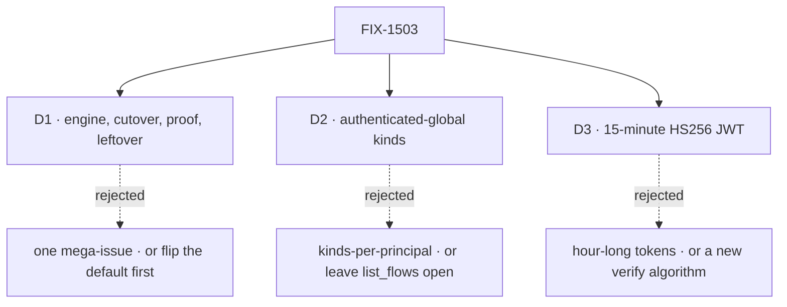

# FIX-1503 · Decisions

[Spec](SPEC.md) · **Decisions** · [Rules](BUSINESS-RULES.md) · [Plan](PLAN.md) · [Docs](DOCS.md) · [Evolution](EVOLUTION.md)

The calls above any single issue: what was chosen, what lost, why, and what each locks in.
Mint trust is not among them — it is [settled](#settled). Three cards are the sign-off
surface. The rest were decided here so no child reopens them.

## The tree

## D1 · Three new issues and the leftover, sequenced around the callers

| | |
|---|---|
| **Instead of** | One issue that flips the default and hopes consumers follow · or four extra children (docs-only, tests-only, transports-only, kitchen-sink-only) |
| **Because** | The engine change is small. The cost is every in-repo HTTP caller that sends no token today. Split engine from cutover so the expensive work has its own review; keep tests and docs inside cutover so "green" cannot stay on the escape. CyberForce is the named proof. [FIX-906](https://linear.app/fixpoint-labs/issue/FIX-906) stays the thin leftover Linear already cut — not a second epic |
| **Locks in** | Engine ships mint + verified default + closed exemptions + the named escape. Cutover migrates HTTP callers, including `goals/` that hit `/api/flows`. Proof waits on both. Leftover starts after mint exists. Collapse trigger: one PR lands mint, default, and every named consumer without a red kitchen-sink |

**What would change my mind:** a measured cutover so small that engine and callers fit one review
without stalling. Then N is N−1 and the second issue should not have been filed.

## D2 · `list_flows` and `capabilities` are authenticated-global; kinds are not per-principal

| | |
|---|---|
| **Instead of** | Leaving those two reads exempt · or making `list_flows` return a different kind list per user |
| **Because** | They are the two routes that are actually open with no gate. Closing them is the identity axis. The kind registry is the host's advertised surface, not tenant data — [FIX-1486](https://linear.app/fixpoint-labs/issue/FIX-1486) already forbids inventing kinds-per-org without an owner call. Session and instance rows are that issue's inventory work, plus [FIX-906](https://linear.app/fixpoint-labs/issue/FIX-906) leftover reads. Authentication here is "you must be somebody"; scoping of stored rows is not a third registry |
| **Locks in** | After the engine child, both routes 401 without a principal and 200 with one. The kind list is the same for every principal on the host. No child adds `?orgId=` as a spoofable filter |

**What would change my mind:** evidence that today's `list_flows` payload already carries
per-tenant instance or seat data, not just registered kinds. Then this route must be
principal-scoped, and [FIX-1486](https://linear.app/fixpoint-labs/issue/FIX-1486) has started
early.

## D3 · Fifteen-minute JWT, host-asserted `sub` and `org`, today's HS256 verify

| | |
|---|---|
| **Instead of** | Hour-long tokens · a new signing algorithm · minting from `body.userId` |
| **Because** | The mint is a token-mediating backend, not a session store. Fifteen minutes is the industry default for a translated credential the browser may hold; remint is a host call, not an IdP round-trip. `sub` and `org` come from the host-verified session or machine key — the same lock as [FIX-1442](https://linear.app/fixpoint-labs/issue/FIX-1442). The verify half already exists (`createHs256JwtVerifier`). A second algorithm is a second auth plane |
| **Locks in** | Default `exp` is `iat + 900`. Human/browser ceiling is 900. Machine ceiling is 3600 when a worker cannot remint mid-job. Required claims: `iss`, `sub`, `aud`, `exp`, `iat`, `jti`, `org` (or `org_id`) from the host. `token_use: access` so a host assertion cannot be replayed as an access token. No refresh token — the host session or API key is the refresh |

**What would change my mind:** CyberForce showing that a stolen 15-minute browser token is the
actual blast radius they can use. Then the human ceiling drops to five minutes. Not an hour
the other way, unless machines cannot remint and the owner accepts the leak window.

## Who owns what

Every rule has one owner. A *consumes* cell is a place a child must not re-decide. FIX-906
consumes the mint and must not re-open the default.

## Decided in review, recorded so no child reopens them

- **Mint trust is settled.** Host-verified session or machine credential → mint → short JWT.
  FSD does not provide login. Re-open only if product wants an IdP.
- **Escape hatch keeps `defaultBodyUserIdPrincipalResolver`.** Explicit opt-in; no second
  "unsigned mode." `@flow-state-dev/node` still refuses network bind on that posture. Exact
  flag spelling is issue-spec detail.
- **FIX-906 is thin leftover, not absorbed.** Default-posture, mint, and the two exemptions
  live on the engine child. Session/resource/read parity and `transcribe` using `ctx.principal`
  stay on FIX-906.
- **`execute_action` and `create_session` get no second gate.** They already resolve a principal.
- **In-process `runAction` / `testFlow` / `fsdev run` keep explicit `userId`.** They are not HTTP.
- **No KS-only or Devtool-only token** that CyberForce cannot present.

## Settled

- **Mint trusts host-owned proof only** (Jake via Architect, 2026-09-21). Human: host session /
  OAuth, then host service secret or host-signed assertion carrying `userId` and optional org
  claims the host alone may assert. Machine: API key or HMAC → same mint. Dev: explicit
  body-`userId` escape. Invent-kill: FSD OAuth UI, password store, user directory, raw end-user
  OAuth codes in the engine, trusting `body.userId` or `body.orgId` when real auth is on.

## Decided, not asked

- **JWT claim names beyond the required set** (`client_id`, `amr`) — engine issue-spec, as long
  as D3's required set holds.
- **Mint path spelling** (`POST /api/flows/mint` vs a sibling prefix) — engine issue-spec.
  Sole unauthenticated route is the constraint, not the letters.
- **Whether docs examples use a shared demo secret in CI** — cutover issue-spec.

## What the end-state POC showed

No end-state POC. The division into issues is the locked sequence (engine small, callers
expensive, CyberForce proves). A consumer-corpus checker re-derives the named cutover list
under `poc/consumer-corpus/` — that is a factual base, not a composition experiment.

## How it got here

- **Drafted (2026-09-22)** — identity axis beside Done FIX-1442; mint practice treated as
  locked; three new children plus the already-thinned FIX-906 leftover; `list_flows` gated
  but not kinds-per-principal; 15-minute HS256 JWT. The consumer-corpus checker found two
  extra HTTP hosts the Linear cost list omitted: `labs/conductor` and `labs/fsd-coding-skill`.
  Cutover owns them.

**Open: none.**
