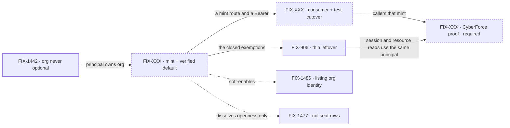

# FIX-1503 · Verified identity by default — host-proof mint + gated `/api/flows`

**Spec** · [Decisions](DECISIONS.md) · [Rules](BUSINESS-RULES.md) · [Plan](PLAN.md) · [Docs](DOCS.md) · [Evolution](EVOLUTION.md)

Epic · 3 unfiled children + 1 filed leftover · Framework simplification & cleanup ·
identity axis beside Done [FIX-1442](https://linear.app/fixpoint-labs/issue/FIX-1442)

## Four teams, before and after

| A team that… | Today | After this epic |
|---|---|---|
| **exposes a host to the network** | Anyone who can reach `/api/flows` is whoever they typed in the body | Every route except mint requires a verified principal |
| **already has login** | Writes a custom resolver or ships open | Exchanges the host session for a short Bearer and keeps its login |
| **lists flows or capabilities from a browser** | Those two reads answer with no credential | The same reads require a token; kinds stay a host-wide registry |
| **runs kitchen-sink, Devtool, or a Lab** | Sends `userId` in JSON and it works | Mints, or names the local-dev escape; CyberForce proves the real path |

**Why now.** Organization identity is already principal-owned ([FIX-1442](https://linear.app/fixpoint-labs/issue/FIX-1442)).
Identity itself is still something the caller writes. That makes org fences advisory, leaves
`list_flows` open, and teaches a default the node host already refuses to bind. The mint is the
missing issue/sign sibling of today's verify helpers — not a login product.

## What's in the box

Inside the box is what a reachable host gets without becoming an identity provider. The fence is
the locked practice: the host verifies the human or machine; the framework only mints and verifies
([Settled](DECISIONS.md#settled)).

## The set · as of 2026-09-22

A dated snapshot of the reviewed scope. Live state is Linear and the implementation PRs.

| Issue | What it delivers | Why the set needs it | Status |
|---|---|---|---|
| FIX-XXX · mint + verified default + close exemptions | The mint route, the default flip, `list_flows` and `capabilities` gated, the named local-dev escape | The substance. Without it consumers have nothing to call and the two open reads stay open | **No child — named gap.** Engine-side; small relative to cutover |
| FIX-XXX · consumer + test cutover | Kitchen-sink, Devtool, docs examples, MCP / scheduled / voice / BullMQ, HTTP `goals/` and labs, integration-tests' HTTP faces | The expensive part. A default flip with no callers is a red repo, not a posture | **No child — named gap.** Sequences around these, not a one-line flip |
| FIX-XXX · CyberForce proof · **required** | The pentest Lab reaches `/api/flows` with a minted token and is refused without one | Framework-green is not the finish line the programme named | **No child — named gap.** Waits on both above |
| [FIX-906](https://linear.app/fixpoint-labs/issue/FIX-906) · thin leftover | Principal on session/resource/read routes + Next vs `fsdev serve` parity, including `transcribe` | Default-posture is absorbed here; leftover must not become a second gate-the-surface epic | **Backlog** · already parented. Not a competing programme |

**0 done · 1 filed leftover · 3 named gaps.** Engine and cutover stay split because the cost
is the callers ([D1](DECISIONS.md#d1)). Collapse if one PR lands mint, default, and every
named consumer without a red kitchen-sink.

## How the issues flow into each other

An edge is what one issue hands the next. Dashed nodes are unfiled or outside the set. FIX-1442
is done input. [FIX-1486](https://linear.app/fixpoint-labs/issue/FIX-1486) and
[FIX-1477](https://linear.app/fixpoint-labs/issue/FIX-1477) are related, not children.

## What stays as it is

- **Login.** Cookie sessions, OAuth, SSO, API keys. The host's. FSD does not provide it.
- **Principal-owned org** ([FIX-1442](https://linear.app/fixpoint-labs/issue/FIX-1442)). Reused, not reopened. No second ownership model, no `__fsd_default_org__` drive-by.
- **[FIX-1486](https://linear.app/fixpoint-labs/issue/FIX-1486)** listing types and org filter. This epic makes that fence enforceable; it does not write the inventory shapes.
- **[FIX-1477](https://linear.app/fixpoint-labs/issue/FIX-1477)** packaging. Gating `list_flows` dissolves the "anyone can read seats" pressure; it does not answer the UI fork.
- **`execute_action` / `create_session`.** They already resolve a principal. No second gate layer.
- **In-process `runAction` / `testFlow` / `fsdev run`.** Trusted process callers, not HTTP. They keep an explicit `userId`.
- **Workforce seats, kinds, agents.** Not an auth plane.

## Sign off

1. **[D1](DECISIONS.md#d1) · Three new issues and the leftover, sequenced around callers.**
   If wrong: a one-line default flip that paints the repo red, or a mega-issue nobody can review.
2. **[D2](DECISIONS.md#d2) · `list_flows` and `capabilities` become authenticated-global, not kinds-per-principal.**
   If wrong: a third inventory of truth beside [FIX-1486](https://linear.app/fixpoint-labs/issue/FIX-1486), or a gated route that still leaks to the internet.
3. **[D3](DECISIONS.md#d3) · Fifteen-minute JWT; host-asserted `sub` and `org`; reuse today's HS256 verify.**
   If wrong: tokens that live as long as a session, or a second auth algorithm the verifiers do not speak.

**Open: none.** Mint trust is [settled](DECISIONS.md#settled), not a card. Escape-hatch naming and
the FIX-906 absorb are [decided, not asked](DECISIONS.md#decided-not-asked). Residual detail is
issue-spec altitude, not a trust-boundary fork. The rules every child obeys:
[BUSINESS-RULES.md](BUSINESS-RULES.md). The order the work runs in: [PLAN.md](PLAN.md).
