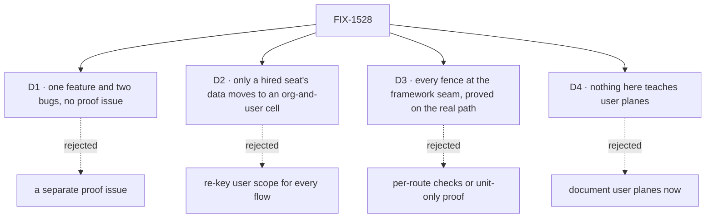

# FIX-1528 · Decisions

[Spec](SPEC.md) · **Decisions** · [Rules](BUSINESS-RULES.md) · [Plan](PLAN.md) · [Docs](DOCS.md) · [Evolution](EVOLUTION.md)

The calls that sit above any one issue in this set. Most of the original scope has shipped, so
there are four, and two of them record product decisions already made. The Architect fences on
[FIX-1528](https://linear.app/fixpoint-labs/issue/FIX-1528) (2026-09-23) are locked input, not
reopened here; [BUSINESS-RULES.md](BUSINESS-RULES.md) carries them as rules with owners.

## The tree

## D1 · The rest of the epic is one feature and two bugs, and FIX-1538 owns the proof

| | |
|---|---|
| **Instead of** | A fourth issue for the assembled proof · or folding the two bugs into FIX-1538 |
| **Because** | The three touch three different doors (drain, debug read, stored data), so folding them makes one PR nobody can review. FIX-1538 lands last and its desired outcome is the epic's outcome word for word, so a separate proof issue would restate it |
| **Locks in** | FIX-1538's goal is the assembled one and grades every leg, not only its own ([ER-15](BUSINESS-RULES.md#the-proof)). Collapse trigger: if FIX-1538 is cut or deferred, the proof becomes its own issue before the epic can wrap |

**What would change my mind on the objective:** evidence that no host runs more than one org or
more than one user per org against the same store. Then plane isolation is theoretical, and the
three remaining issues are polish.

## D2 · Only a hired seat's own data moves to a per-(org, user) cell; the person's cross-org data stays where it is

| | |
|---|---|
| **Instead of** | Re-keying the engine's user scope to (user, org) for every flow · or a Workforce-side copy of the data in a second store |
| **Because** | The product owner decided a private team is not portable. The Architect separates three planes: the person's cross-org data, org-bound data, and a hired seat's private data. Only the third is this epic's. Re-keying every flow would decide the first plane too, which the product owner has not decided. A second store is invent-killed |
| **Locks in** | FIX-1538 changes where a pinned instance resolves user-scoped data, and nothing else. It owns the upgrade: a person in one org keeps what their seats saved once the operator runs its copy step, a seat stops reading their app-wide data, and nothing is silently moved or dropped ([ER-5](BUSINESS-RULES.md#what-a-team-gets-and-what-it-doesnt)) |

The change is narrow enough to skip an end-state POC: only the shared user bucket leaks
([EVOLUTION.md](EVOLUTION.md), third row). The file-level evidence moves to FIX-1538's spec.

## D3 · Every fence sits at a framework seam (dispatch, admission or read), and every leg is proved on the real path

| | |
|---|---|
| **Instead of** | A check in each route or each app · or a unit test that asserts the pin field is set |
| **Because** | F2 put the check at `createExecutionContext` and the HTTP entry points, and the drain reuses the same predicate at the dispatch seam, so every door inherits one rule. A leg proved only by "it shares a code path" is how the drain leg went unproven. A test that reads the pin passes even if admission never consults it |
| **Locks in** | FIX-1534 walks a real claimed-task drain. FIX-1535 reads through the scoped handle, not a second listing door. Each leg is graded by who is asking, with the owner's own run as the control ([ER-13](BUSINESS-RULES.md#how-the-set-is-run)) |

## D4 · Nothing in this epic teaches or documents user planes

| | |
|---|---|
| **Instead of** | Documenting a user's own boards and inventory now, beside the fences |
| **Because** | A user seat's address carries the user id and the name the user typed. Until listings carry org identity ([FIX-1486](https://linear.app/fixpoint-labs/issue/FIX-1486)), any caller who can list can read those names. Locked by the Architect on [#2070](https://github.com/fixpoint-labs/flow-state-dev/pull/2070) |
| **Locks in** | Docs describe the hired-seat fences only. C3, C9 and C10 from the explore wait with user planes. Teaching user planes is a later epic's exit, after FIX-1486 |

## Who owns what

Every rule has one owner, and FIX-1529's pin is the one every other child consumes without
re-deciding. FIX-1538 owns the proof, so it is the only column that reads every other row.

## Decided before this spec, recorded so no child reopens them

- **A private team stays in the org it was built in** (product owner, 2026-09-23). Portability as
  an explicit opt-in is out of scope. Recorded on [#2070](https://github.com/fixpoint-labs/flow-state-dev/pull/2070) → `README.md` § Decided, decision 1.
- **User planes are not taught or exposed until FIX-1486 lands** (Architect, on #2070, decision 2).
- **Hired seats are user-owned only** until a named team-seat product has a who-can-see rule. No
  org-owned hire cells, no ambient org roster (Architect fences).
- **The bridge seat is falsified.** Cross-plane collaboration stays a named gap, and its door is an
  explicit grant, not a seat (#2070).
- **FIX-1534 and FIX-1535 implement ahead of this gate**, by owner authorization. Their fixes are
  reviewed on their PRs, and this spec does not re-gate them.
- **The objective's number.** The epic publishes it as "Goal 1 / foundation honesty". In
  `docs/objectives.md`, foundation honesty is Goal 4, and Goal 1 is real-path validation. This
  set serves both: Goal 4 is the outcome, and Goal 1's evidence (passing goal checks) is the lead measure.

## What the end-state POC showed

None built. The explore's POC on #2070 already assembles the planes end to end (24 legs), and the
one open shape, FIX-1538's cell, is narrow ([D2](#d2)).

## How it got here

- **Explore (Sep 22)** — #2070 found four leaks and falsified the bridge seat.
- **F2 shipped (Sep 23)** — #2091 closed the Critical hole; #2079 shipped the hire tools.
- **Product decisions (Sep 23)** — not portable; user planes wait for FIX-1486.
- **Drafted (Sep 23)** — the remaining set cut to one feature and two bugs.

**Open: none.**
