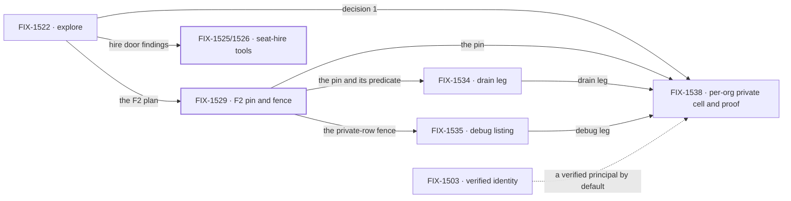

# FIX-1528 · Workforce plane isolation: a private team stays where it was built

**Spec** · [Decisions](DECISIONS.md) · [Rules](BUSINESS-RULES.md) · [Plan](PLAN.md) · [Docs](DOCS.md) · [Evolution](EVOLUTION.md)

Epic · 7 children, 3 done · Workforce: Layer 2 Abstraction · foundation honesty: planes do not
leak config or data across org or user boundaries · [FIX-1528](https://linear.app/fixpoint-labs/issue/FIX-1528)

**How much of that gap it closes:** all of it for hired seats, none of it for user planes (a
user's own boards, inventory and listings), which wait for
[FIX-1486](https://linear.app/fixpoint-labs/issue/FIX-1486) ([D4](DECISIONS.md#d4)).

## Four teams, before and after

| A team that… | Before this epic | After this epic |
|---|---|---|
| **hires a private seat for one person** | Another org could run it with that person's instructions | Only that person, in that org, can list, open, run or resume it. *Shipped* |
| **drains an org board onto hired seats** | The refusal was inferred from a shared code path, never exercised | A drain onto another org's or user's seat is refused. The task ends `errored` with the refusal, and its claim is released |
| **turns debug endpoints on for many users** | The debug listing hands Alice's private seat row to Bob | Scoped like the normal route |
| **has a person in two orgs** | Alice's Acme seat stores data in a cell that follows her to Globex | Her Acme seat's data stays in Acme |

## How we'll know

| | |
|---|---|
| **Outcome** | Alice's Acme private team is invisible and inert from Globex, and from Bob in Acme |
| **Proof** | One assembled goal on the real router and worker pool, owned by FIX-1538 ([ER-15](BUSINESS-RULES.md#the-proof)) |
| **Lead measure** | Fence legs passing on the real path, graded by who asks. **7 of 11 today**: F2's goal legs (a)–(g). Next: drain (FIX-1534), debug (FIX-1535), and stored data from Alice's Globex seat and from Bob's Acme seat (FIX-1538, one leg for each half of the (org, user) cell) |
| **Not doing** | User planes, portability, org-owned hire cells, bridge seats, notify, always-on, board assignment to user ids |

## Why now

The explore on [#2070](https://github.com/fixpoint-labs/flow-state-dev/pull/2070) found any org
could run another org's hired seat with its instructions. [#2091](https://github.com/fixpoint-labs/flow-state-dev/pull/2091)
closed that. Three smaller holes remain, and each makes the closed fence a false promise.
Keeping stored data per org is cheap now and a data split later ([D2](DECISIONS.md#d2)).

## What's in the box

Every door into a hired seat is fenced by one pin from the hire row. The fence is only as good as
the principal the host resolves, so the resolver stays the app's;
[FIX-1503](https://linear.app/fixpoint-labs/issue/FIX-1503) makes a verified one the default.

## The set · as of 2026-09-23

A dated snapshot. Live state is Linear and the implementation PRs.

| Issue | What it delivers | Why the set needs it | Status |
|---|---|---|---|
| [FIX-1522](https://linear.app/fixpoint-labs/issue/FIX-1522) · explore | Plane POC, F2 plan, both product decisions | Every child traces to a finding it pinned | Spec in review · [#2070](https://github.com/fixpoint-labs/flow-state-dev/pull/2070) `df13d36` |
| [FIX-1525](https://linear.app/fixpoint-labs/issue/FIX-1525) · [FIX-1526](https://linear.app/fixpoint-labs/issue/FIX-1526) | Hire and fire as catalog tools; pin required | The runtime door the fences guard | **Done** · [#2079](https://github.com/fixpoint-labs/flow-state-dev/pull/2079) |
| [FIX-1529](https://linear.app/fixpoint-labs/issue/FIX-1529) · F2 | Owner pin on the hire row; catalog, open and restart fence | The Critical hole; every child rides its pin | **Done** · [#2091](https://github.com/fixpoint-labs/flow-state-dev/pull/2091) (#2092 superseded) |
| [FIX-1534](https://linear.app/fixpoint-labs/issue/FIX-1534) · bug | The board-drain leg, proved or fixed | #2091 deferred it; no test walks a drain | Implementing, owner-authorized ahead of this gate |
| [FIX-1535](https://linear.app/fixpoint-labs/issue/FIX-1535) · bug | Debug listing through the scoped handle | The one read that skips the private-row fence; on under `fsdev dev` | Implementing, owner-authorized ahead of this gate |
| [FIX-1538](https://linear.app/fixpoint-labs/issue/FIX-1538) · feature | A private seat's stored data per (org, user); the assembled proof | Nothing else enforces "not portable" | Ready to spec |

**3 done · 1 in review · 2 implementing · 1 to spec.** Bug rows carry no spec PR by design. The
explore and shipped rows are history. The work left is one feature and two bugs on three
different doors, so none folds into another. No separate proof issue: FIX-1538 lands last and its
outcome is the proof ([D1](DECISIONS.md#d1)).

## How the issues flow into each other

An edge is what one issue hands the next; FIX-1503 is another epic's input. The two bugs run side
by side now. FIX-1538 assembles the proof, so it closes last.

## What stays as it is

- **User planes**, with three explore findings that have no issue: a user board and seat inventory
  that hard-code org scope (C9, C10), and a cross-plane write that lands in the caller's cell (C3).
- **The person's cross-org data** outside hired seats. Whether it should follow them is a separate
  product call ([D2](DECISIONS.md#d2)).
- **Related, not children:** [FIX-1486](https://linear.app/fixpoint-labs/issue/FIX-1486),
  [FIX-1396](https://linear.app/fixpoint-labs/issue/FIX-1396),
  [FIX-1503](https://linear.app/fixpoint-labs/issue/FIX-1503),
  [FIX-1536](https://linear.app/fixpoint-labs/issue/FIX-1536) ([PLAN.md](PLAN.md#not-children-deliberately)).
- **A refused action that still answers `202`** (C2). It fails closed; not a leak. No issue.

## Sign off

1. **This epic closes the plane gap for hired seats, and nothing here teaches user planes
   ([D4](DECISIONS.md#d4)).** If wrong: we certify foundation honesty while a user's own boards and
   listings are still open. They are unshipped, so nothing leaks through them today.
2. **[D2](DECISIONS.md#d2) · Only a hired seat's own data moves to a per-(org, user) cell.**
   If wrong: Alice's seat still leaks through a shared bucket, or every user loses cross-org data
   nobody decided to take.
3. **[D1](DECISIONS.md#d1) · The rest is one feature and two bugs, with no proof issue.**
   If wrong: the epic wraps on three green PRs without the assembled check.

**Open: none.** Both product questions were answered before this spec: a private team is not
portable, and user planes wait for FIX-1486 ([Decided](DECISIONS.md#decided-before-this-spec)).
