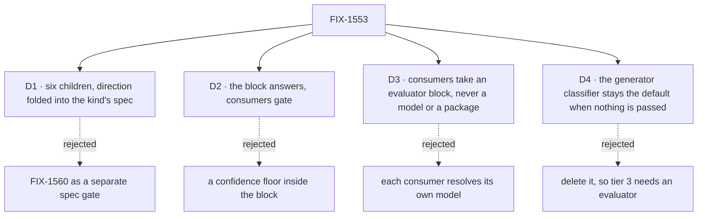

# FIX-1553 · Decisions

[Spec](SPEC.md) · **Decisions** · [Rules](BUSINESS-RULES.md) · [Plan](PLAN.md) · [Docs](DOCS.md) · [Evolution](EVOLUTION.md)

The calls that sit above any one issue in this set. The owner's locks on
[FIX-1553](https://linear.app/fixpoint-labs/issue/FIX-1553) (invent-kills, "Explicitly out", and
the FSD Architect guidance, 2026-09-21 to 24) are decided input, listed
[below](#decided-before-this-spec) and not reopened. The four cards are the engineering calls those
locks leave between the children.

## The tree

## D1 · Six children: FIX-1560 folds into FIX-1554's spec, and FIX-1556 owns the proof

| | |
|---|---|
| **Instead of** | FIX-1560 as its own direction spec and gate ahead of FIX-1554 · or a seventh proof issue |
| **Because** | FIX-1560's four acceptance items (public API and capability contract, prefer-Jev plus adapters, the no-fallback and cascade-outside fences, a spec ready for FIX-1554) are exactly what FIX-1554's retained spec under `specs/issues/FIX-1554/` must contain before it can be built. Two specs for one surface means two gates and a chance to disagree. FIX-1556 already has to run every shipped surface together to teach it, so its goal is the assembled one |
| **Locks in** | FIX-1554's spec carries FIX-1560's acceptance list verbatim and cites it. FIX-1560 is closed as a duplicate of FIX-1554 when that spec opens. FIX-1556's goal grades all six legs ([ER-15](BUSINESS-RULES.md#the-proof)), including the two it does not teach. Collapse trigger: if FIX-1556 is cut, the proof becomes its own issue before wrap |

**What would change my mind on the objective:** evidence that the popular providers' evaluation
adapters answer choice questions no better than a generator with a schema. Then the block kind
is a rename, and Jev is the only reason for it.

## D2 · The block answers; consumers gate. Confidence the model did not give is absent, and absent fails closed

| | |
|---|---|
| **Instead of** | A `minConfidence` option on the block · or a default confidence for models that report none |
| **Because** | The lock makes the block a thin wrap and puts trees in code. A floor inside the block would be a gate in two places. A default number is the "synthetic confidence" the owner invent-killed |
| **Locks in** | FIX-1554 defines one answer shape: each answer, plus confidence and per-option probabilities **only when the model returned them**, absent otherwise. FIX-1558, FIX-1559, FIX-1557 and FIX-1555 read that shape as is; none computes its own confidence. In `cascadingRouter` absent confidence fails every edge, whether or not it sets a floor; a floor adds the "too low" check (ER-4). Per the POC on #1903, the popular providers' adapters return neither, so a cascade on them always lands on `ambiguous`; an author who wants to branch on their bare answer uses a plain `router`. FIX-1558's spec re-checks that against the shipped adapters, and the docs say it plainly ([DOCS.md](DOCS.md)) |

## D3 · A consumer takes an evaluator block, optional, typed on core. It never builds one, names a model, or imports a lab

| | |
|---|---|
| **Instead of** | A `model` option on each consumer that builds the evaluator itself · or a shared "System One" provider |
| **Because** | The block is where the model is chosen and checked. A model option per consumer is three resolvers and three refusal messages. #1903's seams already take a block: `classifier` on `createSkillActivator` and on memory's `system()` |
| **Locks in** | FIX-1559 builds the first seam and the others copy its shape. `@flow-state-dev/orchestration` and `@flow-state-dev/memory` depend on core's block types only. With nothing passed, today's path runs unchanged. With an evaluator passed, its answer is final: `ambiguous` or an error does not fall through to another classifier |

## D4 · The skill activator keeps its generator classifier as the default; a passed evaluator replaces it

| | |
|---|---|
| **Instead of** | Deleting the generator classifier so tier 3 exists only with an evaluator |
| **Because** | The Linear wording is "replace", and it also says skills keep working with no evaluator. Today the stock agent kind's per-seat `enableLlmClassifier` (default off) and the kitchen-sink both run that classifier. Deleting it removes tier 3 from every app that turned it on and has no evaluation model. The invent-kill is a generator *as evaluate's fallback*; D3 forbids that path |
| **Locks in** | FIX-1559 adds the evaluator slot beside today's default. Retiring the generator classifier is a later, separate cut with its own deprecation. The stock agent kind is not edited here |

## Who owns what

Each rule has one owner. The answer shape is the one every other column consumes, and FIX-1556
is the only column that reads every row.

## Decided before this spec, recorded so no child reopens them

Owner locks on FIX-1553 and its children (Architect chat, Jake, 2026-09-20 to 24):

- **`evaluator` is the fifth core block kind**, a peer of `generator` wrapping AI SDK
  `experimental_evaluate`. Dispatcher stays a handler extender; no sixth kind. Tenet 2's test
  for a new primitive is applied, not waived: see [Decided in review](#decided-in-review).
- **`cascadingRouter` is a utility, not a kind.** The name is locked. Trees stay in code.
- **Fail closed** when confidence or probabilities are missing or low. No soft fail into a wrong branch.
- **Prefer Jev via Gateway; accept any evaluation-capable model.** Strings and instances both go
  through evaluate. Generate-only models are refused. No generator plus Zod fallback, no
  OpenRouter Decisions client, no auto-retry.
- **Jev's own library is a first-class second path** (2026-09-24): an author who holds a Jev key
  can use it directly, as an optional peer dependency they install. It is never a hard dependency
  of any FSD package, and only the kind's model path may reach it; consumers still take a block
  ([D3](#d3)). Where the peer is declared and how the kind resolves it is FIX-1554's spec.
- **No `@flow-state-dev/system-one`**, and `labs/typesafe-jev` is not promoted. #1903 stays DNM.
- **Consumers are prefer-when-available**, in order: skill activator, facets, memory. Facets are
  a separate child; query-time classify is an escape hatch only.
- **Not FIX-202.** This is not the test-eval harness.
- **Out:** RAG or Search as core, the kitchen-sink thinking-style router, wholesale migration.
- **FIX-1495 is soft-before and non-blocking.** Core Blocks, Backlog, not W4.
- **Engineering, this spec:** FIX-1554 raises core's `ai` floor to the first release with
  `experimental_evaluate` (#1903 used `^7.0.105`; core pins `^7.0.15`). No child pins its own.

## What the end-state POC showed

**Built:** the whole set, rough and unshipped, in the DNM lab on
[#1903](https://github.com/fixpoint-labs/flow-state-dev/pull/1903) at `b33a072`: an evaluate-only
block (a `handler` stand-in), `cascadingRouter`, skill-activator and memory seams, and index-time
facets. **See it:** `labs/typesafe-jev/` on that branch; `docs/README.md` is the teaching page,
`pnpm --filter @flow-state-dev/typesafe-jev test` runs it. **Showed:** the division holds. Each
consumer needed only an optional block slot on the existing package, and the gate needed nothing
from the block beyond the confidence it passes through. **Changed:** nothing in the division. It
set D2 (adapters carry no confidence) and D3 (the slot takes a block). No new end-state POC.

## Decided in review

Round 1 on #2166 (second look, Codex, FSD Architect triage).

- **Why a kind and not a handler (tenet 2).** The lock stands. What a handler can't carry is
  the model: `ctx.resolveModel` returns a generator model, so an evaluation model needs
  framework-owned resolution and the generate-only refusal, the same reason `generator` is a
  kind. The kind also gets its own trace and DevTool identity, and consumers type their slot on
  an evaluator, not on any handler ([D3](#d3)). The #1903 stand-in resolved its own model, which
  is what D3 forbids consumers doing. **Tripwire:** if FIX-1554's spec finds the kind adds no
  resolution, trace or DevTool behaviour a handler factory couldn't, it raises that to this epic
  before building, and the fallback is an `evaluate` handler factory with four kinds untouched.
- **Absent confidence fails every cascade edge, not only floored ones** ([D2](#d2), ER-4). The
  lock says missing confidence fails closed, and an optional floor let a confidence-less answer
  walk an unfloored edge. Rejected: narrowing the promise to floored edges. Would change my mind:
  a real tree that must route on popular adapters and can't use a plain `router` instead.
- **Leg (f) proves only that memory runs without an evaluator.** The seam call is FIX-1555's own
  test. Asserting it in the assembled goal would pull the cut candidate onto the critical path.
  If FIX-1555 is cut, ER-7's second clause leaves with it by amendment.
- **Leg (b) runs on a real generate-only model** (ER-13), so the wrap gate is satisfiable.
- **Refusal happens before the first call, not when the block is built.** A string model resolves
  at execution; ER-2 already said "before any call", and the docs draft now matches.
- **The five-kinds doc update is a sweep, not a list** ([DOCS.md](DOCS.md)).

Round 2 on #2166 (owner lock relayed by the FSD Architect).

- **Direct Jev joins the model path** ([Decided before this spec](#decided-before-this-spec),
  ER-2, ER-9). Gateway stays the preferred path and leg (a) still runs on it; the direct path is
  proved in FIX-1554's own tests, so the wrap gate does not grow. Rejected: a hard dependency, or
  a consumer reaching Jev itself (ER-11 unchanged).

## How it got here

- **Lab (Sep 18 to 22)** — #1903 moved from OpenRouter Decisions to `experimental_evaluate`.
- **Owner locks (Sep 21 to 24)** — the kind, the utility, the kills, the consumer order.
- **Filed (Sep 24)** — FIX-1553 and seven children under Core Blocks.
- **Drafted (Sep 24)** — FIX-1560 folded; four cards.
- **Review round 1 (Sep 24)** — every cascade edge fails closed; leg (f) scoped; the kind's case recorded.
- **Review round 2 (Sep 24)** — owner adds direct Jev as an optional peer beside Gateway.

**Open: none.**
