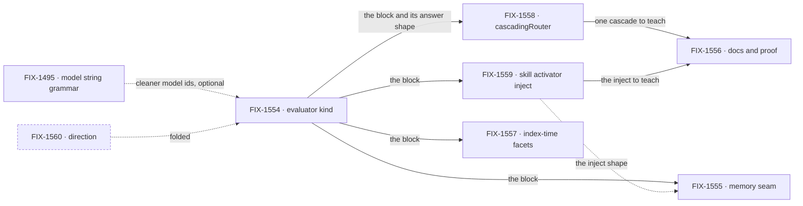

# FIX-1553 · Evaluator: known questions get typed answers, and a routing tree fails closed

**Spec** · [Decisions](DECISIONS.md) · [Rules](BUSINESS-RULES.md) · [Plan](PLAN.md) · [Docs](DOCS.md) · [Evolution](EVOLUTION.md)

Epic · 7 children filed, 6 after [D1](DECISIONS.md#d1) · Core Blocks · Goal 2, differentiate on hard
problems, and Goal 4, keep the foundation honest ([`docs/objectives.md`](../../../docs/objectives.md)) ·
[FIX-1553](https://linear.app/fixpoint-labs/issue/FIX-1553)

## Five teams, before and after

| A team that… | Today | After this epic |
|---|---|---|
| **classifies input with a model** (triage, intent, tagging) | Writes a `generator` with a Zod schema and asks the model to report its own confidence | Declares the questions on an `evaluator` block and gets typed answers, plus the model's confidence when it has one |
| **routes through more than one level of decisions** | Hand-rolls each gate. A missing score is easy to treat as a pass | Writes the tree with `cascadingRouter`. Missing or low confidence lands on the author's `ambiguous` leaf, never on a sibling branch |
| **uses the skill activator's third tier** | Gets a generator classifier | Can pass an evaluator in one line. Slash, keyword and the default stay as they are |
| **searches its own resources by category** | Classifies on every lookup, or builds a second classify stack | Classifies once when content is written and filters stored answers with no model call |
| **captures memory** | Runs today's observer | Still does. An evaluator can be handed to it; nothing requires one |

## How we'll know

| | |
|---|---|
| **Outcome** | An author routes on typed answers from any evaluation-capable model, and a `cascadingRouter` tree never guesses: with no confidence from the model, every edge lands on `ambiguous` |
| **Proof** | One assembled goal on a real evaluation model, six legs, owned by FIX-1556 ([ER-15](BUSINESS-RULES.md#the-proof)) |
| **Lead measure** | Legs of the assembled evaluator goal passing on a real evaluation model. **0 of 6 today** |
| **Not doing** | A System One package, an OpenRouter Decisions client, a generator fallback, cascade inside the block, a dispatcher block kind, RAG as core search |

## Why now

The DNM lab on [#1903](https://github.com/fixpoint-labs/flow-state-dev/pull/1903) showed that Jev
and the popular providers already answer the same AI SDK `experimental_evaluate` call. Every
classifier in the repo today is a generator pretending to be one, and the owner locked the shape
on 2026-09-24. Out of cycle and off the W4 path: side work.

## What's in the box

![What's in the box: the evaluator block kind and the cascadingRouter utility, fenced by no gating, no retry and no fallback inside the block. Composed in by the app: the model, the tree, and the evaluator handed to skill activation, index-time facets or memory. Replaced in one line: the skill activator's third tier and the model. Not built: a System One package, OpenRouter Decisions, a generator fallback, cascade in the block, a dispatcher kind, RAG as core search, the kitchen-sink thinking-style router.](figures/end-state.svg)

The block answers; code decides. Everything that gates or routes sits outside the fence, so a
model that gives no confidence can't be read as a confident one ([D2](DECISIONS.md#d2)).

## The set · as of 2026-09-24

A dated snapshot. Live state is Linear and the implementation PRs. Every row is a Feature and
nothing is specced yet.

| Issue | What it delivers | Why the set needs it | Status |
|---|---|---|---|
| [FIX-1554](https://linear.app/fixpoint-labs/issue/FIX-1554) · core kind | `evaluator`, the fifth block kind: resolver, capability check, refusal of generate-only models, the five-kinds docs | The substance. Everything else consumes it | Backlog · spec not started |
| [FIX-1560](https://linear.app/fixpoint-labs/issue/FIX-1560) · direction | Folded into FIX-1554's spec ([D1](DECISIONS.md#d1)) | Its deliverable is the spec FIX-1554 writes anyway | Backlog · to close as duplicate |
| [FIX-1558](https://linear.app/fixpoint-labs/issue/FIX-1558) · `cascadingRouter` | Code-side tree of evaluate calls with fail-closed gates | The Goal 4 half. Without it the kind is a classifier and nothing more | Backlog |
| [FIX-1559](https://linear.app/fixpoint-labs/issue/FIX-1559) · skill activator | Evaluator inject for tier 3 | First consumer; sets the inject shape the others copy | Backlog |
| [FIX-1557](https://linear.app/fixpoint-labs/issue/FIX-1557) · facets | Classify at write, filter at read | Stops a second classify stack from being built for search | Backlog |
| [FIX-1555](https://linear.app/fixpoint-labs/issue/FIX-1555) · memory | A documented seam, proved by its own tests, sketch only. Its leg proves memory runs without one | Keeps memory from growing its own classifier | Backlog |
| [FIX-1556](https://linear.app/fixpoint-labs/issue/FIX-1556) · docs and teach path | The published teaching page, one demo, the assembled goal | The only child that proves the set works together | Backlog |

**0 done · 0 in flight · 6 to spec, 1 to close.** Whether six is really five: FIX-1555 is the one
I'd cut. It stays because it is sketch-sized and it fences memory off a second classify path. The
collapse trigger is scope: if it grows past a seam and a proof, it leaves the epic.

## How the issues flow into each other

A solid edge is a hard dependency the coordinator wires as blocked-by; a dashed one is a
preference. FIX-1495 is another project's input and blocks nothing. After FIX-1554, the three
consumers and the router can all run at once.

## What stays as it is

- **The stock agent kind's skill loop.** No every-turn classifier, no keyword tier
  ([EVOLUTION.md](EVOLUTION.md)). FIX-1559 changes the opt-in activator only.
- **Existing utilities and routers.** Nothing migrates onto evaluate wholesale.
- **Related, not children:** [FIX-1495](https://linear.app/fixpoint-labs/issue/FIX-1495),
  [FIX-1482](https://linear.app/fixpoint-labs/issue/FIX-1482),
  [FIX-202](https://linear.app/fixpoint-labs/issue/FIX-202),
  [FIX-1455](https://linear.app/fixpoint-labs/issue/FIX-1455) ([PLAN.md](PLAN.md#not-children-deliberately)).

## Sign off

1. **[D2](DECISIONS.md#d2) · The block never gates. A model with no confidence sends every
   `cascadingRouter` edge to `ambiguous`, floor or not.** With an OpenAI or Anthropic adapter a
   cascade sends everything to review; only Jev (or a model that reports confidence) routes
   through one. Those authors branch on the bare answer with a plain `router`. If wrong: authors
   on popular models read "any model works" and find their tree never routes.
2. **[D4](DECISIONS.md#d4) · The skill activator keeps its generator classifier as the default
   when no evaluator is passed.** An evaluator replaces it, and a failed evaluation never falls
   back to it. If wrong: we carry two tier-3 classifiers until a later cut, or the alternative
   silently removes tier 3 from every app and stock seat that turned it on.
3. **[D1](DECISIONS.md#d1) · Six children, FIX-1560 folded, FIX-1556 owns the proof.** If wrong:
   the epic wraps on six green PRs with no check that the pieces work together.

**Open: none.** The owner's locks on FIX-1553 settle every product question the set raised
([Decided before this spec](DECISIONS.md#decided-before-this-spec)).
