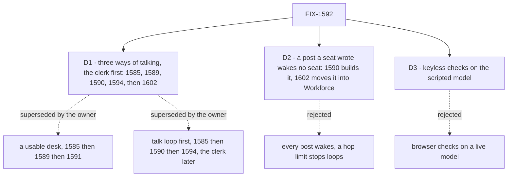

# FIX-1592 · Decisions

[Spec](SPEC.md) · **Decisions** · [Rules](BUSINESS-RULES.md) · [Plan](PLAN.md) · [Docs](DOCS.md) · [Evolution](EVOLUTION.md)

The calls that sit above any one issue in this set. The owner re-scoped the epic on 2026-09-25,
after the first version merged, and the same day put the clerk ahead of the talk loop; the three
cards are what that leaves between the children.

## The tree

## D1 · The epic is the three ways of talking, with the clerk made honest first: FIX-1585 → FIX-1589 → FIX-1590 → FIX-1594 → FIX-1602, and Workforce changes where a path needs them · decided by the owner

| | |
|---|---|
| **Instead of** | The re-scope's first order, 1585 → 1590 → 1594 with FIX-1589 a follow-on · or the first version: a usable support desk, 1585 → 1589 → 1591, with FIX-1590 cut and one package line allowed in the set |
| **Because** | The goal is Jake's ([the real need](SPEC.md#the-goal-and-how-well-know-its-met)): a seat is a conversation, a channel reaches its agents, an agent answers back in the channel. The clerk goes first because the day FIX-1585 ships, `support.ada` is the first seat a person reaches, and it hands their note back word for word. A parrot that looks like it works is worse than a reply loop that isn't finished (the Prod/Eng stamp on #2269; the owner chose "Insert 1589" on a decision card). FIX-1590 needs a Workforce change, because core's dispatcher resolves only internal actions and `defineAgentWorkerFlow` declares only a public `run`; the owner lifted that fence |
| **Locks in** | Workforce changes are allowed where a path needs them (ER-8): the agent kind keeps the person's message (ER-1), declares an internal receiver for posts (ER-2), and gets a way to post to its channel (ER-4). The clerk's `answer` calls a model and may file through the channel's `fileTask` (ER-20). The order is blocked-by on implementation (ER-14). FIX-1602 is not a fourth path: it moves path two's wake into Workforce as stock seat-wake routing before FIX-1601. FIX-1590 wakes member **agent** seats only (below). FIX-1591 is held, not a child. FIX-1585 widens to keep the message (ER-16) |

**Why the wake stays agent-only.** The first reason given, that waking a clerk would run the echo
FIX-1589 replaces, is gone now that FIX-1589 lands first. Two reasons remain. A clerk answers in
its own seat conversation, and only the agent kind gets a way to post back (FIX-1594), so a clerk
woken by a post would answer where nobody reading the channel looks. And a woken clerk may file,
so every post could put a row on `escalations`, which moves the call held with FIX-1591. Adding
clerks to the wake is one entry in the wake's dispatchers (FIX-1590's, then FIX-1602's stock
routing), once that call is made.

**What would change my mind on the objective:** a path that needs core or engine to learn what
a seat is. Then the layer rule and the outcome collide, and the Kill line fires.

## D2 · A post a seat wrote wakes no seat; only a post with no seat author wakes members · FIX-1590 builds it, FIX-1602 moves it into Workforce, reversible

| | |
|---|---|
| **Instead of** | Every post wakes every other member agent, with a hop limit or a per-thread budget to stop loops · or FIX-1594 filters at the seat, declining to answer a seat |
| **Because** | Two agents in one channel would answer each other forever. The fan-out is the one place that sees every post and already reads `author` to skip the writer, so the filter is one comparison where the wake is decided. A hop limit needs a counter carried across posts, which is new state for a demo |
| **Locks in** | FIX-1590 builds the filter at the wake, in kitchen-sink host glue; FIX-1602 moves it, unchanged, into Workforce's stock seat-wake routing. No other child implements it. FIX-1594 must stamp every seat post with the seat's `author` (ER-4), or its posts would wake everyone. Agents in one channel don't hear each other. `author` is an unverified claim, so a raw caller can name a seat and withhold a wake; it can't forge one (FIX-1493 owns verified identity) |

**The owner can reverse this** when a flow needs agents to talk to each other. Reversing it means
adding a loop stop in the wake: FIX-1590's host glue until FIX-1602 merges, Workforce's stock
seat-wake routing after. No other child changes.

## D3 · The goal checks run keyless on kitchen-sink's scripted model, which can drive agent seats and the clerk once their entries are added

| | |
|---|---|
| **Instead of** | Browser checks on a live model · or a real-model goal for the clerk, as the first version planned · or a real-model leg added to the epic's proof |
| **Because** | The goal is who hears whom and what persists, not how good an answer is. A scripted model proves which path ran and what the page kept; a live model adds a key and flake and proves nothing more. The Playwright suite runs a production build under `KITCHEN_SINK_TEST_MODE=1`, whose resolver scripts generators by block name (`test/mock-flowstate.ts`). Today the agent kind's generators, `agent-answer` and `agent-answer-with-activate-tool`, fall to `policy: "allow"`, a no-op with an empty reply; one entry per name fixes that, and FIX-1589's clerk generator needs one too. A marker in a message or post picks a scenario. A step with `toolCalls` and no text runs the real tool (`packages/testing`, `runScript`), so FIX-1594's post and FIX-1589's filing can be scripted |
| **Locks in** | Each goal check's Model field reads "scripted, keyless", citing this card. Anti-game forbids asserting on a reply's wording; a scenario marker may be asserted, since it proves a model call made the reply, not what it says. FIX-1585 adds the agent-kind entry (ER-7), FIX-1589 the clerk's. Not yet run end to end: a scripted tool call reaching a channel `post` through a woken seat; if it can't, that is the Kill line. No real-model leg in the epic's proof. FIX-1589 may add one for answer-or-file judgement as its own check, not a wrap condition |

## Who owns what

Each rule has one owner. FIX-1590 is still the hinge: it consumes FIX-1585's two decisions and
makes the one FIX-1594 must obey. FIX-1589 only consumes what FIX-1585 decides.

## Decided before this spec, recorded so no child reopens them

Fences from the FSD Architect and the cycle PM (2026-09-25), as the re-scope leaves them:

- **No kitchen-sink-only messaging API.** The page calls actions the flows declare.
- **Workforce concepts stay out of core, engine, client and react.**
- **Nothing edits `agent-worker-flow.ts` until FIX-1459 lands.**
- **No second kind→action map; no invented Dispatcher.** The clerk stays `desk-clerk` → `answer { note }`.
- **A seat's reply is a peer `post`**, authored from the seat's identity on the server.
- **The clerk files only through the channel's existing `fileTask`.** No new board-filing API,
  and no person made a drain seat.
- **Browser checks are acceptance; CLI or HTTP smoke alone is not.**

"FIX-1585 stays reachability only" is superseded by ER-16.

## Decided in review, recorded so no child reopens them

- **Round 1 (#2265):** FIX-1590 can't wake agent seats without a Workforce change
  ([review](https://github.com/fixpoint-labs/flow-state-dev/pull/2265#discussion_r4107585826)).
  That fact stands; the owner's re-scope makes the change allowed.
- **Re-scope (owner, 2026-09-25):** the goal is the three paths; Workforce changes are allowed
  where a path needs them ([D1](#d1)).
- **FIX-1589 inserted (owner, 2026-09-25):** the clerk is made honest before the talk loop. The
  Linear Manager called the talk loop "soft-after 1589"; this set reads that as blocked-by on
  implementation, which is what Linear wires, with specs free to start early (ER-14).
- **FIX-1602 added (owner, 2026-09-26):** path two's wake moves into Workforce as stock
  seat-wake routing (the dispatchers and the author filter, on the existing `channel-fan-out`
  loop, not a second fan-out layer), a required child, built after FIX-1594, so the closure run grades the stock path. Its Linear text's
  "soft-after, not a child" is superseded (ER-14, ER-17).
- **FIX-1591 held:** not a child and not on the chain, pending the owner's `escalations` versus
  boot-warning call.
- **FIX-1585's transcript is its posts:** each post leaves one `channel-post` item on its own
  request, with no copy in state (its D1, round 2). FIX-1594's line is read the same way.

## What the end-state POC showed

None built. FIX-1585's premise POC (`specs/issues/FIX-1585/poc/talk-premises/` on its spec
branch) covers the post and its items. The untested premise is D3's scripted post through a
woken seat; FIX-1594's spec proves it or fires the Kill line.

## How it got here

- **Drafted (Sep 25)** from the epic-pm shaping: four issues, FIX-1591 proposed cut.
- **Owner call (Sep 25):** FIX-1591 kept; `escalations` to be served.
- **Review round 1 (Sep 25):** FIX-1590 cut; merged as #2265.
- **Re-scope (Sep 25, after merge):** the owner asked why asking a seat leaves a note with no
  reply, and chose the three paths. FIX-1590 back, FIX-1594 added, FIX-1589 and FIX-1591 out,
  the `escalations` call (old D3) and the clerk's real-model goal (old D4) with them.
- **FIX-1589 inserted (Sep 25):** after the Prod/Eng stamp and the Architect's review on #2269,
  the owner chose "Insert 1589". D1 re-drafted to 1585 → 1589 → 1590 → 1594; FIX-1591 held off
  the chain. The agent-only wake re-argued without the echo reason. Goal section added to meet
  FIX-1593's template.

**Open: none.**
