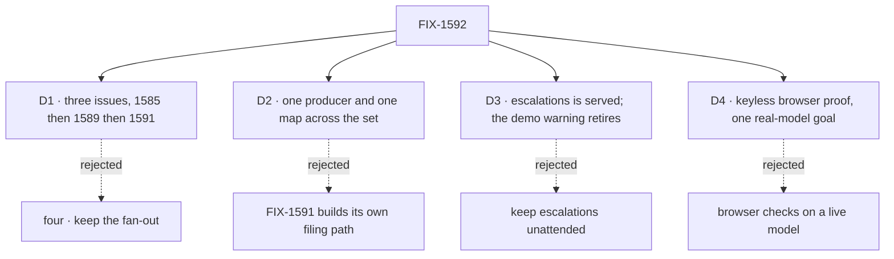

# FIX-1592 · Decisions

[Spec](SPEC.md) · **Decisions** · [Rules](BUSINESS-RULES.md) · [Plan](PLAN.md) · [Docs](DOCS.md) · [Evolution](EVOLUTION.md)

The calls that sit above any one issue in this set. The fences from the FSD Architect and the
cycle PM on the original four issues (2026-09-25) are decided input, listed
[below](#decided-before-this-spec) and not reopened. The four cards are the calls those fences
leave between the children.

## The tree

## D1 · Three issues, run FIX-1585 → FIX-1589 → FIX-1591; a post that wakes seats is a follow-on

| | |
|---|---|
| **Instead of** | Four, keeping FIX-1590 (a post wakes each member seat) · or FIX-1591 cut, its producer half left to FIX-1589 and its person half not built · or both after FIX-1585 in parallel |
| **Because** | FIX-1585 makes the desk reachable; the other two are what a reader finds the moment it is. FIX-1589 goes first because it is the parrot, and because its filing is the first thing that puts a row on either board. FIX-1591 was proposed as a cut; the owner kept it on 2026-09-25 so a person can pick up the work the clerk escalates. FIX-1590 is cut: no Proof line read it, and its planned shape can't be built inside the fence. Core's dispatcher resolves only a flow's internal actions, the agent seats declare only a public `run`, and adding an internal receiver is a package change ER-7 forbids |
| **Locks in** | Linear blocked-by: FIX-1589 by FIX-1585; FIX-1591 by FIX-1589. FIX-1590 is un-parented from FIX-1592 and stays related. It returns only with its own spec that owns the internal receiver as a package change. Nothing in this set touches the notify stub |

**What would change my mind on the objective:** a model-backed clerk that still needs a
framework change beyond FIX-1585's D1 line. Then the desk is teaching a gap, not the framework,
and the Kill line fires.

## D2 · One producer, one map: the clerk files through the channel's own `fileTask`, and every seat action is looked up in FIX-1585's D3 map

| | |
|---|---|
| **Instead of** | FIX-1591 building its own producer for `followups` · a second kind→action table beside FIX-1585's |
| **Because** | FIX-1589's decision to file *is* the producer FIX-1591's issue asked for. A second filing path splits one intake into two. The map is FIX-1585 D3's: one module, its entries written there, a drift test holding it to the tree. A second copy drifts from the first the day a kind is added |
| **Locks in** | FIX-1589 owns filing onto both boards. FIX-1591 consumes those rows and builds only the board-side verbs: pick up an `escalations` row, run the `followups` drain. Any later consumer of seat actions, FIX-1590's follow-on included, imports FIX-1585's map and does not copy it |

## D3 · `escalations` is served, and the reference app stops demonstrating the unattended-board warning · decided by the owner

| | |
|---|---|
| **Instead of** | Leaving `escalations` undrained so the boot keeps printing the warning FIX-1476 shipped as a demonstration |
| **Because** | The channel's own charter says `escalations` is "work a person picks up". A reference app that files work there and gives nobody a way to pick it up teaches the wrong thing louder than the warning teaches the right one. Serving it means some flow declares the board, and a declared board does not warn. You can't have both. **The owner took this trade on 2026-09-25**, keeping FIX-1591 in the set |
| **Locks in** | FIX-1591 rewrites the README's "Nothing is wired to `escalations`" section, and amends legs V8 and V9 of `goals/workforce-conventions/a-channel-holds-the-work-a-seat-drains` in the same PR: V9 expects no warning. V8 keeps its subset assertion, since `support.wren`'s drain still leaves an `escalations` row pending; only its wording ("the unwired board") changes. The warning itself stays proved by `packages/workforce/test/channel-board-attendance.test.ts`. Nothing in kitchen-sink re-creates an unattended board to keep the demo |

## D4 · The browser checks run keyless; one real-model goal for the clerk is how the set counts

| | |
|---|---|
| **Instead of** | Browser checks against a live model · or keyless checks only, and no goal |
| **Because** | The Playwright suite already runs under `KITCHEN_SINK_TEST_MODE=1`, which swaps the model resolver for a deterministic mock. A browser check that needs a live key goes red for reasons that aren't the desk. But a mock proves the path, not the answer, and the objective asks for real models. One goal under `goals/` that sends the clerk a note on a real model, and grades answer-or-file, is the piece that says the answer is real |
| **Locks in** | Every child's browser check is keyless. FIX-1589 owns making the deterministic model drive both branches (answer, and file) in test mode, and owns the one real-model goal. If either branch can't be driven without a live key, that is the Kill line. The goal itself needs a key by design and never trips it |

## Who owns what

Each rule has one owner. FIX-1589's column is the busiest: it builds the answer, and every other
column downstream consumes a row it decided.

## Decided before this spec, recorded so no child reopens them

Fences from the FSD Architect and the cycle PM on FIX-1585, FIX-1589, FIX-1590 and FIX-1591
(2026-09-25), before FIX-1590 was cut:

- **FIX-1585 stays reachability only.** No child widens its spec or PR #2258.
- **No kitchen-sink-only messaging API.** The page calls actions the flows declare.
- **Workforce Layer 2 concepts stay out of core and engine.**
- **Nothing edits `packages/workforce/src/agent-worker-flow.ts` until FIX-1459 lands.** Another
  thread is implementing it.
- **No second kind→action map; no invented Dispatcher.**
- **FIX-1585's browser checks are its acceptance; CLI or HTTP smoke alone is not.**

## Decided in review, recorded so no child reopens them

- **FIX-1590 leaves the set (round 1).** A post can't wake agent seats with core's dispatcher:
  it resolves only internal actions, and `defineAgentWorkerFlow` declares only the public `run`
  ([review](https://github.com/fixpoint-labs/flow-state-dev/pull/2265#discussion_r4107585826)).
  The fix is a package change the fences forbid. [D1](#d1).
- **The Kill line reads the deterministic browser checks only (round 1).** The one real-model
  goal needs a key by design ([D4](#d4), ER-16).

## What the end-state POC showed

None built. The shape rests on FIX-1585's premise POC (`specs/issues/FIX-1585/poc/talk-premises/`
on its spec branch), which confirmed what a post, an ask and the expose line do on the real
kitchen-sink wiring. The one untested premise is D4's: that test mode can drive both of the
clerk's branches. FIX-1589's spec proves it or fires the Kill line.

## How it got here

- **Drafted (Sep 25)** from the epic-pm shaping on FIX-1592: four issues, FIX-1591 proposed cut.
- **Owner call (Sep 25)** — FIX-1591 kept, after FIX-1589. Serving `escalations` retires the
  unattended-board demo (D3). "Person-side pickup" left Not doing and entered the Proof.
- **Review round 1 (Sep 25)** — FIX-1590 cut to a follow-on (D1); D2 added to the sign-off; the
  Kill line scoped to the browser checks.

**Open: none.**
