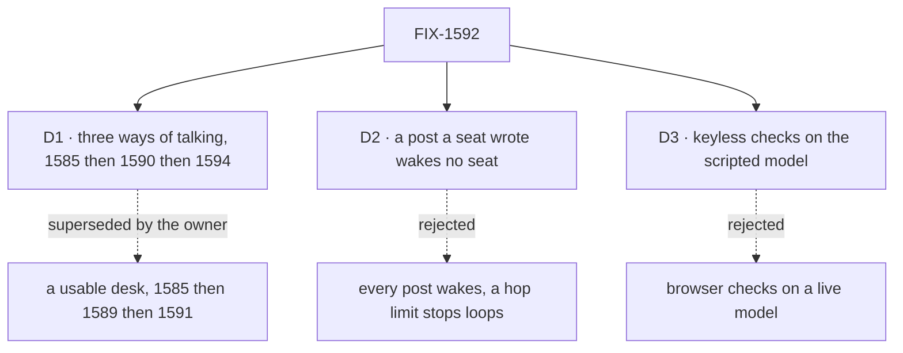

# FIX-1592 · Decisions

[Spec](SPEC.md) · **Decisions** · [Rules](BUSINESS-RULES.md) · [Plan](PLAN.md) · [Docs](DOCS.md) · [Evolution](EVOLUTION.md)

The calls that sit above any one issue in this set. The owner re-scoped the epic on 2026-09-25,
after the first version merged; the three cards are what that leaves between the children.

## The tree

## D1 · The epic is the three ways of talking, run FIX-1585 → FIX-1590 → FIX-1594, with Workforce changes where a path needs them · decided by the owner

| | |
|---|---|
| **Instead of** | The first version: a usable support desk, FIX-1585 → FIX-1589 (the clerk answers) → FIX-1591 (the boards), with FIX-1590 cut and one package line allowed in the set |
| **Because** | The owner, on 2026-09-25: *"A seat is a direct conversation… A channel is a way of talking to two or more agents, or one agent under a specific topic… if you talk to an agent through a channel, the agent can respond back to that channel."* FIX-1590 was cut because a post can't reach an agent seat without a Workforce change: core's dispatcher resolves only internal actions, and `defineAgentWorkerFlow` declares only a public `run`. The owner lifted that fence, so FIX-1590 is back |
| **Locks in** | Workforce changes are allowed where a path needs them (ER-8): the agent kind keeps the person's message (ER-1), declares an internal receiver for posts (ER-2), and gets a way to post to its channel (ER-4). FIX-1590 wakes member **agent** seats only; waking a `desk-clerk` would run the echo FIX-1589 exists to replace. FIX-1589 and FIX-1591 are un-parented and related. FIX-1585 widens to keep the message (ER-16) |

**What would change my mind on the objective:** a path that needs core or engine to learn what
a seat is. Then the layer rule and the outcome collide, and the Kill line fires.

## D2 · A post a seat wrote wakes no seat; only a post with no seat author wakes members · FIX-1590 owns it, reversible

| | |
|---|---|
| **Instead of** | Every post wakes every other member agent, with a hop limit or a per-thread budget to stop loops · or FIX-1594 filters at the seat, declining to answer a seat |
| **Because** | Two agents in one channel would answer each other forever. The fan-out is the one place that sees every post and already reads `author` to skip the writer, so the filter is one comparison where the wake is decided. A hop limit needs a counter carried across posts, which is new state for a demo |
| **Locks in** | FIX-1590 builds the filter at the wake. FIX-1594 must stamp every seat post with the seat's `author` (ER-4), or its posts would wake everyone. Agents in one channel don't hear each other. `author` is an unverified claim, so a raw caller can name a seat and withhold a wake; it can't forge one (FIX-1493 owns verified identity) |

**The owner can reverse this** when a flow needs agents to talk to each other. Reversing it means
adding a loop stop in FIX-1590's wake, not a change to any other child.

## D3 · The browser checks run keyless on kitchen-sink's scripted model, which can drive agent seats once one entry is added

| | |
|---|---|
| **Instead of** | Browser checks on a live model · or a real-model goal, as the first version planned for the clerk |
| **Because** | The Playwright suite runs a production build under `KITCHEN_SINK_TEST_MODE=1`, whose resolver scripts generators by block name (`test/mock-flowstate.ts`). Today it maps no agent seat: the agent kind's generators, `agent-answer` and `agent-answer-with-activate-tool`, fall to `policy: "allow"`, a no-op model with an empty reply. One entry per name fixes that. The script sees the generator's messages, so a marker in a message or post body picks a scenario. A step with `toolCalls` and no text runs the real tool before the next step (`packages/testing`, `runScript`), so FIX-1594's post can be scripted too |
| **Locks in** | FIX-1585 adds the agent-kind entry (ER-7). Each child keys its scenario on a marker, since tests run in parallel against one mock. Not yet run end to end: a scripted tool call reaching a channel `post` through a woken seat. If it can't, that is the Kill line. The set adds no goal, and says so in the Spec |

## Who owns what

Each rule has one owner. FIX-1590 is the hinge: it consumes FIX-1585's two decisions and makes
the one FIX-1594 must obey.

## Decided before this spec, recorded so no child reopens them

Fences from the FSD Architect and the cycle PM (2026-09-25), as the re-scope leaves them:

- **No kitchen-sink-only messaging API.** The page calls actions the flows declare.
- **Workforce concepts stay out of core, engine, client and react.**
- **Nothing edits `agent-worker-flow.ts` until FIX-1459 lands.**
- **No second kind→action map; no invented Dispatcher.**
- **A seat's reply is a peer `post`**, authored from the seat's identity on the server.
- **Browser checks are acceptance; CLI or HTTP smoke alone is not.**

"FIX-1585 stays reachability only" is superseded by ER-16.

## Decided in review, recorded so no child reopens them

- **Round 1 (#2265):** FIX-1590 can't wake agent seats without a Workforce change
  ([review](https://github.com/fixpoint-labs/flow-state-dev/pull/2265#discussion_r4107585826)).
  That fact stands; the owner's re-scope makes the change allowed.
- **Re-scope (owner, 2026-09-25):** the goal is the three paths; FIX-1589 and FIX-1591 leave as
  follow-ons; Workforce changes are allowed where a path needs them ([D1](#d1)).
- **FIX-1585's transcript is its posts:** each post leaves one `channel-post` item on its own
  request, with no copy in state (its D1, round 2). FIX-1594's line is read the same way.

## What the end-state POC showed

None built. FIX-1585's premise POC (`specs/issues/FIX-1585/poc/talk-premises/` on its spec
branch) covers the post and its items. The untested premise is D3's scripted post through a
woken seat; FIX-1594's spec proves it or fires the Kill line.

## How it got here

- **Drafted (Sep 25)** from the epic-pm shaping: four issues, FIX-1591 proposed cut.
- **Owner call (Sep 25):** FIX-1591 kept; `escalations` to be served.
- **Review round 1 (Sep 25):** FIX-1590 cut; merged as #2265.
- **Re-scope (Sep 25, after merge):** the owner asked why asking a seat leaves a note with no
  reply, and chose the three paths. FIX-1590 back, FIX-1594 added, FIX-1589 and FIX-1591 out,
  the `escalations` call (old D3) and the clerk's real-model goal (old D4) with them. This PR.

**Open: none.**
