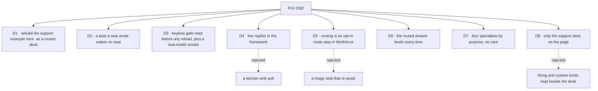

# FIX-1592 · Decisions

[Spec](SPEC.md) · **Decisions** · [Rules](BUSINESS-RULES.md) · [Plan](PLAN.md) · [Docs](DOCS.md) · [Evolution](EVOLUTION.md)

The calls above any one issue. Amended 2026-09-27 after the owner's real-model test: D1 and D3
rewritten, D2 stands, D4 to D8 new. D1 and D8 are the owner's own calls. What the old cards said:
[EVOLUTION.md](EVOLUTION.md).

## The tree

```mermaid
flowchart TD
  E["FIX-1592"] --> D1["D1 · rebuild the support example here, as a routed desk"]
  E --> D2["D2 · a post a seat wrote wakes no seat"]
  E --> D3["D3 · keyless gate read before any reload, plus a real-model smoke"]
  E --> D4["D4 · live replies in the framework"]
  D4 -.->|"rejected"| X4["a kitchen-sink poll"]
  E --> D5["D5 · routing is an opt-in route step in Workforce"]
  D5 -.->|"rejected"| X5["a triage seat that re-posts"]
  E --> D6["D6 · the routed answer lands every time"]
  E --> D7["D7 · four specialists by purpose, no care"]
  E --> D8["D8 · only the support story on the page"]
  D8 -.->|"rejected"| X8["hiring and custom kinds kept beside the desk"]
```

## D1 · Rebuild the support example inside this epic, as one routed conversation · the owner's decision, 2026-09-27

| | |
|---|---|
| **Instead of** | Fix FIX-1609 and FIX-1610 and keep the roster · or a new epic for the rebuild |
| **Because** | The owner's first real use failed this epic's own goal, so the two bugs are this epic's. Fixing them on the old roster proves a desk nobody would ship. A new epic would run the same closure over the same pages twice |
| **Locks in** | The three ways of talking stay the spine: talk to a specialist, a post reaches the right agent ([D5](#d5)), the agent answers in the channel ([D6](#d6)), live ([D4](#d4)). FIX-1609 and FIX-1610 become children, FIX-1610 owning the routing too; FIX-1611 is the rebuild; FIX-1601's plan is [amended](PLAN.md#fix-1601s-plan-amendment). The shipped chain is not reopened |

Jake picked "Rebuild here" on the decision card, 2026-09-27 00:24 UTC.

**What would change my mind on the objective:** the owner deciding support is the wrong example.
D4 to D6 would still stand; the rebuild would move to another example.

## D2 · A post a seat wrote wakes no seat · stands, shipped by FIX-1602

| | |
|---|---|
| **Instead of** | Every post wakes every other member, with a hop limit |
| **Because** | Two agents in one channel would answer each other forever. The wake already reads `author` |
| **Locks in** | It also keeps a specialist's answer, a seat-authored post, from being routed again. FIX-1610 consumes it. `author` is unverified until FIX-1493 |

## D3 · The gate is keyless and reads the open page before any reload; one real-model smoke joins the closure

| | |
|---|---|
| **Instead of** | Reading the page only after a reload, as every check did · no real-model run, as the re-scope decided · real-model gated legs |
| **Because** | Both failures the owner hit passed every keyless check: the checks reloaded first, and the script always called the post tool. A scripted gate still proves who hears whom without a key or flake. The smoke is where a real model's tool choice and routing get seen |
| **Locks in** | Every gated leg asserts before a reload, then after one. Leg a's script never calls the post tool. The smoke runs in FIX-1601 with a key, five posts or more, outside CI; a missing answer is a finding, never flake |

## D4 · Live replies are fixed in the framework: an open session view hears every request in its session, and shows which seats are working · the owner's direction, FIX-1609

| | |
|---|---|
| **Instead of** | Kitchen-sink polls or remounts the panel · a typing bus beside the channel |
| **Because** | A seat's answer is a separate request dispatched into the channel's session. The open view hears only its own requests, and the engine has no session-wide stream. Every app that shows a channel hits this; a demo-only poll teaches the wrong fix |
| **Locks in** | Engine, client and react may change in their own words (session, request, child run), never Workforce's (ER-8). "Working" reads the session's running child runs. The old Kill line's "no change in core or engine" is lifted |

## D5 · Routing is an opt-in route step in Workforce: a channel that declares it sends each post to one member, picked by the members' stated purpose · FIX-1610

| | |
|---|---|
| **Instead of** | A router in kitchen-sink's notify slot · a triage seat that re-posts every post · a custom channel kind |
| **Because** | The fan-out already sees every post, so narrowing its members there leaves the stock wake and D2 alone. An app-side router is what every host would copy, and a goal check forbids one in kitchen-sink. A triage seat adds a hop, a bot line and the old contrivance. A custom kind can't hold `escalations` |
| **Locks in** | The route runs once per post in the channel flow, before the fan-out, never inside per-member notify. Order (ER-21): the specialist already holding the case, from recent lines, no model call; else one classifier call over the members' `WORKER.md` `description:`; else the fallback member. So a failed call never pulls a follow-up away from its specialist. A `CHANNEL.md` line opts in; without it a channel wakes every agent member, as today. Kitchen-sink writes no routing code |

**The trade-off, decided.** A specialist hears only the post routed to it, so its history holds
only its cases. A post leaning on something told to another specialist arrives without it; the
customer may repeat it. Passing lines with the post is a later, one-rule change.

## D6 · A routed specialist's answer lands in the channel every time, as a line the seat wrote, whatever the model's tool choice · FIX-1610

| | |
|---|---|
| **Instead of** | A firmer prompt · a channel-side responder writing the answer itself |
| **Because** | On real models the seat posted its answer 4 times in 6 on one and 0 in 2 on another; the script always did. A prompt makes it likelier, not certain. A channel-side responder writes words no seat wrote |
| **Locks in** | "Meant to answer" is the routed member, so FIX-1610 defines it with the route ([D5](#d5)), never as "every woken member of an unrouted channel posts". The line is authored as the seat (ER-4), so D2 keeps it from waking anyone |

## D7 · The support team is four specialists by purpose and one routed channel

| | |
|---|---|
| **Instead of** | The named roster with routing on top · a fifth `care` specialist for upset customers |
| **Because** | Jake: *"whats the point of having agents with names instead of clear roles or purposes."* Upset is a tone, not a topic: an upset customer with a broken printer still needs `devices` |
| **Locks in** | `support.devices`, `support.accounts`, `support.fsd` and `support.general` (the fallback) on the built-in agent kind; one routed channel holding `escalations`. Cut: ada, grace, iris, otto, wren; `desk-clerk`, its `desk` setting and `desk-note`; the `ada-wren` DM; `desk`. What else leaves the page is [D8](#d8). FIX-1611's spec confirms ids |

## D8 · Kitchen-sink shows only the support story: page hiring, the hiring seat and the custom kinds leave · the owner's call, from his own words

| | |
|---|---|
| **Instead of** | Keeping page hiring, mara, the custom kinds, `followups` and its runner in a separate corner of the app |
| **Because** | Jake, 2026-09-26: *"Why do I have desk clerks and agents, 5 agents stock altogether and I can hire more - but why - whats the point"*. A desk has no job for a hired specialist until one can join the channel (FIX-1415), and these features are most of why the roster read as contrived |
| **Locks in** | Cut from the page and the roster: the rail's "Hire another", mara, the `followup-runner` kind with `followups`, the `digest` channel kind with `noticeboard`. Kept: the operator's HTTP hire, so the durable-hire check stays on the real app. The other checks these features back move to fixture hosts, re-pointed, not deleted (ER-27). Page hiring returns with FIX-1415 |

**The cost, accepted:** hiring from a browser has no demo until FIX-1415. Re-adding one is a
small issue.

## Who owns what

Each rule has one owner. FIX-1610 holds both halves of a routed post, who hears it and that its
answer lands, so no seam is left between them.

## Decided before this spec, recorded so no child reopens them

The Architect's fences, as this amendment leaves them:

- **No kitchen-sink-only messaging API**, and no kitchen-sink poll for the live view.
- **Workforce concepts stay out of core, engine, client and react.**
- **No second kind→action map; no invented Dispatcher.**
- **A seat's reply is a peer `post`.** No channel-side responder; the route posts nothing.
- **Filing onto a board goes through the channel's own `fileTask`.**
- **"Working" reads running child runs**, not a second typing or notify path.
- **Browser checks are acceptance**; a CLI or HTTP run alone is not.

The FIX-1459 fence on `agent-worker-flow.ts` is lifted: FIX-1459 merged.

## Decided in review, recorded so no child reopens them

- **FIX-1609 and FIX-1610 block FIX-1601**; the owner chose the framework fix for the live view.
- **The routed channel folds into FIX-1610**, since who hears a post and whether its answer
  lands are one mechanism. The rebuild is FIX-1611, after FIX-1609 and FIX-1610 (#2310 review).
- **Routing order:** the specialist holding the case, then the classifier, then the fallback
  (ER-21), so a failed call can't split a case (#2310 review).
- **FIX-1591 held**, pending the owner's `escalations` call.
- **A channel's transcript is its posts** (FIX-1585 D1); the live view reads the same items.
- Earlier rounds' calls (the internal receiver, FIX-1589 first, FIX-1602 required) all shipped.

## What the end-state POC showed

None built. The untested premise is D5: one classifier call routing well on a real model.
FIX-1610's spec builds a small routing POC before it is built
([PLAN.md](PLAN.md#notes-for-the-child-specs)); the smoke confirms it.

## How it got here

- **Sep 25:** drafted as a usable support desk (#2265); re-scoped to the three ways of talking
  (#2269).
- **Sep 26:** closure issue FIX-1601 (#2289); FIX-1602 added (#2294). The owner's real-model
  test finds a reload-only channel, a missing answer, no status, a contrived roster.
- **Sep 27, this amendment:** rebuild as a routed desk. D1 and D3 rewritten; D4 to D8 added;
  the Kill line and ER-2's promise amended. The owner picked "Rebuild here" (D1, 00:24 UTC);
  the open question on the other features closed as D8, from his own message. Review folded
  the routed channel into FIX-1610 and filed FIX-1611.

**Open: none.** Approving this direction is merging it.
