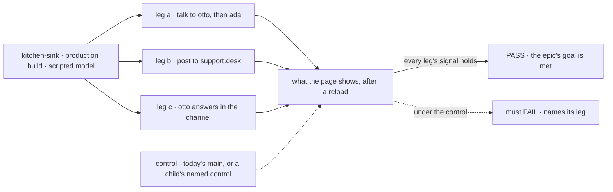
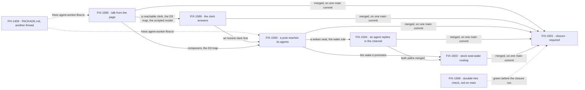

# FIX-1592 · Kitchen-sink: talk to a seat, a channel, and back

**Spec** · [Decisions](DECISIONS.md) · [Rules](BUSINESS-RULES.md) · [Plan](PLAN.md) · [Docs](DOCS.md) · [Evolution](EVOLUTION.md)

Epic · 5 issues and a closure issue · Workforce: Layer 2 Abstraction · Goal 1, validate through real usage
([`docs/objectives.md`](../../../docs/objectives.md)) ·
[FIX-1592](https://linear.app/fixpoint-labs/issue/FIX-1592) · re-scoped by the owner on
2026-09-25; the first version was [#2265](https://github.com/fixpoint-labs/flow-state-dev/pull/2265)
([EVOLUTION.md](EVOLUTION.md))

## Four people, before and after

| Someone who… | Today | After this epic |
|---|---|---|
| **talks to an agent seat (`support.otto`) from the page** | Can't. From the CLI the seat runs, but nothing keeps what was asked | Types a message. The message and the seat's reply stay in that seat's conversation, across a reload |
| **asks the desk clerk (`support.ada`) something** | Can't from the page. From the CLI it hands the note back word for word, with the desk's name on it | Gets a model's answer, or sees the note filed onto `followups` or `escalations` |
| **posts to `support.desk`** | Can't from the page. From the CLI the post lands, and the notify stub names each member and runs none | Posts from the page. Each member agent seat (`support.iris`, `support.otto`) runs once on it |
| **reads `support.desk` after posting** | Sees only what people posted | Sees a member agent's reply in the channel, under that seat's name, across a reload |

## Why now

FIX-1585 makes seats reachable from the page. The day it ships, the clerk parrots the note back,
an agent seat forgets the question, and a channel post runs nobody. The parrot is the worst of
the three, so FIX-1589 runs first ([D1](DECISIONS.md#d1)).

## The goal, and how we'll know it's met

**In kitchen-sink, talking to a seat is a conversation with that agent, a post to a channel
reaches each agent in it, and an agent that heard the post can answer back in that channel.**

| Is it the right goal? | |
|---|---|
| **The real need** | Jake, 2026-09-25: *"A seat is a direct conversation. I should be able to talk to a seat using the normal agent flow that comes with workforce. A seat is just a specific agent with its own memory and its own identity. A channel is a way of talking to two or more agents, or one agent under a specific topic, work stream, or whatever. The system needs to show that if you talk to a channel, it sends it to the agents, and if you talk to the agents, then you're just talking to the agent. But the system also needs to show that if you talk to an agent through a channel, that the agent can respond back to that channel."* |
| **Smaller, and rejected** | "Seats and channels are reachable from the page." FIX-1585 alone meets it while the clerk parrots and a post runs nobody. "A post reaches its agents" without FIX-1594 drops Jake's last sentence |
| **Bigger, and not this epic's** | "A working support desk": boards drained and `escalations` served (FIX-1591, held), agents talking to each other (D2 reversed) |
| **Not done if** | Every child is Done but the four checks never ran on one `main` commit · a check passes only with a key, or only from the CLI · the agent's channel reply wakes the other agent · the clerk's reply is a fixed string · leg b passes on kitchen-sink's own wake glue, not Workforce's stock seat-wake routing (FIX-1602) |

The checks read the page after a reload, not what a flow returned. Each control must fail its
own leg.

| How we verify | |
|---|---|
| **Goal check** | [FIX-1601](https://linear.app/fixpoint-labs/issue/FIX-1601)'s QA plan ([#2288](https://github.com/fixpoint-labs/flow-state-dev/pull/2288)), run on one `main` commit per [the closure issue](../../../docs/contributing/orchestration.md#the-closure-issue-every-epic-ends-in-qa) ([ER-17](BUSINESS-RULES.md#the-proof)). Model: the scripted model, keyless ([D3](DECISIONS.md#d3)) |
| **Signal** | **a:** otto shows the message and the reply after a reload; ada's reply is not the note and carries its scenario marker, so a model call made it. **b:** one post runs iris and otto once each, no other seat. **c:** otto's reply is a line in `support.desk` under its name, survives a reload, runs no seat |
| **Input** | Text each child picks, with a scenario marker in it; a different text must pass too |
| **Anti-game** | Don't assert on a reply's wording: the script wrote it. Don't assert on a flow's return value, a package test or a CLI run; none is what a person sees |
| **Control that must fail** | Today's `main` fails every leg. Each child names a `GOAL_CONTROL`: the old echo fails leg a, the name-only notify stub leg b, dropping D2's author filter leg c |

| | |
|---|---|
| **Lead measure** | A clean FIX-1601 run on one `main` commit. **None today** |
| **Not doing** | The boards' drain and the `escalations` call ([FIX-1591](https://linear.app/fixpoint-labs/issue/FIX-1591), held) · Assistant tools that post or ask · channel admin ([FIX-1415](https://linear.app/fixpoint-labs/issue/FIX-1415)) · verified identity ([FIX-1493](https://linear.app/fixpoint-labs/issue/FIX-1493)) · any Layer 1 channel, notify or dispatch substrate · live updates of other people's posts |
| **Kill line** | A path needs a change in core or engine, or one of the four browser checks can't pass without a live model key |

**What it closes of the objective's gap:** none of the number. It is the reference app's first
browser use of Workforce's three ways of talking.

## What's in the box

The three paths are Workforce's own. Kitchen-sink is where a person first sees them work.

## The set · as of 2026-09-26

A dated snapshot. Live state is Linear and the implementation PRs. The five are Features;
FIX-1601 is the closure issue.

| Issue | What it delivers | Why the set needs it | Status |
|---|---|---|---|
| [FIX-1585](https://linear.app/fixpoint-labs/issue/FIX-1585) · talk from the page | Channel and seat composers; the agent seat keeps the person's message | Path one; nothing below is reachable without it | Done · spec [#2258](https://github.com/fixpoint-labs/flow-state-dev/pull/2258), impl [#2282](https://github.com/fixpoint-labs/flow-state-dev/pull/2282) |
| [FIX-1589](https://linear.app/fixpoint-labs/issue/FIX-1589) · the clerk answers | The clerk's `answer` calls a model, or files the note through the channel's `fileTask` | Path one for the clerk, which otherwise parrots | Done · [#2283](https://github.com/fixpoint-labs/flow-state-dev/pull/2283) |
| [FIX-1590](https://linear.app/fixpoint-labs/issue/FIX-1590) · a post reaches its agents | Each member agent seat runs once on a post with no seat author, through an internal receiver on the agent kind | Path two ([D1](DECISIONS.md#d1)); proves ER-2 and ER-3, and its host wiring is promoted in FIX-1602 | In Development · impl [#2290](https://github.com/fixpoint-labs/flow-state-dev/pull/2290) in review |
| [FIX-1594](https://linear.app/fixpoint-labs/issue/FIX-1594) · an agent replies in the channel | An agent seat posts into a channel it belongs to, authored as itself | Path three | In Development · spec [#2280](https://github.com/fixpoint-labs/flow-state-dev/pull/2280) merged; build after FIX-1590 |
| [FIX-1602](https://linear.app/fixpoint-labs/issue/FIX-1602) · stock seat-wake routing · required | Stock seat-wake routing in Workforce: the dispatchers and the author filter, on the existing `channel-fan-out` loop, not a second fan-out layer. Kitchen-sink thins onto it | The closure grades path two on the stock path, not on kitchen-sink glue ([ER-17](BUSINESS-RULES.md#the-proof)) | Backlog · spec on `spec/FIX-1602`; build after FIX-1590 and FIX-1594 |
| [FIX-1601](https://linear.app/fixpoint-labs/issue/FIX-1601) · closure · required | The QA plan, per [the closure issue](../../../docs/contributing/orchestration.md#the-closure-issue-every-epic-ends-in-qa), run on one `main` commit | Proves the assembled set, which no child's check does ([ER-17](BUSINESS-RULES.md#the-proof)) | QA plan [#2288](https://github.com/fixpoint-labs/flow-state-dev/pull/2288) merged · runs after the other five and FIX-1598 |

**2 done · 2 in development · 1 spec being written · the closure plan merged.** Wrap needs FIX-1601's closure PR merged, which a
clean run opens.

## How the issues flow into each other

Each solid edge is blocked-by on implementation, wired in Linear; specs may start early
([ER-14](BUSINESS-RULES.md#how-the-set-is-run)). FIX-1459's dashed input gates the two builds that edit
`agent-worker-flow.ts` ([ER-11](BUSINESS-RULES.md#what-no-child-may-do)); FIX-1598's gates the
closure run. FIX-1591 is held and
on no chain.

## What stays as it is

- **The assistant**, its composer and its tools.
- **The post contract**: a browser post names no author, and nobody is told about their own
  post (FIX-1476 BR-16a, goal leg V14).
- **A post does not run `desk-clerk` or `followup-runner` seats.** They keep the notify stub's
  name-only line. `support.ada` answers with a model only when asked directly (FIX-1589).
- **`escalations` stays unattended**, and the boot warning stays visible, as FIX-1476 shipped it.
  FIX-1589 may file rows onto it; nobody drains them.
- **Related, not children:** FIX-1591 (held), [FIX-1459](https://linear.app/fixpoint-labs/issue/FIX-1459) (a blocker, not a child),
  FIX-1415, FIX-1493, [FIX-1476](https://linear.app/fixpoint-labs/issue/FIX-1476) ([PLAN.md](PLAN.md#not-children-deliberately)).

## Sign off

**[The goal](#the-goal-and-how-well-know-its-met), at that size:** a seat is a conversation,
a post reaches its agents, an agent answers back in the channel, proved in a browser with no
key. If wrong: the page still can't show Jake's last sentence, or we carry a leg nobody needed.

1. **[D1](DECISIONS.md#d1) · The three ways of talking, with the clerk made honest first:
   1585 → 1589 → 1590 → 1594 → 1602, and Workforce changes where a path needs them.** The owner
   chose this on 2026-09-25. FIX-1602 is not a fourth way of talking: it moves path two's wake
   into Workforce as stock seat-wake routing, before FIX-1601 runs. If wrong: the talk loop waits one issue longer than it had to, while the
   page shows a clerk that answers.
2. **[D2](DECISIONS.md#d2) · A post a seat wrote wakes no seat.** Only a post with no seat author
   wakes members. FIX-1590 builds the rule in host glue; FIX-1602 moves it into Workforce's stock
   seat-wake routing; no other child implements it. If wrong: two agents in one channel answer each other and never stop, or, the
   other way, agents never hear each other. Reversible in one rule.

**Open: none.** Reasoning and what lost: [DECISIONS.md](DECISIONS.md). The rules every child obeys:
[BUSINESS-RULES.md](BUSINESS-RULES.md). The order: [PLAN.md](PLAN.md).
