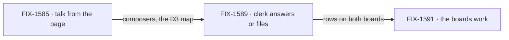

# FIX-1592 · Kitchen-sink: a support desk you can use from the browser

**Spec** · [Decisions](DECISIONS.md) · [Rules](BUSINESS-RULES.md) · [Plan](PLAN.md) · [Docs](DOCS.md) · [Evolution](EVOLUTION.md)

Epic · 3 issues · Workforce: Layer 2 Abstraction · Goal 1, validate through real usage
([`docs/objectives.md`](../../../docs/objectives.md)) ·
[FIX-1592](https://linear.app/fixpoint-labs/issue/FIX-1592)

## Three people, before and after

| Someone who… | Today | After this epic |
|---|---|---|
| **opens `support.desk` or a seat in kitchen-sink** | Reads a read-only panel. The only way to talk to the team is the CLI or a raw HTTP call | Types into the panel. A channel post lands in the transcript; a note to a seat gets its reply in that conversation |
| **asks the front desk (`support.ada`) something** | Can't from the page. From the CLI, gets their own words back with a desk name attached | Gets an answer from a model, or sees the note filed as a row on the desk's `followups` or `escalations` board |
| **looks at the desk's boards** | `followups` is drained by `support.wren`, but nothing files a row. `escalations` is for "work a person picks up", and nobody can | Rows arrive from the clerk. A person picks up an `escalations` row from the board panel, and can run the `followups` drain from there |

## How we'll know

| | |
|---|---|
| **Outcome** | Someone opening kitchen-sink can talk to the support desk from the browser and get a real answer, or see their request filed as work a seat picks up |
| **Proof** | FIX-1589's browser goal check: a note to `support.ada` gets a model-backed answer, or lands on the `followups` board and `support.wren` drains it. FIX-1585's browser checks: a post to `support.desk` is seen in that stream, and a seat asked a question has its reply seen. FIX-1591's browser goal check: a person picks up an `escalations` row from the board panel ([ER-17](BUSINESS-RULES.md#the-proof)) |
| **Lead measure** | Goal-proven child issues, named off the status table. **None today** |
| **Not doing** | A post that wakes member seats ([FIX-1590](https://linear.app/fixpoint-labs/issue/FIX-1590), cut to a follow-on, [D1](DECISIONS.md#d1)): the notify stub still names each member and wakes none · Assistant tools that post or ask · channel admin: create, delete, invite ([FIX-1415](https://linear.app/fixpoint-labs/issue/FIX-1415)) · verified per-participant identity ([FIX-1493](https://linear.app/fixpoint-labs/issue/FIX-1493)) · any Layer 1 Channel, Notify or Dispatcher substrate |
| **Kill line** | Model-backed answering needs a Workforce or Layer 1 change beyond [FIX-1585's D1](https://github.com/fixpoint-labs/flow-state-dev/blob/spec/FIX-1585/specs/issues/FIX-1585/DECISIONS.md) expose line, or a deterministic browser check can't pass without a live model key. The one real-model goal ([D4](DECISIONS.md#d4)) needs a key by design and does not trip this |

**What it closes of the objective's gap:** a sliver of the number. Goal 1 counts goals passing
over goals defined; this set adds one real-model goal ([D4](DECISIONS.md#d4)) and amends two
legs of another ([D3](DECISIONS.md#d3)), one goal of about 35. The number can't see the rest:
the reference app's first seat that answers from a model, reachable by the person evaluating it.

## Why now

FIX-1585 makes seats reachable from the page. The day it ships, the reference app shows a
support agent that parrots you ([FIX-1589](https://linear.app/fixpoint-labs/issue/FIX-1589)):
worse than unreachable, because it looks like it works. The other gap, boards nobody fills,
shows up the same day for the same reader.

## What's in the box

![What's in the box. In the box, shipped in kitchen-sink: talk from the page (FIX-1585), a clerk that answers from a model or files to a board (FIX-1589), and a board panel where a person picks up an escalations row and runs the followups drain (FIX-1591). The fence: every browser verb is an action a flow already declares, and the only package change is FIX-1585's transcript expose line. Composed in by the app: the model, the one kind-to-action map, the notify stub unchanged. Replaced in one line: the model, a kind's answering action. Not built: a post that wakes member seats (FIX-1590, a follow-on), Assistant tools that post or ask, channel admin, verified identity, Layer 1 substrate, a kitchen-sink-only messaging API, live updates of other people's posts.](figures/end-state.svg)

Everything in the box is kitchen-sink. The fence keeps it a reference, not a fork: the page
calls actions the flows already declare, and the framework gains one line.

## The set · as of 2026-09-25

A dated snapshot. Live state is Linear and the implementation PRs. All three are Features.

| Issue | What it delivers | Why the set needs it | Status |
|---|---|---|---|
| [FIX-1585](https://linear.app/fixpoint-labs/issue/FIX-1585) · talk from the page | Channel transcript and composer; seat composer through the kind's one answering action (its D3 map) | Without it nothing below is reachable from a browser | In Spec Review · spec [#2258](https://github.com/fixpoint-labs/flow-state-dev/pull/2258) |
| [FIX-1589](https://linear.app/fixpoint-labs/issue/FIX-1589) · the clerk answers | `desk-clerk`'s `answer` calls a model and decides: answer, or file the note to `followups` or `escalations` through the channel's `fileTask` | The outcome's "real answer", and the boards' only producer ([D2](DECISIONS.md#d2)) | Backlog · after FIX-1585 |
| [FIX-1591](https://linear.app/fixpoint-labs/issue/FIX-1591) · the boards work | A person picks up an `escalations` row from the board panel; the `followups` drain runs from the board | The outcome's "filed as work a seat picks up", and the half of the boards a person owns ([D3](DECISIONS.md#d3)) | Backlog · after FIX-1589 |

**0 done · 1 in spec review · 2 not started.** Wrap needs evidence from all three.
[FIX-1590](https://linear.app/fixpoint-labs/issue/FIX-1590) (posts wake seats) was cut in
review: no Proof line read it, and its shape can't be built inside the fence. It stays related
to FIX-1592 as a follow-on ([D1](DECISIONS.md#d1)).

## How the issues flow into each other

Each edge is a hard dependency, wired in Linear as blocked-by. The set is one chain.

## What stays as it is

- **The assistant**, its composer and its tools. Nothing here gives it a way to post or ask.
- **The post contract and the notify rule**: a post naming no author reaches every member, and
  nobody is told about their own post (FIX-1476 BR-16a, goal leg V14). The notify block stays the
  stub that names each member and wakes none.
- **The framework's unattended-board warning.** Its package test stays. Only kitchen-sink stops
  demonstrating it ([D3](DECISIONS.md#d3)).
- **Related, not children:** [FIX-1590](https://linear.app/fixpoint-labs/issue/FIX-1590) (the cut follow-on), [FIX-1459](https://linear.app/fixpoint-labs/issue/FIX-1459),
  [FIX-1415](https://linear.app/fixpoint-labs/issue/FIX-1415),
  [FIX-1493](https://linear.app/fixpoint-labs/issue/FIX-1493),
  [FIX-1476](https://linear.app/fixpoint-labs/issue/FIX-1476) ([PLAN.md](PLAN.md#not-children-deliberately)).

## Sign off

1. **[D1](DECISIONS.md#d1) · A usable desk is worth three issues, run 1585 → 1589 → 1591; a post
   that wakes seats is cut to a follow-on.** If wrong: a cycle spent on the reference app's desk
   while another subsystem's goal stays red, or a desk whose channel still wakes nobody. The Kill
   line is the stop.
2. **[D2](DECISIONS.md#d2) · One producer and one map: the clerk's filing is the only thing that
   puts rows on the boards, and every seat action is looked up in FIX-1585's D3 map.** If wrong:
   two children build two intakes, or two maps that drift the day a kind is added.
3. **[D4](DECISIONS.md#d4) · The browser checks run keyless on kitchen-sink's deterministic
   model; one real-model goal for the clerk is how the set counts toward the objective.** If
   wrong: either CI needs a live key to go green, or the set proves wiring and never an answer.

Already decided by the owner on 2026-09-25, listed so it is signed with the rest:
[D3](DECISIONS.md#d3), serving `escalations` retires the reference app's unattended-board demo.
If wrong: a reader of kitchen-sink no longer sees that warning and learns it from the docs alone.

**Open: none.** Reasoning and what lost: [DECISIONS.md](DECISIONS.md). The rules every child obeys:
[BUSINESS-RULES.md](BUSINESS-RULES.md). The order: [PLAN.md](PLAN.md).
