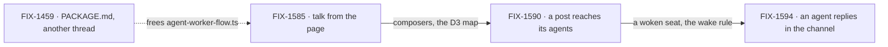

# FIX-1592 · Kitchen-sink: talk to a seat, a channel, and back

**Spec** · [Decisions](DECISIONS.md) · [Rules](BUSINESS-RULES.md) · [Plan](PLAN.md) · [Docs](DOCS.md) · [Evolution](EVOLUTION.md)

Epic · 3 issues · Workforce: Layer 2 Abstraction · Goal 1, validate through real usage
([`docs/objectives.md`](../../../docs/objectives.md)) ·
[FIX-1592](https://linear.app/fixpoint-labs/issue/FIX-1592) · re-scoped by the owner on
2026-09-25; the first version was [#2265](https://github.com/fixpoint-labs/flow-state-dev/pull/2265)
([EVOLUTION.md](EVOLUTION.md))

## Three people, before and after

| Someone who… | Today | After this epic |
|---|---|---|
| **talks to an agent seat (`support.otto`) from the page** | Can't. From the CLI the seat runs, but nothing keeps what was asked | Types a message. The message and the seat's reply stay in that seat's conversation, across a reload |
| **posts to `support.desk`** | Can't from the page. From the CLI the post lands, and the notify stub names each member and runs none | Posts from the page. Each member agent seat (`support.iris`, `support.otto`) runs once on it |
| **reads `support.desk` after posting** | Sees only what people posted | Sees a member agent's reply in the channel, under that seat's name, across a reload |

A seat is one agent with its own memory and identity; talking to it is a conversation. A
channel talks to several agents, or one on a topic, and an agent can answer in it.

## How we'll know

| | |
|---|---|
| **Outcome** | In kitchen-sink, a person talks to an agent seat directly, posts to a channel whose member agent seats receive it, and sees a member agent's reply in that channel |
| **Proof** | Three browser checks on a production build, keyless on kitchen-sink's scripted model ([D3](DECISIONS.md#d3)). FIX-1585: a message to `support.otto` and its reply both survive a reload. FIX-1590: one post to `support.desk` runs each member agent seat once. FIX-1594: a member agent's reply shows in the channel transcript under that seat's name, survives a reload, and wakes no seat ([ER-17](BUSINESS-RULES.md#the-proof)) |
| **Lead measure** | Browser checks passing on `main`, of the three above, named off the status table. **None today** |
| **Not doing** | The clerk's model answer ([FIX-1589](https://linear.app/fixpoint-labs/issue/FIX-1589)) and the boards ([FIX-1591](https://linear.app/fixpoint-labs/issue/FIX-1591)), now follow-ons · Assistant tools that post or ask · channel admin ([FIX-1415](https://linear.app/fixpoint-labs/issue/FIX-1415)) · verified identity ([FIX-1493](https://linear.app/fixpoint-labs/issue/FIX-1493)) · any Layer 1 channel, notify or dispatch substrate · live updates of other people's posts |
| **Kill line** | A path needs a change in core or engine, or one of the three browser checks can't pass without a live model key |

**What it closes of the objective's gap:** none of the number; the set adds no goal. It adds
the reference app's first use, from a browser, of Workforce's three ways of talking: to a seat,
to a channel, and back into the channel.

## Why now

FIX-1585 makes seats reachable from the page. The day it ships, an agent seat forgets the
question and a channel post runs nobody: a page that looks like it works and teaches that seats
don't listen.

## What's in the box

The three paths are Workforce's own. Kitchen-sink is where a person first sees them work.

## The set · as of 2026-09-25

A dated snapshot. Live state is Linear and the implementation PRs. All three are Features.

| Issue | What it delivers | Why the set needs it | Status |
|---|---|---|---|
| [FIX-1585](https://linear.app/fixpoint-labs/issue/FIX-1585) · talk from the page | Channel and seat composers; the agent seat keeps the person's message beside its reply | Path one, and nothing below is reachable without it | In Spec Review · spec [#2258](https://github.com/fixpoint-labs/flow-state-dev/pull/2258), round 2, must fold [ER-1](BUSINESS-RULES.md#what-a-person-gets) |
| [FIX-1590](https://linear.app/fixpoint-labs/issue/FIX-1590) · a post reaches its agents | Each member agent seat runs once on a post with no seat author, through an internal receiver on the agent kind | Path two ([D1](DECISIONS.md#d1)) | Backlog · after FIX-1585 |
| [FIX-1594](https://linear.app/fixpoint-labs/issue/FIX-1594) · an agent replies in the channel | An agent seat posts into a channel it belongs to, authored as itself | Path three | Backlog · after FIX-1590 |

**0 done · 1 in spec review · 2 not started.** Wrap needs evidence from all three.

## How the issues flow into each other

Each edge is a hard dependency on implementation, wired in Linear as blocked-by. The dashed input
gates every edit to `agent-worker-flow.ts`: FIX-1585 and FIX-1590 each make one
([ER-11](BUSINESS-RULES.md#what-no-child-may-do)). If FIX-1594's posting path lands in that
file, it waits the same way.

## What stays as it is

- **The assistant**, its composer and its tools.
- **The post contract**: a browser post names no author, and nobody is told about their own
  post (FIX-1476 BR-16a, goal leg V14).
- **`desk-clerk` and `followup-runner` seats.** A post does not run them; they keep the notify
  stub's name-only line. `support.ada` still answers by echo until FIX-1589.
- **`escalations` stays unattended**, and the boot warning stays visible, as FIX-1476 shipped it.
- **Related, not children:** FIX-1589, FIX-1591 (follow-ons), [FIX-1459](https://linear.app/fixpoint-labs/issue/FIX-1459) (a blocker, not a child),
  FIX-1415, FIX-1493, [FIX-1476](https://linear.app/fixpoint-labs/issue/FIX-1476) ([PLAN.md](PLAN.md#not-children-deliberately)).

## Sign off

1. **[D1](DECISIONS.md#d1) · The epic is the three ways of talking, run 1585 → 1590 → 1594, and
   Workforce changes where a path needs them.** The owner chose this on 2026-09-25. If wrong: the
   desk still parrots and its boards stay empty until FIX-1589 and FIX-1591.
2. **[D2](DECISIONS.md#d2) · A post a seat wrote wakes no seat.** Only a post with no seat author
   wakes members. If wrong: two agents in one channel answer each other and never stop, or, the
   other way, agents never hear each other. Reversible in one rule.

**Open: none.** Reasoning and what lost: [DECISIONS.md](DECISIONS.md). The rules every child obeys:
[BUSINESS-RULES.md](BUSINESS-RULES.md). The order: [PLAN.md](PLAN.md).
