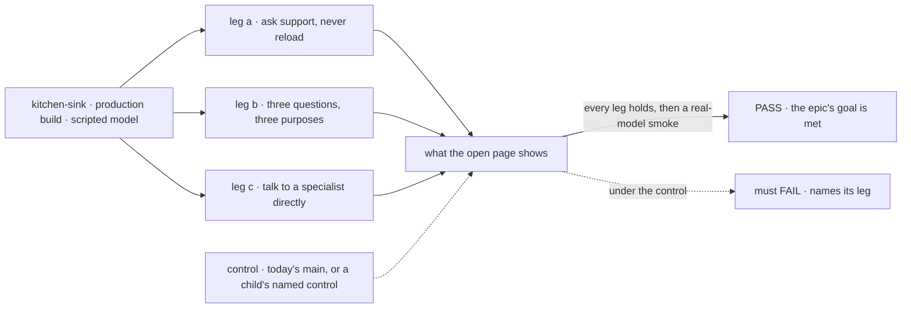
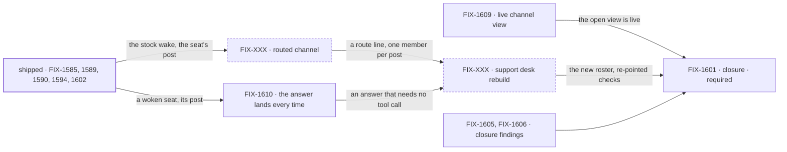

# FIX-1592 · Kitchen-sink: one support conversation, routed to the right specialist

**Spec** · [Decisions](DECISIONS.md) · [Rules](BUSINESS-RULES.md) · [Plan](PLAN.md) · [Docs](DOCS.md) · [Evolution](EVOLUTION.md)

Epic · 14 children, 2 still to file · Workforce: Layer 2 Abstraction · Goal 1, validate through
real usage ([`docs/objectives.md`](../../../docs/objectives.md)) ·
[FIX-1592](https://linear.app/fixpoint-labs/issue/FIX-1592) · amended 2026-09-27; earlier
versions: [EVOLUTION.md](EVOLUTION.md)

**What went wrong.** The owner used the support desk with a real model on 2026-09-26. A question
posted to a channel showed nothing until he reloaded. The second message got no answer. Nothing
showed anyone was working on it. And the roster made no sense: six seats with names instead of
jobs, a "desk clerk" kind, a channel called `ada-wren`, a hire button with no reason to hire.

## Five people, before and after

| Someone who… | Today | After this epic |
|---|---|---|
| **asks the support channel a question** | Sees nothing until they reload, and no sign anyone is on it. The answer shows only if the model chose to post it | Sees a specialist start on it, then its answer, in the open view, no reload. Every time |
| **asks about a device, then their account** | Every agent in `support.desk` runs on every post | Each post goes to the one specialist whose job fits; an unclear one to `general` |
| **needs a person** | Asks the clerk `support.ada` directly; it may file onto `escalations` | The specialist files the case onto `escalations` and says so |
| **opens a specialist directly** | Talks to `support.otto`: a name, no stated job | Talks to `support.devices`, which holds only device cases |
| **reads the kitchen-sink README** | Six named seats, a clerk kind, three channels, a hire button, none with a reason | One channel, four specialists by purpose, one board, each with a reason |

## Why now

All five feature children shipped green, yet the first real use failed: every check reloaded
before reading, and the scripted model always posted the answer. Closing now certifies a desk
that doesn't work for a person ([D1](DECISIONS.md#d1)).

## The goal, and how we'll know it's met

**In kitchen-sink, a person asks the support channel a question and, without reloading, sees
the one specialist whose purpose fits it start work and then answer in the same conversation,
and that specialist keeps only its own cases.**

| Is it the right goal? | |
|---|---|
| **The real need** | Jake, 2026-09-26: *"Channels could have a purpose, like one support channel that routes the message to the right agent, who then responds - so that the support channel can act as one unified support conversation but really the support agents are segmented in their history so that they only focus on different support needs. […] The whole thing needs to make more sense."* |
| **Smaller, and rejected** | "Fix the two bugs, keep the roster." FIX-1609 and FIX-1610 meet it while every agent still runs on every post and the roster still reads as contrived |
| **Bigger, and not this epic's** | A hired specialist joining the channel ([FIX-1415](https://linear.app/fixpoint-labs/issue/FIX-1415)) · a person working `escalations` (FIX-1591, held) · the answer streamed word by word · specialists consulting each other |
| **Not done if** | A leg passes only after a reload · the answer lands only because the script called the post tool · one post runs two specialists · the smoke is skipped, or a missing answer is called flake · the live view is a kitchen-sink poll · the checks ran on different commits |

```mermaid
flowchart LR
  A["kitchen-sink · production build · scripted model"] --> L1["leg a · ask support, never reload"]
  A --> L2["leg b · three questions, three purposes"]
  A --> L3["leg c · talk to a specialist directly"]
  L1 --> R["what the open page shows"]
  L2 --> R
  L3 --> R
  R -->|"every leg holds, then a real-model smoke"| P["PASS · the epic's goal is met"]
  C["control · today's main, or a child's named control"] -.-> R
  R -.->|"under the control"| F["must FAIL · names its leg"]
```

Leg a is the one every earlier check skipped. It reads the open page before any reload, and
today's `main` fails it.

| How we verify | |
|---|---|
| **Goal check** | FIX-1601's QA plan, amended to these legs ([ER-28](BUSINESS-RULES.md#how-the-set-is-run)), on one `main` commit ([ER-17](BUSINESS-RULES.md#the-proof)) |
| **Model** | Scripted and keyless for every gated leg, then one real-model smoke with a key ([D3](DECISIONS.md#d3)) |
| **Signal** | **a:** with no reload, the view shows the routed specialist working, then its answer under its name; still there after a reload. This leg's script never calls the post tool. **b:** a device, an account and an unclear question run `devices`, `accounts` and `general` once each, no one else; each specialist's channel conversation holds only its own post. **c:** a message to `support.devices` and its reply survive a reload and never show in the channel. **Smoke:** five or more real-model posts each get exactly one answer line, no reload; a clearly worded question sent to the wrong specialist is a finding |
| **Input** | Text each child picks, with a scenario marker; a different text must pass too |
| **Anti-game** | No reload before leg a's assertion. No assertion on a reply's wording, a return value, a package test or a CLI run |
| **Control that must fail** | Today's `main` fails a and b. Children name a `GOAL_CONTROL` each: live stream off and answer-by-tool-choice fail a, route off fails b, `drop-user-message` fails c |

| | |
|---|---|
| **Lead measure** | A clean FIX-1601 run on one `main` commit, no-reload leg and smoke included. **None today** |
| **Not doing** | Hired specialists in the channel (FIX-1415) · draining `escalations` (FIX-1591) · a `care` specialist ([D7](DECISIONS.md#d7)) · word-by-word streaming · verified identity (FIX-1493) |
| **Kill line** | A gated leg can't pass keyless · the live view or routing needs a Workforce word in core, engine, client or react · routing needs more than one model call per post |

## What's in the box

Inside the box is what any Workforce app gets; kitchen-sink composes the roster. The fence keeps
the live fix in the framework's own words.

## The set · as of 2026-09-27

A dated snapshot. Live state is Linear and the implementation PRs.

| Issue | What it delivers | Why the set needs it | Status |
|---|---|---|---|
| [FIX-1585](https://linear.app/fixpoint-labs/issue/FIX-1585), [1589](https://linear.app/fixpoint-labs/issue/FIX-1589), [1590](https://linear.app/fixpoint-labs/issue/FIX-1590), [1594](https://linear.app/fixpoint-labs/issue/FIX-1594), [1602](https://linear.app/fixpoint-labs/issue/FIX-1602) · the three ways of talking | Talk to a seat; a post wakes member agents; a seat posts as itself; the stock wake | The spine. FIX-1589's clerk is cut ([D7](DECISIONS.md#d7)); FIX-1590's every-member wake stays the default for unrouted channels | Done · [#2282](https://github.com/fixpoint-labs/flow-state-dev/pull/2282), [#2283](https://github.com/fixpoint-labs/flow-state-dev/pull/2283), [#2290](https://github.com/fixpoint-labs/flow-state-dev/pull/2290), [#2293](https://github.com/fixpoint-labs/flow-state-dev/pull/2293), [#2297](https://github.com/fixpoint-labs/flow-state-dev/pull/2297) |
| [FIX-1603](https://linear.app/fixpoint-labs/issue/FIX-1603), [FIX-1604](https://linear.app/fixpoint-labs/issue/FIX-1604) · closure-prep bugs | A goal leg and a plan check follow FIX-1602 | Found before the run | Done · [#2301](https://github.com/fixpoint-labs/flow-state-dev/pull/2301), [#2300](https://github.com/fixpoint-labs/flow-state-dev/pull/2300) |
| [FIX-1605](https://linear.app/fixpoint-labs/issue/FIX-1605) · dev page 500 · [FIX-1606](https://linear.app/fixpoint-labs/issue/FIX-1606) · wrong README key | The page renders under `next dev`; the README names the gateway key | Closure findings | Backlog · [#2306](https://github.com/fixpoint-labs/flow-state-dev/pull/2306), [#2305](https://github.com/fixpoint-labs/flow-state-dev/pull/2305) open |
| [FIX-1609](https://linear.app/fixpoint-labs/issue/FIX-1609) · live channel view | A session-wide live stream; "working" in the channel view | Leg a ([D4](DECISIONS.md#d4)) | Backlog · not yet a sub-issue |
| [FIX-1610](https://linear.app/fixpoint-labs/issue/FIX-1610) · the answer lands every time | The routed answer, whatever the tool choice | Leg a, the smoke ([D6](DECISIONS.md#d6)) | Backlog |
| FIX-XXX · routed channel (Workforce) | The opt-in route step, a purpose router, the `CHANNEL.md` line | Leg b ([D5](DECISIONS.md#d5)) | To file |
| FIX-XXX · support desk rebuild (kitchen-sink) | The roster, escalation filing, every check and doc re-pointed | The page a person uses ([D7](DECISIONS.md#d7)) | To file |
| [FIX-1601](https://linear.app/fixpoint-labs/issue/FIX-1601) · closure · required | The amended QA plan, run on one `main` commit | Proves the whole ([ER-17](BUSINESS-RULES.md#the-proof)) | In Development · plan [#2288](https://github.com/fixpoint-labs/flow-state-dev/pull/2288) to amend |

**7 done · 4 filed, open · 2 to file · the closure.** Could it be smaller? The routed channel
could fold into the rebuild; it doesn't, because any app reuses it and it needs its own proof.
The rebuild stays one issue: a half-renamed roster leaves `main` red.

## How the issues flow into each other

```mermaid
flowchart LR
  S["shipped · FIX-1585, 1589, 1590, 1594, 1602"] -->|"the stock wake, the seat's post"| R["FIX-XXX · routed channel"]
  S -->|"a woken seat, its post"| T["FIX-1610 · the answer lands every time"]
  R -->|"a route line, one member per post"| K["FIX-XXX · support desk rebuild"]
  T -->|"an answer that needs no tool call"| K
  L["FIX-1609 · live channel view"] -->|"the open view is live"| Z["FIX-1601 · closure · required"]
  K -->|"the new roster, re-pointed checks"| Z
  B["FIX-1605, FIX-1606 · closure findings"] --> Z
  classDef done stroke-width:2px
  classDef proposed stroke-dasharray:4 3
  class S done
  class R,K proposed
```

Solid edges are blocked-by on implementation; specs may start early
([ER-14](BUSINESS-RULES.md#how-the-set-is-run)). Dashed nodes aren't filed. FIX-1609 and the
rebuild share the channel panel and e2e, so they are a seam, not a chain
([PLAN.md](PLAN.md#coordination-seams-to-watch)).

## What stays as it is

- **An unrouted channel still wakes every agent member** (FIX-1590, FIX-1602).
- **A seat's post wakes no seat** ([D2](DECISIONS.md#d2)).
- **`escalations` stays unattended**, boot warning included (FIX-1476).
- **The operator's HTTP hire** and the durable-hire check on the real app, if
  [O1](DECISIONS.md#o1) goes as recommended.
- **The assistant**, its composer and tools.
- **Related, not children:** FIX-1591, FIX-1415, FIX-1493, FIX-1476, FIX-1598.

## Sign off

**[The goal](#the-goal-and-how-well-know-its-met), at that size:** one support conversation,
routed by purpose, live, specialists keeping their own cases, proven in a browser without a
reload and once on a real model. If wrong: we close on a desk that still needs a reload, or
rebuild a demo nobody asked for.

1. **[D1](DECISIONS.md#d1) · Rebuild the support example inside this epic, as a routed desk.**
   Your decision card is pending; this draft assumes yes. If wrong: the epic closes on a roster
   you called contrived, or a new epic re-runs the same closure.
2. **[D4](DECISIONS.md#d4) · Live replies are fixed in the framework, not the demo.** Engine,
   client and react gain a session-wide live stream, which the old Kill line forbade. If wrong:
   every app with a channel keeps the reload bug, or we carry a framework change a poll would
   have hidden.
3. **Live fork: [O1](DECISIONS.md#o1) · Kitchen-sink shows only the support story, or keeps
   the features it has no job for?** Recommended: only the story. Full ask in
   [DECISIONS.md](DECISIONS.md#o1).

**Open: O1.** Reasoning and what lost: [DECISIONS.md](DECISIONS.md). Rules:
[BUSINESS-RULES.md](BUSINESS-RULES.md). Order: [PLAN.md](PLAN.md).
