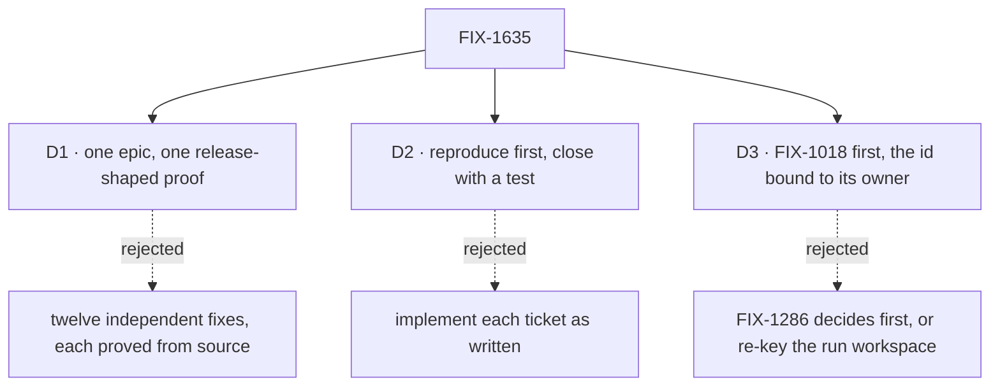

# FIX-1635 · Decisions

[Spec](SPEC.md) · **Decisions** · [Rules](BUSINESS-RULES.md) · [Plan](PLAN.md) · [Docs](DOCS.md) · [Evolution](EVOLUTION.md)

The calls that sit above any single child. The child set itself is not one of them: the owner
locked it with the FSD Architect on 2026-09-29, including what is out of the epic. "Twelve"
below is that locked set of child issues; FIX-1510 shipped as FIX-1261's sub-issue. Two cards
are the sign-off; the third is an engineering call recorded so no child reopens it.

## The tree

## D1 · These twelve are one epic with one release-shaped proof

| | |
|---|---|
| **Instead of** | Fixing each as ordinary backlog, each proved by its own test from source |
| **Because** | What blocks a release is what a consumer meets, and no test in the repo runs as one: 0.1.1 passed `publint`, a dry-run publish and every source test, then failed on its first import. Each security fix is likewise proved one function at a time, never as two users over HTTP against an installed server |
| **Locks in** | A closure run that packs, installs, serves over HTTP and needs a real Redis. It is the most expensive child and it repeats per finding |

**What would change my mind:** evidence that the release is not going to external users soon.
Then these are ordinary bugs, and the closure harness can wait for the launch that needs it.

It comes down to 0.1.1: every source test passed and the first import failed.

## D2 · Reproduce on current `main` first; a hole already closed closes with a test

| | |
|---|---|
| **Instead of** | Implementing each ticket's fix as written |
| **Because** | Most tickets were written in August against code that has moved since: the org-required pass (FIX-1442), the public re-entry allow-list (FIX-999), the ESM-extension build step and the release asset build. A fix for a hole that is gone rewrites working code |
| **Locks in** | A direct-route child that no longer reproduces still lands a PR: a regression test through the ticket's own path that fails on the commit before the hole closed. Closing with a comment alone is not done |

It comes down to age: an August ticket describes code that later passes may have fixed.

## D3 · FIX-1018 lands first; a caller-supplied request id is bound to its owner

| | |
|---|---|
| **Instead of** | FIX-1286 deciding the principal question first in a spec · or giving the run workspace its own user key |
| **Because** | FIX-1018 is a confirmed cross-user read and should not wait on a design review. Its fix answers the question FIX-1286 asks: once no user can adopt another user's request record, two users with one request id already have two records, and the workspace key may need no change. FIX-1634 extends the queue branch where FIX-1018's unguarded write lives |
| **Locks in** | FIX-1286 and FIX-1634 implement after FIX-1018 merges; both specs can start now. A caller-supplied request id stays accepted (callers use it for idempotency), scoped to its owner. FIX-1286 may close as proved by FIX-1018, with its own test |

**What would change my mind:** FIX-1018's reproduction showing the shared workspace survives
per-owner request records. Then FIX-1286 decides independently and the edge comes out.

It comes down to a confirmed leak: the design question should not hold the fix for it.

## Who owns what

Every rule a child builds has one owner. A *consumes* cell is a place a child must not
re-decide: FIX-1286 and FIX-1634 build on FIX-1018's binding rather than inventing their own.
The fence and run rules bind every child, so they are not columns here; each names its owner
and where it's checked in [BUSINESS-RULES.md](BUSINESS-RULES.md#what-no-child-may-do).

## Decided in review, recorded so no child reopens them

- **Routes.** Direct: FIX-1018, 1021, 1022, 1046, 1328, 1431, 1334, 1628. Spec: FIX-1634 (how
  concurrency is arbitrated across processes is a design question) and FIX-1286 (its issue
  asks for a decision). The closure issue is spec: its spec is the QA plan.
- **FIX-1328's "always require an org" option is already the product's direction**
  (FIX-1442). Its worker reproduces against that, and does not re-open seam-side admission as
  a product fork.
- **FIX-1634 is Layer 1 only.** Nothing in it names a channel, seat or specialist. The
  Workforce adopt child is filed after its Layer 1 shape merges, not before.
- **FIX-1628 stays scoped** to the non-streaming step loop.
- **The done rows are re-verified, not reopened.** The closure plan re-runs their tests; a
  failure is a new bug child.
- **Leg a is a standing CI job, not a closure step** (round 1). FIX-1431 lands the pack,
  install and import job and FIX-1334 adds DevTool's assets to it; the closure reuses it. Its
  control is the 0.1.1 tarball, pinned, because "the latest release" stops failing once
  anything newer is published.
- **Each child owns its HTTP case and its control** (round 1). The children with a hole or a
  behaviour to prove over HTTP add a case to one shared suite, and prove it fails on the commit
  before the hole closed. The closure runs the suite against installed tarballs and never
  rebuilds an old commit.
- **No shared owner-check rule** (round 1). The principal children keep their parallel
  bindings and one not-found shape. A shared owner-scoped lookup is FIX-1018's to offer if its
  reproduction produces one; the others may use it, and nothing waits for it.
- **FIX-1286's route stays spec** (round 1). D3 already lets it close as proved by FIX-1018.

## What the end-state POC showed

None built. The children are independent fixes with one ordering edge, and the closure run
is the whole-set proof.

## How it got here

- **Drafted (Sep 29)** from the owner's locked set and the Architect's clusters; the closure
  issue FIX-1636 filed; FIX-1018 wired to block FIX-1286 and FIX-1634.
- **Round 1 (Sep 29)** folded a second-look review, the Architect's stamp on it, and the Cursor
  and Codex inline comments: leg a moved into standing CI, the children own their HTTP cases,
  ER-3 names attach and resume, ER-10 matches the shipped create-if-absent contract, and the
  rules were trimmed to ones with an owner.

**Open: none.**
