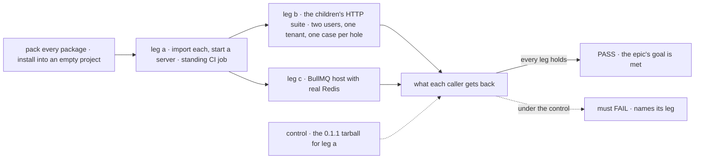
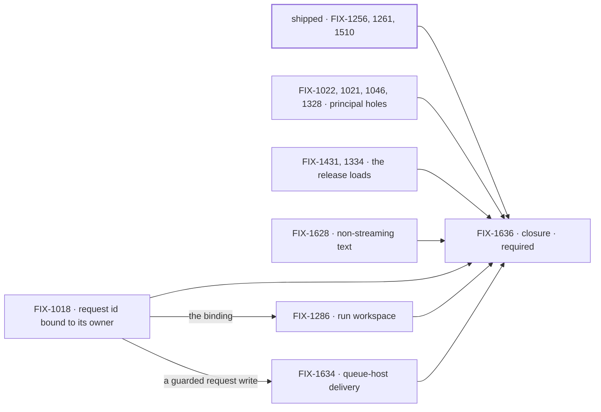

# FIX-1635 · Hard gates before public release: the release installs, and holds its boundaries

**Spec** · [Decisions](DECISIONS.md) · [Rules](BUSINESS-RULES.md) · [Plan](PLAN.md) · [Docs](DOCS.md) · [Evolution](EVOLUTION.md)

Epic · 12 child issues (FIX-1510 ships under FIX-1261) and a closure issue · Public Launch · Goal 4, keep the foundation honest,
with Goal 3 ([`docs/objectives.md`](../../../docs/objectives.md)) ·
[FIX-1635](https://linear.app/fixpoint-labs/issue/FIX-1635) · child set locked by the owner
with the FSD Architect, 2026-09-29

## Five teams, before and after

| A team that… | Today | After this epic |
|---|---|---|
| **installs FSD from npm** | 0.1.1 failed on its first import; nothing in CI installs a packed tarball and imports it | Every published package imports from a clean install, and DevTool ships its client assets |
| **puts several users in one tenant** | A caller who knows another user's request or session id can reach that record, its items or its sandbox | An id a caller chooses is an address, never an ownership. Another user's id is not found |
| **exposes flows over public HTTP** | Re-entry, sibling-flow listings and cross-flow dispatch each trust something the caller controls | Each admits on the stored record and the target flow's own rules |
| **runs work on a queue host (BullMQ)** | Delivery into an existing session is refused, so channels and escalations do nothing there | The recipient runs under its own concurrency policy; what still can't be honoured is refused by name |
| **calls a generator without streaming** | A multi-step turn returns only its last step's text | The same text as the streamed turn |

**Why now.** The release is the first time someone outside this repository runs FSD, and each
of these is a defect they would meet, not a missing feature. A leaked record or a package that
won't import is found by the first user, and costs trust before any feature is judged.

## The goal, and how we'll know it's met

**Someone who installs FSD from the packed release can import every package and run a server,
and none of the holes this epic names can be reached over real HTTP.**

| Is it the right goal? | |
|---|---|
| **The real need** | The owner's cut, 2026-09-29: the defects that block a public release, not polish, not parked bets, not first-hour DX |
| **Smaller, and rejected** | "Every child is Done." Each child's test runs from source, and a package that fails on import passed every source test in the repo |
| **Bigger, and not this epic's** | First-hour DX ([FIX-1161](https://linear.app/fixpoint-labs/issue/FIX-1161)) · the Tier B leftovers · Workforce adopting the queue delivery · kitchen-sink polish |
| **Not done if** | A leg runs against source instead of installed tarballs · a security leg calls a store or function directly instead of HTTP · a hole closed as "no longer reproduces" has no test that fails on the commit before it closed · the checks ran on different commits · a closure finding is open |

Leg a is the one no child's own test reaches, so it becomes a standing CI job the moment
FIX-1431 lands it, not a step that runs once at the end. Leg b is where each hole is asked for
as an attacker would ask for it: each child adds its own case, and the closure runs them all
against the installed tarballs.

| How we verify | |
|---|---|
| **Goal check** | [FIX-1636](https://linear.app/fixpoint-labs/issue/FIX-1636)'s QA plan, on one `main` commit after every other child merges. It reuses the leg a job and runs the children's suite; it builds no leg of its own ([ER-19](BUSINESS-RULES.md#the-closure)) |
| **Model** | Scripted and keyless. FIX-1628's case in leg b asserts on text a scripted model wrote, not on a model's quality |
| **Signal** | **a:** every packed package imports in an empty ESM project, and DevTool serves its client assets from the installed copy. **b:** as user B in user A's tenant, each named hole returns not-found or refused, except a reused request id, which succeeds as B's own request; A's records and items are unchanged afterwards either way. A multi-step non-streamed turn returns the text the streamed turn does. **c:** a delivery into an existing session runs the recipient on a queue-backed host |
| **Input** | Ids B learns the way an attacker would: A's request id from a response header, A's session id from a URL |
| **Anti-game** | No leg imports from `src`, calls a store or engine function directly, or runs against a workspace link. Each passes while a consumer still breaks |
| **Control that must fail** | Leg a against the 0.1.1 tarball, pinned in the job, never "the latest release". Each leg b and c case fails on the commit before its hole closed, including holes closed before this epic ([D2](DECISIONS.md#d2)). The child proves that when it lands the case and records the commit ([ER-16](BUSINESS-RULES.md#what-no-child-may-do)); the closure never rebuilds an old commit |

## What's in the box

![What's in the box: the packed release imports and DevTool carries its assets; ids chosen by a caller never reach another user's records; public entry points admit on the stored record; resource guards throw or refuse; a queue host delivers into an existing session; a non-streaming turn keeps its text. Fence: no Workforce word below Workforce, no reopening org-optional, no refusal deleted without its guarantee. Composed in by the app: its principal resolver, its tenant header, its queue host. Not built: first-hour DX, the Tier B leftovers, Workforce adopting queue delivery, kitchen-sink polish.](figures/end-state.svg)

Inside the box is what any app gets from the release without writing a line. The fence is
what keeps a hard-gates epic from turning into a redesign.

## The set · as of 2026-09-29

A dated snapshot. Live state is Linear and the implementation PRs. Direct-route rows have no
spec PR by design.

| Issue | What it delivers | Why the set needs it | Route · status |
|---|---|---|---|
| [FIX-1256](https://linear.app/fixpoint-labs/issue/FIX-1256) · invalid resource write | Throws instead of resetting state | Silent data loss | direct · **Done** · [#1469](https://github.com/fixpoint-labs/flow-state-dev/pull/1469) |
| [FIX-1261](https://linear.app/fixpoint-labs/issue/FIX-1261), remainder [FIX-1510](https://linear.app/fixpoint-labs/issue/FIX-1510) (its sub-issue) · `writable: false` on collections | Refused on every write to an existing instance, and on delete; creating a missing key stays open | A guard a neighbour bypasses | direct · **Done** · [#1470](https://github.com/fixpoint-labs/flow-state-dev/pull/1470), [#2047](https://github.com/fixpoint-labs/flow-state-dev/pull/2047) |
| [FIX-1018](https://linear.app/fixpoint-labs/issue/FIX-1018) · request id reparenting | A caller's request id cannot reach another user's record or items | Confirmed cross-user read; first of the principal cluster ([D3](DECISIONS.md#d3)) | direct · Backlog |
| [FIX-1286](https://linear.app/fixpoint-labs/issue/FIX-1286) · run-scoped workspace | Two users with one request id never share a sandbox | Its issue asks for a decision, not a patch | spec · Backlog · blocked by 1018 |
| [FIX-1022](https://linear.app/fixpoint-labs/issue/FIX-1022) · session key has no principal | Another user's session id is not found | Same-tenant session read | direct · Todo |
| [FIX-1021](https://linear.app/fixpoint-labs/issue/FIX-1021) · re-entry deny-lists | Only allow-listed sources re-enter from HTTP | Caller-chosen input under another source's privileges | direct · Todo |
| [FIX-1046](https://linear.app/fixpoint-labs/issue/FIX-1046) · sibling-flow listing | A session's stored flow never authorizes another flow's history | Protected history readable | direct · Backlog |
| [FIX-1328](https://linear.app/fixpoint-labs/issue/FIX-1328) · cross-flow admission | The seam admits as ingress does | A target runs without the org it requires | direct · Backlog |
| [FIX-1431](https://linear.app/fixpoint-labs/issue/FIX-1431) · extensionless `dist` | Published packages import | The release is unusable without it | direct · Backlog |
| [FIX-1334](https://linear.app/fixpoint-labs/issue/FIX-1334) · DevTool client assets | DevTool can't publish without them | A first publish breaks at runtime | direct · Backlog |
| [FIX-1634](https://linear.app/fixpoint-labs/issue/FIX-1634) · queue-host delivery | Delivery into an existing session on BullMQ, Layer 1 only | Channels and escalations do nothing on a queue host | spec · Backlog · blocked by 1018 |
| [FIX-1628](https://linear.app/fixpoint-labs/issue/FIX-1628) · non-streaming text drop | A multi-step turn keeps every step's text | Same turn, two answers | direct · Backlog |
| [FIX-1636](https://linear.app/fixpoint-labs/issue/FIX-1636) · closure · **required** | The QA plan, run on one `main` commit | The only child that runs the release as a consumer does | spec · Backlog · blocked by every open child |

**12 children: 2 done, 10 open, plus FIX-1510 done under FIX-1261 · the closure.** Could it be smaller? The set is the owner's, locked with
the Architect, and this spec does not reopen it. What can shrink is the work: several tickets
predate later passes on `main`, so each direct-route worker reproduces first, and a hole that
is already closed closes with a test instead of a rewrite ([D2](DECISIONS.md#d2)).

## How the issues flow into each other

Edges are blocked-by on implementation; every spec can start at the gate. Only FIX-1018 gates
other children. The clusters are a sequencing hint, not dependencies.

## What stays as it is

- **Org is never optional** ([FIX-1442](https://linear.app/fixpoint-labs/issue/FIX-1442)). No child reopens it.
- **Cross-tenant walls** (FIX-682). The holes here are inside one tenant.
- **Workforce.** Adopting queue delivery is a later child, filed once FIX-1634's Layer 1 shape merges.
- **Out of this epic, by the owner:** the Tier B leftovers, [FIX-1591](https://linear.app/fixpoint-labs/issue/FIX-1591), kitchen-sink polish (FIX-1631 to 1633), [FIX-1621](https://linear.app/fixpoint-labs/issue/FIX-1621), and publish work under [FIX-1161](https://linear.app/fixpoint-labs/issue/FIX-1161).

## Sign off

**[The goal](#the-goal-and-how-well-know-its-met), at that size:** the packed release,
installed and served, with every named hole asked for over HTTP. If wrong: we launch on source
tests that a consumer's install never ran, or carry a closure harness heavier than the fixes.

1. **[D1](DECISIONS.md#d1) · These twelve are one epic with one release-shaped proof.** If
   wrong: we spend a closure run on fixes that were each fine alone.
2. **[D3](DECISIONS.md#d3) · FIX-1018 lands first; a caller's id is bound to its owner, and
   FIX-1286 specs against that.** If wrong: FIX-1286 and FIX-1634 wait a few days on a fix they
   didn't need.

**Recorded, not asked:** [D2](DECISIONS.md#d2), reproduce first and close with a test.

**Open: none.** Approve this direction by merging. Reasoning and what lost:
[DECISIONS.md](DECISIONS.md). Rules: [BUSINESS-RULES.md](BUSINESS-RULES.md). Order:
[PLAN.md](PLAN.md).
