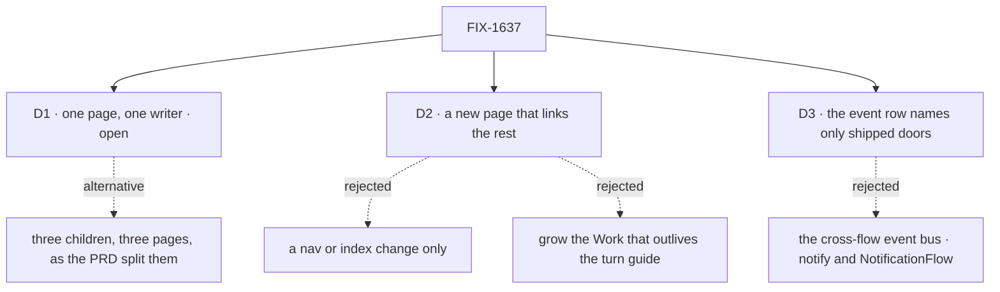

# FIX-1637 · Decisions

[Spec](SPEC.md) · **Decisions** · [Rules](BUSINESS-RULES.md) · [Plan](PLAN.md) · [Docs](DOCS.md) · [Evolution](EVOLUTION.md)

The calls above any single issue. D1 is open and the owner's: it overrides the PRD's
three-child split. D2 tests the epic's own kill line. D3 corrects one line of the Architect's
guidance against what ships. The rest were decided here so no child reopens them.

## The tree

## D1 · One page from one writer: fold FIX-1638 and FIX-1640 into FIX-1639? · open

| | |
|---|---|
| **Instead of** | The PRD's split: three children, three pages (the guide, the config matrix, the glossary), each written in isolation, as the Architect's "do not merge bodies" note asks |
| **Because** | All three describe the same five surfaces: webhook ingress, schedule dispatch, `dispatcher()`, the `{ id }` / `{ key }` policy, channels and boards. Three isolated writers produce three phrasings of one thing, the drift `polish-docs` exists to clean. The split also costs two extra spec gates and a cross-spec pass for a three-column table and three definitions |
| **Locks in** | FIX-1639 publishes everything. The table may still be its own linkable page inside FIX-1639 if the writer finds it reads better. FIX-1638 and FIX-1640 close as folded only when the owner says so |

### Fold the table and the terms into the page, or keep three children?

**Plain terms.** The PRD asks for three documents: a guide, a table of where settings live, and
a short glossary. They explain the same handful of features. Written by three people who never
see each other's drafts, they'll describe those features three slightly different ways, and a
reader will find the disagreements.

**The trade-off.** Folding gives one consistent page for one review. It overrides the owner's
split and the Architect's note. Every deliverable still ships; only the number of tickets changes.

It comes down to consistency: three isolated writers describe five features three ways.

**My recommendation.** Fold. The table and the terms read against the page they sit in, so
they should be written with it.

**What would change my mind.** If you want the table or the terms reviewable and linkable on
their own schedule, say for FIX-453's architecture work or a design partner, keep them split.

**What being wrong costs.** Low and reversible: one fold to re-split, before any page is written.

## D2 · A new page that links the existing ones, not a nav change and not a longer guide

| | |
|---|---|
| **Instead of** | A sidebar or index entry pointing at the eight existing pages (the kill line's second clause) · adding webhooks, schedules and the table to *Work that outlives the turn* |
| **Because** | Checked against `main`. Three things the outcome needs exist on no page: the flow / host / ops table, the queue-host `{ id }` fence on the guides' reading path (it lives in a reference refusal table and the channels page), and the terms. A nav entry can't supply them. *Work that outlives the turn* is the right map for step 3 and the wrong home for webhooks and schedules, which start work rather than outlive it |
| **Locks in** | One new guide page. *Work that outlives the turn* stays the step-3 map and gains a link; the page links it rather than repeating it |

**What would change my mind:** the three missing pieces fitting in a short section of an
existing page without it losing its subject. Then the kill line holds and FIX-1639 is a nav edit.

It comes down to what's missing: a nav entry can point at pages, not supply the table.

## D3 · The event row names only doors that ship

| | |
|---|---|
| **Instead of** | The Architect's suggested event-ingress row on FIX-1638: the cross-flow event bus, `.notify(topic)` and `NotificationFlow` subscribers, cited as Done history |
| **Because** | That issue, [FIX-441](https://linear.app/fixpoint-labs/issue/FIX-441), is **Canceled**, and neither name is exported. The Proof requires every key on the page to resolve to a shipped export. What ships: another flow on the same server sends with `dispatcher({ flowKind, action, session })` into the receiver's `internal.actions`; any other source (a queue, a bus) mounts a custom `InboundTransportAdapter`. Workforce's channel wake is the L2 fan-out and belongs to the channels section |
| **Locks in** | The table's event row has two lines, both shipped. One event to many flows is one dispatcher per receiver, or a router. FIX-1639 removes the stale `notification` row from *Inbound transports → Known sources* as drift |

**What would change my mind:** a pub/sub surface shipping before FIX-1639 publishes. Then the
row names it.

It comes down to the export check: a canceled API on the page fails the Proof.

## Who owns what

Every rule has one owner today, the project's PR-1 included. The dashed cells are where
ownership moves if the owner answers D1 with a re-split; nothing else changes.

## Decided, not asked

- **`epic-wake` moves out of published docs.** One line in `docs/contributing/orchestration.md`
  says it is contributor tooling and not the product's *wake*. The outsider rule
  ([`user-docs.md`](../../../docs/contributing/user-docs.md)) keeps internal tooling names out
  of `apps/docs`, which mentions none of `epic-wake`, Conductor or DevForce today. Holds whether
  D1 folds or re-splits; it departs from the PRD's letter, so it's flagged in the PR.
- **Three terms, one definition each.** *Wake*: something outside the flow (a webhook delivery,
  a schedule tick) starts a run through the host. *Dispatch*: a flow sends one unit of work to
  an entry, into its own session or an existing one. *Schedule tick*: your scheduler calling a
  schedule's dispatch endpoint. The two Architect notes phrase *wake* slightly differently; this
  one reconciles them to what the reference pages do.
- **The ops column names what fires, and links.** It never says how to deploy on a cloud. The
  per-scheduler and deploy guides already exist.
- **The page lives in the guides site.** Placement in the sidebar is FIX-1639's; the closure
  starts from the nav, so it must be reachable there.

## Decided in review, recorded so no child reopens them

Nothing yet.

## What the end-state POC showed

No end-state POC. Docs only, and the assembled surface is one page; the closure run is the
end-state check.

## How it got here

- **Drafted (2026-09-29)** from the owner's PRD and the Architect's guidance on FIX-1637,
  FIX-1638, FIX-1639 and FIX-1640. Checking the guidance against `main` found FIX-441
  canceled (D3), a stale `notification` source row, and the per-scheduler guides already
  published. Closure FIX-1642 filed.

**Open: D1.**
