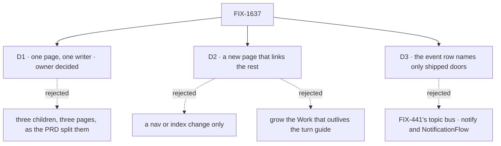

# FIX-1637 · Decisions

[Spec](SPEC.md) · **Decisions** · [Rules](BUSINESS-RULES.md) · [Plan](PLAN.md) · [Docs](DOCS.md) · [Evolution](EVOLUTION.md)

The calls above any single issue. D1 is the owner's, answered on 2026-09-29: it overrides the
PRD's three-child split. D2 tests the epic's own kill line. D3 corrects one line of the Architect's
guidance against what ships. The rest were decided here so no child reopens them.

## The tree

## D1 · One page from one writer: FIX-1638 and FIX-1640 fold into FIX-1639 · decided by the owner

| | |
|---|---|
| **Instead of** | The PRD's split: three children, three pages (the guide, the config matrix, the glossary), each written in isolation, as the Architect's "do not merge bodies" note asks |
| **Because** | All three describe the same five surfaces: webhook ingress, schedule dispatch, `dispatcher()`, the `{ id }` / `{ key }` policy, channels and boards. Three isolated writers produce three phrasings of one thing, the drift `polish-docs` exists to clean. The split also costs two extra spec gates and a cross-spec pass for a three-column table and three definitions |
| **Locks in** | FIX-1639 publishes everything: the flow / host / ops table and the terms are sections of the one page. FIX-1638 and FIX-1640 are canceled as folded, and their blocks on FIX-1642 are removed. The `epic-wake` entry is one line in `docs/contributing/`, not published docs |

**What would change my mind:** the owner wanting the table or the terms reviewable on their own
schedule, say for FIX-453's architecture work or a design partner. Re-splitting would reopen
two children, not this epic.

It comes down to consistency: three isolated writers describe five features three ways.

## D2 · A new page that links the existing ones, not a nav change and not a longer guide

| | |
|---|---|
| **Instead of** | A sidebar or index entry pointing at the eight existing pages (the kill line's second clause) · adding webhooks, schedules and the table to *Work that outlives the turn* |
| **Because** | Checked against `main`. Three things the outcome needs exist on no page: the flow / host / ops table, the queue-host `{ id }` fence on the guides' reading path (it lives in a reference refusal table and the channels page), and the terms. A nav entry can't supply them. *Work that outlives the turn* is the right map for step 3 and the wrong home for webhooks and schedules, which start work rather than outlive it |
| **Locks in** | One new guide page. *Work that outlives the turn* stays the step-3 map and gains a link; the page links it rather than repeating it |

**What would change my mind:** the three missing pieces fitting in a short section of an
existing page without it losing its subject. Then the kill line holds and FIX-1639 is a nav edit.

It comes down to what's missing: a nav entry can point at pages, not supply the table.

## D3 · The event row names only doors that ship

| | |
|---|---|
| **Instead of** | The Architect's suggested event-ingress row on FIX-1638: FIX-441's topic, or notification, bus (`.notify(topic)` and `NotificationFlow` subscribers), cited as Done history. Only that bus is rejected. Cross-flow delivery itself ships and stays on the row |
| **Because** | [FIX-441](https://linear.app/fixpoint-labs/issue/FIX-441) is **Canceled**, and neither name is exported. The Proof requires every key on the page to resolve to a shipped export. What ships: **`dispatcher({ flowKind, action, session })` into the receiver's `internal.actions` is the cross-flow bus**, for another flow on the same server; any other source (a queue, a bus) mounts a custom `InboundTransportAdapter`. Workforce's channel wake is the L2 fan-out and belongs to the channels section |
| **Locks in** | The table's event row has two lines, both shipped, and the first names `dispatcher()`. One event to many flows is one dispatcher per receiver, or a router. FIX-1639 rewords the `notification` row in *Inbound transports → Known sources* as drift: it keeps the value, since core's `InboundSource` still lists it and the DevTool still labels it, and stops describing it as cross-flow event subscribers, which no shipped transport emits. FIX-441 is soft-related, never reopened |

**What would change my mind:** a pub/sub surface shipping before FIX-1639 publishes. Then the
row names it.

It comes down to the export check: the canceled topic bus on the page fails the Proof.

## Who owns what

Every rule has one owner, the project's PR-1 included, and after D1 that owner is FIX-1639 for
all but the proof. FIX-1641 and FIX-1643 own no rule and have no column: they consume ER-6.

## Decided, not asked

- **`epic-wake` moves out of published docs.** One line in `docs/contributing/orchestration.md`
  says it is contributor tooling and not the product's *wake*. The outsider rule
  ([`user-docs.md`](../../../docs/contributing/user-docs.md)) keeps internal tooling names out
  of `apps/docs`, which mentions none of `epic-wake`, Conductor or DevTeam today. The owner
  confirmed it with D1: one line in `docs/contributing/`, written by FIX-1639.
- **Three terms, one definition each.** *Wake*: something outside the flow (a webhook delivery,
  a schedule tick) starts a run through the host. *Dispatch*: a flow sends one unit of work to
  an entry, into its own session or an existing one. *Schedule tick*: your scheduler calling a
  schedule's dispatch endpoint. The two Architect notes phrase *wake* slightly differently; this
  one reconciles them to what the reference pages do.
- **The ops column names what fires, and links.** It never says how to deploy on a cloud. The
  per-scheduler and deploy guides already exist.
- **FIX-1641's authoring shapes stay in the example.** Filed while this spec was written, with
  its examples PR (#2369) already open: a `WORKER.md` wake block, today's flow-level bindings,
  and a `wakes:` alias, each compiled by user-land code in `examples/wake-authoring` to the
  bindings that ship. No framework API changes, so ER-6 holds. The page may link the example
  and teaches neither as a framework feature. It blocks the closure because every child does,
  not because the closure checks it: the run proves the page alone. The page never waits for it.
- **The page lives in the guides site.** Placement in the sidebar is FIX-1639's; the closure
  starts from the nav, so it must be reachable there.
- **FIX-1643's subscribe and route shapes stay in the example too.** Filed during review, with
  its examples PR (#2372) open as a draft: the host registers GitHub once through today's
  webhook transport adapter, then per-session subscribe and one webhook with route rules
  compiling to today's webhook bindings and `dispatcher()`, in `examples/wake-subscribe`. A
  soft-related sibling of FIX-1641, not its child. ER-6 holds on the same terms: the page may
  link the example, teaches neither style as a framework feature, and never waits for it; it
  blocks the closure only because every child does.

## Decided in review, recorded so no child reopens them

- **FIX-1641 stays a child and keeps its block on the closure.** Review asked to unblock it,
  since the run proves only the page. The closure rule wires every child
  ([`orchestration.md`](../../../docs/contributing/orchestration.md#the-closure-issue-every-epic-ends-in-qa)),
  so the closure run waits for #2369 to merge or for the owner to close FIX-1641 with its
  findings filed to FIX-1639, which drops the block. The page does not wait either way.
- **D3 rejects the topic bus only.** Owner clarification on the PR: `dispatcher()` into
  `internal.actions` is the shipped cross-flow bus and the event row names it. The invent-kill
  is FIX-441's `.notify` / `NotificationFlow`.
- **The `notification` source row is reworded, not removed.** The runtime still recognizes the
  value, so removing it would make the docs disagree with the DevTool.
- **After-request work is a dispatched run, never a side chain.** `.sideChain()` is
  request-scoped: the request stays open until it settles. The table's keeps-going row names
  `dispatcher()` alone.
- **The fence follows the effective dispatcher, not the host's package.** A `bullmqWorker`
  process in `worker-only` mode installs no dispatcher and does not refuse `{ id }`; `colocated`
  and `dispatch-only` do, as does a custom dispatcher without `dispatchLocal`. A reply follows
  the process running the queued run the same way.

## What the end-state POC showed

No end-state POC. Docs only, and the assembled surface is one page; the closure run is the
end-state check. FIX-1641 and FIX-1643 are children's explorations of authoring shapes, not
tests of the set's division.

## How it got here

- **Drafted (2026-09-29)** from the owner's PRD and the Architect's guidance on FIX-1637,
  FIX-1638, FIX-1639 and FIX-1640. Checking the guidance against `main` found FIX-441
  canceled (D3), a `notification` source row still describing its subscribers, and the per-scheduler guides already
  published. Closure FIX-1642 filed. FIX-1641 (wake authoring POC) joined the same hour and
  was wired to block it. Project rule PR-1 inherited from the project spec (#2367).
- **Review, 2026-09-29.** The owner narrowed D3's rejection to the topic bus. Codex's checks
  turned D3's `notification` row from removed to reworded, took `.sideChain()` off the
  keeps-going row, and scoped the fence to the effective dispatcher. FIX-1641's block on the
  closure kept and explained. No decision reversed.
- **Set membership, 2026-09-29.** The owner filed FIX-1643 (subscribe and route POC) at 13:18Z
  as a child, soft-related to FIX-1641, with examples PR #2372. It was wired to block the
  closure. No decision changed.
- **D1 answered, 2026-09-29, after merge.** The owner folded FIX-1638 and FIX-1640 into
  FIX-1639, as recommended; both are canceled in Linear and their blocks on FIX-1642 removed.
  This follow-up records it and drops the re-split cells.
- **POCs parked, 2026-09-29.** The owner parked the wake POCs (FIX-1641, FIX-1643, FIX-1644
  and the FIX-1645 plan) pending a likely move out of this epic. Until that settles, Linear
  holds their membership; the set table adds no rows for them.
- **Lead measure restated, 2026-09-29.** The restraint pass dropped FIX-1639's own goal check
  ([#2403](https://github.com/fixpoint-labs/flow-state-dev/pull/2403)): docs-only, it is proven
  by its page-facts POC plus the docs build, and the closure FIX-1642
  ([#2402](https://github.com/fixpoint-labs/flow-state-dev/pull/2402)) alone proves the page
  followed as written.
- **Queue-host fence corrected, 2026-09-29.** FIX-1639's D1 (#2403) ran the draft: a
  `{ from: true }` reply is refused too where the running process has a queue dispatcher, and
  no host dispatches in process per flow. The fence is three rows, the way out is a `{ key }`
  plus shared state or a host with no queue, and #2403 holds the wording. A correction to what
  the approved goal already asks the page to state, not a direction change.

**Nothing open.**
