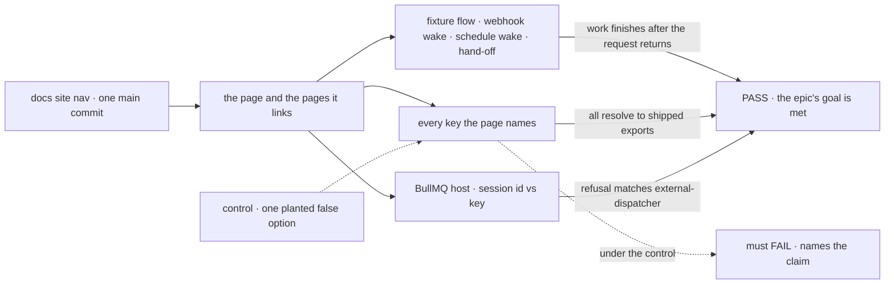
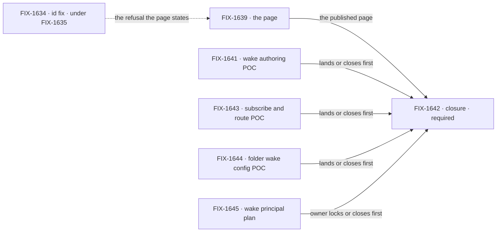

# FIX-1637 · Keeping flows alive: one page from an outside event to work that keeps going

**Spec** · [Decisions](DECISIONS.md) · [Rules](BUSINESS-RULES.md) · [Plan](PLAN.md) · [Docs](DOCS.md) · [Evolution](EVOLUTION.md)

Epic · 8 issues, 2 folded into the page by [D1](DECISIONS.md#d1) · docs only, no runtime change · Framework simplification & cleanup
([project spec #2367](https://github.com/fixpoint-labs/flow-state-dev/pull/2367)) · Goal 4,
keep the foundation honest ([`docs/objectives.md`](../../../docs/objectives.md)) ·
[FIX-1637](https://linear.app/fixpoint-labs/issue/FIX-1637)

## Five builders, before and after

| A builder who… | Today | After this epic |
|---|---|---|
| **wants a flow to react to an outside service** | Finds *Webhooks* under Engine › Hosting. Nothing joins it to schedules or to work that keeps going | One page walks webhook, then schedule, then the hand-off, and links each reference page |
| **wants a flow to run on a clock** | Reads *Scheduled actions*, *Schedule index* and four scheduler guides to learn which parts are theirs | One table says what goes in the flow, what goes on the host, and what their scheduler must call |
| **runs on a queue-backed host (BullMQ)** | Meets the `{ id }` refusal as one row of a refusal table, or as a channel that never answers | Reads before building: where the host's dispatcher hands work to the queue, `{ key }` works, `{ id }` is refused by name, and what to do instead |
| **meets *wake*, *dispatch*, *tick*** | Sees the words used across pages, defined nowhere. *Heartbeat* on these pages means a running request's liveness | Gets each defined once, in a sentence |
| **uses Workforce channels and boards** | Reads an 800-line channels page to tell the conversation from the work list | Reads one section: a channel holds the conversation, a board holds the work, with links |

**Why now.** The public release ([FIX-1635](https://linear.app/fixpoint-labs/issue/FIX-1635))
puts FSD in front of outside builders, and our own support desk found the queue-host gap
([FIX-1634](https://linear.app/fixpoint-labs/issue/FIX-1634)) by doing nothing on BullMQ. Goal 4
says document a limitation plainly; today a builder learns this one by hitting it. The
objectives' non-goal, production deployment guides, holds: the page says what fires each wake
and links the scheduler and deploy guides that exist. It writes none.

## The goal, and how we'll know it's met

**A builder who wants a flow to react to things happening outside a chat (an incoming webhook,
a clock, another flow) and to keep working after the request that started it returns can find,
from one page of the published docs, which of the existing ways to use, what to configure in
the flow vs the host vs their infrastructure, and what does not work yet on a queue-backed
host.**

| Is it the right goal? | |
|---|---|
| **The real need** | The owner's PRD: *"One coherent published path so builders know how a flow stays alive 24/7 without inventing product nouns."* The substance ships across eight pages; the path between them doesn't |
| **Smaller, and rejected** | "Link the pages from a nav entry." It fixes discovery and leaves three things no page has: the flow/host/ops table, the queue-host fence on the reading path, and the terms ([D2](DECISIONS.md#d2)) |
| **Bigger, and not this epic's** | Making `{ id }` work on BullMQ (FIX-1634, under FIX-1635) · a per-cloud deploy guide · live UI fan-out (FIX-1506) |
| **Not done if** | A key or option on the page doesn't resolve to a shipped export · the page's refusal text disagrees with the runtime · a reader must leave the page's links to finish · `epic-wake` or a Heartbeats noun reaches `apps/docs` |

The control is what makes a pass mean the page is true, not just readable.

| How we verify | |
|---|---|
| **Goal check** | The closure issue ([FIX-1642](https://linear.app/fixpoint-labs/issue/FIX-1642)) on one `main` commit after every other child merges ([ER-15](BUSINESS-RULES.md#the-closure)) |
| **Signal** | A QA run starts at the docs site nav and uses only the page and its links. It builds a fixture flow woken by a webhook and by a schedule that hands off work finishing after the request returns. Every API name and config key on the page and its table resolves to a shipped export. The page's BullMQ `session: { id }` statement matches the runtime: `DispatchRefusedError`, `refused: "external-dispatcher"`, while `{ key }` runs |
| **Input** | The published page as written, a real BullMQ host with Redis whose dispatcher hands work to the queue (`colocated` or `dispatch-only`), and the webhook and schedule endpoints called over HTTP |
| **Anti-game** | No reading the source to fill a gap the page left. No asserting on a child's own test |
| **Control that must fail** | A planted false claim, an option that does not exist, on the page: the run must fail on it |

| | |
|---|---|
| **Lead measure** | The set's goal-proven issues, named: FIX-1639's own check (its fixture follows its draft page) is the only one. **None today** |
| **Not doing** | No runtime or API change, the FIX-1634 `{ id }` fix included: it stays under FIX-1635, a pointer only · no Heartbeats or Paperclip product noun, no clone page · no new L1 Channel, Board, Agent, Team or Outbox · no reviving the canceled Relay family (FIX-1197, FIX-1230, FIX-1231) · no rewrite of the webhook, schedule, dispatched-work or channels pages beyond fixing drift and linking · no per-cloud deployment how-to · no live-UI or fan-out work (FIX-1506, FIX-1622) · `epic-wake` never appears in published docs · no L2 adopt filed for FIX-1634 · no folder wake config or trust-lane runtime: FIX-1644 explores the one and FIX-1645 plans the other, and neither ships here |
| **Kill line** | If writing the page shows a builder cannot keep a flow alive 24/7 with shipped features alone (the honest page would be mostly "not yet"), stop and file the runtime gap instead. If the existing pages already give the path and only discovery is broken, a nav or index change replaces the page |

## What's in the box

![What's in the box: one published page holding the path from webhook to schedule to hand-off, the id vs key section with the queue-host fence, the flow / host / ops table, and three defined terms. Linked, not rewritten: the eight reference pages and the scheduler and deploy guides. Reworded in one line: the notification source row, and the epic-wake definition moving to contributor docs. Not built, below a fence: the id fix, a Heartbeats noun, new L1 nouns, Relay, a per-cloud deploy guide, live UI](figures/end-state.svg)

The box is one page; everything it leans on already ships. The fence keeps a docs epic from
becoming a runtime or product one.

## The set · as of 2026-09-29

A dated snapshot. Live state is Linear and the implementation PRs.

| Issue | What it delivers | Why the set needs it | Status |
|---|---|---|---|
| [FIX-1639](https://linear.app/fixpoint-labs/issue/FIX-1639) · the page | The published page: the path, the `{ id }` / `{ key }` fence, the terms block and the flow / host / ops table; drift fixes and links on the pages it leans on | The substance. By [D1](DECISIONS.md#d1) it carries all three deliverables | Backlog · spec route |
| [FIX-1638](https://linear.app/fixpoint-labs/issue/FIX-1638) · config matrix | Nothing on its own: the flow / host / ops table is a section of FIX-1639's page | **Folded into FIX-1639** ([D1](DECISIONS.md#d1), decided) | Canceled as folded |
| [FIX-1640](https://linear.app/fixpoint-labs/issue/FIX-1640) · terms | Nothing on its own: the terms are a section of FIX-1639's page, and the `epic-wake` line is FIX-1639's | **Folded into FIX-1639** ([D1](DECISIONS.md#d1), decided) | Canceled as folded |
| [FIX-1641](https://linear.app/fixpoint-labs/issue/FIX-1641) · wake authoring POC | Three authoring shapes in an examples package, each compiling to today's bindings | Exploration the owner filed with the Architect; evidence, not surface. Nothing it adds ships as a framework API here ([ER-6](BUSINESS-RULES.md#what-no-child-may-do)) | Backlog · examples [#2369](https://github.com/fixpoint-labs/flow-state-dev/pull/2369) open, draft |
| [FIX-1643](https://linear.app/fixpoint-labs/issue/FIX-1643) · subscribe and route POC | The host registers GitHub once, then two routing styles in an examples package: per-session subscribe, and one webhook with route rules compiling to today's bindings | Exploration the owner filed with the Architect; evidence, not surface. A sibling of FIX-1641, soft-related, not its child. Nothing it adds ships as a framework API here ([ER-6](BUSINESS-RULES.md#what-no-child-may-do)) | Backlog · examples [#2372](https://github.com/fixpoint-labs/flow-state-dev/pull/2372) open, draft |
| [FIX-1644](https://linear.app/fixpoint-labs/issue/FIX-1644) · folder wake config POC | Wake config as a file convention: the worker or channel folder holds the wake files, transports register the way flows and blocks do, and seats reference the registrations. Examples and a short write-up | Exploration the owner filed with the Architect, not locked; evidence, not surface. A sibling of FIX-1641 and FIX-1643, soft-related. Nothing it adds ships as a framework API here ([ER-6](BUSINESS-RULES.md#what-no-child-may-do)) | In Review · examples [#2374](https://github.com/fixpoint-labs/flow-state-dev/pull/2374) open, draft |
| [FIX-1645](https://linear.app/fixpoint-labs/issue/FIX-1645) · wake principal plan | A written sketch of who a wake runs as and which trust lane admits it: untrusted edge vs trusted internal, an org actor for org webhooks, seat vs org cron | The owner placed it here, not under FIX-1635. A plan, not a build: it changes no runtime, and the page never teaches it ([ER-6](BUSINESS-RULES.md#what-no-child-may-do)) | Backlog · sketch on the issue; two of its three questions await the owner |
| [FIX-1642](https://linear.app/fixpoint-labs/issue/FIX-1642) · closure · **required** | The QA plan: the page followed as written on one `main` commit | Proves the whole ([ER-15](BUSINESS-RULES.md#the-closure)) | Backlog · blocked by every other open child; Linear holds the list |

**One page, three POCs, a plan, and the closure.** The set would be zero only if a nav change
were enough, and it isn't ([D2](DECISIONS.md#d2)). FIX-1641 was filed while this spec was
written, FIX-1643 during its review, and FIX-1644 and FIX-1645 in the hour before it merged.
All four run beside the page, not before it; like every child each blocks the closure.

## How the issues flow into each other

Solid edges are blocked-by; the dashed edge from FIX-1634 is an input from another epic.
FIX-1638 and FIX-1640 have no node: D1 folded them into FIX-1639 and they are canceled. The
three POCs and the plan hand the page nothing it must wait for, and the closure checks none of
them. Each blocks the closure only because every child does: the run waits for each examples PR
to merge, or for the owner to close the POC with its findings filed to FIX-1639, and for the
owner to lock FIX-1645's sketch or close it. They are soft-related siblings, so no edge joins
them. FIX-1645 gates shipping folder wakes as a product, which is outside this epic.

## What stays as it is

- **The refusal**, until FIX-1634 ships. The page states it and never works around it.
- **The reference pages and the scheduler and deploy guides**: linked, fixed where they drift,
  not rewritten ([ER-9](BUSINESS-RULES.md#what-no-child-may-do)).
- **Related, not children:** FIX-1634, FIX-1635, FIX-453, FIX-1506, FIX-1622, the Relay family.

## Sign off

**[The goal](#the-goal-and-how-well-know-its-met), at that size:** one page, proven by following
it, with the queue-host gap stated plainly. If wrong: we ship a page nobody can build from, or
a runtime gap gets documented instead of fixed.

1. **[D1](DECISIONS.md#d1) · One page from one writer, FIX-1638 and FIX-1640 folded in.
   Decided by the owner, 2026-09-29.** If wrong: one fold to re-split, before the page is written.
2. **[D2](DECISIONS.md#d2) · A new page, not a nav change.** If wrong: a page that repeats what
   a sidebar entry would have found.
3. **[D3](DECISIONS.md#d3) · The event row names only doors that ship.** `dispatcher()` is the
   cross-flow bus that ships; FIX-441's topic bus is the one left out. If wrong: a reader builds
   on `.notify` and `NotificationFlow`, which were canceled.

**Nothing open.** Reasoning and what lost: [DECISIONS.md](DECISIONS.md). Rules:
[BUSINESS-RULES.md](BUSINESS-RULES.md). Order: [PLAN.md](PLAN.md).
