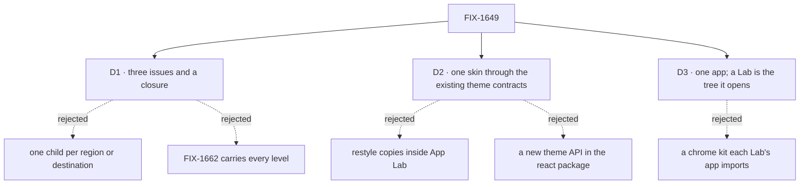

# FIX-1649 · Decisions

[Spec](SPEC.md) · **Decisions** · [Rules](BUSINESS-RULES.md) · [Plan](PLAN.md) · [Docs](DOCS.md) · [Evolution](EVOLUTION.md)

The calls above any single issue. D1, D2 and D3 are the sign-off surface, and no fork is open;
the rest are decided so no child reopens them. Scope, invent-kills and vocabulary come
from the PRD and the Architect's signed guidance on FIX-1649.

## The tree

## D1 · Three issues and a closure: the shell splits at the task level; the shell owns how surfaces are reached and look, the siblings own what they mean

| | |
|---|---|
| **Instead of** | FIX-1662 carrying every level, as the set did before the hand-back · one child per region or per destination |
| **Because** | The hand-back turned four regions into three centre levels (project, workstream, task), each with four tabs, and a right panel that changes with the level. As one child that is one spec of twelve tabs and two panel modes, past what a review holds. The task level is the clean cut: it reads one harness session (its transcript, diff and checks) and carries the session writes (a turn, Interrupt, Hand off), where the project board is the workstream board in swimlanes, so those two stay together. Meaning still lives in FIX-1650, 1651 and 1652, so a child per destination would still draw a sibling's model or wait on it |
| **Locks in** | **FIX-1662:** the frame (sidebar, Jump to, routes, the right panel's slot), the project and workstream levels, and the workstream's panel. **FIX-1664:** the task level and the task inspector, inside that frame; its spec runs beside FIX-1662's, and its build merges after FIX-1662. The split trigger still stands for anything further: a level that needs a read no shipped surface exposes splits out rather than inventing the read |

**What would change my mind:** FIX-1664's spec finding the task level reads mostly what the
workstream level already reads. Then it folds back into FIX-1662.

It comes down to the size of a child: one spec of three levels is past what a review holds.

## D2 · One skin, through the theme contracts FSD components already have

| | |
|---|---|
| **Instead of** | Restyling FSD components inside App Lab · adding a theme provider or theme API to `@flow-state-dev/react` |
| **Because** | Jake's layer rule: FSD's L1 packages carry no App Lab look. The contracts exist: the navigator and panels read `--fsd-nav-*` and `--fsd-panel-*` ([FIX-1477 D1](../../issues/FIX-1477/DECISIONS.md#d1)), the registry reads semantic tokens, and kitchen-sink already maps one onto the other. A restyled copy drifts from every later FSD fix; a theme API puts a Lab-shaped surface into L1 |
| **Locks in** | **Two shelves, as FSD ships them.** The chrome (navigator, roster, board panels, seat detail) is imported at runtime from `@flow-state-dev/react` and skinned through `--fsd-*`, per FIX-1477 D1. Registry and item components are copied in by `fsdev ui add` and skinned only through tokens; the copy is never edited. **One token set**, whose defaults are neutral values living beside the components that read them; the App Lab theme overrides them from the design-system package. A component that can't take the skin is fixed at its source by FIX-1655 and re-synced, and FIX-1655 owns a check that fails when an App Lab copy differs from its source ([ER-6](BUSINESS-RULES.md#what-no-child-may-do)) |

**Why the copy-in is right here when FIX-1477 D1 rejected it.** There the copy-in registry was
proposed for the chrome itself, and a drifting copy of the chrome was the defect being fixed.
Here it is the registry's documented distribution model (`packages/ui/README.md`), and App Lab
is the example consumer for skinning, so it must skin the way a user's app would. The re-sync
check closes drift, and paint stays in tokens. Publishing `ui` as a runtime package, FIX-1477
D1's mind-changer, is not reopened here.

**What would change my mind:** the refined design asking for a look a reused component can't
reach through its contract without a change to its public props. Then that component needs a
spec of its own, not a restyled copy.

It comes down to where the paint lives: a restyled copy or a theme API puts App Lab into FSD.

## D3 · One app that opens any Lab; a Lab is the Workforce tree it opens

Decided by Jake on 2026-09-30, answering the fork this set had open ("One app").

| | |
|---|---|
| **Instead of** | A chrome kit each Lab's own app imports |
| **Because** | Labs share one app chrome, per the Architect, and D-12 says DevForce is a Lab built completely on Workforce: "no special wrappers" reads most naturally as no Lab app at all. One app means no Lab writes UI and there is one thing to deploy; the kit is a package with one consumer today that would amend FIX-1455 D5. It is also the smaller build, and extracting a kit later is cheaper than guessing its seams now |
| **Locks in** | The chrome stays inside `labs/app-lab`. A second Lab opens as its tree, with no shell code and no wrapper ([ER-4](BUSINESS-RULES.md#what-a-team-gets-and-what-it-doesnt)), which the closure's leg b checks on `goals/pentest-lab/lab/workforce/`. A tree is not configuration alone: it carries code (flows, and a host that `fsdev gen` renders per app). How App Lab loads one is FIX-1662's spec's call, between the runtime `@flow-state-dev/workforce` loader and a per-Lab `fsdev gen` step; neither puts shell code in the Lab. The price: a Lab can't have a screen of its own until the shell grows a place for one |

**What would change my mind:** DevForce or CyberForce must ship as separate products, with
screens only they have.

**What being wrong costs:** about one issue to extract the chrome into a package later.

It comes down to what a Lab is: a tree needs no app of its own.

## Who owns what

Every rule has one owner. A *consumes* cell is a place a child must not re-decide: FIX-1662
consumes the token set and the hand-back rule; it does not choose colours. FIX-1662 owns reach,
so FIX-1664's tabs hang off FIX-1662's routes; FIX-1664 owns how a session is written to, so
the workstream composer's `@worker` goes through the same operation.

**Look, and meaning, surface by surface.** The shell (FIX-1662, FIX-1664) owns where each
surface sits, how it is reached and how it looks. What it means belongs where it already
ships, or to the sibling that will ship it; until then, the surface shows its named empty state
([ER-5](BUSINESS-RULES.md#what-a-team-gets-and-what-it-doesnt)):

| Surface in the design | What it means comes from |
|---|---|
| TEAMS, each team's workers, a worker's harness and status | Workforce as shipped: the tree's teams and seats, and the seat's run |
| The PROJECTS tree's projects, the project level | FIX-1650 · org primitives |
| Workstreams, tasks, a board row, brief, results, a task's acceptance criteria and harness plan | FIX-1651 · eng workstream kit |
| NEEDS YOU, and inspect depth past what the task inspector shows | FIX-1652 · attention and inspect |

## Decided in review, recorded so no child reopens them

- **The structure is the hand-back v1's, not the wireframes'** ([`assets/design/`](assets/design/DESIGN.md), Sep 30).
  One sidebar replaces the rail and sidebar: the org switcher, Jump to (⌘K), NEEDS YOU, the
  PROJECTS tree (a project, then its workstreams as `#channels` with progress), TEAMS, and a
  footer with the sessions live and the user. **Under TEAMS, each team lists its workers below
  it** (seat, harness, status): Jake's correction, which the screens don't draw yet. Three
  centre levels: project (Stream, Board, Workstreams, Brief; one swimlane per workstream,
  columns QUEUED, RUNNING, IN REVIEW, NEEDS YOU, DONE; a team roster strip), workstream (Stream,
  Board, Brief, Results; the stream's cards for a task assignment, a review result, a live
  session, an approval with Approve & run, Show SQL and Deny, and a human message routed into a
  session) and task (Session, Diff, Checks, Brief; Interrupt, Hand off, Open PR). The wireframes
  stay as history.
- **The five destinations are the tree and the tabs.** Projects and workstreams are the tree.
  Chat is a workstream's stream and its composer, where `@worker` sends the message into that
  worker's session as a turn. Attention is NEEDS YOU. **Resources has no place in v1**: it is
  reached from Jump to until [design pass 2](#design-pass-2) gives it one.
- **The right panel is contextual; it replaces the run inspector.** At a workstream: progress,
  the team roster (seat, harness, status, queue) and its tasks grouped by status. At a task: the
  task inspector (worker, harness, started, tokens, cost, acceptance criteria, harness plan,
  files, linked tasks), with the devtool's full trace one link away. It shows only what shipped
  reads return.
- **App Lab's theme has a light and a dark variant**, both over the token set's neutral
  defaults. The hand-back is dark; the ticket's brutalist beige, black and yellow is the light
  one. Leg c is unchanged: with no App Lab theme loaded, neither variant's values show.
- **App Lab lives at `labs/app-lab/`**, with the repo's dogfooded apps. Kitchen-sink is not the shell.
- **The design-system package is private**: an npm name is permanent, and no outside consumer
  exists. Its name and folder are FIX-1655's call.
- **No second full theme.** Its only consumer was the proof. Neutral values are the token
  set's defaults, which any app loading no theme already sees, so leg c renders with none.
- **Final visuals wait for the final hand-back; structure does not.** The token contract with
  its neutral defaults, the levels and the bindings start at the gate. v1 fixes structure and
  may seed draft values; theme values and final layout merge after the final hand-back
  ([ER-9](BUSINESS-RULES.md#how-the-set-is-run)).
- **A surface whose meaning hasn't shipped shows a named empty state**, not a hidden item, and
  an action with no shipped operation behind it is disabled and says what arrives.
- **NEEDS YOU lists the pending approvals and questions seats have raised** until FIX-1652
  defines attention. It is not the Thought Fabric attention domain.
- **The design-system package imports nothing from `@flow-state-dev/workforce`.** Workforce
  words in the chrome (NEEDS YOU, TEAMS) are labels App Lab passes in.

## Open for design pass 2 · what the hand-back v1 left undrawn

Not decisions for Jake; the brief for the next Claude Design pass, with what the build does
until it returns. Kept in step with [`assets/design/DESIGN.md`](assets/design/DESIGN.md) §7.

| Item | Until it returns |
|---|---|
| **Where resources live** | Reached from Jump to, as a list of what the tree declares |
| **The light variant** (the ticket's beige, black and yellow) | FIX-1655 drafts it from the ticket; no final value merges |
| **TEAMS with workers below each team** (Jake's correction) | Built as the correction says, on the v1 look |
| **Tabs not drawn:** workstream Board, Brief, Results; project Stream, Workstreams, Brief; task Diff, Checks, Brief | Built from the wireframes' surfaces in the v1 look |
| **Empty, loading and failed states** in the v1 look | The wireframes' states: a named empty state, a per-section Retry |
| **The right panel at a project** (v1's board has none) | The board takes the full width |
| **Narrow screens** | Desktop width only |

## What the end-state POC showed

None built. The design hand-back carries the assembled end-state where it is contested (layout
and reach), and the one code seam, tokens mapped onto `--fsd-nav-*`, already works in kitchen-sink.

## How it got here

- **Drafted (Sep 29)** from the PRD and the Architect's guidance; FIX-1662 and FIX-1663 filed.
- **Owner direction (Sep 29)**: wireframes first, for Claude Design; its hand-back gates final
  visuals ([PLAN.md](PLAN.md)).
- **Review round 1 (Sep 29)**: D2 names the two shelves and sanctions the registry copy-in with
  a re-sync check; neutral values became the token set's defaults, not a second theme; the load
  mechanism is FIX-1662's call; the kit path moved under the then-open fork.
- **Design hand-back v1 (Sep 30, owner input)**: three dark screens and Jake's TEAMS
  correction replaced the wireframes as structure; the destinations became the tree and the
  tabs; the right panel became contextual; the theme gained a dark variant; D1 split the shell
  at the task level, filing FIX-1664; [design pass 2](#design-pass-2) opened.
- **Jake's answer (Sep 30)**: the open fork, one app or a chrome kit each Lab imports, became
  [D3](#d3): one app. The kit's replacement rules were removed.
