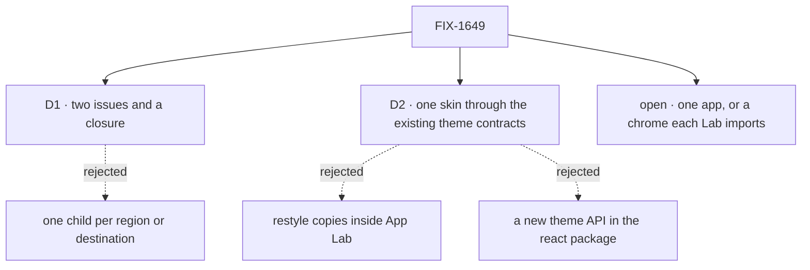

# FIX-1649 · Decisions

[Spec](SPEC.md) · **Decisions** · [Rules](BUSINESS-RULES.md) · [Plan](PLAN.md) · [Docs](DOCS.md) · [Evolution](EVOLUTION.md)

The calls above any single issue. D1 and D2 are the sign-off surface; one fork is open and is
Jake's; the rest are decided so no child reopens them. Scope, invent-kills and vocabulary come
from the PRD and the Architect's signed guidance on FIX-1649.

## The tree

## D1 · Two issues and a closure: the shell owns how surfaces are reached and look, the siblings own what they mean

| | |
|---|---|
| **Instead of** | One child per region (sidebar, centre, inspector) or per destination (projects, workstreams, chat, attention, resources) |
| **Because** | The Architect's line puts the *meaning* of three of the five destinations in FIX-1650, 1651 and 1652. A child per destination would either draw a sibling's model or wait on it. What is left, reach and look, is one surface with one seam: FIX-1655's token set, which FIX-1662 consumes |
| **Locks in** | FIX-1662 carries all four regions and all five destinations. Split trigger: if its spec finds a region needs a read no shipped surface exposes, that region splits out as its own child rather than inventing the read inside the shell |

**What would change my mind:** a sibling epic shipping its meaning inside this epic's window
in a way that reshapes a region. Then that region is worth its own child.

It comes down to where meaning lives: per-destination children would redraw siblings' models.

## D2 · One skin, through the theme contracts FSD components already have

| | |
|---|---|
| **Instead of** | Restyling FSD components inside App Lab · adding a theme provider or theme API to `@flow-state-dev/react` |
| **Because** | Jake's layer rule: FSD's L1 packages carry no App Lab look. The contracts exist: the navigator and panels read `--fsd-nav-*` and `--fsd-panel-*` ([FIX-1477 D1](../../issues/FIX-1477/DECISIONS.md#d1)), the registry reads semantic tokens, and kitchen-sink already maps one onto the other. A restyled copy drifts from every later FSD fix; a theme API puts a Lab-shaped surface into L1 |
| **Locks in** | **Two shelves, as FSD ships them.** The chrome (navigator, roster, board panels, seat detail) is imported at runtime from `@flow-state-dev/react` and skinned through `--fsd-*`, per FIX-1477 D1. Registry and item components are copied in by `fsdev ui add` and skinned only through tokens; the copy is never edited. **One token set**, whose defaults are neutral values living beside the components that read them; the App Lab theme overrides them from the design-system package. A component that can't take the skin is fixed at its source by FIX-1655 and re-synced, and FIX-1655 owns a check that fails when an App Lab copy differs from its source ([ER-6](BUSINESS-RULES.md#what-no-child-may-do)) |

**Why the copy-in is right here when FIX-1477 D1 rejected it.** There the copy-in registry was
proposed for the chrome itself, and a drifting copy of the chrome was the defect being fixed.
Here it is the registry's documented distribution model (`packages/ui/README.md`), and App Lab
is the example consumer for skinning, so it must skin the way a user's app would. The re-sync
check closes drift, and paint stays in tokens. Publishing `ui` as a runtime package, FIX-1477
D1's mind-changer, is not reopened here.

**What would change my mind:** the refined design asking for a look a reused component can't
reach through its contract without a change to its public props. Then that component needs a
spec of its own, not a restyled copy.

It comes down to where the paint lives: a restyled copy or a theme API puts App Lab into FSD.

## Who owns what

Every rule has one owner. A *consumes* cell is a place a child must not re-decide: FIX-1662
consumes the token set and the hand-back rule; it does not choose colours.

## Decided in review, recorded so no child reopens them

- **App Lab lives at `labs/app-lab/`**, with the repo's dogfooded apps. Kitchen-sink is not the shell.
- **The design-system package is private**: an npm name is permanent, and no outside consumer
  exists. Its name and folder are FIX-1655's call.
- **No second full theme.** Its only consumer was the proof. Neutral values are the token
  set's defaults, which any app loading no theme already sees, so leg c renders with none.
- **Final visuals wait for the refined design; structure does not.** The token contract with
  its neutral defaults, the regions and the bindings start at the gate. Theme values and final
  layout merge after the Claude Design hand-back ([ER-9](BUSINESS-RULES.md#how-the-set-is-run)).
- **A destination whose meaning hasn't shipped shows a named empty state**, not a hidden item,
  so the design hand-off draws every destination.
- **NEEDS YOU lists the pending approvals and questions seats have raised** until FIX-1652
  defines attention. It is not the Thought Fabric attention domain.
- **The run inspector summarises one run and links the devtool's full trace**, showing only
  what shipped reads return.
- **The design-system package imports nothing from `@flow-state-dev/workforce`.** Workforce
  words in the chrome (NEEDS YOU, ON SHIFT) are labels App Lab passes in.

## Open · one, and it is Jake's

### Is App Lab one app that opens any Lab, or a chrome each Lab's own app imports?

**Plain terms.** Labs share one app chrome, per the Architect. That can mean one app you point
at a Lab (DevForce is App Lab opened on DevForce's tree), or a kit each Lab builds its own app
from. The wireframes look the same either way; what differs is whether a Lab ships its own app.

**The trade-off.** One app means no Lab writes UI and one thing to deploy, but a Lab can't have
a screen of its own until the shell grows a place for it. A kit gives each Lab its own screens,
at the cost of an app per Lab and a chrome package with one consumer today.

**My recommendation: one app; a Lab is the Workforce tree it opens.** D-12 says DevForce is a
Lab built completely on Workforce, and "no special wrappers" reads most naturally as no Lab
app at all. It is also the smaller build, and extracting a kit later is cheaper than guessing
its seams now. A tree is not configuration alone: it carries code (flows, and a host that
`fsdev gen` renders per app). How App Lab loads one is FIX-1662's spec's call, between the
runtime `@flow-state-dev/workforce` loader and a per-Lab `fsdev gen` step. Both keep this
answer, because neither puts shell code in the Lab. Leg b checks it on
`goals/pentest-lab/lab/workforce/`.

**What would change my mind:** DevForce or CyberForce being meant to ship as separately
deployed products, with screens only they have.

**What being wrong costs:** moderate and late. Under my answer, a Lab that needs its own app
later means extracting the chrome into a package, about one issue. Under the other, we build
and hold a package surface nobody else uses yet.

It comes down to what a Lab is: a tree needs no app of its own.

### If Jake picks the chrome kit

The rest of the set is written on the one-app path. Under the kit, these replace it; no child
is added:

- **ER-4 becomes:** a second Lab's app imports the chrome package and draws no chrome of its
  own; its code is its host and routes, nothing the shell already draws; it opens only under an
  org.
- **Leg b becomes:** a second app on the pentest lab's tree imports the chrome and reaches every
  surface leg a reaches, with no chrome component of its own.
- **FIX-1662** grows a package export for the chrome, which amends FIX-1455 D5 knowingly
  ([EVOLUTION.md](EVOLUTION.md)), and `DOCS.md` gains a published page for that package.

## What the end-state POC showed

None built. The wireframes carry the assembled end-state where it is contested (layout and
reach), and the one code seam, tokens mapped onto `--fsd-nav-*`, already works in kitchen-sink.

## How it got here

- **Drafted (Sep 29)** from the PRD and the Architect's guidance; FIX-1662 and FIX-1663 filed.
- **Owner direction (Sep 29)**: wireframes first, for Claude Design; its hand-back gates final
  visuals ([PLAN.md](PLAN.md)).
- **Review round 1 (Sep 29)**: D2 names the two shelves and sanctions the registry copy-in with
  a re-sync check; neutral values became the token set's defaults, not a second theme; the load
  mechanism is FIX-1662's call; the kit path moved under [the fork](#if-kit).
