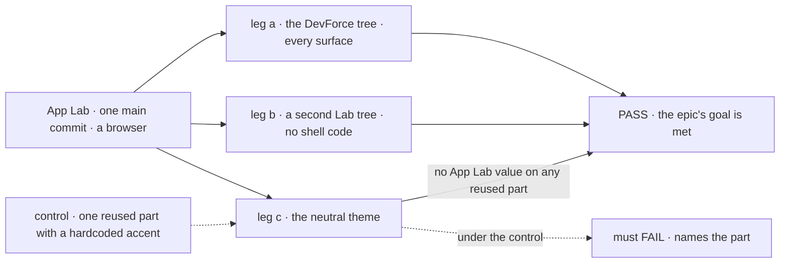
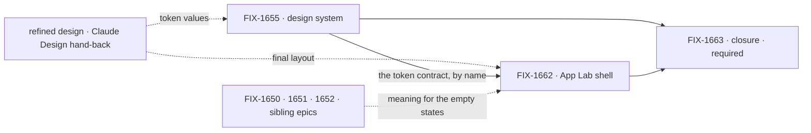

# FIX-1649 · Workforce lab shell: one app a Lab is used through, in one skin

**Spec** · [Decisions](DECISIONS.md) · [Rules](BUSINESS-RULES.md) · [Plan](PLAN.md) · [Docs](DOCS.md) · [Evolution](EVOLUTION.md)

Epic · two issues and a closure · Workforce App Lab · Goal 1, validate through real usage
([`docs/objectives.md`](../../../docs/objectives.md)) · [FIX-1649](https://linear.app/fixpoint-labs/issue/FIX-1649)
· Cycle 2 candidate, not Cycle 1

**Wireframes for the Claude Design hand-off: [`assets/wireframes/`](assets/wireframes/README.md).**
Five screens, structure only. They can be handed off without reading the rest of this set.

## Four teams, before and after

| A team that… | Today | After this epic |
|---|---|---|
| **uses a Lab day to day** (the owner, dogfooding) | Has kitchen-sink, a teach surface, and the devtool, a debugger. Neither is where a Lab is used | Opens App Lab: what needs them, the Lab's channels, the seats on shift, and every surface one click away |
| **builds the next Lab** (DevForce, then CyberForce) | Would write its own chrome, and reach channels, boards and runs its own way | Opens its Workforce tree in App Lab and writes no shell code ([open fork](DECISIONS.md#open)) |
| **reuses FSD UI in its own app** | Themes the navigator and panels through `--fsd-nav-*` and `--fsd-panel-*`; eleven `@flow-state-dev/ui` registry components use fixed palette colours (red, green, blue, amber) rather than semantic tokens | One token set skins every reused component, with no fork |
| **owns a sibling horizon epic** (FIX-1650, 1651, 1652) | Needs a screen before anyone can see what it means | Fills a destination the shell already reaches |

**Why now.** Jake wants wireframes in front of Claude Design first, so the look is refined
before anything is built. The spec is the carrier for that hand-off. The build is a Cycle 2
candidate beside FIX-1650; Cycle PM decides when it starts, and nothing here pours into Cycle 1.

## The goal, and how we'll know it's met

**A person can use a Workforce Lab from one app, reaching every surface the shell promises,
with reused FSD components in one skin that is not baked into FSD itself; and a second Lab
opens in the same shell with no shell code of its own.**

| Is it the right goal? | |
|---|---|
| **The real need** | Jake's PRD: app lab, design system, and nav across projects, workstreams, chat, attention and resources. The Architect's success line: Labs share one app chrome and design system without a second product shell or new L1 nouns |
| **Smaller, and rejected** | "App Lab renders in the skin." FIX-1662 alone meets it, and a second Lab could still need its own chrome, while every reused component could still carry App Lab paint in FSD |
| **Bigger, and not this epic's** | What projects, workstreams and attention *mean* (FIX-1650, 1651, 1652) · review and GitHub wake (FIX-1653) · the DevForce Lab product itself |
| **Not done if** | Every child is Done and the closure check hasn't run · a reused FSD component was forked into App Lab · an App Lab skin value sits in an FSD package · a destination shows a model the shell invented · a Lab needs a wrapper, or opens with no org · final visuals merged before the refined design came back |

Leg c is what makes "one skin, not baked in" checkable. The control plants the failure it
exists to catch.

| How we verify | |
|---|---|
| **Goal check** | The closure issue's goal check ([FIX-1663](https://linear.app/fixpoint-labs/issue/FIX-1663)), in a browser, on one `main` commit after every other child merges ([ER-12](BUSINESS-RULES.md#how-the-set-is-run)) |
| **Signal** | Leg a: from App Lab's first screen, every sidebar section, centre surface, the inspector and all five destinations are reached; a post in a channel shows its answer in the stream and the working seat in the inspector. Leg b: a second tree opens by configuration alone. Leg c: computed styles on every reused component carry no App Lab value |
| **Input** | The DevForce lab's declared tree (`goals/devforce-lab/lab/workforce/`) with a real model, under a real org; for leg b, the pentest lab's tree (`goals/pentest-lab/lab/workforce/`), the nearest to CyberForce in the repo. Kitchen-sink's tree is not a stand-in for either leg |
| **Anti-game** | No asserting on a child's own tests. No App Lab code that names the second tree. No component excluded from leg c's sweep |
| **Control that must fail** | One reused component given a hardcoded App Lab colour: leg c must FAIL naming it. Today's `main`: legs a and b fail |

Leg b's form follows the [open fork](DECISIONS.md#open): under the other answer it becomes a
second app importing the chrome.

## What's in the box

![What's in the box. In the box: App Lab under labs, with four regions, a rail, a sidebar with NEEDS YOU, channels and ON SHIFT, a centre with stream, board, brief and results, and a run inspector, reaching five destinations; and a private design-system package with the token set, a neutral theme and the App Lab theme, plus skin fixes made where reused FSD components live. Reused and skinned, not forked: the react navigator and panels, the ui registry components, and the devtool's full trace, one link away. Filled by sibling epics: projects and workstreams, attention. Not built, below a fence: new L1 nouns, a Heartbeats, Paperclip or Grok Bot clone, a factory or Conductor shell, kitchen-sink as the shell, the Thought Fabric attention domain, a design system per Lab, forks of FSD UI](figures/end-state.svg)

The screens are the [wireframes](assets/wireframes/README.md). Inside the box is one app and
one skin; the fence is the PRD's invent-kills, drawn where a shell epic would drift.

## The set · as of 2026-09-29

A dated snapshot. Live state is Linear and the implementation PRs.

| Issue | What it delivers | Why the set needs it | Status |
|---|---|---|---|
| [FIX-1655](https://linear.app/fixpoint-labs/issue/FIX-1655) · design system | A private design-system package: the token set, a neutral theme and the App Lab theme, mapped onto the theme contracts FSD components already have; skin gaps fixed where the components live | The skin, and the proof it isn't paint on FSD ([D2](DECISIONS.md#d2)) | Todo · spec route (no Kind label, defaults to spec) |
| [FIX-1662](https://linear.app/fixpoint-labs/issue/FIX-1662) · App Lab shell | `labs/app-lab`: the four regions and five destinations over a Lab's tree, org required, empty states for what siblings haven't shipped | The substance: where a Lab is used ([D1](DECISIONS.md#d1)) | Backlog · spec route |
| [FIX-1663](https://linear.app/fixpoint-labs/issue/FIX-1663) · closure · **required** | The QA plan and runs on one `main` commit | Proves the whole | Backlog · blocked by FIX-1655, FIX-1662 |

Two issues and a closure. Whether two is really one was argued: the design system has
consumers beyond App Lab (every reused FSD component), so it stays its own issue. Whether two
should be five, one per region or destination, is [D1](DECISIONS.md#d1).

## How the issues flow into each other

Dashed edges are inputs from outside the set: the hand-back gates final visuals only
([ER-9](BUSINESS-RULES.md#how-the-set-is-run)), and the siblings gate nothing. FIX-1662 names
FIX-1655's tokens in its spec but does not wait for its merge. The closure waits on both.

## What stays as it is

- **Kitchen-sink** stays the teach surface, and the **devtool** stays the debugger; App Lab
  links the devtool's trace rather than rebuilding it.
- **The theme contracts** (`--fsd-nav-*`, `--fsd-panel-*`, the registry's semantic tokens):
  used, not replaced ([EVOLUTION.md](EVOLUTION.md)).
- **Related, not children:** FIX-1650 to FIX-1653, FIX-1637 (wake spine, a docs pointer only),
  FIX-1407, FIX-1442, FIX-1455, FIX-1592.

## Sign off

**[The goal](#the-goal-and-how-well-know-its-met), at that size:** every surface reached, one
skin not baked into FSD, a second Lab with no shell code. If wrong: we ship a shell only App
Lab can use, or skin FSD in App Lab's colours.

1. **[D1](DECISIONS.md#d1) · Two issues and a closure; the shell owns reach and look, the
   siblings own meaning.** If wrong: FIX-1662 is too large to review, and splits at its spec.
2. **[D2](DECISIONS.md#d2) · One skin through the theme contracts FSD components already have;
   no forks, no App Lab values in FSD.** If wrong: the skin can't reach a look Claude Design
   asks for without changing a component's public API.

**Open: one.** [Is App Lab one app that opens any Lab, or a chrome each Lab's app imports?](DECISIONS.md#open)
I recommend one app. Reasoning: [DECISIONS.md](DECISIONS.md). Rules:
[BUSINESS-RULES.md](BUSINESS-RULES.md). Order, and where the hand-back sits: [PLAN.md](PLAN.md).
