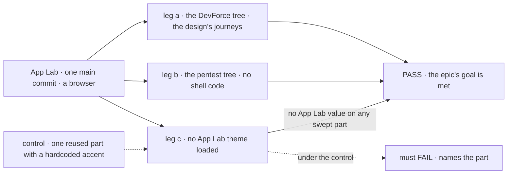
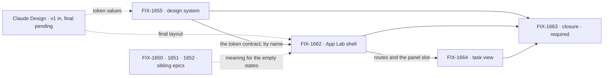

# FIX-1649 · Workforce lab shell: one app a Lab is used through, in one skin

**Spec** · [Decisions](DECISIONS.md) · [Rules](BUSINESS-RULES.md) · [Plan](PLAN.md) · [Docs](DOCS.md) · [Evolution](EVOLUTION.md)

Epic · three issues and a closure · Workforce App Lab · Goal 1, validate through real usage
([`docs/objectives.md`](../../../docs/objectives.md)) · [FIX-1649](https://linear.app/fixpoint-labs/issue/FIX-1649)
· Cycle 2 candidate, not Cycle 1

**The design: [`assets/design/DESIGN.md`](assets/design/DESIGN.md).** Claude Design's hand-back
v1 (three screens, Sep 30) fixes the structure this epic builds; each screen is walked through
beside the [wireframe](assets/wireframes/README.md) it replaced. It reads without the rest of this set.

## Four teams, before and after

| A team that… | Today | After this epic |
|---|---|---|
| **uses a Lab day to day** (the owner, dogfooding) | Has kitchen-sink, a teach surface, and the devtool, a debugger. Neither is where a Lab is used | Opens App Lab: what needs them, the projects and their workstreams, the teams and their workers, and a task's live session two clicks away |
| **builds the next Lab** (DevForce, then CyberForce) | Would write its own chrome, and reach channels, boards and runs its own way | Opens its Workforce tree in App Lab and writes no shell code ([D3](DECISIONS.md#d3)) |
| **reuses FSD UI in its own app** | Themes the navigator and panels through `--fsd-nav-*` and `--fsd-panel-*`; some `@flow-state-dev/ui` registry components use fixed palette colours rather than semantic tokens | One token set with neutral defaults skins every reused component; copies stay unedited |
| **owns a sibling horizon epic** (FIX-1650, 1651, 1652) | Needs a screen before anyone can see what it means | Fills a destination the shell already reaches |

**Why now.** Claude Design's first hand-back is in, and the structure it shows should be fixed
before anything is built. The build is a Cycle 2 candidate beside FIX-1650; Cycle PM schedules it.

## The goal, and how we'll know it's met

**A person can use a Workforce Lab from one app, reaching every surface the shell promises,
with reused FSD components in one skin that is not baked into FSD itself; and a second Lab
opens in the same shell with no shell code of its own.**

| Is it the right goal? | |
|---|---|
| **The real need** | Jake's PRD: app lab, design system, and nav across projects, workstreams, chat, attention and resources. The Architect's line: Labs share one app chrome and design system without a second product shell or new L1 nouns |
| **Smaller, and rejected** | "App Lab renders in the skin." FIX-1662 alone meets it, while a second Lab could still need its own chrome and a reused component could still carry App Lab paint in FSD |
| **Bigger, and not this epic's** | What projects, workstreams and attention *mean* (FIX-1650, 1651, 1652) · review and GitHub wake (FIX-1653) · the DevForce Lab product itself |
| **Not done if** | Every child is Done and the closure check hasn't run · a reused FSD component was restyled in App Lab, or a copy differs from its source · an App Lab skin value sits in an FSD package · a surface shows a model the shell invented · a Lab needs a wrapper, or opens with no org · final visuals merged before the final hand-back |

Leg c makes "not baked in" checkable; its control plants the failure it exists to catch.

| How we verify | |
|---|---|
| **Goal check** | The closure issue's goal check ([FIX-1663](https://linear.app/fixpoint-labs/issue/FIX-1663)), in a browser, on one `main` commit after every other child merges ([ER-12](BUSINESS-RULES.md#how-the-set-is-run)) |
| **Signal** | Leg a walks the design's two journeys from App Lab's first screen: **NEEDS YOU → the approval card** in its workstream's stream **→ Approve & run**, and the row leaves NEEDS YOU; **the project board → a task card → its Session**, with the task inspector beside it. Then every sidebar section, every tab at the three levels, the right panel at a workstream and at a task, and resources from Jump to are reached; a message to `@worker` in a workstream's composer arrives in that worker's session as a turn. Where FIX-1650 hasn't shipped projects, the project level passes on its named empty state and the second journey starts from the workstream's Board. Leg b: the second tree opens through FIX-1662's load path and reaches the same surfaces, with no shell code of its own. Leg c: with no App Lab theme loaded, computed styles on every swept part carry no App Lab value, and a static check finds none under `packages/` |
| **Input** | The DevForce lab's tree (`goals/devforce-lab/lab/workforce/`) with a real model, under a real org; for leg b, the pentest lab's tree (`goals/pentest-lab/lab/workforce/`), the nearest to CyberForce in the repo. Kitchen-sink's tree stands in for neither |
| **Anti-game** | No asserting on a child's own tests. No App Lab code that names the second tree. No swept part left out, and no copy out of sync with its source |
| **Control that must fail** | One reused component given a hardcoded App Lab colour: leg c must FAIL naming it. Today's `main`: legs a and b fail |

**Leg c's sweep, pinned once:** the `@flow-state-dev/react` chrome App Lab mounts (navigator,
roster, board panels, seat detail), every `@flow-state-dev/ui` registry component App Lab copies
in (the stream's cards, tool calls and diffs among them), and the devtool page the trace link
opens. FIX-1663's QA plan lists them by name.

## What's in the box

The screens are [the design](assets/design/DESIGN.md). Inside the box is one app and one skin;
the fence is the PRD's invent-kills, drawn where a shell epic would drift.

## The set · as of 2026-09-30

A dated snapshot. Live state is Linear and the implementation PRs.

| Issue | What it delivers | Why the set needs it | Status |
|---|---|---|---|
| [FIX-1655](https://linear.app/fixpoint-labs/issue/FIX-1655) · design system | The token set's neutral defaults beside the components; a private package with the App Lab theme in light and dark, mapped onto the existing contracts; skin gaps fixed at the source; the re-sync check | The skin, and the proof it isn't paint on FSD ([D2](DECISIONS.md#d2)) | Todo · spec route (no Kind label, defaults to spec) |
| [FIX-1662](https://linear.app/fixpoint-labs/issue/FIX-1662) · App Lab shell | `labs/app-lab` over a Lab's tree, org required: the sidebar, the routes and the right panel's slot; the project and workstream levels with their tabs and the workstream's panel; empty states for what siblings haven't shipped | The substance: where a Lab is used ([D1](DECISIONS.md#d1)) | Backlog · spec route |
| [FIX-1664](https://linear.app/fixpoint-labs/issue/FIX-1664) · task view | The task level inside FIX-1662's frame: Session, Diff, Checks and Brief; Interrupt, Hand off, Open PR; the composer's turn; the task inspector | Where a person watches and steers one worker ([D1](DECISIONS.md#d1)) | Backlog · spec route · blocked by FIX-1662 |
| [FIX-1663](https://linear.app/fixpoint-labs/issue/FIX-1663) · closure · **required** | The QA plan and runs on one `main` commit | Proves the whole | Backlog · blocked by FIX-1655, FIX-1662, FIX-1664 |

The design system has consumers beyond App Lab, so it is its own issue; why the shell splits at
the task level and nowhere else is [D1](DECISIONS.md#d1).

## How the issues flow into each other

Dashed edges are inputs from outside the set: the final hand-back gates final visuals only
([ER-9](BUSINESS-RULES.md#how-the-set-is-run)), and the siblings gate nothing (they feed
FIX-1664's empty states the same way). FIX-1662 names FIX-1655's tokens in its spec but does not
wait for its merge; FIX-1664's spec runs beside FIX-1662's, and its build merges after it. The
closure waits on all three.

## What stays as it is

- **Kitchen-sink** stays the teach surface, and the **devtool** stays the debugger; App Lab
  links the devtool's trace rather than rebuilding it.
- **The wireframes** stay in [`assets/wireframes/`](assets/wireframes/README.md) as the history
  of what went to Claude Design; the hand-back replaced them as structure.
- **The theme contracts** (`--fsd-nav-*`, `--fsd-panel-*`, the registry's semantic tokens) and
  the registry's copy-in distribution: used, not replaced ([EVOLUTION.md](EVOLUTION.md)).
- **Related, deliberately not children:** FIX-1650 to 1652 (what the destinations mean) ·
  FIX-1653 (review and GitHub wake) · FIX-1637 (wake spine, a docs pointer only) · FIX-1455
  and FIX-1592 (kitchen-sink) · FIX-1407, FIX-1442 · the DevForce Lab product.

## Sign off

**[The goal](#the-goal-and-how-well-know-its-met), at that size:** every surface reached, one
skin not baked into FSD, a second Lab with no shell code. If wrong: we ship a shell only App
Lab can use, or skin FSD in App Lab's colours.

1. **[D1](DECISIONS.md#d1) · Three issues and a closure: the shell splits at the task level
   (FIX-1664); the shell owns reach and look, the siblings own meaning.** If wrong: one more
   seam than the work needs, and FIX-1664 folds back into FIX-1662 at its spec.
2. **[D2](DECISIONS.md#d2) · One skin through the contracts FSD components already have: the
   chrome imported from `react`, registry components copied in and never restyled.** If wrong:
   the skin can't reach a look Claude Design asks for without changing a component's public API.

3. **[D3](DECISIONS.md#d3) · One app that opens any Lab; a Lab is the Workforce tree it
   opens.** Decided by Jake on Sep 30. If wrong: DevForce or CyberForce must ship as separate
   products, and extracting the chrome into a package is about one issue.

**Open: none.** Rules: [BUSINESS-RULES.md](BUSINESS-RULES.md).
Order, and where the hand-back sits: [PLAN.md](PLAN.md).
