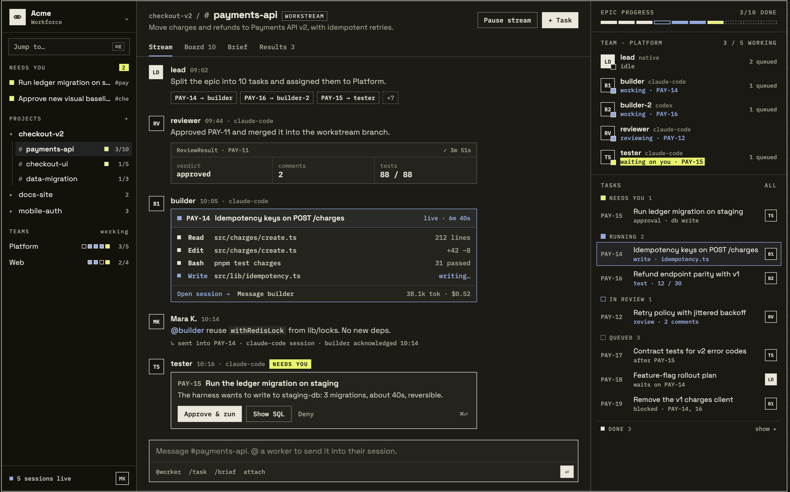
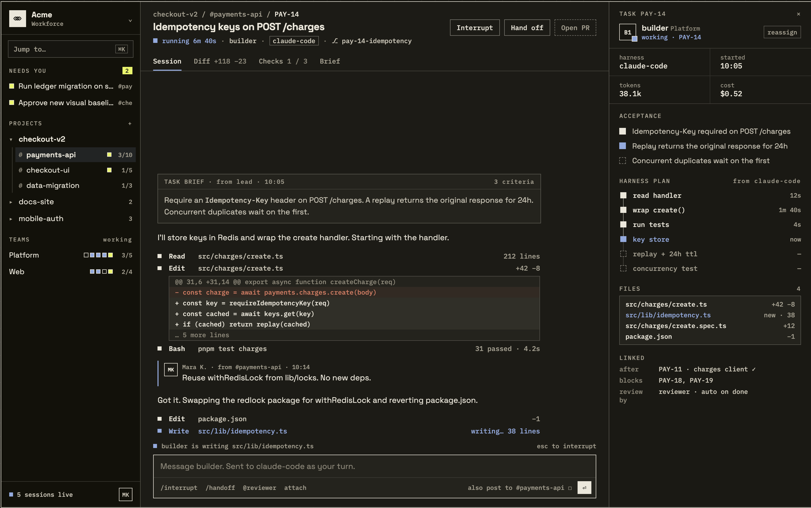
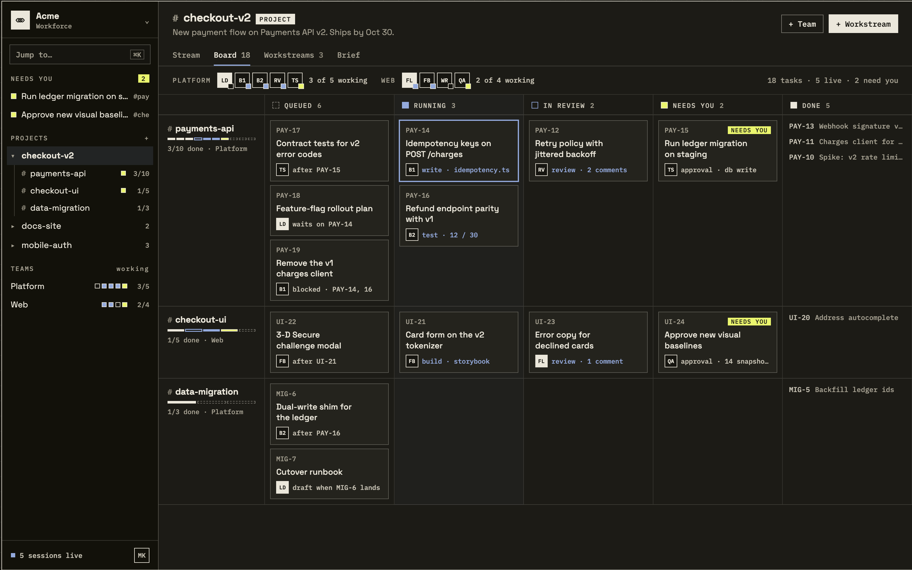
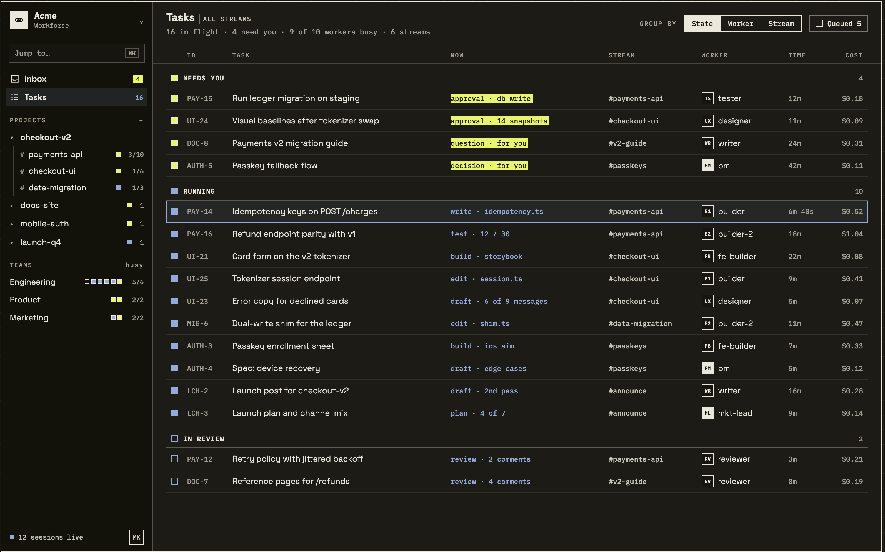
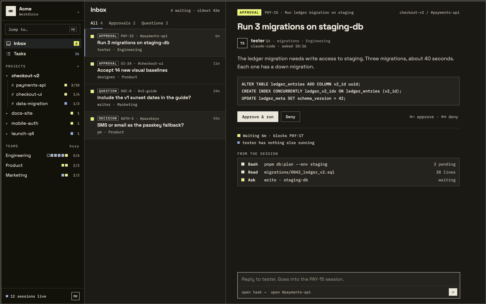

# App Lab: how each screen works

Epic FIX-1649 · Workforce lab shell · 2026-09-30

> **The final hand-back is [v2](v2/README.md)** (design pass 2, 2026-10-01). It is the look:
> Shift Manager's theme values come from it. Its structure differs from what this file
> describes (Chief of Staff, Roster, fewer tabs). The
> [v2 amendment](../../EVOLUTION.md#amendment--2026-10-01--design-v2s-structure) adopts Chief of
> Staff, Roster and TEAMS as status squares; v2's removed tabs do not join, so the rest of the
> structure below stands. v2's
> README says, item by item, what it drew from §9.

This file shows the five low-fidelity wireframes and your five Claude Design screens together, and says how each screen behaves. **Where the two differ, your Claude Design screens win.** The wireframes are the starting point, kept as history; the spec on [#2421](https://github.com/fixpoint-labs/flow-state-dev/pull/2421) now fixes the structure your screens show ([`../../SPEC.md`](../../SPEC.md)).

Throughout this file:
- **The shell owns** where a thing sits, how you get to it, and how it looks.
- **The sibling epics own** what the thing *means*: FIX-1650 org primitives (projects, workstreams), FIX-1651 eng workstream kit (tasks, their states and what each is doing now, board, brief, results), FIX-1652 attention & inspect (what counts as an ask, its kinds, approve and deny, harness visibility). Time and cost come from the session and run data that already ships.
- When a sibling hasn't shipped yet, the shell still shows the place, with a named empty state ("No workstreams yet…"). It never invents data.

---

## 1 · The frame: sidebar, centre, right panel

Your design keeps three columns:

| Column | What it does |
|---|---|
| **Sidebar** (left) | Where you are and what needs you. Always visible. |
| **Centre** | The thing you opened: a project, a workstream or a task, with tabs across the top; or one of the two lists, Inbox or Tasks. |
| **Right panel** | Context for whatever is open. It changes with the centre (see sections 3 and 4). |

**What changed from the wireframe:** the thin nav rail (PROJ / WORK / CHAT / ATTN / RES) is gone. Its job moved into the sidebar tree, so there is one column of navigation, not two.

---

## 2 · The sidebar

Top to bottom, as your design has it:

1. **Org switcher** (Acme · Workforce). Picks which org's Workforce you're looking at. Every Lab opens under an org; there's no org-less mode.
2. **Jump to… ⌘K.** Search across projects, workstreams, tasks, workers. This is also where **resources** live until your next design pass gives them a home.
3. **Inbox** with a yellow count (4). Everything a worker has asked you and is waiting on. Opens the Inbox screen (section 7).
4. **Tasks** with a count (16). Every task in flight, across all streams. Opens the Tasks screen (section 6).
5. **PROJECTS.** A tree: project, then its workstreams as `#channels`, each with progress (3/10) and a yellow dot when something in it needs you.
6. **TEAMS.** Each team with how many workers are busy. **Your fix: each team expands to list its workers underneath** (seat name, harness such as claude-code or codex, and status: working, idle, waiting on you). Clicking a worker opens what it's working on.
7. **Footer.** "N sessions live" and you.

Inbox and Tasks are fixed: they stay directly under Jump to whatever you have open. **They replace the NEEDS YOU section** the first three screens had.

**States (from the wireframe):** each section fails on its own with a Retry. One failed read never blanks the rest of the sidebar. Empty sections say so in a sentence ("No projects yet").

---

## 3 · Workstream: the Stream tab (the main screen)

This is where you spend most of your time. A workstream (`#payments-api`) is a channel plus the work flowing through it.

**Header:** breadcrumb (checkout-v2 / #payments-api), the workstream's one-line goal, **Pause stream**, **+ Task**.

**Tabs:** Stream · Board · Brief · Results. The tab is part of the URL, so a link opens the same view.

**The Stream** is a conversation where the workers post as they work. Each post can carry a card:
- **Task assignment.** The lead splits work and shows who got what (PAY-14 → builder).
- **Review result.** The verdict, comment count and tests passed.
- **Live session.** A worker's current task with its tool calls as they happen (Read, Edit, Bash, Write), tokens and cost. **Open session →** goes to the task screen (section 4). **Message builder** talks to that worker directly.
- **Approval.** A worker needs you ("Run the ledger migration on staging"): **Approve & run**, **Show SQL**, **Deny**. The same ask is in Inbox, drawn the same way.
- **Your messages.** Type in the composer; `@builder` sends it *into that worker's session*. The stream shows it was delivered and acknowledged.

**Composer shortcuts:** `@worker`, `/task`, `/brief`, attach.

**The other tabs** (from the wireframe, not yet drawn by Claude Design):
- **Board:** this workstream's tasks by state.
- **Brief:** the document the work started from, plus "done when".
- **Results:** what the work produced: PRs, artifacts, verdicts.

**Right panel at a workstream:**
- **Epic progress:** segmented bar, 3/10 done.
- **Team:** each worker with its harness, what it's on, and its queue. "Waiting on you" is highlighted.
- **Tasks:** grouped as NEEDS YOU, RUNNING, IN REVIEW, QUEUED, DONE, each with the worker's badge.

---

## 4 · Task: the Session tab

Opening a task (PAY-14) shows one worker doing one piece of work. The task screen is built as its own issue, FIX-1664, inside the frame FIX-1662 builds.

**Header:** the task title; status (running 6m 40s), worker, harness, and branch. Actions: **Interrupt**, **Hand off** (to another worker), **Open PR**.

**Tabs:** Session · Diff · Checks · Brief.

**Session** is the worker's live transcript:
- the task brief it got (with the acceptance criteria);
- its narration ("I'll store keys in Redis…");
- each tool call, with inline diffs for edits and pass counts for test runs;
- your messages, which arrive as a turn in its session.

The composer here talks to the worker directly, with an option to also post to the workstream. **Esc** interrupts.

**Right panel at a task** (this replaces the wireframe's "run inspector"):
- worker and team, with **reassign**;
- harness, start time, tokens, cost;
- **Acceptance:** each criterion, ticked as it's met;
- **Harness plan:** the worker's steps with timings;
- **Files** changed;
- **Linked:** what it comes after, what it blocks, who reviews it.

The inspector's four states from the wireframe still apply: nothing selected, running, waiting on you, finished. A lead/EM worker shows its asks and dispatches, never tool calls, because it doesn't use a harness. The full trace stays in the devtool, one link away.

---

## 5 · Project: the Board tab

A project (checkout-v2) groups several workstreams toward one outcome ("Ships by Oct 30").

**Header:** project name and goal. **+ Team**, **+ Workstream**.

**Tabs:** Stream · Board · Workstreams · Brief.

**Board:**
- **Team strip** across the top: each team's workers as badges, with how many are working.
- **One row (swimlane) per workstream,** with its progress and team.
- **Columns:** QUEUED · RUNNING · IN REVIEW · NEEDS YOU · DONE.
- **Cards** show the task, its worker, and its state in words ("blocked · PAY-14, 16", "approval · db write"). NEEDS YOU cards are tagged in yellow.
- Clicking a card opens the task (section 4).

A project is optional. A Lab with no projects still opens, showing its workstreams directly.

---

## 6 · Tasks: everything in flight

One list of every task, across every stream. Use it to see what the whole Lab is doing without opening each workstream.

**Header:** "Tasks · ALL STREAMS" and a summary line: 16 in flight · 4 need you · 9 of 10 workers busy · 6 streams.

**Controls:**
- **Group by** State, Worker or Stream.
- **Queued (5)** shows or hides the tasks that haven't started.

**Columns:** ID · TASK · NOW · STREAM · WORKER · TIME · COST.
- **NOW** says what the task is doing in words: "approval · db write", "test · 12 / 30", "edit · session.ts". Asks are tagged in yellow.
- **WORKER** is the worker's badge and seat.
- **TIME** and **COST** come from the task's session and runs.

**Grouped by State**, the groups are NEEDS YOU (yellow), RUNNING, IN REVIEW, and QUEUED when that toggle is on, each with a count.

**Clicking a row opens the task** (section 4). There is no right panel; the list takes the full width.

What a state means and what NOW says come from FIX-1651. Until it ships, a column it would fill shows a named empty state, never a guess.

---

## 7 · Inbox: what waits on you

Everything a worker has asked you, in one place. Three panes: the sidebar, the list, and the item you picked.

**The list:** "Inbox · 4 waiting · oldest 42m", with tabs **All · Approvals · Questions**, each with a count. Each item shows:
- its kind: APPROVAL, QUESTION or DECISION;
- the task id, the `#stream` and how long it has waited;
- its title, and the worker and team who asked.

**The detail pane** (the right side, for the selected item):
- the kind, the task and where it lives (checkout-v2 / #payments-api);
- the title, and the worker: seat, role, harness, and when it asked;
- the worker's explanation, and what it wants to do (for an approval, the SQL);
- **Approve & run** and **Deny**, or ⌘⏎ and ⌘⌫;
- what waiting costs: "Waiting 6m · blocks PAY-17", "tester has nothing else running";
- **From the session:** the worker's last few tool calls, ending at the ask;
- a composer: "Reply to tester. Goes into the PAY-15 session." Your reply lands in that worker's session, the same as a message from the task screen. **open task →** and **open #payments-api** take you to where the ask lives.

**The detail pane draws an ask the same way the stream's approval card does.** One ask, one look, wherever you meet it. Answer it in either place and it leaves both.

What counts as an ask, which kinds there are, and what Approve and Deny do all come from FIX-1652. The shell only places them.

---

## 8 · The five destinations, and where each went

The wireframe had five fixed destinations. In your design they became the tree, the tabs, and two fixed lists:

| Destination | Now |
|---|---|
| Projects | The PROJECTS tree, and the project screen (section 5) |
| Workstreams | `#channels` under each project (section 3) |
| Chat | The workstream Stream and its composer |
| Attention | **Inbox** (section 7), plus the NEEDS YOU states on boards and in Tasks |
| Tasks (new) | **Tasks** (section 6): every task in flight, across streams |
| Resources | **No home yet.** Reachable from Jump to until the next design pass places it |

---

## 9 · What the next design pass should cover

Pass 2 has come back: [v2/README.md](v2/README.md#the-pass-2-open-list-item-by-item) answers each item below.

- **Where resources live** (engineering handbook, feature briefs and so on).
- **The light theme.** The ticket's brutalist beige / black / yellow. These screens are the dark variant.
- **Teams with workers listed underneath** (your correction).
- **Tabs not drawn yet:** workstream Board / Brief / Results; project Stream / Workstreams / Brief; task Diff / Checks / Brief.
- **Empty, loading and failed states** in the new visual language.
- **The right panel at a project.** Your board screen has none; say whether the board keeps the full width.
- **Narrow screens:** what collapses first.
- **Tasks grouped by Worker or by Stream.** Only State is drawn.
- **Finished tasks.** Tasks shows what's in flight; say whether done tasks get a place in it.
- **Inbox when nothing waits,** and the Tasks screen with nothing running.

Everything above is structure the epic now fixes. Colours, type, spacing and proportions stay Claude Design's call.
