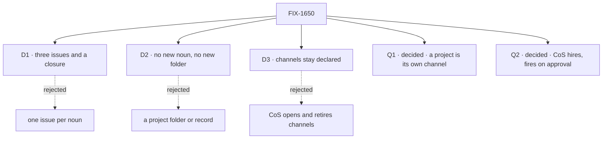

# FIX-1650 · Decisions

[Spec](SPEC.md) · **Decisions** · [Rules](BUSINESS-RULES.md) · [Plan](PLAN.md) · [Docs](DOCS.md) · [Evolution](EVOLUTION.md)

The calls above any single issue. D1 to D3 are the sign-off surface. Q1 and Q2 are answered
(Jake, 2026-10-01). Scope,
vocabulary and invent-kills come from the Architect's guidance on FIX-1650; the prior locks on
the open forks are only these: `workforce/projects/` is invent-killed, single-user comes first,
project is product framing, and the org seat is composed from the existing seat and kind
registers.

## The tree

## D1 · Three issues and a closure; only the two the open questions touch wait

| | |
|---|---|
| **Instead of** | One issue per noun: project, workstream, CoS, repair · or filing nothing until Jake answers |
| **Because** | A workstream already is a declared channel with its boards: Shift Manager lists them today, so it needs a rule, not an issue. The CoS seat and its hire and fire policy are one template, so they are one spec. Orphan repair (FIX-1621, adopted) needs no answer from Jake and CoS consumes it, so it is the issue that starts at the gate. It stays apart from CoS's fire for that reason only: the two share one mutation path ([ER-19](BUSINESS-RULES.md#what-a-team-gets-and-what-it-doesnt)) |
| **Locks in** | FIX-1621 starts at the gate. FIX-1718's spec starts when Q1 is answered and FIX-1719's when Q2 is (both answered 2026-10-01, [Q1](#q1), [Q2](#q2)). The workstream's definition is FIX-1718's to write ([ER-2](BUSINESS-RULES.md#what-a-team-gets-and-what-it-doesnt)) |

**What would change my mind:** Q2's answer giving CoS behaviour of its own (routing asks,
standing reports). Then that behaviour splits from FIX-1719, as FIX-1726 now carries it.

It comes down to what waits on Jake: three lets repair start, five parks four issues.

## D2 · Project and workstream are product framing over what the tree already holds; nothing new in L1, no new folder

| | |
|---|---|
| **Instead of** | A project folder or record of its own (`workforce/projects/`, invent-killed) · a Workstream type beside channels and boards |
| **Because** | The shell needs a grouping and four reads (stream, board, workstreams, brief); channels, their boards, their charters, teams and documents already carry all of them. Workforce is Layer 2: Agent, Team, Channel and Project stay out of core and engine |
| **Locks in** | Q1 is answered inside channels, teams, boards and documents. An answer that needs a folder or an L1 type is an escalation back to this epic, not a child's call. At most a key is added to `CHANNEL.md`'s closed list |

**What would change my mind:** a project that must own something no channel, team or document
can hold, such as a budget or a membership separate from its workstreams.

It comes down to a new noun: a folder of its own reopens an invent-kill.

## D3 · Channels stay declared in this epic: no runtime open, retire or invite

| | |
|---|---|
| **Instead of** | CoS opening and retiring workstream channels at runtime |
| **Because** | Hire and fire ride a shipped capability (`createSeatHireCapability`). Channel admin was explored (FIX-1415, #2084), not shipped, and parked behind Collab mint (FIX-1341), with the Architect's fence: no worker-facing channel-admin tools until Collab and the inventory land. "Channels" in the PRD's CoS + Ops line reads, here, as CoS reading them |
| **Locks in** | A new workstream is a `CHANNEL.md` and a restart. CoS never writes a channel in this epic ([ER-3](BUSINESS-RULES.md#what-no-child-may-do)) |

**What would change my mind:** Jake wanting CoS to open workstreams in the first version. Then
this epic waits on FIX-1341 being un-parked, and that is his scheduling call.

It comes down to what exists: hire ships, channel admin is a parked explore.

## Q1 · decided · a project is a channel of its own

**Jake, 2026-10-01**, in the project thread (19:57Z): "A project is a channel session." That
is the project channel, the recommendation below: a channel's charter is the project brief, its
conversation is the project stream, and workstream channels name their project with one new key
on `CHANNEL.md`. FIX-1718's spec starts from it ([ER-1](BUSINESS-RULES.md#what-a-team-gets-and-what-it-doesnt)).

He refined it two minutes later (19:59Z):

> A project (or channel) should be a durable resource everyone in the Lab can discover and act
> on. The flow session is the person's (or seat's) live handle onto that resource — membership,
> wake surface, unread, "I'm in this room." Treating the session itself as the discoverable
> thing mixes directory with runtime and forces every consumer to invent the same join.
>
> Practical fence: resource owns identity and org policy; session owns participation and
> runtime; link is explicit (resourceId on the session / sessions listed on the resource). Don't
> make the session the resource, and don't invent a second project store beside channels.

**What it settles.** A project is a channel resource: durable, and discoverable by everyone in
the Lab. Sessions are participation handles onto it, linked explicitly. There is no second
project store.

The question as it was put to him, kept as the record:

**The question.** What is a project: a channel of its own, a team, or a named pack of channels?

**In plain terms.** Shift Manager shows a project with a stream, a board, its workstreams and
a brief. Something in the Lab's files has to say which workstreams belong to which project, and
where its stream and brief come from. Nothing does today.

**The trade-off.** A **project channel**: a channel whose charter is the brief and whose
conversation is the project stream, which its workstream channels name. Stream and brief come
for free, and one team can work on several projects; the cost is one new key on a workstream's
`CHANNEL.md`. A **team**: a project is a team folder, its `TEAM.md` the brief, its channels the
workstreams. Nothing new, but a team has no conversation of its own, and a second project needs
a second team of the same people. A **pack**: a key that groups channels by name. Teams can
span projects, but there is no stream, and the brief needs a document.

**My recommendation:** a project channel. It is the only option where the project stream is a
real conversation the CoS can post to, and it keeps teams free to work across projects, as
DevForce's design (D-12) already assumes.

**What would change my mind:** if you think of a project as one team's body of work, one team
per project. Then a team is simpler and adds nothing.

**What being wrong costs:** about one issue's rework (FIX-1718), no stored data: the link is a
key in `CHANNEL.md` files. None of the three needs a folder or an L1 type, so none is an
escalation.

It comes down to the project stream: only a channel already has a conversation.

## Q2 · decided · CoS alone, opt-in; it hires without asking and fires on approval (seat set pending Jake's confirmation)

**Jake, 2026-10-01**, on the epic PR
([#2602](https://github.com/fixpoint-labs/flow-state-dev/pull/2602#issuecomment-5937962361)):
"I think For now, ops can just hire without asking."

**What it settles.** The hiring seat hires when asked, with no Inbox approval, and the person sees it
in TEAMS. The fences on that hire are unchanged: a kind the Lab registers, never an org seat,
never a declared seat's id, landing in the principal's own cell ([ER-4](BUSINESS-RULES.md#what-a-team-gets-and-what-it-doesnt),
[ER-7](BUSINESS-RULES.md#what-a-team-gets-and-what-it-doesnt)). Undoing a wrong hire is
one approved fire.

**Where his words don't reach, my defaults as EM.** Each is one line from Jake to reverse.

- **The seat set is CoS alone** (Jake, later on Oct 1, relayed on
  [#2613](https://github.com/fixpoint-labs/flow-state-dev/pull/2613#issuecomment-5939127612),
  being confirmed with him): no Ops seat. CoS, declared under `org/workers/` on the `agent` kind
  and opt-in per Lab, holds hire and fire; other seats ask it by message.
- **Fire and retire still ask in Inbox.** A fire removes the seat's inventory row
  ([ER-19](BUSINESS-RULES.md#what-a-team-gets-and-what-it-doesnt)), the hard-to-undo
  direction, so the approval stays there ([ER-20](BUSINESS-RULES.md#what-a-team-gets-and-what-it-doesnt)).
- **"For now" is a policy, not a missing part.** Asking before a hire can come back later; how
  is [ER-20](BUSINESS-RULES.md#what-a-team-gets-and-what-it-doesnt)'s.

**What it costs.** A model picks who joins, inside the fences. Tightening later means looking
over the seats CoS hired, which is the price the recommendation named.

It comes down to the friction on a hire: none now, and every fire still asks.

## Who owns what

The matrix holds ER-1 to ER-9, ER-19 and ER-20. ER-10 to ER-18 are fences and process that bind
every child alike, so they sit outside it.

Every rule has one owner. FIX-1621 decides what an orphan is, so CoS calls its read rather than
writing a second detector. FIX-1718 decides what a project and a workstream are, so CoS joins a
project's channel the way FIX-1718 defines it. The closure only checks.

## Decided in review, recorded so no child reopens them

- **FIX-1621 joins the set** as a child, moved into this project. It is the "fire" half of the
  CoS + Ops defaults, and leaving it out would give the hiring seat a second orphan detector. Its own open walls
  (template or documented, delete-only or guided re-hire, banner or Ops seat) are answered by
  Q2 where Q2 reaches and by its spec otherwise.
- **Single user, one org per Lab run, from the principal.** No org id in a request body; nothing
  multi-user is built.
- **FIX-1715, FIX-1716 and FIX-1717 are not children.** The first two are Workforce EM's
  parallel tracks; FIX-1717 is a Claude thread's.
- **A fired seat leaves TEAMS.** Today `fire` keeps the seat's inventory row, a shipped behaviour
  this set changes. FIX-1621 owns the change and CoS fires through the same path
  ([ER-19](BUSINESS-RULES.md#what-a-team-gets-and-what-it-doesnt)).
- **An org seat is not hireable today (settled, REFUTED).** Read-based on `origin/main`, not
  executed: the declared roster reader is teams-only and passes over `org/workers/`
  (`read-workforce-directory.ts:14-16`; `resource-walk.ts` walks it for resources only), and
  seat-hire never reads a `WORKER.md` (`hire` takes `seatId`, `flow`, `settings`,
  `instructions`). FIX-1719 closes both halves in Layer 2: the reader lists org seats with no
  team, and either the seat factory boots them or `hire` names the declared seat. Which half is
  FIX-1719's first design question.
- **Q2 is answered** (Jake, 2026-10-01): CoS is the one admin seat and hires without asking; fire and retire still ask
  in Inbox. The answer and the defaults I picked around it are [Q2](#q2).
- **Q1 is answered** (Jake, 2026-10-01, the project thread): "A project is a channel
  session." A project is a channel of its own, and its workstreams name it by one key on
  `CHANNEL.md`. He refined it the same day:

  > A project (or channel) should be a durable resource everyone in the Lab can discover and act
  > on. The flow session is the person's (or seat's) live handle onto that resource — membership,
  > wake surface, unread, "I'm in this room." Treating the session itself as the discoverable
  > thing mixes directory with runtime and forces every consumer to invent the same join.
  >
  > Practical fence: resource owns identity and org policy; session owns participation and
  > runtime; link is explicit (resourceId on the session / sessions listed on the resource). Don't
  > make the session the resource, and don't invent a second project store beside channels.

  So a project is a channel resource; sessions are participation handles with an explicit link;
  there is no second project store. FIX-1718's spec starts from it; the answer is [Q1](#q1).
- **No team named `org`.** An org seat in a `teams/org/` team would need no loader change, and
  forks the locked tree (`workforce/org/{resources,skills,channels,workers}/`). Rejected.

## What the end-state POC showed

No end-state POC. One claim was settled by a read-based check instead; its verdict is in
[Decided in review](#decided-in-review-recorded-so-no-child-reopens-them).

## How it got here

- **Drafted (Oct 1)** from the Architect's guidance on FIX-1650, FIX-1649's ownership amendment
  (#2423) and the shipped code; FIX-1718, FIX-1719 and FIX-1720 filed, FIX-1621 adopted. Q1 and
  Q2 opened for Jake with recommendations.
- **Review round 1 (Oct 1).** Q2 reshaped to org seats under the locked tree, made hireable in
  Layer 2 and fenced to the principal's cell; ER-19 (fire removes the row) and ER-20 (the
  approval) added; the org-seat claim settled.
- **Merged (Oct 1)** with Q1 and Q2 open.
- **Q2 answered (Oct 1)** by Jake, recorded by an amendment: Ops hires without asking. Fire stays
  on approval as my default. ER-4, ER-20, the goal's leg b and its control, and the figures
  that stated every-hire approval follow it.
- **Ops dropped (Oct 1)**: CoS is the one org admin seat and the only hire door; fire still asks.
  ER-4, ER-6, ER-20, Q2, the goal's leg b and the figures follow it; FIX-1719's spec carries
  the detail. Pending Jake's direct confirmation.
- **Q1 answered (Oct 1)** by Jake, recorded by an amendment: a project is its own channel.
  FIX-1718's spec no longer waits; ER-1, ER-14, the plan and the figures that showed it waiting
  follow it.
