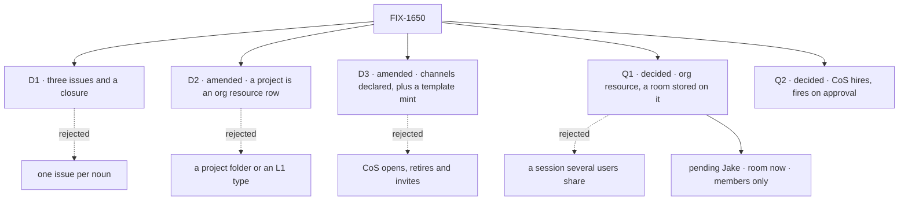

# FIX-1650 · Decisions

[Spec](SPEC.md) · **Decisions** · [Rules](BUSINESS-RULES.md) · [Plan](PLAN.md) · [Docs](DOCS.md) · [Evolution](EVOLUTION.md)

The calls above any single issue. D1 to D3 are the sign-off surface. Q1 and Q2 are answered
(Jake, 2026-10-01), and Q1's answer amends D2 and D3, which Jake confirmed ("Amend now"). Q1's
talk shape is a shared room stored on the project (the FIX-1729 spike); two calls inside it,
building the room now and keeping it members only, are [pending Jake](#pending) on my
recommendations. Scope, vocabulary and invent-kills
come from the Architect's guidance on FIX-1650; the prior locks on the open forks are only
these: `workforce/projects/` is invent-killed, single-user comes first, project is product
framing, and the org seat is composed from the existing seat and kind registers.

## The tree

## D1 · Three issues and a closure; only the two the open questions touch wait

| | |
|---|---|
| **Instead of** | One issue per noun: project, workstream, CoS, repair · or filing nothing until Jake answers |
| **Because** | A workstream already is a declared channel with its boards: Shift Manager lists them today, so it needs a rule, not an issue. The CoS seat and its hire and fire policy are one template, so they are one spec. Orphan repair (FIX-1621, adopted) needs no answer from Jake and CoS consumes it, so it is the issue that starts at the gate. It stays apart from CoS's fire for that reason only: the two share one mutation path ([ER-19](BUSINESS-RULES.md#what-a-team-gets-and-what-it-doesnt)) |
| **Locks in** | FIX-1621 starts at the gate. FIX-1718's spec starts when Q1 is answered and FIX-1719's when Q2 is (both answered 2026-10-01, [Q1](#q1), [Q2](#q2)). The workstream's definition is FIX-1718's to write ([ER-2](BUSINESS-RULES.md#what-a-team-gets-and-what-it-doesnt)) |

**What would change my mind:** Q2's answer giving CoS behaviour of its own (routing asks,
standing reports). Then that behaviour splits from FIX-1719, as FIX-1726 now carries it.

It comes down to what waits on Jake: three lets repair start, five parks four issues.

## D2 · amended · A project is a row in the org resource plane; nothing new in L1, no new folder

| | |
|---|---|
| **Instead of** | A project folder (`workforce/projects/`, invent-killed) · an L1 Project or Workstream type · a project kept in a channel's files or in a session's state |
| **Because** | Jake, 2026-10-01: projects are data-driven org resources, generally created by CoS. The org resource plane already holds runtime rows every flow in a Lab's org can read (the hired roster is one), and `workforce/org/resources/` already declares such collections, so a row needs no new substrate. FIX-1728 ran it on today's L1 ([#2629](https://github.com/fixpoint-labs/flow-state-dev/pull/2629)). Workforce is Layer 2: Agent, Team, Channel and Project stay out of core and engine |
| **Locks in** | A project is one row in the `projects` collection, and the row is the only home of its data. Workstreams stay declared channels ([ER-2](BUSINESS-RULES.md#what-a-team-gets-and-what-it-doesnt)). An answer that needs a folder or an L1 type is an escalation back to this epic, not a child's call. At most one key is added to `CHANNEL.md`'s closed list: `mintFor:` |

**What would change my mind:** projects that must be written by hand in the tree rather than
created by CoS. Then a tree seed writes rows into the same collection, and nothing else moves.

It comes down to new substrate: a row rides the plane the roster already uses.

## D3 · amended · Channels stay declared; the one runtime move is minting a talk session from a template

| | |
|---|---|
| **Instead of** | CoS opening, retiring, inviting to or renaming channels at runtime · or no runtime move at all, which leaves FIX-1718 no project to show once projects are runtime data |
| **Because** | Hire and fire ride a shipped capability (`createSeatHireCapability`). Channel admin was explored (FIX-1415, #2084), not shipped, and parked behind Collab mint (FIX-1341), with the Architect's fence: no worker-facing channel-admin tools until Collab and the inventory land. Minting a talk session when a project row is created, and when a person joins, runs on shipped L1 (`reactTo.created`, a cross-flow `dispatcher`, session state); FIX-1728 ran both. Retire, invite and rename are what FIX-1341 parked, and they stay there. This slice is the first instance of FIX-1341's dynamic-room lane |
| **Locks in** | Declared channels stay boot-opened and unchanged; a new workstream is a `CHANNEL.md` and a restart. A talk session is opened at runtime only by minting from a template, on create or on join ([ER-3](BUSINESS-RULES.md#what-no-child-may-do)). CoS creates project rows; it never opens, retires, invites to or renames a channel |

**Decided with Jake:** he chose to amend now rather than wait for Collab (FIX-1341)
([2](#pending-2)). **What would change my mind:** Collab redesigning rooms before FIX-1718
builds; then the slice folds into it.

It comes down to what exists: mint and join run on shipped L1, channel admin is a parked explore.

## Q1 · decided · a project is an org resource, and its members talk in one room stored on it

**Jake, 2026-10-01**, in the project thread: projects are data-driven org resources, generally
created by CoS, and a talk channel is about the project, never the project itself. "We need to
spike on FIX-1728 before we can move forward with the specs." The spike ran the shape on
today's L1 and needed no L1 change
([`specs/spikes/FIX-1728/SPIKE.md`](https://github.com/fixpoint-labs/flow-state-dev/blob/fbae60365b27929f86ea9446850554d49da5b5e4/specs/spikes/FIX-1728/SPIKE.md),
[#2629](https://github.com/fixpoint-labs/flow-state-dev/pull/2629): 3 of 3 pass, and the
control goes red). A second spike, on a shared project room, followed
([`specs/spikes/FIX-1729/SPIKE.md`](https://github.com/fixpoint-labs/flow-state-dev/blob/73aa7383860f7c85d44b29c2cb494c1cbb5745d8/specs/spikes/FIX-1729/SPIKE.md),
[#2632](https://github.com/fixpoint-labs/flow-state-dev/pull/2632): 3 of 3 pass, and both
controls go red).

**What it settles.** A project is a row in an org-scoped collection declared once at
`workforce/org/resources/projects.ts` (ref `projects`). The row is the only home of the
project's durable data: title, status, owner, links, its `members`, and the list of its talk
sessions. CoS creates rows at runtime with `create()` through a `createProject` action that
FIX-1718 builds and wires onto the CoS seat FIX-1719 boots, and anyone in the Lab's org can
list them. `members` is written only by trusted code: CoS at create, and later a member's invite,
which is an edit to the row, not a channel invite under ER-3.

The project's conversation is **one room stored on the project**, in Layer 2. Each line is a row
in a new org collection, `room-lines` (`projectId`, `seq`, `userId`, a seat's `author`, `body`),
created and never edited. Lines are ordered by a per-project sequence whose counter sits on a
row of its own, so editing the project never contends with a post. A line's `userId` is the
poster's session owner as the engine recorded it, never a field the caller sends.

Each person reaches the room through **their own talk session**, minted from one template: a
`CHANNEL.md` that declares `mintFor: projects`, which is a shape and is not opened at boot.
Creating a row mints the creator's talk session in the same turn (a `reactTo.created` binding
the binder installs, dispatching to the channel kind's internal `bind` entry). A member who
has no talk session yet calls `join`, which mints theirs. A talk session is keyed by the
project and the person, not by the caller's session, so a second window adopts the existing one
([ER-27](BUSINESS-RULES.md#what-no-child-may-do)). The row records whether it is bound, and if
the create-time reaction fails after the row commits, an idempotent re-bind on read, on join or
on CoS's retry completes it ([ER-28](BUSINESS-RULES.md#what-no-child-may-do)). The session reads the room
(`read { after }` a cursor of its own) and posts to it, and both are refused unless the
session's owner, as the engine recorded it, is in the row's `members`. Membership is never read
from session state or a request body. The link stays explicit and two-sided: `resourceId` in
the talk session's state and `sessions: [{ sessionId, userId }]` on the row, both written by
`bind`. `resourceId` only says which project the session is about; it grants nothing
([ER-23](BUSINESS-RULES.md#what-no-child-may-do)). One person alone in a room is the
single-user case, so there is no separate per-person thread and nothing to migrate later. No
engine session is shared between users, and no project field lives in session state.

**Option A is rejected.** A session several users own breaks "a session belongs to one person",
which the engine enforces at seven sites and in the request-scope filter its snapshot and stream
use. Building it is size L, 4 to 6 PRs, all on the auth surface, and it would make access depend
on a hook each app writes. The room needs none of it.

**The fence it keeps** (Jake, 19:59Z, which still holds):

> Practical fence: resource owns identity and org policy; session owns participation and
> runtime; link is explicit (resourceId on the session / sessions listed on the resource). Don't
> make the session the resource, and don't invent a second project store beside channels.

The row is the resource and holds org policy (`members`). The talk session is one person's
participation. The two fields are the link. The room's lines sit beside the row on the org
side, and the `projects` collection is the one project store.

**What it replaces.** The recommendation this epic merged with, a project as a channel of its
own, and this amendment's first draft, which recorded that as Jake's answer. Jake held it the
same day: a channel is messaging about the project, and live channels stay user-bound sessions.

**Still open, carried, assigned to no child:** live push of other people's lines (today they
arrive on the reader's next read: on open, on focus, after a wake) · one seat memory per room
rather than per person ([5](#pending-5)) · one transcript home for declared channels too
(today they keep items), flagged for `audit-coherence` · a board per project (a template's
`boards:` resolve to one ledger per template today) · a workstream as runtime data, which would
be a second collection with its own `mintFor:` template, the same family and no new substrate;
until then a workstream is a declared channel ([ER-2](BUSINESS-RULES.md#what-a-team-gets-and-what-it-doesnt)).

**Decided for projects (Cursor's review):** project talk lives in room rows only, with no
`channel-post` item mirroring it in anyone's session ([ER-26](BUSINESS-RULES.md#what-a-team-gets-and-what-it-doesnt)),
so a project has one transcript home. **Concurrency:** the engine's own retries lost one post
in ten under a two-person burst, so the room retries its sequence allocation itself
([ER-24](BUSINESS-RULES.md#what-no-child-may-do)); joins get the same rigour, idempotent and
retried on the row's `sessions` append ([ER-27](BUSINESS-RULES.md#what-no-child-may-do)).

It comes down to where the conversation lives: on the org side beside the row, never in a
shared session.

### Inside Q1 · the calls, two pending Jake

Decided: the slice ships here (2) and each seat keeps one conversation per person per room (5).
Pending Jake on cards, written on my recommendations: build the shared room now (1) and keep
it readable by members only (4). The template site stays on my default (3). A different answer
to any of them is a small amendment, priced below.

**1 · pending Jake · Build the shared room now, instead of per-person threads?**
*Recommended, and what this spec is written on: yes, the room is the only talk shape.*

- *In plain terms.* FIX-1728 gave each person a private thread about a project. A room gives
  everyone on the project one conversation. The plumbing is the same: the project row, the
  mint, join and the two-way link. The room adds a member list and keeps its lines on the
  project instead of in each person's session.
- *The trade-off.* The room costs about one more PR inside FIX-1650 (size M, 3 PRs, against
  FIX-1728's two), and a thread never has to be migrated, because one person alone in a room is
  a per-person thread. Per-person threads are smaller now, but their lines live in private
  sessions, so moving to a room later leaves old lines private or needs a copy.
- *My recommendation:* build the room now and drop the per-person thread from the plan.
- *What would change my mind:* FIX-1718 unable to take one more PR before it ships, or no v1
  Lab ever having two real people in it.
- *What being wrong costs:* about one PR nobody needed, if rooms never get a second member.
  The other way round, a migration of thread history, or leaving it private.
- *If he answers "per person first":* FIX-1728's per-person talk is the fallback baseline.
  ER-1, ER-25 and ER-27 stand; ER-26 and the members gate on the room drop out of this slice;
  FIX-1729's room becomes the later delta, and FIX-1718 shrinks by about one PR.

**2 · decided · Jake, 2026-10-01: "Amend now."** The narrow slice ships inside FIX-1650, and D2,
D3 and ER-3 are amended together, as recorded above. Waiting for FIX-1341 was rejected. Exactly
two runtime moves are allowed, mint on create and join; retire, invite and rename stay parked.
If Collab later redesigns rooms, `bind` and `mintFor:` are renamed or folded in. The stored
data is `resourceId` on sessions, `members` and `sessions` on rows, and the `room-lines` rows,
so that migration is small.

**3 · Where is "a new project gets a talk channel shaped like this" declared?** *Default, the
Architect's lean on #2629: `mintFor:` on `CHANNEL.md` for templates a Lab authors or an install
configures; app-default projects and workstreams call the same `bind` from product code.*

- *In plain terms.* A Lab author writes a `CHANNEL.md` with `mintFor: projects` and gets the
  charter and members for free. A project shape the app ships by default needs no file in the
  Lab's tree: its code calls the same mint. Either way, the PROJECTS list reads rows, never the
  checkout.
- *The trade-off.* One substrate, two declaration sites. The key makes a channel folder a
  template rather than a room, told apart only by the key. Code alone would leave non-coders
  nothing to edit; a new file name (`TEMPLATE.md`) is a second dialect for a shape `CHANNEL.md`
  already has.
- *My recommendation:* the split above. The key's name is the implementer's.
- *What would change my mind:* template and room folders confused in practice. Then a separate
  file with the same fields.
- *What being wrong costs:* renaming one key and moving one folder per template. Rows and
  sessions are unaffected.

**4 · pending Jake · Who can read a project's room: its members, or everyone in the Lab?**
*Recommended, and what this spec is written on: members only, read through each person's own
talk session.*

- *In plain terms.* Everyone in the Lab can already see that a project exists. The question is
  whether they can read its conversation too. Under members only, a non-member sees the
  project's row and no conversation.
- *The trade-off.* Members-only reads go through the reader's session, so each read is one
  small request record, and other people's lines arrive on the next read, not live. Letting
  the whole Lab read makes reads a cheap collection GET with no request record, but anyone in
  the Lab reads every project's conversation. Members only with cheap reads needs a new L1 row
  fence ("readable by the users this row lists") on every read path: an L1 security change.
- *My recommendation:* members only, with views reading on open, on focus and after a wake,
  never on a fast timer.
- *What would change my mind:* a Lab where people sit in a room all day waiting for lines.
  Then whole-Lab reads, or the row fence if the room must stay private.
- *What being wrong costs:* extra request records and a few seconds of lag. Switching to
  whole-Lab reads later is a one-line change to the collection.

**5 · decided (an implementer call) · Each seat keeps one conversation per person per room.**
When Alice posts, the project's seat wakes in a conversation that belongs to Alice; when Bob
posts, in one that belongs to Bob. Both answer into the one room. The seat acts with the
poster's authority, which engine isolation requires, and it gets the room's recent lines as
context on every wake, so neither conversation misses the other's lines. One seat memory per
room would need a service identity that owns the room's seats, close to isolation off; it is
carried as open, not built. If a seat needs long private reasoning about a project, it keeps
notes on the project row.

## Q2 · decided · CoS alone, opt-in; it hires without asking and fires on approval (seat set pending Jake's confirmation)

**Jake, 2026-10-01**, on the epic PR
([#2602](https://github.com/fixpoint-labs/flow-state-dev/pull/2602#issuecomment-5937962361)):
"I think For now, ops can just hire without asking."

**What it settles.** The hiring seat hires when asked, with no Inbox approval, and the person sees it
in TEAMS. The fences on that hire are unchanged: a kind the Lab registers, never an org seat,
never a declared seat's id, landing in the principal's own cell ([ER-4](BUSINESS-RULES.md#what-a-team-gets-and-what-it-doesnt),
[ER-7](BUSINESS-RULES.md#what-a-team-gets-and-what-it-doesnt)). Undoing a wrong hire is
one approved fire.

**Where his words don't reach, my defaults as EM.** Each is one line from Jake to reverse.

- **The seat set is CoS alone** (Jake, later on Oct 1, relayed on
  [#2613](https://github.com/fixpoint-labs/flow-state-dev/pull/2613#issuecomment-5939127612),
  being confirmed with him): no Ops seat. CoS, declared under `org/workers/` on the `agent` kind
  and opt-in per Lab, holds hire and fire; other seats ask it by message.
- **Fire and retire still ask in Inbox.** A fire removes the seat's inventory row
  ([ER-19](BUSINESS-RULES.md#what-a-team-gets-and-what-it-doesnt)), the hard-to-undo
  direction, so the approval stays there ([ER-20](BUSINESS-RULES.md#what-a-team-gets-and-what-it-doesnt)).
- **"For now" is a policy, not a missing part.** Asking before a hire can come back later; how
  is [ER-20](BUSINESS-RULES.md#what-a-team-gets-and-what-it-doesnt)'s.

**What it costs.** A model picks who joins, inside the fences. Tightening later means looking
over the seats CoS hired, which is the price the recommendation named.

It comes down to the friction on a hire: none now, and every fire still asks.

## Who owns what

The matrix holds ER-1 to ER-9, ER-19, ER-20, ER-25 and ER-26. ER-10 to ER-18, ER-21 to ER-24, ER-27 and ER-28 are fences and
process that bind every child alike, so they sit outside it.

Every rule has one owner. FIX-1621 decides what an orphan is, so CoS calls its read rather than
writing a second detector. FIX-1718 owns the `projects` collection, its `members`, the room
(`room-lines` and its sequence row), the talk template, `bind`, `join`, the room's members
gate, and CoS's whole create path: the `createProject` action and its tool on the CoS seat.
FIX-1719 boots that seat and nothing project-shaped, so its merged plan is unchanged; FIX-1718's
CoS-wiring PR waits for the seat. CoS opens nothing itself. FIX-1718 also
builds the one runtime channel move ER-3 allows, which moves ER-3's build from FIX-1719 to
FIX-1718. The closure only checks.

## Decided in review, recorded so no child reopens them

- **FIX-1621 joins the set** as a child, moved into this project. It is the "fire" half of the
  CoS + Ops defaults, and leaving it out would give the hiring seat a second orphan detector. Its own open walls
  (template or documented, delete-only or guided re-hire, banner or Ops seat) are answered by
  Q2 where Q2 reaches and by its spec otherwise.
- **Single user, one org per Lab run, from the principal.** No org id in a request body; nothing
  multi-user is built.
- **FIX-1715, FIX-1716 and FIX-1717 are not children.** The first two are Workforce EM's
  parallel tracks; FIX-1717 is a Claude thread's.
- **A fired seat leaves TEAMS.** Today `fire` keeps the seat's inventory row, a shipped behaviour
  this set changes. FIX-1621 owns the change and CoS fires through the same path
  ([ER-19](BUSINESS-RULES.md#what-a-team-gets-and-what-it-doesnt)).
- **An org seat is not hireable today (settled, REFUTED).** Read-based on `origin/main`, not
  executed: the declared roster reader is teams-only and passes over `org/workers/`
  (`read-workforce-directory.ts:14-16`; `resource-walk.ts` walks it for resources only), and
  seat-hire never reads a `WORKER.md` (`hire` takes `seatId`, `flow`, `settings`,
  `instructions`). FIX-1719 closes both halves in Layer 2: the reader lists org seats with no
  team, and either the seat factory boots them or `hire` names the declared seat. Which half is
  FIX-1719's first design question.
- **Q2 is answered** (Jake, 2026-10-01): CoS is the one admin seat and hires without asking; fire and retire still ask
  in Inbox. The answer and the defaults I picked around it are [Q2](#q2).
- **No team named `org`.** An org seat in a `teams/org/` team would need no loader change, and
  forks the locked tree (`workforce/org/{resources,skills,channels,workers}/`). Rejected.
- **Q1 is answered** (Jake, 2026-10-01): a project is an org resource row, and talk channels are
  about it. The convention, the fence it keeps and the calls inside it are [Q1](#q1).
- **The slice ships inside FIX-1650** (Jake, 2026-10-01, "Amend now"): D2, D3 and ER-3 are
  amended together rather than waiting for FIX-1341 ([2](#pending-2)).
- **No shared org session (settled by the FIX-1728 spike, executed).** A session belongs to the
  principal that created it; another user's read and action both answer 404, and posting into
  another person's session is refused (P3, P6). Today's "shared" channels are shared only
  because a Lab authenticates everyone as one user. No child relies on that. This settles how
  the engine behaves today. The FIX-1729 spike re-verified it at seven sites, which is why a
  shared room lives on the org side ([Q1](#q1)) and not in a shared session.
- **Session state grants nothing (settled by the FIX-1729 spike, executed).** Session state is
  caller-writable at create: a non-member created a talk session with `resourceId` set to a
  project and it landed. Only the row's `members` check refused her, and with the check removed
  she read and posted (POC N1). So access is decided from the engine-recorded session owner
  against the row, never from session state or a body ([ER-23](BUSINESS-RULES.md#what-no-child-may-do)).
- **Minted talk sessions are not channels in the inventory.** They are never registered in
  `inventory/channels/*`, so the Lab's channel list doesn't fill with every person's talk sessions, the
  hole FIX-1415 named ([ER-22](BUSINESS-RULES.md#what-no-child-may-do)). The Architect's pass
  on #2629.

## What the end-state POC showed

No end-state POC. One claim was settled by a read-based check, and the project shape by the
FIX-1728 spike's POC; both verdicts are in
[Decided in review](#decided-in-review-recorded-so-no-child-reopens-them).

## How it got here

- **Drafted (Oct 1)** from the Architect's guidance on FIX-1650, FIX-1649's ownership amendment
  (#2423) and the shipped code; FIX-1718, FIX-1719 and FIX-1720 filed, FIX-1621 adopted. Q1 and
  Q2 opened for Jake with recommendations.
- **Review round 1 (Oct 1).** Q2 reshaped to org seats under the locked tree, made hireable in
  Layer 2 and fenced to the principal's cell; ER-19 (fire removes the row) and ER-20 (the
  approval) added; the org-seat claim settled.
- **Merged (Oct 1)** with Q1 and Q2 open.
- **Q2 answered (Oct 1)** by Jake, recorded by an amendment: Ops hires without asking. Fire stays
  on approval as my default. ER-4, ER-20, the goal's leg b and its control, and the figures
  that stated every-hire approval follow it.
- **Ops dropped (Oct 1)**: CoS is the one org admin seat and the only hire door; fire still asks.
  ER-4, ER-6, ER-20, Q2, the goal's leg b and the figures follow it; FIX-1719's spec carries
  the detail. Pending Jake's direct confirmation.
- **Q1 answered (Oct 1)** by Jake, after a first draft of this amendment recorded "a project is
  a channel" and he held it. He asked for the FIX-1728 spike first; its convention is what this
  records. D2 and D3 are amended with it, ER-3's build moves to FIX-1718, ER-21 and ER-22 are
  added, and the goal's leg a, the box, the path and the figures follow. Jake then chose to
  amend now, so the slice ships here, and asked for a spike on a shared project room.
- **The FIX-1729 spike folded (Oct 1)** ([#2632](https://github.com/fixpoint-labs/flow-state-dev/pull/2632)):
  the talk shape becomes one room stored on the project (option B, Layer 2 only), reached
  through each person's own talk session, members only; a shared engine session (option A) is
  rejected. ER-1 and ER-21 are amended, ER-23 and ER-24 added, and leg a, the box, the Q1
  figure and the ownership label follow. Building the room now and members-only reads are
  pending Jake; one seat conversation per person per room is decided.
- **Cursor's review of the amendment (Oct 1)**, four notes folded: the per-person fallback if
  Jake answers card 1 "per person first"; ER-1 split into ER-1 (row and members), ER-25 (the
  talk link) and ER-26 (room storage); project talk in room rows only, with no item mirror;
  and ER-27, an idempotent, retried join, matching FIX-1718's BR-16a.
- **Codex's review of the amendment (Oct 1)**, three P1s folded: ER-28, a project row that
  records its bind state and is re-bound idempotently after a failed create-time reaction;
  ER-27 keys a talk session by project and person, so a second window adopts it; and CoS's
  project creation (the `createProject` action and its tool) moves wholly into FIX-1718, whose
  CoS-wiring PR waits for FIX-1719's seat. FIX-1719's merged plan is not reopened. The matrix,
  the plan, the path and leg a's owner follow.
