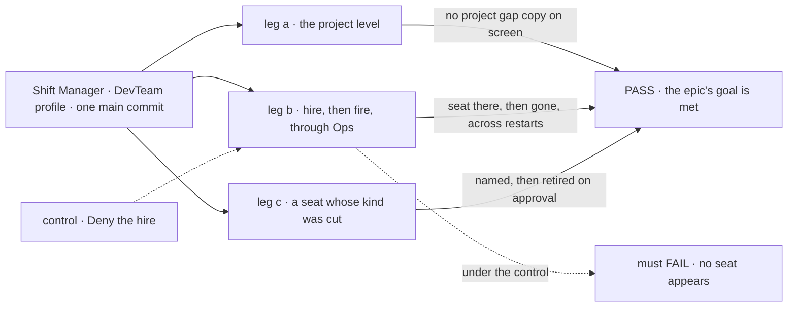
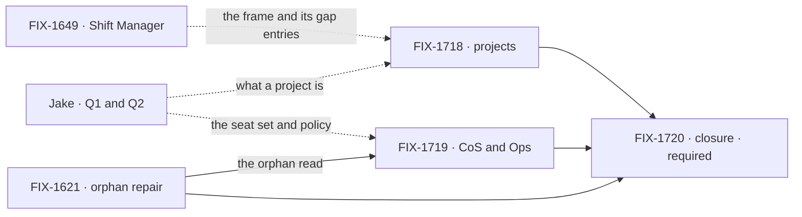

# FIX-1650 · Org primitives: one person runs a Lab's projects and people from Shift Manager

**Spec** · [Decisions](DECISIONS.md) · [Rules](BUSINESS-RULES.md) · [Plan](PLAN.md) · [Docs](DOCS.md) · [Evolution](EVOLUTION.md)

## Four teams, before and after

| A team that… | Today | After this epic |
|---|---|---|
| **runs a Lab alone in Shift Manager** (the owner, dogfooding) | PROJECTS lists every workstream on its own, and the project level shows four named empty states | Workstreams sit under the project they belong to; the project's Stream, Board, Workstreams and Brief read from the Lab's own tree |
| **needs one more worker, or one fewer** | Edits a `WORKER.md`, or writes and guards its own hire action, then restarts | Asks Ops. Ops raises the hire or the fire in Inbox, it happens on Approve, and it survives a restart |
| **shipped a release that cut a kind** | The seat that ran it is refused at boot, named, and stays broken | Sees which seats lost their kind and why, and retires or re-hires each one on approval |
| **builds the next Lab** (DevTeam, then CyberForce) | Would invent its own idea of a project and of an admin seat | Declares its projects in its tree and opts into CoS and Ops as documents, writing no code for either |

**Why now.** Shift Manager shipped: its shell and task view are Done and its closure is
running. Its project level is drawn as named empty states that say "arrives with FIX-1650",
and since #2423 it waits on this epic for what a workstream is too. Under it, the hire plane is
finished (durable hire, plane isolation, the seat-hire capability), but nothing a person can
use rides on it. The spec work proceeds now; when the build runs is Jake's call
([PLAN.md](PLAN.md#timing)).

## The goal, and how we'll know it's met

**One person opens a Lab in Shift Manager, finds its workstreams under the projects the Lab
declares, and changes who works there by asking Ops and approving in Inbox, with every change
surviving a restart, from what the Lab's tree declares and with nothing new in FSD's core.**

| Is it the right goal? | |
|---|---|
| **The real need** | Jake's PRD line: project, workstream-as-channel+flow, CoS + Ops defaults (hire/fire/channels), single-user. The Architect's fences: product framing over the tree, no new L1 noun, no `workforce/projects/` |
| **Smaller, and rejected** | "Projects render." FIX-1718 alone meets it, and the person still edits files and restarts to change who works there, which is the half of "org" a single user feels most |
| **Bigger, and not this epic's** | Multi-user orgs and the org subscription registry (FIX-1550) · opening and retiring channels at runtime (channel admin, parked: [D3](DECISIONS.md#d3)) · what sits on a workstream's board (FIX-1651) · attention (FIX-1652) · wake and principal (FIX-1637, FIX-1645) |
| **Not done if** | Every child is Done and the closure check hasn't run · a project needs a folder or a type of its own · a hire or fire lands without the person's approval · a fired seat is back after a restart, or still listed under TEAMS · a seat whose kind is gone is mapped onto another kind without anyone asking |

Leg b is the one the smaller goal would skip. Denying the ask must leave the roster untouched,
which is what makes its PASS mean the person decided.

| How we verify | |
|---|---|
| **Goal check** | The closure issue's goal check ([FIX-1720](https://linear.app/fixpoint-labs/issue/FIX-1720)), in a browser over Shift Manager, on one `main` commit after every other child merges ([ER-9](BUSINESS-RULES.md#the-closure)) |
| **Signal** | Leg a: PROJECTS lists at least two projects with their workstreams beneath them, and each project's Stream, Board, Workstreams and Brief show the Lab's content, not a gap entry. Leg b: the person asks for a second coder, an approval appears in Inbox, Approve; TEAMS shows the seat, and still does after a restart; a fire the same way leaves it gone after the next. Leg c: a stored seat whose kind the profile no longer registers is listed with the reason, retired on approval, and the next boot names no refused seat |
| **Input** | The DevTeam profile (`labs/shift-manager/teams/devteam`) with its tree carrying what FIX-1718 and FIX-1719 add, a real model, one org from the Lab's resolver. Leg c seeds its orphan by hiring a kind, then booting without it |
| **Anti-game** | No asserting on a child's own tests. No Lab code that names a project or Ops beyond the documents. No restart skipped |
| **Control that must fail** | Deny instead of Approve: leg b's "seat appears" must FAIL. Today's `main`: all three legs FAIL |

## What's in the box

Two of the three boxes are dashed because they wait on Jake's answers. Everything they compose
already ships, and the fence is the Architect's invent-kill list, where an org epic would drift.

## The set · as of 2026-10-01

A dated snapshot. Live state is Linear and the implementation PRs.

| Issue | What it delivers | Why the set needs it | Status |
|---|---|---|---|
| [FIX-1718](https://linear.app/fixpoint-labs/issue/FIX-1718) · projects | A project as the tree declares it ([Q1](DECISIONS.md#open)); the project level and the PROJECTS tree filled; what a workstream is, written down | Half the goal: the shell's project level is empty | Backlog · spec route · **holds for Q1** |
| [FIX-1621](https://linear.app/fixpoint-labs/issue/FIX-1621) · orphan repair | Finds stored seats whose kind is gone, names the reason, retires or re-hires each on approval | Without it, a cut kind leaves a broken seat nobody can clear, and Ops would invent its own detector | Backlog · spec route · adopted from Workforce L2 |
| [FIX-1719](https://linear.app/fixpoint-labs/issue/FIX-1719) · CoS and Ops | Two org seats a Lab opts into; Ops hires and fires on approval and calls FIX-1621's repair | The other half: who works here, changed without a file edit | Backlog · spec route · **holds for Q2** · blocked by FIX-1621 |
| [FIX-1720](https://linear.app/fixpoint-labs/issue/FIX-1720) · closure · **required** | The QA plan and its runs on one `main` commit | Proves the whole | Backlog · blocked by FIX-1718, FIX-1621, FIX-1719 |

3 issues and a closure, none started. Whether three is really two: CoS and Ops could fold into
FIX-1718, but they answer a different question for Jake and share nothing with projects but the
closure. Whether three is really four: [D1](DECISIONS.md#d1) keeps CoS and Ops together and
gives the workstream no issue of its own.

## How the issues flow into each other

Dashed edges are inputs from outside the set. Jake's answers hold a spec from starting, not a
build from merging; FIX-1621 starts at the gate. Shift Manager is shipped, so FIX-1718 fills
its frame without waiting on it.

## What stays as it is

- **Channels stay declared** on disk and opened at boot; a new workstream is a `CHANNEL.md`
  ([D3](DECISIONS.md#d3)).
- **The hire plane** (durable hire, plane isolation, the seat-hire capability) is composed, not
  rebuilt; degrade-by-name at boot stays the default until FIX-1621 ships.
- **Shift Manager's frame** stays FIX-1649's; this epic replaces only the gap entries it fills.
- **Related, deliberately not children:** FIX-1715, FIX-1716, FIX-1717 (Workforce EM's tracks)
  · FIX-1651, FIX-1652, FIX-1653 · FIX-1637 and FIX-1645 · FIX-1550 · FIX-1415 and FIX-1341.

## Sign off

**[The goal](#the-goal-and-how-well-know-its-met), at that size:** projects from the tree,
and the roster changed by approval, single user. If wrong: we ship projects while the org's
people are still managed by editing files.

1. **[D1](DECISIONS.md#d1) · Three issues and a closure; only the two the open questions touch
   wait.** If wrong: CoS grows behaviour of its own and splits from Ops at its spec.
2. **[D2](DECISIONS.md#d2) · Project and workstream are product framing over what the tree
   already holds; nothing new in L1, no new folder.** If wrong: an answer to Q1 needs a type
   of its own, and that comes back here as an escalation.
3. **[D3](DECISIONS.md#d3) · Channels stay declared in this epic.** If wrong: a new workstream
   costs a file and a restart until channel admin ships.

**Open: two, for Jake.** [Q1](DECISIONS.md#open), what a project is, and
[Q2](DECISIONS.md#open), which org seats a Lab gets and whether Ops asks before it hires.
Each has a recommendation. Rules: [BUSINESS-RULES.md](BUSINESS-RULES.md). Order:
[PLAN.md](PLAN.md).

Epic · three issues and a closure · Workforce: Shift Manager · Goal 1, validate through real
usage ([`docs/objectives.md`](../../../docs/objectives.md)): one more goal check, the closure's,
in the corpus; a small part of the gap · [FIX-1650](https://linear.app/fixpoint-labs/issue/FIX-1650)
· not Cycle 1
