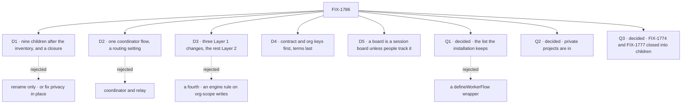

# FIX-1786 · Decisions

[Spec](SPEC.md) · **Decisions** · [Rules](BUSINESS-RULES.md) · [Plan](PLAN.md) · [Docs](DOCS.md) · [Evolution](EVOLUTION.md)

The calls above any single issue. D1 is the sign-off surface. This epic runs under `epic-em`:
D2 to D5 are engineering calls I made and record here, with what would reverse each. Jake
answered Q1 to Q3 on 2026-10-06, and no child reopens them. All three are decided: Q1's shape,
the list, was chosen at FIX-1789's spec gate on its POC and is recorded here. The
model itself (workers as resources, delegates in session state, rooms removed, the vocabulary)
is decided in the PRD and the [concept](concept/CONCEPT.md), and is not reopened here.

## The tree

## D1 · Nine refactor children after the inventory, and a closure, now

| | |
|---|---|
| **Instead of** | Rename only (FIX-1796 alone) · or fix privacy in place: keep hires, mailboxes and rooms, and narrow the org-locked hire and the boards |
| **Because** | A rename keeps the hole: an org-locked hire still reaches every member, and a drain still runs as whoever triggers it. A fix in place keeps six parts and three meanings of "shared", and each fix is a special case on a part the target model deletes. The inventory comes first because FIX-1763's mailbox children are in flight; starting under them makes each one a rebase |
| **Locks in** | A refactor across Workforce, the engine (three changes, [D3](#d3)), Shift Manager and the docs. Implementation waits on FIX-1787's merge-first rows. Work built on hires, mailboxes and rooms merges first and is refactored here, or closes |

**What would change my mind:** no app needing a second user or a worker of its own this year.
Then fix the hole in place and rename later.

It comes down to the model a reader learns: both cheaper options keep the six parts.

## D2 · engineering · One coordinator flow, with a routing setting

| | |
|---|---|
| **Instead of** | Two flows: a coordinator that routes by judgment and keeps a board, and a relay with a fixed policy (the concept's open question) |
| **Because** | Both styles share every part the concept lists: the door, delegates in session state, the roster check, delivery into the delegate's own session, the one-answer record, the routing record. Only who picks differs, the model or a policy. Today's mailbox flow already carries best fit and wake-everyone in one flow. Two flows put the roster check in two places, two places to get a security check wrong. A board is session state any worker flow may keep; no board is not a second flow |
| **Locks in** | One coordinator flow with `routing: judgment \| best-fit \| round-robin \| everyone`. A relay is a coordinator with a fixed policy and no board |

**What would change my mind:** FIX-1791's spec finding that judgment routing needs a different
session shape for more than half the flow. Then split it, with the delegate check and the
answer record in one shared module.

## D3 · engineering · Workforce stays Layer 2; Layer 1 changes are three

| | |
|---|---|
| **Instead of** | A Layer 1 worker noun with its own store · or per-org user keys faked inside Workforce · or a fourth change, an engine rule refusing a worker flow's writes to org scope (FIX-1789's Q2) |
| **Because** | Workers, coordinators and workstreams compose what ships: resources, scopes, sessions, projected collections, boards. Three things Workforce cannot fake: a scope key, a row rule, session state a caller can't write. [The end-state POC](#what-the-end-state-poc-showed) settled the third: the public create persists a caller's session state, so a link held there accepts the caller's own other worker, and a row only flow code writes outlives a deleted session id. No fourth (Jake, 2026-10-06): org scope is shared with the org by design, a worker flow may write there if that is how it is built to work, and the framework can't know when org data is relevant. The built-in worker flows, `agent` and the coordinator, keep a worker's own state out of it |
| **Locks in** | (1) user data keyed per (user, org) for every flow, FIX-1790, a persisted key change whose old records move to one org by an operator step, never read in two ([ER-3](BUSINESS-RULES.md#what-a-team-gets-and-what-it-doesnt)); (2) "owner writes, org reads" on a row, FIX-1793, new work the 2026-09-23 security lock left for later; (3) session data only the server writes. The worker link takes the form this card's *what would change my mind* anticipated: a server-only field on the session record, set and checked when the session is created, never on a turn; a session's worker can't change, and no action names a worker (Jake, 2026-10-06, on FIX-1788's spec). A coordinator's delegates are held where only the server writes too, and the public create can't seed them. FIX-1788 picks the mechanism and builds it, FIX-1791 consumes it. Flow instances and owner pins get deprecation markers, nothing more. A worker's own key for its private state is Layer 2, FIX-1788's, and so is reading a worker's configuration per run: a generator already resolves its tools per call ([ER-2](BUSINESS-RULES.md#what-a-team-gets-and-what-it-doesnt)). Any other Layer 1 change comes back to this epic |

**What would change my mind:** a second consumer of a worker outside Workforce. Then a worker
noun in core earns its place.

## D4 · engineering · The contract and per-org keys first; the terms last, with docs moving with code

| | |
|---|---|
| **Instead of** | Rename first, then refactor · or every child at once |
| **Because** | FIX-1790 lands before FIX-1788: under today's cross-org user key, a user in two orgs would see one private roster in both. FIX-1789 lands before FIX-1788 because a configuration must name a registered worker flow. Terms go last because docs move with code (Jake, 2026-10-03): renaming ahead of behaviour documents parts that don't exist yet. So each child names its new surfaces in the new terms and documents its own behaviour; FIX-1796 removes what remains and publishes the glossary |
| **Locks in** | A seven-step critical path ([PLAN.md](PLAN.md#the-path)). Parallel windows: FIX-1789 beside FIX-1790; FIX-1791 beside FIX-1795; FIX-1793, FIX-1794 and FIX-1795 together. Every spec can be written once this one merges; the order gates builds only |

## D5 · engineering · Each mailbox board becomes a session board, unless people track the work

| | |
|---|---|
| **Instead of** | One rule per file type (every lab board a workstream) · or keeping an org-scoped board as a third shape |
| **Because** | An org-scoped board is the shape this epic removes: any member's session drains it, and the session's user doesn't narrow it. A session board is private and needs no project; a workstream costs a project. So FIX-1792 asks one question per board: does the work outlive one conversation, and does a person track it? Yes makes it a workstream; otherwise, and when unclear, a session board. Goal fixtures that test board mechanics become session boards |
| **Locks in** | FIX-1792 waits on FIX-1793 for the workstream option. The per-board table is FIX-1792's spec. A session board that hands rows to a delegate on another flow can't be shared down the lineage, which stops at a flow, and still stays its own board: never one ledger for all its owner's sessions. FIX-1794 decides how ([ER-9](BUSINESS-RULES.md#what-a-team-gets-and-what-it-doesnt)) |

## Q1 · decided · An author says "this flow runs workers" in a list the installation keeps, not a `defineWorkerFlow()` wrapper

**Jake, 2026-10-06**, at FIX-1789's spec gate
([#2811](https://github.com/fixpoint-labs/flow-state-dev/pull/2811)), on its POC of both shapes
([`two-shapes`](../../issues/FIX-1789/poc/two-shapes/README.md#what-was-observed)), as this
card had asked. He had leaned to the wrapper for contract integrity; the POC showed the list
holds it as surely.

- **What it is.** Today's map of flows the installation passes to the hire. Each flow on it is
  checked when the installation registers it, against
  [ER-2](BUSINESS-RULES.md#what-a-team-gets-and-what-it-doesnt)'s contract, by checks exported so
  a library can call them in its own tests. Standard-only is carried per entry, set by the
  installation.
- **What decided it.** Both shapes refused the same flows before any worker ran (S1–S4), so
  contract integrity was a tie. The wrapper lost an installation's standard-only setting when it
  swapped in a library's `agent`, and needed two definitions of one flow for two installations
  (F3, F4). It also refused a flow that meets every requirement but was written by hand: the
  second authority `worker-config.ts` rejects on purpose (H1).
- **How it binds the set.** From this record's merge
  ([ER-24](BUSINESS-RULES.md#how-the-set-is-run)): FIX-1788's `agent` flow and FIX-1791's
  coordinator flow register on the list, and neither moves onto a new export.
  [ER-14](BUSINESS-RULES.md#what-no-child-may-do) holds: the list registers flows, not workers.
- **What it leaves.** A wrapper may come later as sugar over the list, with no mark.
  [D1](#d1)'s collapse trigger doesn't fire: FIX-1789's spec found the contract is more than a
  registration list (three checks, attribution, moving `agent`'s skills drawer off org scope), so
  it keeps its own issue.

It comes down to who sets standard-only: under the wrapper, an installation can't keep its own policy.

## Q2 · decided · Private projects are in, and FIX-1763's "projects stay org-level" fence is lifted

**Jake, 2026-10-06:** yes, provided private projects are mostly a scope configuration. Asked on
[the inventory](https://linear.app/fixpoint-labs/issue/FIX-1786#comment-9e837aa5), call 1.
FIX-1762's stack merged first (#2738 and #2748, 2026-10-06).

- **What it means.** A project is private or shared, chosen at create, one project type.
  FIX-1763's own fence left "dual org/user later via a create-time flag, same membership model,
  no second project type", and this is that flag. ER-7 holds without a condition, leg b makes a
  private project that Bob can't reach, and the docs publish private projects. FIX-1762's locks
  (one optional remote per project, a worktree mapped from it, side files outside the checkout,
  no whole-repo copy or auto-commit as the user, the FIX-1766 host-loss overlay) carry into
  FIX-1793 unchanged.
- **The condition.** If FIX-1793's spec finds private projects cost the MVP much more than a
  scope configuration, it raises that at its gate. Taking them out is then an amendment here
  ([ER-24](BUSINESS-RULES.md#how-the-set-is-run)) that removes ER-7's private half, leg b's
  private step and the docs phrase together.
- **Where it points.** Jake expects org-level (shared) concepts may be a fast follow after the
  MVP, as a key unique feature of the platform, which is why private projects should be cheap to
  build now. That moves nothing in this epic: the shared project, its workstreams and the
  library stay in the goal as approved. FIX-1793's spec gate is where it is asked outright,
  beside the cost check above: does the shared half (the shared project and its two owners, "owner
  writes, org reads", and FIX-1795's library) stay in the MVP? Yes keeps the goal. No is an
  amendment here that changes the goal, and takes leg b's two-owner half and FIX-1795 with it.

## Q3 · decided · FIX-1774 and FIX-1777 are closed into FIX-1791 and FIX-1794

**Jake, 2026-10-06:** yes. Asked on [the inventory](https://linear.app/fixpoint-labs/issue/FIX-1786#comment-9e837aa5),
call 2. FIX-1774 is Canceled and FIX-1777 a Duplicate in Linear. FIX-1791 carries FIX-1774's
dogfood legs and its *not done if* list, and FIX-1794 carries FIX-1777's "runs as the filer"
rule, both restated on the new model.

## Who owns what

The matrix holds ER-1 to ER-12; ER-13 onward are fences and process that bind every child
alike. FIX-1788 decides what a worker is, so the coordinator, the library and the conversion
consume it rather than define their own. FIX-1789 owns attribution on shared writes, because it
is the contract's private-state rule seen from the shared side. FIX-1793 owns the one new
engine rule. The closure only checks.

## Decided in review, recorded so no child reopens them

- **A workstream is a project entry plus its lead's workstream session**, stored at
  `workstreams/<project>/<workstream>`, with project progress computed. The PRD's
  recommendation, adopted.
- **`MAILBOX.md` becomes `WORKER.md`, and old files are refused loudly** with the conversion in
  the message. The PRD's recommendation, adopted.
- **No transcript resource is built.** It is out of scope in the PRD; copy or projection stays
  punted. The coordinator's routing record is built.
- **FIX-1796 leaves channel-kind paths alone**: `workforce/flows/channels/<kind>.ts` and
  `CHANNEL.md`'s `flow:`. Channels are out of scope; nothing renames them silently.
- **Model variants carry into forks and the library.** Codex, Claude and Cursor variants are
  separate workers sharing core instructions (the 2026-10-04 lock). That lock's ownership half
  is superseded: workers are private, and standard workers are read-only projections.
- **Per-org user data does not dual-read.** A record stored before under the cross-org key would
  read in every org its user belongs to, the leak FIX-1790 exists to close, and the owner-pinned
  cell already refuses that fallback. It moves to the one org it can be attributed to by an
  operator step, or stops with `migration-required`; nothing is deleted ([ER-3](BUSINESS-RULES.md#what-a-team-gets-and-what-it-doesnt)).
  Reversed in review (Jake, Codex) from a dual-read.
- **The privacy spine is proved when it merges**, not only at the end: leg c's worker steps and
  the control run on FIX-1788's merge commit, and a failure holds the coordinator and the
  library from merging ([ER-30](BUSINESS-RULES.md#the-closure)). From review (Jake).
- **Private projects are proved.** Leg b makes one and Bob can't reach it; otherwise ER-7's
  private half would ship unchecked. From review (Jake, Cursor); unconditional since Q2.
- **ER-14 forbids a second registry of workers**, not Q1's worker-flow declaration, the list.
  From review.
- **A shared entry's `writtenBy` is as trustworthy as the worker flow that wrote it.** With no
  engine rule ([D3](#d3)), FIX-1789's shared-write helper stamps it from the session's identity;
  a caller can't forge it, but the registered flow's own code could, and no doc may promise
  otherwise ([ER-11](BUSINESS-RULES.md#what-a-team-gets-and-what-it-doesnt)). From FIX-1789's
  gate, an engineering call.
- **A worker names the flow that runs it.** An installation has many worker flows (the built-in
  agent, the coordinator, the app's own), each one singleton copy that every worker naming it
  shares. Making flows singletons doesn't put every worker on `agent` ([ER-1](BUSINESS-RULES.md#what-a-team-gets-and-what-it-doesnt)).
  From review (Jake); the concept and its workers figure now say so.
- **A board stays its own when its rows cross a flow.** A user-scoped ledger spans every session
  its owner has, and a board takes any pending row in it, so one of Alice's sessions could claim
  another's rows. ER-9 now requires that only a board's own drains claim its rows, and leaves how
  to FIX-1794's spec; a task-board change comes back here. From review round 2 (Codex).
- **A worker's configuration is data, read per run.** On a singleton, `ctx.flow.config` is one
  frozen bag for every worker, and `seatTools` carries live blocks a stored row can't hold. So the
  contract stores names, resolves them when a session loads its worker, and a flow reads that
  configuration per run ([ER-2](BUSINESS-RULES.md#what-a-team-gets-and-what-it-doesnt), FIX-1789).
  From review round 2 (Codex).
- **Shift Manager lives at `packages/shift-manager`.** #2759 (FIX-1770) moves it there and lands
  first among the merge-first rows; PRs that edit the lab rebase after it.
- **Checked against `main` at `74f9a4f68`:** a project room and the mailbox boards are as
  [EVOLUTION.md](EVOLUTION.md#where-todays-code-differs-checked-against-main) states; 33
  `MAILBOX.md` files, 15 with boards (the concept's 32 and 14 predate a FIX-1778 fixture).

## What the end-state POC showed

- **Built:** a singleton flow on the real engine, with the worker link in session state, in a
  user-scoped row only flow code writes, and, as the control that must fail, in session state
  over org-scoped workers. Its door drains a lineage-shared session board.
- **See it:** `bash specs/epics/FIX-1786/poc/singleton-worker-link/run.sh`, 12 legs
  ([README](poc/singleton-worker-link/README.md)).
- **Showed:** the premise holds within one flow: the session loads its worker, and the task child
  runs as the owner and settles the row. Another user's link reads nothing; the control honours
  it. Three things don't hold. A session-state link accepts the caller's own other worker, seeded
  through the public create, and a flow-owned row outlives a deleted session id. A user's
  workers share every `flowIsolation` cell. A lineage board can't reach a worker on another flow.
- **Changed:** [D3](#d3)'s third Layer 1 change is definite, as server-owned session state.
  FIX-1788 also keys a worker's private state by the worker and moves today's per-worker cells
  ([ER-1](BUSINESS-RULES.md#what-a-team-gets-and-what-it-doesnt)). A board whose rows cross a flow
  can't use its lineage ([ER-9](BUSINESS-RULES.md#what-a-team-gets-and-what-it-doesnt), FIX-1794;
  [D5](#d5)); the POC's answer, the owner's user scope, was struck in review round 2. The FIX-1788
  and FIX-1794 split holds. Variants: none.

## How it got here

- **Drafted (Oct 6)** from the PRD on FIX-1786, its Architect guidance, the concept doc and the
  code on `main`. FIX-1788 to FIX-1797 filed; FIX-1787 kept as the inventory.
- **The inventory landed (Oct 6)** while drafting: Q2 and Q3 reference its two asks, the
  carries into FIX-1791 and FIX-1794 are recorded, and #2759 lands first.
- **POC (Oct 6)**: D3's third change became definite, as server-owned session state, and
  FIX-1788 gained the worker key, because the run showed a caller-seeded link to the caller's own
  other worker is honoured and a singleton's isolated cells are shared by every worker. ER-9
  gained the flow-boundary rule, because a cross-flow child roots its own lineage.
- **Review round 1 (Oct 6)**: per-org user data stopped dual-reading old records (ER-3); the
  closure gained an early leg-c run at FIX-1788's merge (ER-30) and a private-project step if Q2
  holds; ER-14 names what it forbids. Issue-level notes went to the children, and FIX-1798 was
  filed outside the epic to remove flow instances and owner pins after FIX-1788 (ER-20).
- **A correction from review (Oct 6)**: the concept, the box and ER-1 now say each worker names its own
  flow, after Jake read the PRD as putting every worker on one flow. No decision moved.
- **Review round 2 (Oct 6)**: ER-9 keeps each board its own, because the POC's user-scoped
  answer let one of an owner's sessions claim another's rows; ER-2 makes a worker's
  configuration stored data read per run; ER-7's private half waits on Q2, as the Q2 card said.
  The flow-match check on a session link went to FIX-1788 as a note.
- **Jake's answers (Oct 6)**, after merge, in a follow-up PR: Q1 goes to FIX-1789's spec, which
  builds both shapes in a POC, and the epic stops recommending the list; Q2 is yes, so private
  projects are in and ER-7, leg b and the docs lose their condition; Q3 is yes.
- **Review of the answers (Oct 6)**, in a second follow-up PR: Q1's winner comes back here before
  FIX-1788 or FIX-1791 names a shape, because both declare their flows with it (Codex); the "fast
  follow" Jake expects for the shared half is asked at FIX-1793's spec gate, so it has an owner
  (the second look); ER-26 points at the orchestration contract's GitHub stacks.
- **FIX-1789's gate (Oct 6)**, in a third follow-up PR: Q1 is the list, on FIX-1789's POC (#2811),
  and ER-24 is met for it. FIX-1789's open call on an engine rule for org-scope writes is no: D3
  stays three, and ER-2 and ER-11 say the privacy promise covers a worker's own state and
  user-scoped data, not org scope. From FIX-1788's spec (#2812): D3's third change holds the
  worker link in a server-only field set at create, so no action names a worker. "Seat" left the
  prose here, one name for one thing (Jake, #2810).

**Open: none needing an answer now.** Whether the shared half stays in the MVP is asked at
FIX-1793's spec gate ([Q2](#q2)).
