# FIX-1786 · Decisions

[Spec](SPEC.md) · **Decisions** · [Rules](BUSINESS-RULES.md) · [Plan](PLAN.md) · [Docs](DOCS.md) · [Evolution](EVOLUTION.md)

The calls above any single issue. D1 is the sign-off surface. This epic runs under `epic-em`:
D2 to D5 are engineering calls I made and record here, with what would reverse each. D6 is
FIX-1794's D1, approved at its spec gate and recorded here because it changes the task board. D7
is FIX-1796's D4, recorded here because it renames a Layer 1 public name; the product owner
amended it on 2026-10-07, so a task board's seat becomes assignee too. D8 and D9 are the
product owner's calls: D8 brings FIX-1802 into the set, and its grant was made exact on
2026-10-07; D9, the same day, takes backwards support out of every child. Jake
answered Q1 to Q3 on 2026-10-06, and no child reopens them. All three are decided: Q1's shape,
the list, was chosen at FIX-1789's spec gate on its POC and is recorded here. The
model itself (workers as resources, delegates in session state, rooms removed, the vocabulary)
is decided in the PRD and the [concept](concept/CONCEPT.md), and is not reopened here.

## The tree

```mermaid
flowchart TD
  E["FIX-1786"] --> D1["D1 · nine children after the inventory, and a closure"]
  D1 -.->|"rejected"| X1["rename only · or fix privacy in place"]
  E --> D2["D2 · one coordinator flow, a routing setting"]
  D2 -.->|"rejected"| X2["coordinator and relay"]
  E --> D3["D3 · seven Layer 1 mechanism changes, two renames and a removal, the rest Layer 2"]
  D3 -.->|"rejected"| X3["an engine rule on org-scope writes"]
  E --> D4["D4 · contract and org keys first, terms last"]
  E --> D5["D5 · a board is a session board unless people track it"]
  E --> D6["D6 · a board's rows at its owner's user scope, one partition per conversation"]
  D6 -.->|"rejected"| X6["one ledger per owner · a claim filter in Workforce"]
  E --> D7["D7 · the discovery domain seats becomes workers; a board's seat becomes assignee"]
  D7 -.->|"rejected"| X7["seats pinned as a model-facing name · an alias · seat kept on the board · route"]
  E --> D8["D8 · a worker whose delegates take tasks gets the task tools · the split is in the MVP"]
  D8 -.->|"reversed"| X8["filing makes a coordinator · the split after the MVP · a filing flag"]
  E --> D9["D9 · no backwards support while there are no consumers"]
  D9 -.->|"rejected"| X9["operator steps · dual-reads · refusals by name · upgrade pages"]
  E --> Q1["Q1 · decided · the list the installation keeps"]
  Q1 -.->|"rejected"| XQ1["a defineWorkerFlow wrapper"]
  E --> Q2["Q2 · decided · private projects are in"]
  E --> Q3["Q3 · decided · FIX-1774 and FIX-1777 closed into children"]
```

## D1 · Nine refactor children after the inventory, and a closure, now

| | |
|---|---|
| **Instead of** | Rename only (FIX-1796 alone) · or fix privacy in place: keep hires, mailboxes and rooms, and narrow the org-locked hire and the boards |
| **Because** | A rename keeps the hole: an org-locked hire still reaches every member, and a drain still runs as whoever triggers it. A fix in place keeps six parts and three meanings of "shared", and each fix is a special case on a part the target model deletes. The inventory comes first because FIX-1763's mailbox children are in flight; starting under them makes each one a rebase |
| **Locks in** | A refactor across Workforce, core's document tools, the engine, the task board, the skills library and discovery's domain list (seven mechanism changes, two public renames and one public removal, [D3](#d3)), Shift Manager and the docs. Implementation waits on FIX-1787's merge-first rows. Work built on hires, mailboxes and rooms merges first and is refactored here, or closes. [D8](#d8) later added a tenth refactor child, FIX-1802 |

**What would change my mind:** no app needing a second user or a worker of its own this year.
Then fix the hole in place and rename later.

![D1: nine children after the inventory, chosen, beside rename only and fixing privacy in place. Decides it: the model a reader learns, one rule against six parts. The price: nine issues, seven mechanism changes (the fifth T1, the task tools' roster read per call; the sixth the skills library's key taken per run; the seventh a per-turn rule for which of a shared copy's resources the model reaches), two public renames (D7) and one public removal. Flips if no app needs a second user or its own worker this year](figures/d1-the-set.svg)

It comes down to the model a reader learns: both cheaper options keep the six parts.

## D2 · engineering · One coordinator flow, with a routing setting

| | |
|---|---|
| **Instead of** | Two flows: a coordinator that routes by judgment and keeps a board, and a relay with a fixed policy (the concept's open question) |
| **Because** | Both styles share every part the concept lists: the door, delegates in session state, the roster check, delivery into the delegate's own session, the one-answer record, the routing record. Only who picks differs, the model or a policy. Today's mailbox flow already carries best fit and wake-everyone in one flow. Two flows put the roster check in two places, two places to get a security check wrong. A board is session state any worker flow may keep; no board is not a second flow |
| **Locks in** | One coordinator flow with `routing: judgment \| best-fit \| round-robin \| everyone`. A relay is a coordinator with a fixed policy and no board |

**What would change my mind:** FIX-1791's spec finding that judgment routing needs a different
session shape for more than half the flow. Then split it, with the delegate check and the
answer record in one shared module.

## D3 · engineering · Workforce stays Layer 2; Layer 1 changes are seven mechanisms, two renames and a removal

| | |
|---|---|
| **Instead of** | A Layer 1 worker noun with its own store · or per-org user keys faked inside Workforce · or an engine rule refusing a worker flow's writes to org scope (FIX-1789's Q2) |
| **Because** | Workers, coordinators and workstreams compose what ships: resources, scopes, sessions, projected collections, boards. Seven things Workforce cannot fake: a scope key, a row rule, session state a caller can't change after create, a task ledger kept per conversation ([D6](#d6)), task tools that read their roster per call, since an action is fixed when it is defined ([D8](#d8), T1), a skills library that takes its key per run, since orchestration keys it by the flow's instance and every worker on a singleton shares that one, and one view of a shared copy's resources per turn, since every worker on a copy shares its resource registry and core's document tools list all of it ([amended after merge](EVOLUTION.md#amendment-visibility)). The other three are names, not mechanisms. Two are renames ([D7](#d7)): discovery's `seats` domain, a `contracts` constant, becomes `workers`, and a task board's seat, in orchestration's types and the hand-off record core defines, becomes assignee. One is a removal: discovery's `mailboxes` domain goes with the mailbox. So `contracts` still names one Workforce domain, as it named `seats` before; whether Layer 1 keeps that closed list is [FIX-1803](https://linear.app/fixpoint-labs/issue/FIX-1803), FIX-1575's open question. [The end-state POC](#what-the-end-state-poc-showed) settled the third: the public create stored a caller's session state unchecked, and as sent when its schema refused it, so a worker named there skipped the check the flow ran later; and a row only flow code writes outlives a deleted session id. What shipped checks the worker in the create itself and fixes it after ([amended after merge](EVOLUTION.md#amendment-binding)). No engine rule on org-scope writes (Jake, 2026-10-06): org scope is shared with the org by design, a worker flow may write there if that is how it is built to work, and the framework can't know when org data is relevant. The built-in worker flows, `agent` and the coordinator, keep a worker's own state out of it; a custom worker flow's privacy is its author's, and the contract doesn't check it ([ER-2](BUSINESS-RULES.md#what-a-team-gets-and-what-it-doesnt)) |
| **Locks in** | (1) user data keyed per (user, org) for every flow, FIX-1790, a persisted key change whose old records are dropped, never read in any org ([D9](#d9), [ER-3](BUSINESS-RULES.md#what-a-team-gets-and-what-it-doesnt)); (2) "owner writes, org reads" on a row, FIX-1793, new work the 2026-09-23 security lock left for later; (3) session state a caller can't change after create, as FIX-1788's P1 shipped it ([#2850](https://github.com/fixpoint-labs/flow-state-dev/pull/2850)) and the product owner approved it on 2026-10-07. A session's worker is a readonly field of its starting state: the caller names it with `createSession({ state })`, the flow's optional create check confirms it, the engine refuses any later change to it, and sessions can be listed by it. It is named at create, never on a turn; a session's worker can't change, and no action names a worker (Jake, 2026-10-06, on FIX-1788's spec). A coordinator's delegates are server-owned: only the server writes them, and the public create can't seed them. The item took three engine changes it didn't name as first written: a readonly guard on session state, a state filter on listing inside each store, and a refusal at create of a starting state the schema rejects, on flows that bind their sessions. They build this one mechanism, not new ones, and none names a worker: the engine knows readonly fields ([EVOLUTION.md](EVOLUTION.md#amendment-binding)). FIX-1788 picks the mechanism and builds it, FIX-1791 consumes it. Flow instances and owner pins stay in the engine untouched, with no deprecation markers, until FIX-1798 removes them ([D9](#d9)). A worker's own key for its private state is Layer 2, FIX-1788's, and so is reading a worker's configuration per run: a generator already resolves its tools per call ([ER-2](BUSINESS-RULES.md#what-a-team-gets-and-what-it-doesnt)). (4) A task ledger kept per conversation, FIX-1794, a change to the task board that leaves the engine untouched ([D6](#d6)). (5) T1, orchestration's task tools reading their roster per call, FIX-1794 as amended in [#2839](https://github.com/fixpoint-labs/flow-state-dev/pull/2839): generic, naming no worker or delegate ([D8](#d8)). (6) Orchestration's skills library taking its key per run, FIX-1788's S7: a function of the running context the composing layer supplies, the shape of [D6](#d6)'s partition, naming no worker; Workforce supplies the worker's key. (7) A per-turn resource visibility rule in core, FIX-1788's P4 (its S8 and [D7](../../issues/FIX-1788/DECISIONS.md#d7)), the product owner's call on 2026-10-07: optional, generic, naming no worker. Every model-facing listing and lookup in core honours it, its document tools and their path lookup among them, and a hidden resource answers exactly as a missing one does. With no rule, everything is visible, as before. Workforce supplies the rule from the worker verified on the turn. It governs what the model reaches through tools and context, not app code that reads a resource by reference, which is its author's, as FIX-1788's D6 has it for a custom worker flow. The option's name is FIX-1788's. And two public renames, both FIX-1796's, with no alias ([D7](#d7)): discovery's `seats` domain becomes `workers` in `MANIFEST_DOMAINS`, and a task board's seat becomes assignee in orchestration's board types and the hand-off record's field. And one public removal, FIX-1792's (its S9, BR-5a): discovery's `mailboxes` domain leaves `MANIFEST_DOMAINS` and core's discovery tool, with no alias. Any other Layer 1 change comes back to this epic |

**What would change my mind:** a second consumer of a worker outside Workforce. Then a worker
noun in core earns its place.

## D4 · engineering · The contract and per-org keys first; the terms last, with docs moving with code

| | |
|---|---|
| **Instead of** | Rename first, then refactor · or every child at once |
| **Because** | FIX-1790 lands before FIX-1788: under today's cross-org user key, a user in two orgs would see one private roster in both. FIX-1789 lands before FIX-1788 because a configuration must name a registered worker flow. Terms go last because docs move with code (Jake, 2026-10-03): renaming ahead of behaviour documents parts that don't exist yet. So each child names its new surfaces in the new terms and documents its own behaviour; FIX-1796 removes what remains and publishes the glossary |
| **Locks in** | A seven-step critical path ([PLAN.md](PLAN.md#the-path)). Parallel windows: FIX-1789 beside FIX-1790; FIX-1793 beside FIX-1794. FIX-1795 builds after the MVP ([Q2](#q2)). Every spec can be written once this one merges; the order gates builds only |

## D5 · engineering · Each mailbox board becomes a session board, unless people track the work

| | |
|---|---|
| **Instead of** | One rule per file type (every lab board a workstream) · or keeping an org-scoped board as a third shape |
| **Because** | An org-scoped board is the shape this epic removes: any member's session drains it, and the session's user doesn't narrow it. A session board is private and needs no project; a workstream costs a project. So FIX-1792 asks one question per board: does the work outlive one conversation, and does a person track it? Yes makes it a workstream; otherwise, and when unclear, a session board. Goal fixtures that test board mechanics become session boards |
| **Locks in** | FIX-1792 waits on FIX-1793 for the workstream option and on FIX-1802 ([D8](#d8)). The per-board table is FIX-1792's spec; the DevTeam's feature board is a workstream on storefront, led by its EM, an ordinary worker whose delegates take tasks, so it has the task tools ([D8](#d8)). A session board that hands rows to a delegate on another flow can't be shared down the lineage, which stops at a flow, and still stays its own board: never one ledger for all its owner's sessions. [D6](#d6) is how ([ER-9](BUSINESS-RULES.md#what-a-team-gets-and-what-it-doesnt)) |

## D6 · A board keeps its tasks at its owner's user scope, in a partition only its own conversation reaches

From FIX-1794's spec gate ([#2828](https://github.com/fixpoint-labs/flow-state-dev/pull/2828),
[its D1](../../issues/FIX-1794/DECISIONS.md#d1)), recorded here because it changes the task
board ([ER-22](BUSINESS-RULES.md#what-no-child-may-do), [ER-24](BUSINESS-RULES.md#how-the-set-is-run)).

| | |
|---|---|
| **Instead of** | One unpartitioned ledger at the owner's user scope · a claim filter in Workforce over that ledger · the board kept in its session and settled by the task session's reply |
| **Because** | A lineage stops at a flow, and the owner's user scope crosses it: the task session reads, renews, parks and settles its row as a same-flow run does. FIX-1794's POC ([`board-partition`](../../issues/FIX-1794/poc/board-partition/README.md)): one unpartitioned user ledger let one conversation take another's task (U1), and a Workforce-only claim filter held the claim but not the read or the wake (E1). A row settled by a reply can't be renewed, so it runs twice or never |
| **Locks in** | A change to the task board in orchestration: a ledger whose rows sit at the owner's user scope, one partition per conversation, named from data only the server writes, and every board operation goes through it. Orchestration knows no conversation or worker: the composing layer supplies the partition. The engine is untouched. One shape for every board in the chain, same flow or not, so FIX-1792's converted boards and FIX-1793's workstream boards are built on it ([ER-9](BUSINESS-RULES.md#what-a-team-gets-and-what-it-doesnt)). The option's name is FIX-1794's |

**What would change my mind:** the engine gaining a seam that settles, renews and parks one row
in another session, for its own reasons. Then the board stays in its session, and the partition
is dropped before it ships.

## D7 · The discovery domain `seats` becomes `workers`; a task board's seat becomes assignee

From FIX-1796's spec gate ([#2832](https://github.com/fixpoint-labs/flow-state-dev/pull/2832),
[its D4](../../issues/FIX-1796/DECISIONS.md#d4)), recorded here because `MANIFEST_DOMAINS` in
`packages/contracts/src/types/manifest.ts` is a Layer 1 public name, which binds the set only
once the epic records it ([ER-22](BUSINESS-RULES.md#what-no-child-may-do), [ER-24](BUSINESS-RULES.md#how-the-set-is-run)).

**Amended by the product owner, 2026-10-07.** They wrote: "I'm still not sold on seats for task
boards. Maybe routes? Similar to router. Any other ideas". Offered assignee, lane, route and
station, they answered: "Ok let's go with assignee". That flips the card's board half as merged,
where a task board kept "seat"
([the card as merged](https://github.com/fixpoint-labs/flow-state-dev/blob/2ab5e6b0bd77c798142a48922131aa52f45f737d/specs/epics/FIX-1786/DECISIONS.md#d7)),
and [FIX-1796's D1](../../issues/FIX-1796/DECISIONS.md#d1) with it. "Seat" is now retired
everywhere, with no board exception. Orchestration is Layer 1, so [D3](#d3) counts the board's
rename as its second public rename.

| | |
|---|---|
| **Instead of** | Keeping `seats` as a pinned, model-facing name · or `seats` kept as an alias beside `workers` · or keeping "seat" on the board (D7 as merged) · or "route", which the engine's HTTP routes and the router block kind already own · or settling now whether Layer 1 keeps a closed list of discovery domains or each layer registers its own |
| **Because** | The `seats` domain lists Workforce's workers, so it goes. It is the one surface a model reads by name, so a pinned `seats` would teach a model the meaning the sweep removes. No alias: an alias is a retired term in an export ([ER-12](BUSINESS-RULES.md#what-a-team-gets-and-what-it-doesnt)). On the board, the product owner wasn't sold on "seat", a word a reader of Workforce learned as a worker. A task already says `assignee` for the board entry it picks, so the entry and the pick take one name, the glossary defines one word, and "seat" names nothing. "Route" would give a word the framework already uses twice a third meaning. The renames add no coupling: `contracts` already names `seats` and `mailboxes` today, and the board's names are orchestration's own. Moving to domains each layer registers is a bigger Layer 1 redesign the MVP doesn't need, so that question stays open for [FIX-1803](https://linear.app/fixpoint-labs/issue/FIX-1803), FIX-1575's open question |
| **Locks in** | `MANIFEST_DOMAINS`, core's discovery tool and Workforce's `discover:` key say `workers`, built by FIX-1796. A saved prompt, skill or eval that passes `seats` gets the "unknown domain" listing, and a worker file with `discover: [seats]` is refused, listing the known domains. The `mailboxes` domain isn't decided here: FIX-1792 removes it ([#2833](https://github.com/fixpoint-labs/flow-state-dev/pull/2833) S9, its BR-5a), and [D3](#d3) counts that as its one public removal. A task board's types, its docs and the hand-off record take "assignee", built by FIX-1796 with no alias: an assignee is who a task goes to, an entry in the board's `workers` map or a name the board's assignee check accepts (in Workforce, a delegate); a task's `assignee` names it, and it runs the task inline or hands it off to a dispatch run. The hand-off record's `seat` field becomes `assignee`, and nothing reads the old one ([D9](#d9)). The glossary defines assignee only; it has no seat row. FIX-1796's [PLAN](../../issues/FIX-1796/PLAN.md#pinned-names) pins the names |

**What would change my mind:** one word for a board's entry and a task's pick reading
ambiguously in the board's own API, for example a `workers` map keyed by assignee beside a
task's `assignee` in one signature. Then the entry gets a word of its own, never "seat" again,
and it comes back here as a question for the product owner.

## D8 · A worker whose delegates can take a task gets the task tools, and the split is in the MVP

The product owner's call (2026-10-06), with its grant made exact on 2026-10-07. It reverses
FIX-1794's answer to its [Q](../../issues/FIX-1794/DECISIONS.md#q), which put the split in a
follow-up, by bringing that follow-up, [FIX-1802](https://linear.app/fixpoint-labs/issue/FIX-1802),
into the set.

| | |
|---|---|
| **Instead of** | Filing as what makes a coordinator, one level deep: a task session refuses to file, and the split waits for FIX-1802 after the MVP (FIX-1794's Q, as answered) · or a `filing: true` flag in a worker's file that grants it (FIX-1802's draft, [#2839](https://github.com/fixpoint-labs/flow-state-dev/pull/2839)) |
| **Because** | Filing work is a capability, not a kind of worker. A worker whose delegates can take a task has someone to file for, and one without has nobody, so the delegates already say it; a flag would say it twice. The tools already ship: orchestration's `taskTools`, the board's eight tools a skill's delegation surface installs today. A worker with them files onto its own conversation's board, and a filed task's worker can file pieces in turn: the split. A coordinator is the flow built for routing work: an evaluator classifies first, and the flow acts as an agent only when no obvious path exists. It isn't the only thing that coordinates |
| **Locks in** | No flag. A worker gets the task tools when at least one of its `delegates:` can take a task: delegates are the grant, and "can take a task" is FIX-1794's check (its S4: the delegate's flow takes tasks). The tools are `createTaskToolsCapability(resolver, roster)` and `taskToolActions(<board id>, resolver, roster)` in `packages/orchestration/src/skills/task-tools-capability.ts`; the resolver is the session's own board, and the roster its task-taking delegates, read per call (T1). The coordinator is one such worker, so it files with the same tools, and FIX-1794's filing actions (its S4) are these tools, not a set of their own. [#2839](https://github.com/fixpoint-labs/flow-state-dev/pull/2839) amends FIX-1794 to say so (its S4, S11, sketch, DOCS and EVOLUTION), so S4 is rewritten once, and the [D9](#d9) sweep leaves FIX-1794 alone. A worker keeps the flow it names (the DevTeam's EM keeps `flow: em`). The split ships in the MVP as FIX-1802. A chain goes at most five boards deep ([FIX-1794's D2](../../issues/FIX-1794/DECISIONS.md#d2)) and holds at most 100 tasks by default, a cap the app can configure (the product owner, 2026-10-07). It builds after FIX-1794 and before FIX-1792's P2 and P3 and the closure, which it blocks ([ER-27](BUSINESS-RULES.md#how-the-set-is-run)). FIX-1791's best fit falls back to the coordinator's own judgment turn when no fallback delegate is set, and a configured fallback delegate still wins ([its D2](../../issues/FIX-1791/DECISIONS.md#d2), amended with this record). The DevTeam's feature board is a workstream on storefront, led by its EM, an ordinary worker whose delegates take tasks ([D5](#d5)). One Layer 1 change comes with it, **T1**, built by FIX-1794 as amended in [#2839](https://github.com/fixpoint-labs/flow-state-dev/pull/2839) (its PLAN): `createTaskToolsCapability`'s roster may be read per call, a function of the running context, not only fixed at build; and `taskToolActions` takes a roster too, so an app's `addTask` is checked against the session's current delegates. T1 is an orchestration change, generic: it names no worker or delegate. Why: a session's delegates change mid-session, and today the actions don't check the assignee. Existing callers pass what they pass today. [D3](#d3) counts it as the fifth mechanism change ([ER-22](BUSINESS-RULES.md#what-no-child-may-do)) |

**What would reverse it:** the product owner, if FIX-1802's spec prices the split well past the
other children. That comes back here as a question, not a child's call.

## D9 · No backwards support of any kind while there are no consumers

The product owner's call (2026-10-07): "No consumers yet. No need for backwards support of any
kind." Recorded here because it binds every child
([ER-24](BUSINESS-RULES.md#how-the-set-is-run)).

| | |
|---|---|
| **Instead of** | Carrying what was there before into the new shape: operator steps that move old user records to one org (FIX-1790) and old hires to their owners (FIX-1788), old rows read in the new shape, old files and removed calls refused by name with the conversion, an upgrading page |
| **Because** | Nobody runs Workforce outside this repo, so each of those paths protects data and files that don't exist, and each costs a step, a test leg and a page. Every `MAILBOX.md` is in this repo, and FIX-1792 converts them all |
| **Locks in** | No child builds a migration, an operator upgrade step, a dual-read, an alias, an upgrade page, or a refusal of an old shape by name ([ER-31](BUSINESS-RULES.md#what-no-child-may-do)). Old data is dropped: nothing reads or moves a record, row, cell, room line or board stored in a shape this epic replaces. A file in an old format is just not loaded. [BP-030](../../../docs/contributing/best-practices.md#bp-030-tolerate-the-old-shape-when-you-change-a-persisted-or-in-flight-field) says to tolerate the old shape of a persisted field; it conflicts with this, and D9 wins as the product owner's later and more specific call. BP-030 doesn't apply to this epic while there are no consumers. Changesets follow [BP-022](../../../docs/contributing/best-practices.md#bp-022-release-notes-via-changesets) and the pre-1.0 rule in [release-notes-workflow](../../../docs/contributing/release-notes-workflow.md#pre-10-discipline-current-state): a change to a published package's public surface carries a changeset, `minor` for a rename or removal so the version moves with the break, in one user-facing sentence. None carries upgrade instructions, a rename table or migration steps, since there is no consumer to upgrade (cross-spec alignment, 2026-10-07: a changeset is release bookkeeping, not backwards support) |
| **Not reached** | Removing flow instances and owner pins from the engine stays FIX-1798's scope ([ER-20](BUSINESS-RULES.md#what-no-child-may-do)); with no consumers there is no deprecation phase before it, so FIX-1788 adds no markers and FIX-1798 deletes outright. Project claims stay until FIX-1792 converts the boards that read them, which is build order, not compatibility. ER-21's "files as migrations", a loader that keeps data in line with files, is another thing and stays out |
| **Reaches** | Merged specs, amended in one sweep PR. **FIX-1788**: the operator step for old hires, their memory and conversations (its D1), reading an older stored configuration (BR-21), the step's rerun rule (BR-32) and its upgrade leg. **FIX-1790**: the operator copy step and its attribution rule (its D1, D2), the upgrade note, and leg c's old record. **FIX-1793**: old project rows read as shared (BR-5), rooms and claims kept for an operator to read, and room calls, `mintFor:` and `talk` refused by name. **FIX-1796**: the `LEGACY_` names kept for an upgrade to read (its D2), and the upgrading page and its rename table. **FIX-1789**: the README line telling upgraders `kinds` is now `workerFlows` (its `minor` changeset stays as one sentence, by the changeset policy above). **FIX-1788** also drops its deprecation markers on `register(.., { pin })` and collection cardinality (its S2, V2, BR-27). Open specs, folded at their own gates. **FIX-1792** ([#2833](https://github.com/fixpoint-labs/flow-state-dev/pull/2833)): `MAILBOX.md`, `flows/mailboxes/` and old lines refused by name, the upgrade page, and today's `CHANNEL.md` refusal; its D2 is answered, old data dropped. **FIX-1797** ([#2835](https://github.com/fixpoint-labs/flow-state-dev/pull/2835)): c7's pre-epic store and QR-12, and its `MAILBOX.md`-refusal and `upgrading.md` checks |

**The in-repo stores (the product owner, 2026-10-07):** yes, the kitchen-sink app's and the
DevTeam lab's stores are reset once when this ships, and stored keys are renamed outright, with no
read of an old key and no copy step. FIX-1796's D2 flips to match.

**Swept** in the amendment PR [#2841](https://github.com/fixpoint-labs/flow-state-dev/pull/2841):
every *Reaches* item in FIX-1788, FIX-1789, FIX-1790, FIX-1793 and FIX-1796, each recorded in that
spec's EVOLUTION. FIX-1793's project claims stay until FIX-1792, as *Not reached* says.

**What would reverse it:** a consumer outside this repo before the closure run. Then the product
owner decides what upgrade path that consumer needs, as a question here. From the first release
with a consumer, BP-030 applies again; nothing built here is retro-fitted.

## Q1 · decided · An author says "this flow runs workers" in a list the installation keeps, not a `defineWorkerFlow()` wrapper

**Jake, 2026-10-06**, at FIX-1789's spec gate
([#2811](https://github.com/fixpoint-labs/flow-state-dev/pull/2811)), on its POC of both shapes
([`two-shapes`](../../issues/FIX-1789/poc/two-shapes/README.md#what-was-observed)), as this
card had asked. He had leaned to the wrapper for contract integrity; the POC showed the list
holds it as surely.

- **What it is.** Today's map of flows the installation passes to the hire. Each flow on it is
  checked when the installation registers it, against
  [ER-2](BUSINESS-RULES.md#what-a-team-gets-and-what-it-doesnt)'s contract, by checks exported so
  a library can call them in its own tests. Standard-only is carried per entry, set by the
  installation.
- **What decided it.** Both shapes refused the same flows before any worker ran (S1–S4), so
  contract integrity was a tie. The wrapper lost an installation's standard-only setting when it
  swapped in a library's `agent`, and needed two definitions of one flow for two installations
  (F3, F4). It also refused a flow that meets every requirement but was written by hand: the
  second authority `worker-config.ts` rejects on purpose (H1).
- **How it binds the set.** From this record's merge
  ([ER-24](BUSINESS-RULES.md#how-the-set-is-run)): FIX-1788's `agent` flow and FIX-1791's
  coordinator flow register on the list, and neither moves onto a new export.
  [ER-14](BUSINESS-RULES.md#what-no-child-may-do) holds: the list registers flows, not workers.
- **What it leaves.** A wrapper may come later as sugar over the list, with no mark.
  [D1](#d1)'s collapse trigger doesn't fire: FIX-1789's spec found the contract is more than a
  registration list (three checks, attribution, moving `agent`'s skills drawer off org scope), so
  it keeps its own issue.

It comes down to who sets standard-only: under the wrapper, an installation can't keep its own policy.

## Q2 · decided · Private projects are in, and FIX-1763's "projects stay org-level" fence is lifted

**Jake, 2026-10-06:** yes, provided private projects are mostly a scope configuration. Asked on
[the inventory](https://linear.app/fixpoint-labs/issue/FIX-1786#comment-9e837aa5), call 1.
FIX-1762's stack merged first (#2738 and #2748, 2026-10-06).

- **What it means.** A project is private or shared, chosen at create, one project type.
  FIX-1763's own fence left "dual org/user later via a create-time flag, same membership model,
  no second project type", and this is that flag. ER-7 holds without a condition, leg b makes a
  private project that Bob can't reach, and the docs publish private projects. FIX-1762's locks
  (one optional remote per project, a worktree mapped from it, side files outside the checkout,
  no whole-repo copy or auto-commit as the user, the FIX-1766 host-loss overlay) carry into
  FIX-1793 unchanged.
- **The condition.** If FIX-1793's spec finds private projects cost the MVP much more than a
  scope configuration, it raises that at its gate. Taking them out is then an amendment here
  ([ER-24](BUSINESS-RULES.md#how-the-set-is-run)) that removes ER-7's private half, leg b's
  private step and the docs phrase together. It didn't fire: FIX-1793's spec priced a private
  project as today's row kept in user scope, a scope configuration (its D1).
- **The shared half stays in the MVP.** Jake, 2026-10-06, at FIX-1793's spec gate
  ([#2823](https://github.com/fixpoint-labs/flow-state-dev/pull/2823)): "yes to all
  recommendations." Shared projects stay beside private ones, so the goal and leg b's two-owner
  half stand as approved, with "owner writes, org reads" behind them. Only a shared project's
  members open workstreams on it; everyone in the org still reads it (ER-7). Jake still expects
  more org-level (shared) concepts as a fast follow after the MVP, a key unique feature of the
  platform.
- **The library follows the MVP.** Jake, 2026-10-06: "post mvp is fine." FIX-1795's spec
  ([#2819](https://github.com/fixpoint-labs/flow-state-dev/pull/2819)) goes through its gate now;
  its build starts once the goal is met. The goal and leg a lose the library copy, FIX-1796 and
  the closure stop waiting on FIX-1795 ([ER-27](BUSINESS-RULES.md#how-the-set-is-run)), and
  FIX-1795's own tests prove [ER-10](BUSINESS-RULES.md#what-a-team-gets-and-what-it-doesnt)
  after the MVP. Nothing else moves out.

## Q3 · decided · FIX-1774 and FIX-1777 are closed into FIX-1791 and FIX-1794

**Jake, 2026-10-06:** yes. Asked on [the inventory](https://linear.app/fixpoint-labs/issue/FIX-1786#comment-9e837aa5),
call 2. FIX-1774 is Canceled and FIX-1777 a Duplicate in Linear. FIX-1791 carries FIX-1774's
dogfood legs and its *not done if* list, and FIX-1794 carries FIX-1777's "runs as the filer"
rule, both restated on the new model. FIX-1774's leg e later moved to FIX-1794 and its leg d to FIX-1793
([decided in review](#decided-in-review-recorded-so-no-child-reopens-them)).

## Who owns what

The matrix holds ER-1 to ER-12; ER-13 onward are fences and process that bind every child
alike. FIX-1788 decides what a worker is, so the coordinator, the library and the conversion
consume it rather than define their own. FIX-1789 owns attribution on shared writes, because a
full `writtenBy` shape is one of the contract's registration checks. FIX-1793 owns the one new
engine rule. The closure only checks.

## Decided in review, recorded so no child reopens them

- **A workstream is a project entry plus its lead's workstream session**, stored at
  `workstreams/<project>/<owner>/<workstream>`, with project progress computed. The PRD's
  recommendation, adopted; FIX-1793 added the owner segment, so the owner rule reads the owner
  off the key.
- **`MAILBOX.md` becomes `WORKER.md`, and every file is converted.** The PRD's recommendation,
  adopted. Its loud refusal of old files was withdrawn by [D9](#d9): no old file is refused by
  name.
- **No transcript resource is built.** It is out of scope in the PRD; copy or projection stays
  punted. The coordinator's routing record is built.
- **FIX-1796 renames nothing for channels.** Channels are out of scope, and they have no paths to
  rename: no `flows/channels/` path is tracked on `main`, and `CHANNEL.md` is refused by name, as
  a file from before channels were renamed to mailboxes (FIX-1748). Corrected in the seventh
  follow-up PR, which checked `main` with `git ls-files`; the draft named paths that don't exist.
  That refusal goes with the mailbox code ([D9](#d9)).
- **Model variants carry into forks and the library.** Codex, Claude and Cursor variants are
  separate workers sharing core instructions (the 2026-10-04 lock). That lock's ownership half
  is superseded: workers are private, and standard workers are read-only projections.
- **Per-org user data does not dual-read, and old records are dropped.** A record stored before
  under the cross-org key would read in every org its user belongs to, the leak FIX-1790 exists to
  close, and the owner-pinned cell already refuses that fallback. Reversed in review (Jake, Codex)
  from a dual-read. The operator step that then moved each record to one org was withdrawn by
  [D9](#d9): nothing reads or moves them ([ER-3](BUSINESS-RULES.md#what-a-team-gets-and-what-it-doesnt)).
- **The privacy spine is proved when it merges**, not only at the end: leg c's worker steps and
  the control run on FIX-1788's merge commit, and a failure holds the coordinator and the
  library from merging ([ER-30](BUSINESS-RULES.md#the-closure)). From review (Jake).
- **Private projects are proved.** Leg b makes one and Bob can't reach it; otherwise ER-7's
  private half would ship unchecked. From review (Jake, Cursor); unconditional since Q2.
- **ER-14 forbids a second registry of workers**, not Q1's worker-flow declaration, the list.
  From review.
- **A shared entry's `writtenBy` is as trustworthy as the worker flow that wrote it.** With no
  engine rule ([D3](#d3)), FIX-1789's shared-write helper stamps it from the session's identity;
  it can't be forged from input, but flow code that writes the resource directly can set any
  value (FIX-1789's BR-22; its K3 leg pins the bypass), and no doc may promise otherwise
  ([ER-11](BUSINESS-RULES.md#what-a-team-gets-and-what-it-doesnt)). It is for display and audit
  only, never an authorization input; who may write is FIX-1793's. From FIX-1789's gate, an
  engineering call.
- **A worker names the flow that runs it.** An installation has many worker flows (the built-in
  agent, the coordinator, the app's own), each one singleton copy that every worker naming it
  shares. Making flows singletons doesn't put every worker on `agent` ([ER-1](BUSINESS-RULES.md#what-a-team-gets-and-what-it-doesnt)).
  From review (Jake); the concept and its workers figure now say so.
- **A board stays its own when its rows cross a flow.** A user-scoped ledger spans every session
  its owner has, and a board takes any pending row in it, so one of Alice's sessions could claim
  another's rows. ER-9 now requires that only a board's own drains claim its rows, and
  [D6](#d6) records how: one partition per conversation, built by FIX-1794. From review round 2
  (Codex).
- **A worker's configuration is data, read per run.** On a singleton, `ctx.flow.config` is one
  frozen bag for every worker, and `seatTools` carries live blocks a stored row can't hold. So the
  contract stores names, resolves them when a session loads its worker, and a flow reads that
  configuration per run ([ER-2](BUSINESS-RULES.md#what-a-team-gets-and-what-it-doesnt), FIX-1789).
  From review round 2 (Codex).
- **Shift Manager lives at `packages/shift-manager`.** #2759 (FIX-1770) moves it there and lands
  first among the merge-first rows; PRs that edit the lab rebase after it.
- **FIX-1792 removes project claims and a project row's mailbox list, not FIX-1793.** Today they
  place a mailbox board's coding runs in its project. FIX-1793 leaves them readable and
  deprecated, and nothing new builds on them. FIX-1792 removes them as it converts each board,
  and its per-board table can use them. From FIX-1793's spec
  ([its decisions](../../issues/FIX-1793/DECISIONS.md#decided-not-asked)), bound to the set by
  this record ([ER-24](BUSINESS-RULES.md#how-the-set-is-run)).
- **FIX-1794 builds filing tasks for delegates and following them through, not FIX-1791.** A
  task needs a board, and FIX-1794 decides how a board whose rows cross a flow stays its own
  (ER-9). So FIX-1774's leg e (tasks) and FIX-1780's follow-through go to FIX-1794, and a coordinator
  files no task until FIX-1794 ships. FIX-1774's leg d (opening a workstream from the
  coordinator) goes to FIX-1793, whose project coordinator does it. FIX-1791 keeps posts and delegates. Jake, 2026-10-06, at
  FIX-1791's spec gate ([its Q1](../../issues/FIX-1791/DECISIONS.md#q1)), bound to the set by
  this record ([ER-24](BUSINESS-RULES.md#how-the-set-is-run)). [D8](#d8) later put filing by any
  worker given the tool, and the split, in the MVP as FIX-1802.
- **Checked against `main` at `74f9a4f68`:** a project room and the mailbox boards are as
  [EVOLUTION.md](EVOLUTION.md#where-todays-code-differs-checked-against-main) states; 33
  `MAILBOX.md` files, 16 boards in 15 of them (the concept's 32 and 14 predate a FIX-1778 fixture).

## What the end-state POC showed

- **Built:** a singleton flow on the real engine, with a session's worker held in session state,
  in a user-scoped row only flow code writes, and, as the control that must fail, in session state
  over org-scoped workers. Its door drains a lineage-shared session board.
- **See it:** `bash specs/epics/FIX-1786/poc/singleton-worker-link/run.sh`, 12 legs
  ([README](poc/singleton-worker-link/README.md)).
- **Showed:** the premise holds within one flow: the session loads its worker, and the task child
  runs as the owner and settles the row. Another user's worker reads nothing; the control honours
  it. Three things don't hold. A worker held in session state accepts the caller's own other worker,
  seeded through the public create, and a flow-owned row outlives a deleted session id. A user's
  workers share every `flowIsolation` cell. A lineage board can't reach a worker on another flow.
- **Changed:** [D3](#d3)'s third Layer 1 change is definite, as server-owned session state. It
  shipped as a readonly field of the session's starting state, checked at create
  ([amended after merge](EVOLUTION.md#amendment-binding)).
  FIX-1788 also keys a worker's private state by the worker
  ([ER-1](BUSINESS-RULES.md#what-a-team-gets-and-what-it-doesnt)); today's per-worker cells were
  to move, and since [D9](#d9) are dropped. A board whose rows cross a flow
  can't use its lineage ([ER-9](BUSINESS-RULES.md#what-a-team-gets-and-what-it-doesnt), FIX-1794;
  [D5](#d5)); the POC's answer, one ledger at the owner's user scope, was struck in review round 2,
  and [D6](#d6) keeps that scope with a partition per conversation. The FIX-1788
  and FIX-1794 split holds. Variants: none.

## How it got here

- **Drafted (Oct 6)** from the PRD on FIX-1786, its Architect guidance, the concept doc and the
  code on `main`. FIX-1788 to FIX-1797 filed; FIX-1787 kept as the inventory.
- **The inventory landed (Oct 6)** while drafting: Q2 and Q3 reference its two asks, the
  carries into FIX-1791 and FIX-1794 are recorded, and #2759 lands first.
- **POC (Oct 6)**: D3's third change became definite, as server-owned session state, and
  FIX-1788 gained the worker key, because the run showed a caller-seeded link to the caller's own
  other worker is honoured and a singleton's isolated cells are shared by every worker. ER-9
  gained the flow-boundary rule, because a cross-flow child roots its own lineage.
- **Review round 1 (Oct 6)**: per-org user data stopped dual-reading old records (ER-3); the
  closure gained an early leg-c run at FIX-1788's merge (ER-30) and a private-project step if Q2
  holds; ER-14 names what it forbids. Issue-level notes went to the children, and FIX-1798 was
  filed outside the epic to remove flow instances and owner pins after FIX-1788 (ER-20).
- **A correction from review (Oct 6)**: the concept, the box and ER-1 now say each worker names its own
  flow, after Jake read the PRD as putting every worker on one flow. No decision moved.
- **Review round 2 (Oct 6)**: ER-9 keeps each board its own, because the POC's user-scoped
  answer let one of an owner's sessions claim another's rows; ER-2 makes a worker's
  configuration stored data read per run; ER-7's private half waits on Q2, as the Q2 card said.
  The flow-match check on a session link went to FIX-1788 as a note.
- **Jake's answers (Oct 6)**, after merge, in a follow-up PR: Q1 goes to FIX-1789's spec, which
  builds both shapes in a POC, and the epic stops recommending the list; Q2 is yes, so private
  projects are in and ER-7, leg b and the docs lose their condition; Q3 is yes.
- **Review of the answers (Oct 6)**, in a second follow-up PR: Q1's winner comes back here before
  FIX-1788 or FIX-1791 names a shape, because both declare their flows with it (Codex); the "fast
  follow" Jake expects for the shared half is asked at FIX-1793's spec gate, so it has an owner
  (the second look); ER-26 points at the orchestration contract's GitHub stacks.
- **FIX-1789's gate (Oct 6)**, in a third follow-up PR: Q1 is the list, on FIX-1789's POC (#2811),
  and ER-24 is met for it. FIX-1789's open call on an engine rule for org-scope writes is no: D3
  stays three, and ER-2 and ER-11 say the privacy promise covers a worker's own state and
  user-scoped data, not org scope. From FIX-1788's spec (#2812): D3's third change holds the
  worker link in a server-only field set at create, so no action names a worker. "Seat" left the
  prose here, one name for one thing (Jake, #2810).
- **The library follows the MVP (Oct 6)**, in a fourth follow-up PR: Jake answered the library's
  half of the MVP question ([Q2](#q2)). The goal, leg a, the path and ER-10 now put FIX-1795's
  build after the closure run. Two engineering calls: the terms sweep doesn't wait on the
  library, which is new code written in the new terms (ER-25); and FIX-1795 stays a child but
  doesn't block the closure (ER-27), so the wrap reports it as the one open child.
- **FIX-1793's gate (Oct 6)**, in a fifth follow-up PR: Jake kept the shared half in the MVP, with
  only a shared project's members opening workstreams ([Q2](#q2)), and FIX-1792 now owns removing
  project claims and a project row's mailbox list. At FIX-1791's gate, filing tasks for
  delegates and following them through moved to FIX-1794.
- **FIX-1794's gate (Oct 6)**, in a sixth follow-up PR: a board keeps its tasks at its owner's
  user scope, one partition per conversation ([D6](#d6)), on FIX-1794's POC (#2828). It is the
  fourth Layer 1 change ([D3](#d3)), and ER-9 now states it.
- **FIX-1796's gate (Oct 6)**, in a seventh follow-up PR: discovery's `seats` domain becomes
  `workers` ([D7](#d7)), on the product owner's rule that "seat" names a place on a task board
  only (#2832). It is [D3](#d3)'s one public rename; the board keeps its word, and the
  glossary defines it. The channel-kind paths the draft kept don't exist on `main`, so the spec
  stops naming them. The plan gives FIX-1792 five PRs, ties them to FIX-1791's P2, and notes
  FIX-1797's milestone hold.
- **The product owner's direction (Oct 6)**, in the same follow-up PR: filing work is a tool any
  worker can be granted, and the split is in the MVP ([D8](#d8)), so FIX-1802 joins the set
  before FIX-1792's P2 and P3 and the closure, reversing FIX-1794's answer to its Q. FIX-1791's best fit
  now falls back to the coordinator's judgment when no fallback delegate is set (its D2, amended
  here). The DevTeam's feature board is a workstream again, so D5's wait on FIX-1793 holds, now
  with FIX-1802. Two of Cursor's review notes on the D1 figure were folded.
- **The product owner's sign-off answers (Oct 7)**, in the same follow-up PR: D8's grant is a
  worker's delegates, not a `filing: true` flag, and the tools are orchestration's `taskTools`; a
  chain goes five boards deep and holds 100 tasks by default, which the app can change. [D9](#d9):
  no backwards support of any kind while there are no consumers, so ER-1, ER-3 and ER-6 drop their
  upgrade paths, ER-31 forbids them, and FIX-1792's D2 is answered: old data is dropped. The
  merged children's specs follow in a sweep PR.
- **T1 recorded (Oct 7)**, in the same follow-up PR: FIX-1802's spec ([#2839](https://github.com/fixpoint-labs/flow-state-dev/pull/2839)) wires
  orchestration's existing `taskTools` and needs one extension, T1, built by FIX-1794 as amended
  there: the roster read per call, and a roster on `taskToolActions`. [D3](#d3) now counts five
  mechanism changes and one public rename. #2839 carries FIX-1794's [D8](#d8) amendment, so the
  D9 sweep leaves FIX-1794 alone. FIX-1792's plan is now four PRs ([#2833](https://github.com/fixpoint-labs/flow-state-dev/pull/2833)), with no
  refusal PR (D9).
- **The D9 sweep (Oct 7)**, its own amendment PR ([#2841](https://github.com/fixpoint-labs/flow-state-dev/pull/2841)):
  the merged children drop their upgrade paths as [D9](#d9)'s *Reaches* row lists. FIX-1796's D2
  flips on the product owner's answer that the in-repo stores are reset once and stored keys are
  renamed outright. FIX-1795's follow-up for old org-wide hires goes with FIX-1788's D2.
- **The board's seat becomes assignee (Oct 7)**, in the same amendment PR: the product owner
  wasn't sold on "seat" for task boards and chose assignee over lane, route and station
  ([D7](#d7)). D7's board half flips, and FIX-1796's D1 with it. [D3](#d3), ER-22, D1 and the box
  now count five mechanism changes and two public renames, and "seat" is retired everywhere.
- **Amended after merge, the cross-spec alignment (Oct 7)**, its own amendment PR ([#2843](https://github.com/fixpoint-labs/flow-state-dev/pull/2843)): reading the
  children's merged specs against each other found nine places they disagreed, each an
  engineering call. [D3](#d3) now counts six mechanism changes (the sixth, FIX-1788's skills
  library taking its key per run), two public renames and one public removal (FIX-1792's
  `mailboxes` domain), and ER-22, D1 and the box match. [D7](#d7)'s assignee is who a task goes
  to, an entry in the board's `workers` map or a name its assignee check accepts. ER-19 says
  what FIX-1761 left: no record of what a request wrote, so views reload after every turn. ER-6
  reaches every standard worker that lists delegates. The path's step 4 holds FIX-1793's Board
  view for FIX-1794's P2 and FIX-1802's P1. [D9](#d9) states the changeset policy. The set
  table's board count, the workstream path's owner segment and FIX-1802's docs row now match
  the children.
- **Amended after merge, a session's worker in readonly state (Oct 7)**, its own amendment PR:
  FIX-1788's P1 ([#2850](https://github.com/fixpoint-labs/flow-state-dev/pull/2850)) binds a session through a readonly field of its starting state, and the
  product owner approved that on 2026-10-07 and rejected a separate link concept (FIX-1788's D5,
  [#2857](https://github.com/fixpoint-labs/flow-state-dev/pull/2857)). [D3](#d3)'s third change, ER-1, ER-17, the set table, the plan's FIX-1788 row and
  seam, and the concept now say so. P1 took three engine changes item (3) didn't name: a readonly
  guard, a state filter on listing inside each store, and a schema refusal at create on flows that
  bind their sessions. D3 still counts six mechanism changes, because all three build the third.
  ER-22's escalation came after P1 merged them, not before
  ([EVOLUTION.md](EVOLUTION.md#amendment-binding)).
- **Amended after merge, one view of a shared copy's resources per turn (Oct 7)**, its own
  amendment PR: FIX-1788's S8 needed a Layer 1 change and stopped at its guardrail. On one shared
  copy, core's document tools list every document any worker on the copy may be granted, and
  nothing in core narrows that per turn. The product owner chose option A on 2026-10-07: an
  optional per-turn resource visibility rule in core, which Workforce supplies from the turn's
  worker (FIX-1788's [D7](../../issues/FIX-1788/DECISIONS.md#d7)). [D3](#d3) now counts seven
  mechanism changes, and ER-22, D1, the box and the concept match. Rejected: Workforce-only
  document tools (B) and a copy per worker that holds grants (C)
  ([EVOLUTION.md](EVOLUTION.md#amendment-visibility)).

**Open: none.**
