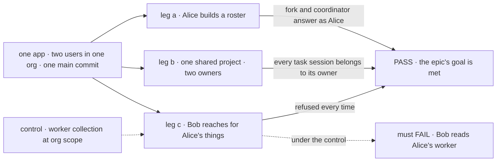
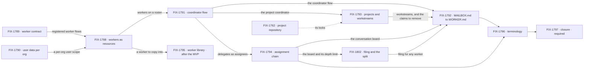

# FIX-1786 · Workforce, private and shared: workers as resources, coordinators, workstreams

**Spec** · [Decisions](DECISIONS.md) · [Rules](BUSINESS-RULES.md) · [Plan](PLAN.md) · [Docs](DOCS.md) · [Evolution](EVOLUTION.md)

## Five teams, before and after

| A team that… | Today | After this epic |
|---|---|---|
| **builds an app on Workforce** | Learns hires, mailboxes, rooms, talk sessions, flow instances and owner pins, and three meanings of "shared" | Learns one rule: a worker's own state and user-scoped data are private to one user, while shared resources and org scope are shared, and a flow writes to org scope by its author's choice. Then workers, each naming the flow that runs it, coordinators and workstreams |
| **runs an org with more than one user** | A hire locked to the org alone is reachable by every member. Mailbox boards are org rows no session narrows, and a drain runs as whoever triggers it | A worker belongs to one user and acts as them. Shared work enters a roster only through its owner |
| **wants a worker of their own** | Edits a `WORKER.md` and restarts, or gets an org hire every member can reach | Forks a standard worker, and the fork is theirs alone. After the MVP, they can also copy a template from the org's library ([FIX-1795](https://linear.app/fixpoint-labs/issue/FIX-1795)) |
| **hands work between workers** | A mailbox's members are fixed when it opens, and workers can't answer each other | A coordinator routes by judgment, best fit, round robin or everyone, to delegates it can add and remove |
| **runs a project with others** (Shift Manager) | Projects are org rows. A workstream is a mailbox id on the row, and members talk in a shared room | A project is private or shared ([Q2](DECISIONS.md#q2)). Each workstream has one owner, whose roster does the work as them, and each member talks to the project through their own coordinator |

**Why now.** The model is hard to hold in your head, even for the person who designed it, and
explaining it better won't fix that ([concept](concept/CONCEPT.md#why-this-doc)). Every child
built on hires, mailboxes and rooms adds to the bill: four of FIX-1763's children build on
mailboxes right now, and the inventory found 38 items on the refactor's ground. Nobody outside
this repo runs Workforce yet, and every `MAILBOX.md` lives in it, so the refactor carries nothing
across: old data is dropped and every file is converted, with no upgrade path
([D9](DECISIONS.md#d9)). The inventory (FIX-1787) runs first, so the refactor starts from a known
base.

## The goal, and how we'll know it's met

**Two users in one org each run a private roster (a standard worker, a fork and a coordinator)
on shared singleton flows, and work one shared project through workstreams they each own, with
every task running as its owner and nothing of one user's reachable by the other except what
was written to a shared resource or to org scope.**

The worker library follows the MVP (Jake, 2026-10-06). FIX-1795's spec goes through its gate
now, and its build starts once this goal is met. Nothing else moves out: at FIX-1793's spec
gate, Jake kept the shared project and its workstreams in the MVP ([Q2](DECISIONS.md#q2)).

A worker's own state and user-scoped data never cross users. Org scope is shared with the org by
design: a worker flow may write there if that is how its author built it, the framework doesn't
refuse it, and other members' runs read it. The built-in worker flows keep a worker's own state
out of it; a custom worker flow's privacy is its author's, not a registration check
([D3](DECISIONS.md#d3), [ER-2](BUSINESS-RULES.md#what-a-team-gets-and-what-it-doesnt)).

| Is it the right goal? | |
|---|---|
| **The real need** | Jake's PRD: one rule set, where a worker's own state and user-scoped data are private to one user, while shared resources and org scope, which a flow writes by its author's choice, are shared (Jake, 2026-10-06). The model is the problem, not its docs. Under it sits a hole: an org-locked hire reaches every member |
| **Smaller, and rejected** | "The terms are renamed." FIX-1796 alone meets it, and the org-locked hire still reaches everyone. Or "workers are private": FIX-1788 alone, while boards and projects stay org rows any member's session drains |
| **Bigger, and not this epic's** | Channels · user-to-user communication · transcript resources · files as migrations · long-lived session memory (FIX-1775) · removing flow instances and owner pins from the engine ([FIX-1798](https://linear.app/fixpoint-labs/issue/FIX-1798), after FIX-1788) |
| **Not done if** | Every child is Done and the closure check hasn't run · it ran with one user · Bob opens, names or writes any of Alice's workers, sessions, boards or workstream sessions · a task in Alice's chain runs as anyone else · one of Alice's boards claims another's rows · a user changes a standard worker · leg b never made a private project · a `MAILBOX.md` is left in the repo · Workforce still registers a flow instance or sets an owner pin · a retired term is left in an export or a published page ([ER-12](BUSINESS-RULES.md#what-a-team-gets-and-what-it-doesnt)) · a bug the closure run found is open |

Leg c is the one a smaller goal would skip. Put the worker collection at org scope, which is
what today's org-locked hire amounts to, and Bob must read Alice's worker: that failure is what
makes leg c's PASS mean something.

| How we verify | |
|---|---|
| **Goal check** | The closure issue's goal check ([FIX-1797](https://linear.app/fixpoint-labs/issue/FIX-1797)), in Shift Manager over HTTP and a browser, on one `main` commit after every other child merges ([ER-28](BUSINESS-RULES.md#the-closure)) |
| **Signal** | Leg a: Alice forks a standard worker and posts to a best-fit coordinator whose delegates she adds; her delegate answers, the routing is recorded, every session is hers. Leg b: Alice and Bob each own a workstream in one shared project; every session in each chain belongs to its owner, two of Alice's boards that hand rows to another flow each drain only their own, and the project view computes both. Leg c: Bob opens Alice's session, names her worker as a delegate, writes her entry, links a session to her worker: each refused. Leg c reaches only for a worker's own state and user-scoped data; a member reading what a worker flow wrote to org scope is not a failure. Alice in a second org sees none of her first org's workers. In leg b, Alice also makes a private project, and Bob can't list, open or read it ([Q2](DECISIONS.md#q2)) |
| **Input** | Shift Manager (`packages/shift-manager`) on its standard install, converted to `WORKER.md`; two users of one org through the app's sign-in; a real model; a held-out post for the coordinator |
| **Anti-game** | No asserting on a child's own tests. No worker, project or delegate seeded by a fixture: the users make each one through the app. No run with one user, and no request of Bob's sent under Alice's identity |
| **Control that must fail** | The worker collection at org scope, which puts a worker itself where every member reads it: leg c must FAIL. Today's `main`: all three legs FAIL |
| **Milestone** | Leg c's worker steps and the control run early, on the commit FIX-1788 merges on, so the privacy fix is proved before the coordinator builds on it rather than last ([ER-30](BUSINESS-RULES.md#the-closure)) |

## What's in the box

Everything in the box composes what ships, plus five Layer 1 mechanism changes and two public
renames ([D3](DECISIONS.md#d3)). The fifth mechanism change is T1, the task tools' roster read per
call, built by FIX-1794 (amended) ([D8](DECISIONS.md#d8)). The fence is the PRD's out-of-scope list and the locks the Architect
carried: what would turn a privacy refactor into a collaboration product. The library in the
box builds after the MVP.

## The set · as of 2026-10-06

A dated snapshot. Live state is Linear and the implementation PRs. Every refactor child is
blocked by FIX-1787 ([ER-23](BUSINESS-RULES.md#how-the-set-is-run)).

| Issue | What it delivers | Why the set needs it | Status |
|---|---|---|---|
| [FIX-1787](https://linear.app/fixpoint-labs/issue/FIX-1787) · inventory | A merge, close or untouched call for every open PR and active issue in the areas the refactor changes | The refactor starts from its result. Route: inventory, no spec, user-approved outside this gate | In Review · posted 2026-10-06 [on FIX-1786](https://linear.app/fixpoint-labs/issue/FIX-1786#comment-9e837aa5): 38 items, 13 merge first, 13 close, 12 untouched; its two owner calls answered 2026-10-06 ([Q2](DECISIONS.md#q2), [Q3](DECISIONS.md#q3)) |
| [FIX-1789](https://linear.app/fixpoint-labs/issue/FIX-1789) · worker contract | Registered worker flows on the installation's list, their registration checks, a standard-only flag per entry | A worker's configuration must name a flow the installation registered and checked | Spec merged ([#2811](https://github.com/fixpoint-labs/flow-state-dev/pull/2811)) · [Q1](DECISIONS.md#q1) decided at its gate: the list |
| [FIX-1790](https://linear.app/fixpoint-labs/issue/FIX-1790) · user data per org | User-scoped data kept per (user, org), for every flow; records stored before dropped ([D9](DECISIONS.md#d9)) | Without it a user's private workers show in every org they belong to | Backlog · spec route |
| [FIX-1788](https://linear.app/fixpoint-labs/issue/FIX-1788) · workers as resources | A worker as a user-scoped resource, run by the singleton flow it names; standard workers projected from files; fork; a session link callers can't seed; Workforce stops using instances and pins | The spine: privacy by construction | Backlog · spec route |
| [FIX-1791](https://linear.app/fixpoint-labs/issue/FIX-1791) · coordinator flow | Delegates in session state, four routing policies, one answer per delegate, a routing record | Replaces the mailbox with a worker, and fixes its fixed membership | Backlog · spec route · carries FIX-1774's dogfood legs and *not done if* list, except leg d (FIX-1793's) and leg e (FIX-1794's) |
| [FIX-1795](https://linear.app/fixpoint-labs/issue/FIX-1795) · worker library | Templates in the org, copied into a user's scope | With hires private, the only way a team shares a worker | In Spec Review ([#2819](https://github.com/fixpoint-labs/flow-state-dev/pull/2819)) · build after the MVP (Jake, 2026-10-06; [Q2](DECISIONS.md#q2)) |
| [FIX-1793](https://linear.app/fixpoint-labs/issue/FIX-1793) · projects and workstreams | Private or shared projects; workstream resources an owner writes and the org reads; a project coordinator; rooms removed | Leg b, and the one new engine rule | Spec merged ([#2823](https://github.com/fixpoint-labs/flow-state-dev/pull/2823)) · private and shared projects in, and a shared project's members open its workstreams ([Q2](DECISIONS.md#q2)) |
| [FIX-1794](https://linear.app/fixpoint-labs/issue/FIX-1794) · assignment chain | Tasks assigned from delegates, down the owner's boards, run as the owner, and followed through; T1, the task tools' roster read per call, amended in [#2839](https://github.com/fixpoint-labs/flow-state-dev/pull/2839) ([D8](DECISIONS.md#d8)) | Today a drain runs as whoever triggers it | Backlog · spec route · carries FIX-1777's "runs as the filer" rule, FIX-1774's leg e and FIX-1780's follow-through |
| [FIX-1802](https://linear.app/fixpoint-labs/issue/FIX-1802) · filing and the split | Orchestration's task tools for any worker whose delegates can take a task; a filed task's worker files pieces in turn, five boards deep and 100 tasks a chain by default | The split is in the MVP, and the DevTeam's workstream is led by an ordinary worker that files ([D8](DECISIONS.md#d8)) | Backlog · joined 2026-10-06 · spec being written, no PR yet |
| [FIX-1792](https://linear.app/fixpoint-labs/issue/FIX-1792) · `MAILBOX.md` to `WORKER.md` | 33 charters converted, all 16 boards in 15 files: 13 files keep a session board, the DevTeam's feature becomes a workstream, and kitchen-sink's escalations board goes with its feature, old mailbox data dropped ([D9](DECISIONS.md#d9)); project claims and a project row's mailbox list removed | One way to declare a worker | Backlog · spec route |
| [FIX-1796](https://linear.app/fixpoint-labs/issue/FIX-1796) · terminology | The retired terms gone from code, docs and the glossary, a task board's seat renamed assignee among them ([D7](DECISIONS.md#d7)) | One term, one thing | Backlog · spec route |
| [FIX-1797](https://linear.app/fixpoint-labs/issue/FIX-1797) · closure · **required** | The QA plan, an early leg-c run when FIX-1788 merges, and the runs on one `main` commit | Proves the whole | Backlog · blocked by every other child except FIX-1795, which builds after the MVP ([ER-27](BUSINESS-RULES.md#how-the-set-is-run)) |

The inventory, ten refactor children and a closure (FIX-1802 joined with [D8](DECISIONS.md#d8));
none of the ten started, and none of the
inventory's merge-first PRs has landed. Whether nine is really eight: FIX-1790 could ride in
FIX-1788, but it changes a persisted key every flow uses, so it keeps its own review; D9 took
away its operator step, not the key change. The collapse trigger, FIX-1789's contract needing only
a registration list, didn't fire: its spec found three checks, attribution and a drawer move
([Q1](DECISIONS.md#q1)).

## How the issues flow into each other

An edge is what one issue hands the next. FIX-1787 blocks every node and is left off the
graph. The closure waits on all of them except the library, which builds after the MVP and
hands the terms sweep nothing: it is new code, written in the new terms
([ER-25](BUSINESS-RULES.md#how-the-set-is-run)). The dashed edge is an input from FIX-1763's set.
The widest windows are two at once: the contract beside per-org keys, and projects beside the
chain and then the split.

## What stays as it is

- **Sessions stay private to one user.** The engine's session ownership doesn't change.
- **Channels** are a later feature, and nothing here renames them
  ([ER-21](BUSINESS-RULES.md#what-no-child-may-do)). They have no paths on `main` to keep: no
  `flows/channels/` path is tracked. Today's refusal of `CHANNEL.md` by name goes with the
  mailbox code ([D9](DECISIONS.md#d9)).
- **Task boards** and `sharedToLineage`, consumed as they ship, except one change: a ledger kept
  per conversation at the owner's user scope ([D6](DECISIONS.md#d6)). A board's seat becomes
  assignee, a rename with no change in behaviour ([D7](DECISIONS.md#d7)). Orchestration's task tools are consumed as
  they ship except T1, built by FIX-1794 (amended): the roster is read per call, and the app's
  actions check it too ([D8](DECISIONS.md#d8)).
- **Flow instances and owner pins** stay in the engine untouched, with no deprecation markers, until FIX-1798 removes them ([D9](DECISIONS.md#d9)); Workforce stops using them.
  Their removal is [FIX-1798](https://linear.app/fixpoint-labs/issue/FIX-1798), outside this epic.
- **Memory**: the memory package's tiers, and long-lived session memory, which is FIX-1775's.
- **Related, deliberately not children:** FIX-1763 and its children · FIX-1650 and its
  children · FIX-1775 · FIX-1778, consumed · FIX-1798, the engine removal ([PLAN.md](PLAN.md#not-children-deliberately)).

## Sign off

**[The goal](#the-goal-and-how-well-know-its-met), at that size:** two users, a private roster
each, one shared project with an owner per workstream, and nothing crossing except shared
resources and org scope. If wrong: we rename the parts while a hire still reaches every member.

1. **[D1](DECISIONS.md#d1) · Nine refactor children after the inventory, and a closure, now.**
   If wrong: a refactor that rebuilds under in-flight work, or one nobody needed this year.

**Answered by Jake, 2026-10-06.** [Q1](DECISIONS.md#q1) · where an author says a flow runs
workers: a list the installation keeps, not a `defineWorkerFlow()` wrapper, chosen at
FIX-1789's spec gate on a POC of both. [Q2](DECISIONS.md#q2) · private projects are in and FIX-1763's
"projects stay org-level" is lifted; FIX-1762's stack merged first. The library follows the MVP:
FIX-1795's spec continues, and its build waits until the goal is met. At FIX-1793's spec gate,
the shared half stays in the MVP.
[Q3](DECISIONS.md#q3) · FIX-1774 and FIX-1777 are closed into FIX-1791 and FIX-1794. At FIX-1789's
gate, no engine rule on org-scope writes. At FIX-1794's, [D6](DECISIONS.md#d6) · a board keeps its
tasks per conversation, a Layer 1 change in [D3](DECISIONS.md#d3). At FIX-1796's,
[D7](DECISIONS.md#d7) · discovery's `seats` domain becomes `workers` with no alias, [D3](DECISIONS.md#d3)'s
first public rename; a task board kept "seat" until 2026-10-07. The product owner, [D8](DECISIONS.md#d8) · any
worker can file work, and the split is in the MVP: FIX-1802 joins the set.

**Answered by the product owner, 2026-10-07.** [D8](DECISIONS.md#d8) · a worker gets
orchestration's existing task tools when one of its delegates can take a task, with no flag; a
chain goes five boards deep and holds 100 tasks by default, which the app can change.
[D9](DECISIONS.md#d9) · no backwards support of any kind while there are no consumers: no
migration, upgrade step, dual-read or refusal by name, and old data is dropped. BP-030 doesn't
apply to this epic until a consumer exists. FIX-1792's D2 is answered: old data is dropped.
[D7](DECISIONS.md#d7), amended · a task board's seat becomes assignee ("Ok let's go with
assignee"), [D3](DECISIONS.md#d3)'s second public rename, and "seat" is retired everywhere.

Engineering calls I
made as EM, for the record: [D2](DECISIONS.md#d2) to [D5](DECISIONS.md#d5). Rules:
[BUSINESS-RULES.md](BUSINESS-RULES.md). Order: [PLAN.md](PLAN.md).

Epic · the inventory, ten children and a closure · Workforce: Shift Manager ·
[FIX-1786](https://linear.app/fixpoint-labs/issue/FIX-1786) · Goals 2 and 4
([`docs/objectives.md`](../../../docs/objectives.md)): it moves Workforce wholly onto the session,
user and org scopes and adds the one rule they lack (owner writes, org reads), the Workforce half
of Goal 2's scoped-state gap; and it closes Workforce's privacy hole, most of its Goal 4 gap and
none outside it
