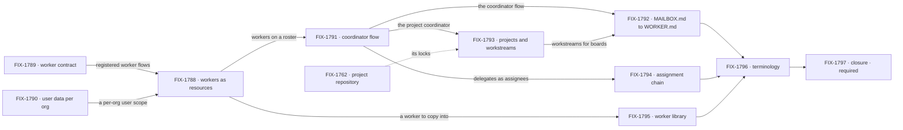

# FIX-1786 · Workforce, private and shared: workers as resources, coordinators, workstreams

**Spec** · [Decisions](DECISIONS.md) · [Rules](BUSINESS-RULES.md) · [Plan](PLAN.md) · [Docs](DOCS.md) · [Evolution](EVOLUTION.md)

## Five teams, before and after

| A team that… | Today | After this epic |
|---|---|---|
| **builds an app on Workforce** | Learns seats, mailboxes, rooms, talk sessions, flow instances and owner pins, and three meanings of "shared" | Learns one rule: everything is private to one user, and only shared resources are shared. Then workers, each naming the flow that runs it, coordinators and workstreams |
| **runs an org with more than one user** | A hire locked to the org alone is reachable by every member. Mailbox boards are org rows no session narrows, and a drain runs as whoever triggers it | A worker belongs to one user and acts as them. Shared work enters a roster only through its owner |
| **wants a worker of their own** | Edits a `WORKER.md` and restarts, or gets an org hire every member can reach | Forks a standard worker, or copies a template from the org's library. The copy is theirs alone |
| **hands work between workers** | A mailbox's members are fixed when it opens, and workers can't answer each other | A coordinator routes by judgment, best fit, round robin or everyone, to delegates it can add and remove |
| **runs a project with others** (Shift Manager) | Projects are org rows. A workstream is a mailbox id on the row, and members talk in a shared room | A project is private or shared ([Q2](DECISIONS.md#q2)). Each workstream has one owner, whose roster does the work as them, and each member talks to the project through their own coordinator |

**Why now.** The model is hard to hold in your head, even for the person who designed it, and
explaining it better won't fix that ([concept](concept/CONCEPT.md#why-this-doc)). Every child
built on seats, mailboxes and rooms adds to the bill: four of FIX-1763's children build on
mailboxes right now, and the inventory found 38 items on the refactor's ground. The framework is pre-1.0 and every `MAILBOX.md` lives in this repo, so a
loud refusal costs less today than two formats later. The inventory (FIX-1787) runs first, so
the refactor starts from a known base.

## The goal, and how we'll know it's met

**Two users in one org each run a private roster (a standard worker, a fork, a library copy and
a coordinator) on shared singleton flows, and work one shared project through workstreams they
each own, with every task running as its owner and nothing of one user's reachable by the other
except what was written to a shared resource.**

| Is it the right goal? | |
|---|---|
| **The real need** | Jake's PRD: one rule set, where everything is private to one user and the only shared things are shared resources. The model is the problem, not its docs. Under it sits a hole: an org-locked hire reaches every member |
| **Smaller, and rejected** | "The terms are renamed." FIX-1796 alone meets it, and the org-locked hire still reaches everyone. Or "workers are private": FIX-1788 alone, while boards and projects stay org rows any member's session drains |
| **Bigger, and not this epic's** | Channels · user-to-user communication · transcript resources · files as migrations · long-lived session memory (FIX-1775) · removing flow instances and owner pins from the engine ([FIX-1798](https://linear.app/fixpoint-labs/issue/FIX-1798), after FIX-1788) |
| **Not done if** | Every child is Done and the closure check hasn't run · it ran with one user · Bob opens, names or writes any of Alice's workers, sessions, boards or workstream sessions · a task in Alice's chain runs as anyone else · one of Alice's boards claims another's rows · a user changes a standard worker · leg b never made a private project · a record stored before FIX-1790 reads in two orgs · a `MAILBOX.md` loads · Workforce still registers a flow instance or sets an owner pin · a retired term is left in an export or a published page ([ER-12](BUSINESS-RULES.md#what-a-team-gets-and-what-it-doesnt)) · a bug the closure run found is open |

Leg c is the one a smaller goal would skip. Put the worker collection at org scope, which is
what today's org-locked hire amounts to, and Bob must read Alice's worker: that failure is what
makes leg c's PASS mean something.

| How we verify | |
|---|---|
| **Goal check** | The closure issue's goal check ([FIX-1797](https://linear.app/fixpoint-labs/issue/FIX-1797)), in Shift Manager over HTTP and a browser, on one `main` commit after every other child merges ([ER-28](BUSINESS-RULES.md#the-closure)) |
| **Signal** | Leg a: Alice forks a standard worker, copies a template, and posts to a best-fit coordinator whose delegates she adds; her delegate answers, the routing is recorded, every session is hers. Leg b: Alice and Bob each own a workstream in one shared project; every session in each chain belongs to its owner, two of Alice's boards that hand rows to another flow each drain only their own, and the project view computes both. Leg c: Bob opens Alice's session, names her worker as a delegate, writes her entry, links a session to her worker: each refused. Alice in a second org sees none of her first org's workers, nor anything stored before FIX-1790. In leg b, Alice also makes a private project, and Bob can't list, open or read it ([Q2](DECISIONS.md#q2)) |
| **Input** | Shift Manager (`packages/shift-manager`) on its standard install, converted to `WORKER.md`; two users of one org through the app's sign-in; a real model; a held-out post for the coordinator |
| **Anti-game** | No asserting on a child's own tests. No worker, project or delegate seeded by a fixture: the users make each one through the app. No run with one user, and no request of Bob's sent under Alice's identity |
| **Control that must fail** | The worker collection at org scope: leg c must FAIL. Today's `main`: all three legs FAIL |
| **Milestone** | Leg c's worker steps and the control run early, on the commit FIX-1788 merges on, so the privacy fix is proved before the coordinator builds on it rather than last ([ER-30](BUSINESS-RULES.md#the-closure)) |

## What's in the box

Everything in the box composes what ships, plus three Layer 1 changes the box names
([D3](DECISIONS.md#d3)). The fence is the PRD's out-of-scope list and the locks the Architect
carried: what would turn a privacy refactor into a collaboration product.

## The set · as of 2026-10-06

A dated snapshot. Live state is Linear and the implementation PRs. Every refactor child is
blocked by FIX-1787 ([ER-23](BUSINESS-RULES.md#how-the-set-is-run)).

| Issue | What it delivers | Why the set needs it | Status |
|---|---|---|---|
| [FIX-1787](https://linear.app/fixpoint-labs/issue/FIX-1787) · inventory | A merge, close or untouched call for every open PR and active issue in the areas the refactor changes | The refactor starts from its result. Route: inventory, no spec, user-approved outside this gate | In Review · posted 2026-10-06 [on FIX-1786](https://linear.app/fixpoint-labs/issue/FIX-1786#comment-9e837aa5): 38 items, 13 merge first, 13 close, 12 untouched; its two owner calls answered 2026-10-06 ([Q2](DECISIONS.md#q2), [Q3](DECISIONS.md#q3)) |
| [FIX-1789](https://linear.app/fixpoint-labs/issue/FIX-1789) · worker contract | Registered worker flows, the private-state rule, a standard-only flag | A worker's configuration must name a flow that keeps its state private | Backlog · spec route · [Q1](DECISIONS.md#q1)'s shape is chosen at its spec gate on a POC of both, then recorded in the epic |
| [FIX-1790](https://linear.app/fixpoint-labs/issue/FIX-1790) · user data per org | User-scoped data kept per (user, org), for every flow; records stored before moved to one org or refused | Without it a user's private workers show in every org they belong to | Backlog · spec route |
| [FIX-1788](https://linear.app/fixpoint-labs/issue/FIX-1788) · workers as resources | A worker as a user-scoped resource, run by the singleton flow it names; standard workers projected from files; fork; a session link callers can't seed; instances and pins deprecated | The spine: privacy by construction | Backlog · spec route |
| [FIX-1791](https://linear.app/fixpoint-labs/issue/FIX-1791) · coordinator flow | Delegates in session state, four routing policies, one answer per delegate, a routing record | Replaces the mailbox with a worker, and fixes its fixed membership | Backlog · spec route · carries FIX-1774's dogfood legs and *not done if* list |
| [FIX-1795](https://linear.app/fixpoint-labs/issue/FIX-1795) · worker library | Templates in the org, copied into a user's scope | With hires private, the only way a team shares a worker | Backlog · spec route |
| [FIX-1793](https://linear.app/fixpoint-labs/issue/FIX-1793) · projects and workstreams | Private or shared projects; workstream resources an owner writes and the org reads; a project coordinator; rooms removed | Leg b, and the one new engine rule | Backlog · spec route · private projects in ([Q2](DECISIONS.md#q2)) |
| [FIX-1794](https://linear.app/fixpoint-labs/issue/FIX-1794) · assignment chain | Tasks assigned from delegates, down the owner's boards, run as the owner | Today a drain runs as whoever triggers it | Backlog · spec route · carries FIX-1777's "runs as the filer" rule |
| [FIX-1792](https://linear.app/fixpoint-labs/issue/FIX-1792) · `MAILBOX.md` to `WORKER.md` | 33 charters converted, 15 boards resolved, old files refused by name | One way to declare a worker | Backlog · spec route |
| [FIX-1796](https://linear.app/fixpoint-labs/issue/FIX-1796) · terminology | The retired terms gone from code, docs and the glossary | One term, one thing | Backlog · spec route |
| [FIX-1797](https://linear.app/fixpoint-labs/issue/FIX-1797) · closure · **required** | The QA plan, an early leg-c run when FIX-1788 merges, and the runs on one `main` commit | Proves the whole | Backlog · blocked by every other child |

The inventory, nine refactor children and a closure; none of the nine started, and none of the
inventory's merge-first PRs has landed. Whether nine is really eight: FIX-1790 could ride in
FIX-1788, but it changes a persisted key every flow uses and moves what was stored before by an
operator step, so it keeps its own review. Collapse trigger: if FIX-1789's spec finds the contract
needs only a registration list, it folds into FIX-1788 ([D1](DECISIONS.md#d1)).

## How the issues flow into each other

An edge is what one issue hands the next. FIX-1787 blocks every node and is left off the
graph; the closure waits on all of them. The dashed edge is an input from FIX-1763's set. The
widest window is three at once: projects, the chain and the library.

## What stays as it is

- **Sessions stay private to one user.** The engine's session ownership doesn't change.
- **Channels**: their kinds at `workforce/flows/channels/<kind>.ts` and `CHANNEL.md`'s `flow:`,
  untouched; channels are a later feature ([ER-20](BUSINESS-RULES.md#what-no-child-may-do)).
- **Task boards** and `sharedToLineage`, consumed as they ship.
- **Flow instances and owner pins** stay in the engine, deprecated; Workforce stops using them.
  Their removal is [FIX-1798](https://linear.app/fixpoint-labs/issue/FIX-1798), outside this epic.
- **Memory**: the memory package's tiers, and long-lived session memory, which is FIX-1775's.
- **Related, deliberately not children:** FIX-1763 and its children · FIX-1650 and its
  children · FIX-1775 · FIX-1778, consumed · FIX-1798, the engine removal ([PLAN.md](PLAN.md#not-children-deliberately)).

## Sign off

**[The goal](#the-goal-and-how-well-know-its-met), at that size:** two users, a private roster
each, one shared project with an owner per workstream, and nothing crossing except shared
resources. If wrong: we rename the parts while a hire still reaches every member.

1. **[D1](DECISIONS.md#d1) · Nine refactor children after the inventory, and a closure, now.**
   If wrong: a refactor that rebuilds under in-flight work, or one nobody needed this year.

**Answered by Jake, 2026-10-06.** [Q1](DECISIONS.md#q1) · where an author says a flow runs
workers: chosen at FIX-1789's spec gate on a POC that builds both a list the installation keeps
and a `defineWorkerFlow()` wrapper, then recorded in the epic before FIX-1788 or FIX-1791 names
one; Jake leans to the wrapper. [Q2](DECISIONS.md#q2) · private projects are in and FIX-1763's
"projects stay org-level" is lifted; FIX-1762's stack merged first. Whether the shared half stays
in the MVP is asked at FIX-1793's spec gate.
[Q3](DECISIONS.md#q3) · FIX-1774 and FIX-1777 are closed into FIX-1791 and FIX-1794. Engineering calls I
made as EM, for the record: [D2](DECISIONS.md#d2) to [D5](DECISIONS.md#d5). Rules:
[BUSINESS-RULES.md](BUSINESS-RULES.md). Order: [PLAN.md](PLAN.md).

Epic · the inventory, nine children and a closure · Workforce: Shift Manager ·
[FIX-1786](https://linear.app/fixpoint-labs/issue/FIX-1786) · Goals 2 and 4
([`docs/objectives.md`](../../../docs/objectives.md)): it moves Workforce wholly onto the session,
user and org scopes and adds the one rule they lack (owner writes, org reads), the Workforce half
of Goal 2's scoped-state gap; and it closes Workforce's privacy hole, most of its Goal 4 gap and
none outside it
