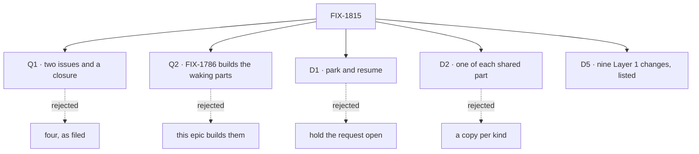

# FIX-1815 · Decisions

[Spec](SPEC.md) · **Decisions** · [Rules](BUSINESS-RULES.md) · [Plan](PLAN.md) · [Docs](DOCS.md) · [Evolution](EVOLUTION.md)

The calls that sit above either child. Three are open and belong to the product owner (Q1 to
Q3). Five are engineering calls I made as EM (D1 to D5); they are recorded so no child reopens
them.

## The tree

Q3, D3 and D4 have no rejected sibling worth a node: their cards name what lost.

## Q1 · Two issues and a closure, or all four? (open)

**Plain terms.** The epic as filed has four issues. Two of them do not move the outcome.
FIX-1818 moves both kinds onto one answer-once check. FIX-1819 decides whether skills get
helpers back, and that answer may be "no".

**The trade-off.** Cut, the epic holds only what the goal needs. The one-check rule becomes
epic rule [ER-6](BUSINESS-RULES.md#what-no-child-may-do), which FIX-1816's spec obeys, and the
question that remains, whether "ask the delegate" becomes an ask and so FIX-1791's ledger token
goes, moves into FIX-1816's spec. Kept, both block the closure, and one of them may close with
nothing built.

**My recommendation: cut both.** If ask rides the board row's claim ticket or the delivery ledger
(`packages/workforce/src/delivery-ledger.ts`, on `main`), there is no second check to retire, so
FIX-1818 has no work of its own. FIX-1819 goes to Backlog, unparented, and comes back after ask
ships. Neither cut changes the outcome, so the coordinator acts on them after this gate.

**What would change my mind.** FIX-1816's spec finds that ask can ride neither existing check.
Then FIX-1818's work is real and it rejoins as a child.

**What being wrong costs.** One issue re-filed later. Nothing is built twice in between, because
ER-6 forbids a third check.

It comes down to the outcome: neither extra issue moves it, and both would block the closure.

## Q2 · Who builds the shared waking parts? (open)

**Plain terms.** Both kinds need two parts. One is a signal that a hand-off finished. The other
is a durable note that a waiting turn is owed a wake, so a restart cannot lose it. FIX-1786
already specifies both: FIX-1794 P2's `completed`, `errored` and `parked` notices with their
pending-notice marker (its S6 and S7), and FIX-1802's settle-owed marker (its BR-17). Neither is
on `main`. FIX-1794 is in development; FIX-1802's build is on hold for a delegation amendment
(session fix-1786-pm, `fixpoint-labs/agent-mailbox#38`).

**The trade-off.** If FIX-1786 builds them, nothing already approved changes, but this epic's
builds wait on FIX-1786's pace, including that hold. If this epic builds them, ask can ship
sooner, but two approved specs, one already in development, are amended by another session and
go back through their gates.

**My recommendation: FIX-1786 builds them, as specified, and this epic consumes them.** Both
specs here proceed now. FIX-1816's spec confirms ask can ride a board row, so both parts fit
unchanged, or names the exact gap and asks FIX-1786 for an amendment. It does not build a copy
([ER-7](BUSINESS-RULES.md#what-no-child-may-do)). One gap is already visible: FIX-1794's
`onTaskSettled` is an entry on Workforce's coordinator flow, so an ask below Workforce cannot hear it as specified.

**What would change my mind.** FIX-1802's amendment drops or reshapes the settle-owed marker, or
its hold outlasts both specs here. Then this epic builds the marker and FIX-1802 consumes it.

**What being wrong costs.** Wait wrongly, and ask ships weeks late for a part that was ready to
build. Build wrongly, and there are two wake mechanisms, which is the lost-or-duplicate answer
this epic exists to remove.

It comes down to the approved specs: both parts are already defined, and a second definition re-gates two.

## Q3 · FIX-1780 says Done, but its notices never shipped (open)

**Plain terms.** FIX-1780 promised `onTaskSettled`, the signal a filer hears when its task ends.
Linear marks it Done. Only its S5a shipped (#2761). S1 to S5 never did, and FIX-1794's evolution
record moved them to FIX-1794 P2. The feasibility spike read "Done" and cited a signal that does
not exist.

**The trade-off.** A comment corrects the record and leaves one owner. A reopen or a new issue
gives the same signal a second owner beside FIX-1794 P2.

**My recommendation: keep Done, add a comment and a relation to FIX-1794** saying S1 to S5 moved
there and S5a is what shipped. Canceled would misstate S5a.

**What would change my mind.** The product owner reads "Done" as "everything in the
description shipped". Then move it to Canceled with the same comment.

**What being wrong costs.** The next reader builds on a signal that is not there, as the spike
did.

It comes down to ownership: a reopen or a new issue gives the signal two owners.

## D1 · Ask parks and resumes; nothing holds a request open

| | |
|---|---|
| **Instead of** | Holding the asking request open until the answer arrives |
| **Because** | The spike: a held request hits serverless time limits, holds a lease, and two workers that ask each other deadlock. Park and resume already works for human approval: the turn suspends on the tool call and is rebuilt from the durable item log (`core/src/blocks/internal/generator-resume.ts`) |
| **Locks in** | One replay of the asking turn per wake, which is the cost each ask pays. A server-side resume (L1) |

## D2 · One of each shared part, across both epics

| | |
|---|---|
| **Instead of** | Each kind of hand-off, or each epic, with its own signal, marker or answer-once check |
| **Because** | Two mechanisms that both decide "answered once" disagree at the edges, and a duplicate or lost answer is the failure this epic removes. The product owner decided on one answer-once fence on 2026-10-08 |
| **Locks in** | One child-finished signal (FIX-1794 P2's notices). One resume-owed marker (FIX-1802's settle-owed family). One answer-once check, an existing one. Q2 names who builds the first two |

## D3 · Every ask is bounded

| | |
|---|---|
| **Instead of** | An ask that may wait without limit |
| **Because** | A asks B while B asks A, and both wait forever. Nothing today carries a cancel from a parent to its child; `dispatch-and-execute.ts` combines only the request signal and lease loss |
| **Locks in** | A mandatory timeout and a depth cap on every ask, and a cancel of the asker that reaches the asked child. The values are FIX-1816's |

## D4 · Dispatch stays fire-and-forget by default

| | |
|---|---|
| **Instead of** | Making every dispatch wait |
| **Because** | A dispatch on `main` returns before the dispatched work runs, and its callers are written for that. A default that waits changes all of them |
| **Locks in** | Ask is a separate, opt-in call |

## D5 · The set's Layer 1 changes are these nine

| | |
|---|---|
| **Instead of** | Each child finding its Layer 1 changes during its build |
| **Because** | This is framework work. A change to a persisted format or a public export outlives the epic, so each one is named, owned and proved before a child builds it |
| **Locks in** | A child that needs a tenth comes up to this epic first ([ER-11](BUSINESS-RULES.md#what-no-child-may-do)) |

| # | Change | Area | Owner | Critical | Proved by · red state |
|---|---|---|---|---|---|
| L1 | Server-side resume of a turn parked on a task or internal source | `engine` · beside `routes/resume-routes.ts`; `public-reentry.ts` unchanged | FIX-1816 | New internal verb at an authorization boundary (BP-031); **no new public route** | Resumes a parked task-source turn; the public route still answers not-found. Red: nothing can resume it today |
| L2 | A wait binding: the parked turn names the request it waits on | `core` · `generator-resume.ts`; `engine` execution | FIX-1816 | **Persisted** in the item log | Leg a's restart. Red: after a restart the turn cannot find what it waited on |
| L3 | A durable resume-owed marker, the same family as FIX-1802's settle-owed (BR-17) | `orchestration` · board rows | Q2 · recommended FIX-1802 | **Persisted** | Leg a's waker control must FAIL |
| L4 | The child-finished signal FIX-1780 promised | `orchestration` board gate; `workforce` `onTaskSettled` | Q2 · recommended FIX-1794 P2 | **Public** entry name | FIX-1794's V5; leg a consumes it |
| L5 | `awaitDispatch`: dispatch once under `ctx.runOnce`, then read `resultOf(requestId)` | `core` context; `engine` read | FIX-1816 | **Public export** and a new read verb | Leg a's `runOnce` control must FAIL: B runs twice |
| L6 | A board worker that asks parks its own row; its lease does not lapse into a second claim | `orchestration` · `dispatch-and-execute.ts`, lease renewal | FIX-1816 | **Persisted** row state | An asking worker past its lease is not re-claimed. Red: today a second worker claims it |
| L7 | A timeout and a depth cap on each ask; a cancel reaches the asked child (D3) | `core`, `engine`; `orchestration` cascade | FIX-1816 | **Persisted** deadline | A asks B, B asks A: both end at the timeout. Red: both wait forever |
| L8 | A test-harness dispatch seam with a durable in-memory runtime that survives a simulated restart | `@flow-state-dev/testing` | FIX-1816 | **Public export** | L1, L2 and L5 to L7's tests run on it. Red: today's harness drops the wait on restart |
| L9 | An answered park resumes the same task session; a finished session takes a follow-up question, and a follow-up task as a new row bound to it | `orchestration` park path; `workforce` task entry | FIX-1817 | **Persisted**: a row keeps its session after it ends | Leg b. Red: FIX-1794 BR-25's answer has no path back |

L9 keeps FIX-1794's rule that a finished task declines writes (its goal leg e): a follow-up task
is a new row, not a write to the old one.

## Who owns what

Read a row: one cell builds or decides, the others consume or prove. The two dashed cells in the
FIX-1786 column are Q2's recommendation. They become solid when the product owner answers it.

## Decided before review, recorded so no child reopens them

- **Two kinds, ask and assign, and both stay.** The product owner, 2026-10-08.
- **An assigned task's session works across turns until resolved, and never locks.** Same.
- **One answer-once fence under both kinds.** Same; D2 applies it.
- **The spike's facts, re-checked on `main` at f9e7b131.** No `onTaskSettled`, `awaitDispatch`,
  `dispatchAndWait` or `resultOf(requestId)` in code. `metadata.dispatch.from` carries `block`,
  `sessionId` and `lineageId`, no request id. FIX-1659 is about a reassign that leaves a claim in
  place, not cancellation reaching children.

## What the end-state POC showed

None built. The spike was read-only, and the two kinds touch different callers, so a POC is the
first move inside FIX-1816's spec, not here.

## How it got here

- **Filed (Oct 8)**: the epic and four children, after the spike and the product owner's three calls.
- **Drafted (Oct 8)**: the closure FIX-1820 filed; two cuts proposed (Q1); the build owner raised (Q2).
