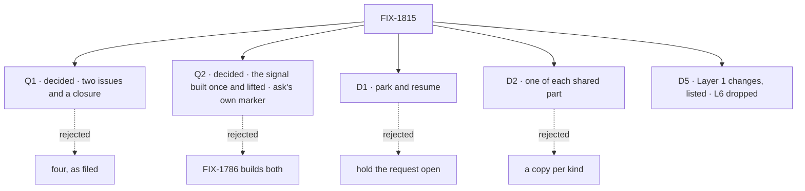

# FIX-1815 · Decisions

[Spec](SPEC.md) · **Decisions** · [Rules](BUSINESS-RULES.md) · [Plan](PLAN.md) · [Docs](DOCS.md) · [Evolution](EVOLUTION.md)

The calls that sit above either child. None is open. Q1 was the product owner's, answered on
2026-10-08. Q2 was decided on 2026-10-08 by the two epics' coordinators, to whom the product owner
delegated it. Q3 was an engineering call the coordinator absorbed on 2026-10-08. Five are engineering calls I made as EM (D1 to D5); they are recorded so no child
reopens them. The product owner's approval of the FIX-1816 and FIX-1817 specs on 2026-10-08 changed
D5's rows; they are recorded in [D5 amendments from the child specs](#d5-amendments-from-the-child-specs),
with the product owner's call on a FIX-1794 P2 slip. The cross-spec pass of the two specs, which
the product owner authorized on 2026-10-08, settled four more points, recorded
[below](#decided-in-the-cross-spec-pass).

## The tree

Q3, D3 and D4 have no rejected sibling worth a node: their cards name what lost.

## Q1 · Two issues and a closure, or all four? (decided 2026-10-08)

**Decided by the product owner**, in session on 2026-10-08: "cut both". The epic holds two
issues and a closure.

**Plain terms.** The epic as filed had four issues. Two of them did not move the outcome.
FIX-1818 moved both kinds onto one answer-once check. FIX-1819 decided whether skills get
helpers back, and that answer may be "no".

**What was decided.**

1. **FIX-1818 is cut.** It is Canceled in Linear. Its one-check rule became epic rule
   [ER-6](BUSINESS-RULES.md#what-no-child-may-do), which FIX-1816's spec obeys. Its remaining
   question, whether "ask the delegate" becomes an ask and so FIX-1791's ledger token goes, moved
   into FIX-1816's spec.
2. **FIX-1819 is cut.** It is in Backlog, unparented, still blocked by FIX-1816, and revisited
   after ask ships.
3. **The closure FIX-1820** is blocked by FIX-1816 and FIX-1817 only.

**Why, as it was weighed.** Cut, the epic holds only what the goal needs; kept, both would have
blocked the closure, and one of them might have closed with nothing built. If ask rides the board
row's claim ticket or the delivery ledger (`packages/workforce/src/delivery-ledger.ts`, on
`main`), there is no second check to retire, so FIX-1818 had no work of its own. Neither cut
changed the outcome.

**What would reopen it.** FIX-1816's spec finds that ask can ride neither existing check. Then
FIX-1818's work is real and it rejoins as a child.

**What it costs.** At most one issue re-filed later. Nothing is built twice in between, because
ER-6 forbids a third check.

It comes down to the outcome: neither extra issue moves it, and both would block the closure.

## Q2 · Who builds the shared waking parts? (decided 2026-10-08)

**Decided by the two coordinators**, this epic's and FIX-1786's (session `fix-1786-pm`), on
2026-10-08. The product owner delegated the call to them. Recorded as given, so no child reopens it.

**Plain terms.** Both kinds need two parts. One is a signal that a hand-off finished. The other
is a durable note that a waiting turn is owed a wake, so a restart cannot lose it. FIX-1786
specifies the first (FIX-1794 P2's `completed`, `errored` and `parked` notices, its S6 and S7) and
a note of the second kind (FIX-1802's settle-owed marker, its BR-17). Neither is on `main`.

**What was decided.**

1. **The resume-owed marker: the same pattern, a separate marker.** FIX-1802's settle-owed marker
   stays as FIX-1802 specifies it; #2889 left it unchanged. It starts a *new* turn in the parked
   row's task session, and ask resumes the *parked* turn, so ask shares its pattern, not its
   mechanism. FIX-1816 builds the Layer 1 resume verb and its own resume-owed marker on that
   pattern: written in the same write that ends the turn, cleared only by what it owes, replayed
   on any touch of the board (L3).
2. **The child-finished signal: built once, then lifted.** FIX-1794 P2 builds the task notice and
   `onTaskSettled` (its S6 and S7) layer-clean: pure functions over the row and the notice, no
   Workforce imports, in one module. FIX-1816 lifts that module into `orchestration` and re-points
   S6 and S7 at it. One implementation, moved once, no parallel copy (L4). FIX-1816's spec sends
   `fix-1786-pm` the seam's shape before FIX-1794 P2 starts.
3. **The order.** FIX-1814, then FIX-1794 P2, then FIX-1802 P1, each gated on the product owner's
   merge, with no dates. FIX-1817's build waits on FIX-1802. FIX-1816's lift of the
   child-finished signal waits on FIX-1794 P2. FIX-1816's other rows do not wait
   ([ER-15](BUSINESS-RULES.md#how-the-set-is-run)).
4. **The answered park.** FIX-1817 owns "an answered park resumes the *same* task session".
   FIX-1794 BR-25's two notices, `parked` and then `completed`, stay unchanged. If FIX-1817 changes
   what a park writes on the row, it tells `fix-1786-pm` before FIX-1794 P2 merges.

**What it settles.** The gap the recommendation left open, that FIX-1794's `onTaskSettled` was a
Workforce entry an ask below Workforce could not hear, closes by the lift, not by a second copy.
FIX-1802's marker and FIX-1794 BR-25 stay as specified. FIX-1794 P2 builds S6 and S7
layer-clean, as the coordinators agreed, and the lift's re-pointing of them is one of two agreed
touches of FIX-1794's code; FIX-1817's L9 rows are the other ([ER-12](BUSINESS-RULES.md#what-no-child-may-do), [ER-21](BUSINESS-RULES.md#how-the-set-is-run)).

**What it costs.** Two owed markers share one pattern, so a change to the pattern is made in both.
FIX-1816 carries the lift, which lands only after FIX-1794 P2 merges.

It comes down to what each wake does: a new turn and a resumed turn share a pattern, not a marker.

## Q3 · FIX-1780 says Done, but its notices never shipped (decided 2026-10-08)

**Decided as an engineering call**, absorbed by the coordinator under the epic-pm posture on
2026-10-08: FIX-1780 stays Done, with a correcting comment and a relation to FIX-1794.

**Plain terms.** FIX-1780 promised `onTaskSettled`, the signal a filer hears when its task ends.
Linear marks it Done. Only its S5a shipped (#2761). S1 to S5 never did, and FIX-1794's evolution
record moved them to FIX-1794 P2. The feasibility spike read "Done" and cited a signal that does
not exist.

**What was decided.**

1. **FIX-1780 stays Done.** Canceled would misstate S5a, which shipped.
2. **A correcting comment is posted on FIX-1780**, saying S1 to S5 moved to FIX-1794 P2 and S5a
   is what shipped.
3. **A related relation to FIX-1794 is added**, so the next reader finds the owner.

**Why, as it was weighed.** A comment corrected the record and left one owner. A reopen or a new
issue would have given the same signal a second owner beside FIX-1794 P2.

**What would reopen it.** The product owner reads "Done" as "everything in the description
shipped". Then FIX-1780 moves to Canceled with the same comment.

**What it costs.** Done stays half true on its face; the comment carries the rest. Without it,
the next reader builds on a signal that is not there, as the spike did.

It comes down to ownership: a reopen or a new issue gives the signal two owners.

## D1 · Ask parks and resumes; nothing holds a request open

| | |
|---|---|
| **Instead of** | Holding the asking request open until the answer arrives |
| **Because** | The spike: a held request hits serverless time limits, holds a lease, and two workers that ask each other deadlock. Park and resume already works for human approval: the turn suspends on the tool call and is rebuilt from the durable item log (`core/src/blocks/internal/generator-resume.ts`) |
| **Locks in** | One replay of the asking turn per wake, which is the cost each ask pays. A server-side resume (L1) |

## D2 · One of each shared part, across both epics

| | |
|---|---|
| **Instead of** | Each kind of hand-off, or each epic, with its own signal, owed-marker pattern or answer-once check |
| **Because** | Two mechanisms that both decide "answered once" disagree at the edges, and a duplicate or lost answer is the failure this epic removes. The product owner decided on one answer-once fence on 2026-10-08 |
| **Locks in** | One child-finished signal: FIX-1794 P2's notices, one module, lifted into `orchestration` by FIX-1816, never copied. One owed-marker pattern, FIX-1802's settle-owed (BR-17); FIX-1816's resume-owed marker follows it, because a resumed turn is not a new one. One answer-once check, an existing one. [Q2](#q2) records who builds what |

## D3 · Every ask is bounded

| | |
|---|---|
| **Instead of** | An ask that may wait without limit |
| **Because** | A asks B while B asks A, and both wait forever. Nothing today carries a cancel from a parent to its child; `dispatch-and-execute.ts` combines only the request signal and lease loss |
| **Locks in** | A mandatory timeout and a depth cap on every ask, and a cancel of the asker that reaches the asked child. As FIX-1816 settled them: the depth cap holds by construction at depth 1, since a turn working a task row cannot ask, and the timeout is fixed, fired by the durability sweeper's expiry step within 10 to 20 minutes (L7) |

## D4 · Dispatch stays fire-and-forget by default

| | |
|---|---|
| **Instead of** | Making every dispatch wait |
| **Because** | A dispatch on `main` returns before the dispatched work runs, and its callers are written for that. A default that waits changes all of them |
| **Locks in** | Ask is an opt-in option on the call, `addTask`'s `waitForResponse` (L5); without it a hand-off is fire-and-forget |

## D5 · The set's Layer 1 changes are these, L6 dropped

| | |
|---|---|
| **Instead of** | Each child finding its Layer 1 changes during its build |
| **Because** | This is framework work. A change to a persisted format or a public export outlives the epic, so each one is named, owned and proved before a child builds it |
| **Locks in** | A child that needs another comes up to this epic first ([ER-11](BUSINESS-RULES.md#what-no-child-may-do)). The rows keep their numbers; L6 is dropped, not renumbered |

| # | Change | Area | Owner | Critical | Proved by · red state |
|---|---|---|---|---|---|
| L1 | Server-side resume of a turn parked on a task or internal source | `engine` · beside `routes/resume-routes.ts`; `public-reentry.ts` unchanged | FIX-1816 | New internal verb at an authorization boundary (BP-031); **no new public route** | Resumes a parked task-source turn; the public route still answers not-found. Red: nothing can resume it today |
| L2 | A wait binding: the parked turn names the task row it waits on (L5) | `core` · `generator-resume.ts`; `engine` execution | FIX-1816 | **Persisted** in the item log | Leg a's restart. Red: after a restart the turn cannot find what it waited on |
| L3 | A durable resume-owed marker on FIX-1802's settle-owed pattern (BR-17): written in the write that ends the turn, cleared only by what it owes, replayed on any board touch. FIX-1802's own marker is unchanged | `orchestration` · board rows | FIX-1816 ([Q2](#q2)) | **Persisted** | Leg a's waker control must FAIL |
| L4 | The child-finished signal FIX-1780 promised: FIX-1794 P2 builds it (S6, S7) as one layer-clean module; FIX-1816 lifts it into `orchestration` and re-points S6 and S7 at it | `orchestration` board gate, after the lift; `workforce` `onTaskSettled` | FIX-1794 P2 builds · FIX-1816 lifts ([Q2](#q2)) | **Public** entry name | FIX-1794's V5, before and after the lift; leg a consumes it |
| L5 | An ask is a task on the asker's own board: `addTask` with a `waitForResponse` option. No new tool, no new core export, no `awaitDispatch` or `resultOf`. `waitForResponse` adds no tool | `orchestration` · `addTask` | FIX-1816 (its D1) | **Public**: one option on an existing tool | Leg a's `runOnce` control must FAIL: B runs twice |
| ~~L6~~ | **Dropped.** There are no nested asks: a turn that is itself working a task row cannot wait, so no asking worker parks its own row | — | — | — | — |
| L7 | A timeout and a depth cap on each ask; a cancel reaches the asked child (D3). The depth half holds by construction, at depth 1. The timeout is fixed and fires from the durability sweeper's expiry step, within 10 to 20 minutes | `engine` sweeper expiry; `orchestration` cascade | FIX-1816 | **Persisted** deadline | An ask past its deadline resumes with a timeout error. Red: it waits forever |
| L8 | A test-harness dispatch seam with a durable in-memory runtime that survives a simulated restart | `@flow-state-dev/testing` | FIX-1816 | **Public export** | L1, L2, L5 and L7's tests run on it. Red: today's harness drops the wait on restart |
| L9 | An answered park resumes the same task session; a finished session takes a follow-up question, and a follow-up task as a new row bound to it. `answerTask` joins the task tools, and `addTask.followUpOf` binds a follow-up to the root task's session; a follow-up is refused while that session has an unfinished task. `parkOnQuestion`, a new model-visible tool, parks an assigned task on its question; an asked task is not offered it (ER-22). A person's message keeps the shipped `allow` concurrency | `orchestration` park path and task tools; `workforce` task entry, which changes FIX-1794's S5 `work` entry, S6 session key and S7 capability (ER-12) | FIX-1817 | **Persisted**: a row keeps its session after it ends, and `turnReentries` now counts question re-entries as well as person turns. **Public**: two new tools, `answerTask` and `parkOnQuestion`, and one `addTask` option | Leg b. Red: FIX-1794 BR-25's answer has no path back |

L9 keeps FIX-1794's rule that a finished task declines writes (its goal leg e): a follow-up task
is a new row, not a write to the old one. L5 adds no tool. L9's `answerTask` and `parkOnQuestion`
are the two the set adds, and a turn still carries one set of task tools.

## Who owns what

Read a row: one cell builds or decides, the others consume, lift, reuse or prove. The two rows
[Q2](#q2) settled each have FIX-1786 as builder: the signal, which FIX-1816 moves once, and the
owed-marker pattern, which FIX-1816 reuses for its own resume-owed marker (L3).

## Decided before review, recorded so no child reopens them

- **Two kinds, ask and assign, and both stay.** The product owner, 2026-10-08.
- **An assigned task's session works across turns until resolved, and never locks.** Same.
- **One answer-once fence under both kinds.** Same; D2 applies it.
- **The spike's facts, re-checked on `main` at f9e7b131.** No `onTaskSettled`, `awaitDispatch`,
  `dispatchAndWait` or `resultOf(requestId)` in code. `metadata.dispatch.from` carries `block`,
  `sessionId` and `lineageId`, no request id. FIX-1659 is about a reassign that leaves a claim in
  place, not cancellation reaching children.

## D5 amendments from the child specs

The product owner approved FIX-1816's spec at #2900 (head `964ecb69`) and FIX-1817's at #2899
(head `163730d8`) in session on 2026-10-08. Each carried changes to this epic's rows, recorded
here as decided:

- **L5, reshaped** (FIX-1816 D1). An ask is a task on the asker's own board, `addTask` with
  `waitForResponse`. The product owner's reason: ask and add both add a task.
- **L6, dropped.** No nested asks; a turn working a task row cannot wait.
- **L7's depth half** holds by construction, at depth 1. The timeout is fixed and fires from the
  durability sweeper's expiry step, within 10 to 20 minutes.
- **ER-5** reads "an opt-in option"; [D4](#d4)'s fire-and-forget default is unchanged.
- **L9** (FIX-1817) adds `answerTask`, a new task tool, and `addTask.followUpOf`.
- **If FIX-1794 P2 slips, ask waits with it. Decided by the product owner**, 2026-10-08. No
  stop-gap waker is built: it would be the second child-finished signal
  [ER-7](BUSINESS-RULES.md#what-no-child-may-do) forbids, and the lift would tear it out. The cost
  is that ask's goal slips one for one with P2 ([PLAN](PLAN.md#what-unblocks-what-from-here)).

## Decided in the cross-spec pass

The product owner authorized a cross-spec pass of FIX-1816's and FIX-1817's approved specs on
2026-10-08. It found four points where the two specs, or this epic's rows, did not yet agree.
Recorded here as decided:

1. **An asked task gets no `parkOnQuestion` in v1.** A coordinator decision, an engineering call
   the product owner can overrule. A colleague you asked answers with what it has, or fails; it
   cannot stop on a question back to the asker. *Rejected:* letting it park. A question parked
   inside an ask would sit until the ask's timeout fired, silently, 10 to 20 minutes later (L7),
   and the asker would see only a timeout. *Cost:* an asked worker that needs a fact it lacks
   must fail and say so; the asker can assign the work instead. Epic rule
   [ER-22](BUSINESS-RULES.md#what-a-team-gets-and-what-it-doesnt), owned by FIX-1817, mirrored by
   FIX-1816.
2. **A second agreed touch of FIX-1794's code** ([ER-12](BUSINESS-RULES.md#what-no-child-may-do)).
   FIX-1817's L9 rows change FIX-1794's S5 `work` entry, S6 session key and S7 capability. Where
   FIX-1816's lift and FIX-1817 both touch S6's task entry, FIX-1817 lands after FIX-1816 P3 and
   rebases onto it. `fix-1786-pm` is told before FIX-1794 P2 merges
   ([ER-21](BUSINESS-RULES.md#how-the-set-is-run)).
3. **L9 adds `parkOnQuestion`**, a new model-visible tool, beside `answerTask`. The persisted
   `turnReentries` now counts question re-entries as well as person turns ([D5](#d5)).
4. **One set of task tools per turn, not a count.** The intent is one set of task tools on each
   turn. FIX-1816's check becomes "`waitForResponse` adds no tool", not a literal eight.
   FIX-1786's ER-32 says "each of the eight task tools"; that literal is raised with
   `fix-1786-pm` as an amendment request, since ER-12 keeps this epic out of FIX-1786's specs.

## What the end-state POC showed

None built. The spike was read-only, and the two kinds touch different callers, so a POC is the
first move inside FIX-1816's spec, not here.

## How it got here

- **Filed (Oct 8)**: the epic and four children, after the spike and the product owner's three calls.
- **Drafted (Oct 8)**: the closure FIX-1820 filed; two cuts proposed (Q1); the build owner raised (Q2).
- **In review (Oct 8)**: FIX-1786's delegation amendment (#2889) merged. It keeps FIX-1794 P2's
  notices and FIX-1802's settle-owed marker as specified, so Q2's flip condition did not fire; the
  two inputs now wait on FIX-1814.
- **Q2 decided (Oct 8)**: by the two coordinators, delegated by the product owner. The signal is
  built once by FIX-1794 P2 and lifted by FIX-1816; FIX-1816 builds its own resume-owed marker on
  FIX-1802's pattern; the inputs land FIX-1814, FIX-1794 P2, FIX-1802 P1.
- **Merged (Oct 8)**: #2891, by the product owner.
- **Q1 and Q3 decided (Oct 8)**: Q1 by the product owner, in session: FIX-1818 and FIX-1819
  cut. Q3 as an engineering call by the coordinator under epic-pm: FIX-1780 stays Done with a
  correcting comment and a relation to FIX-1794. Recorded by a follow-up PR from `main` (#2893).
- **Child specs approved (Oct 8)**: FIX-1816 (#2900) and FIX-1817 (#2899), by the product
  owner, in session. Their changes to L5, L6, L7, L9 and ER-5, and the product owner's call that
  ask waits on a FIX-1794 P2 slip, recorded in
  [D5 amendments from the child specs](#d5-amendments-from-the-child-specs) by a second follow-up
  PR from `main` (#2904).
- **Cross-spec pass (Oct 8)**: authorized by the product owner. An asked task gets no
  `parkOnQuestion` (ER-22, a coordinator call the product owner can overrule); FIX-1817's L9 is a
  second agreed touch of FIX-1794's code (ER-12); L9 adds `parkOnQuestion` and widens
  `turnReentries`; the tool check is one set per turn, with FIX-1786's ER-32 raised as an
  amendment request. Recorded in [Decided in the cross-spec pass](#decided-in-the-cross-spec-pass), same PR.
