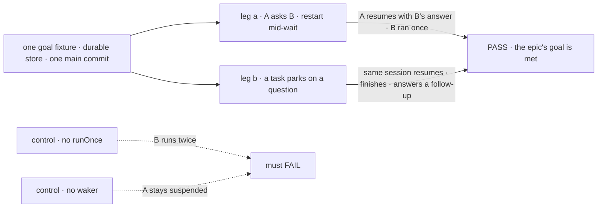
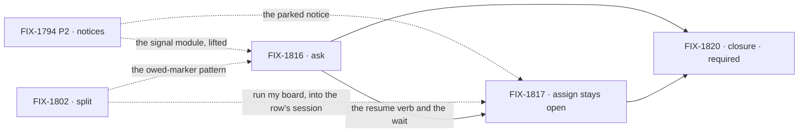

# FIX-1815 · Hand-offs: ask, assign, and sessions that stay open

**Spec** · [Decisions](DECISIONS.md) · [Rules](BUSINESS-RULES.md) · [Plan](PLAN.md) · [Docs](DOCS.md) · [Evolution](EVOLUTION.md)

## Four teams, before and after

| A team that… | Today | After this epic |
|---|---|---|
| **builds a worker that must check with a colleague before it acts** | Dispatches and moves on. The dispatch returns before the colleague does anything, so the answer never reaches the turn that needed it | Asks, waits, and continues the same turn with the colleague's real answer |
| **assigns a job that may need a question answered** | The worker parks the task on its question, and the answer has no path back into the session that asked it ([FIX-1794](https://linear.app/fixpoint-labs/issue/FIX-1794) BR-25) | The answer wakes the same task session, which carries on with everything it already knew |
| **follows up on finished work** | A finished task's session has nothing more to give. A follow-up starts from nothing | Asks the session what it did, or hands it a follow-up task |
| **runs Workforce on a server that restarts** | A restart in the middle of a hand-off can strand the answer, or run the work twice | The hand-off resumes after the restart, and the work ran once |

**Why now.** The other Workforce epic, [FIX-1786](https://linear.app/fixpoint-labs/issue/FIX-1786),
is building the parts both kinds of hand-off wake on: the task notices in FIX-1794's P2 and the
settle-owed marker in [FIX-1802](https://linear.app/fixpoint-labs/issue/FIX-1802). Neither is on
`main` yet. Specifying ask and assign now lets those parts be built once, in a shape both kinds
use, instead of copied later ([D2](DECISIONS.md#d2)). And [FIX-1814](https://linear.app/fixpoint-labs/issue/FIX-1814)
removes skill sub-agents, the only in-turn hand-off a worker had.

## The goal, and how we'll know it's met

**A worker can hand work to another worker and either wait for the answer inside its own turn
(ask), or assign it as a job whose session carries on across turns until it is done and still
answers questions afterward (assign). Both survive a restart without doing the work twice.**

| Is it the right goal? | |
|---|---|
| **The real need** | A hand-off today is thrown over the wall: no answer in the turn, no path back for a parked task's answer, nothing left in a finished session. A restart between the hand-off and the answer is where work gets lost or done twice |
| **Smaller, and rejected** | "Ask ships." FIX-1816 alone meets it, while every assigned task still loses its answer on park, which is the common case on a board. Or "assign stays open" alone, while the support desk's escalation and the coordinator's "ask the delegate" still cannot use the answer in the turn |
| **Bigger, and not this epic's** | Parallel fan-in beyond one-at-a-time resume · an untrusted external inbox · skill helpers · the Shift Manager composer for finished tasks ([FIX-1765](https://linear.app/fixpoint-labs/issue/FIX-1765)) |
| **Not done if** | Every child is Done and FIX-1820's goal check hasn't run · it ran on an in-memory store · the restart came before the hand-off instead of during the wait · either control passed · the follow-up was answered by a new session, not the task's own · a bug the closure run found is open |

Each control removes one half of "survives a restart without doing the work twice". If either
control passes, leg a proved nothing.

| How we verify | |
|---|---|
| **Goal check** | The closure issue's goal check ([FIX-1820](https://linear.app/fixpoint-labs/issue/FIX-1820)): one goal fixture under `goals/`, on a durable store, on one `main` commit after every other child merges ([ER-16](BUSINESS-RULES.md#how-the-set-is-run)) |
| **Signal** | Leg a: worker A asks worker B; the server restarts while A waits; A's turn resumes with B's real answer, and B ran once. Leg b: an assigned task parks on a question; the answer resumes the same task session, which still knows what it did before parking, and finishes; afterward a follow-up question to that session is answered from its history, and a follow-up task is accepted |
| **Input** | Real workers on a real model. The restart is a process stop and start, not a mocked one |
| **Anti-game** | No asserting on a child's own tests. No restart before the ask is dispatched. Leg b's follow-up must name something only the task session could know |
| **Control that must fail** | Without `runOnce`, B runs twice. Without the waker, A stays suspended. Today's `main`: both legs fail |

## While it runs, what it leaves out, and when to stop

**Lead measure.** The set's goal-proven issues, named: each child counts when its own goal check
has passed and then merged. Today: none.

**Not doing.**

- An untrusted external inbox. "Mailbox" stays reserved for it.
- Skill `agents:` back in any form, including a skill's private team.
- Ask and assign merged into one kind.
- A request held open while it waits ([D1](DECISIONS.md#d1)).
- The Shift Manager composer for finished tasks. FIX-1764 and epic FIX-1765 own it; this epic
  settles what a reply does with them ([ER-14](BUSINESS-RULES.md#how-the-set-is-run)).
- A separate issue to retire FIX-1791's delivery-ledger token.
- Parallel fan-in beyond a correct one-at-a-time resume.
- [FIX-1818](https://linear.app/fixpoint-labs/issue/FIX-1818), one fence: cut ([Q1](DECISIONS.md#q1)). Canceled, folded into
  [ER-6](BUSINESS-RULES.md#what-no-child-may-do); its "ask the delegate" and ledger-token question moves into FIX-1816's spec.
- [FIX-1819](https://linear.app/fixpoint-labs/issue/FIX-1819), skill helpers: cut ([Q1](DECISIONS.md#q1)). Backlog,
  unparented, still blocked by FIX-1816; revisited after ask ships.

**Kill line.** If FIX-1816's spec cannot name a shipped caller that needs the answer inside the
same turn, and that assign-plus-park cannot serve, ask is surface we'd carry for nothing. Then the
set stops after the ask spec and ships assign alone. The two candidates are the support desk's
escalation (`apps/kitchen-sink/workforce/blocks/escalate.ts`) and FIX-1791's "ask the delegate".
Note that `escalate` today files a case that nothing drains, and FIX-1792 converts its board, so
it is not yet evidence either way.

## What's in the box

Inside the box are the two kinds and the seam under them, ask's own resume-owed marker among its
parts. The middle row is the reason for the epic's timing: the signal, the owed-marker pattern and
the fence come from FIX-1786 and the board. The signal is lifted here once, the pattern reused,
and nothing copied ([D2](DECISIONS.md#d2), [Q2](DECISIONS.md#q2)).

## The set · as of 2026-10-08

A dated snapshot. Live state is Linear and the implementation PRs. Nothing has started.

| Issue | What it delivers | Why the set needs it | Status |
|---|---|---|---|
| [FIX-1816](https://linear.app/fixpoint-labs/issue/FIX-1816) · ask | Park and resume: an ask is a task on the asker's own board, with `waitForResponse`; the turn resumes with its answer, bounded by a fixed timeout, depth 1 by construction ([D5](DECISIONS.md#d5) rows L1 to L3, L5, L7, L8); lifts the child-finished signal into `orchestration` (L4) | Leg a. Its spec also decides "ask the delegate" and FIX-1537 | Todo · spec route, first |
| [FIX-1817](https://linear.app/fixpoint-labs/issue/FIX-1817) · assign stays open | An answered park resumes the same task session; a finished session answers and takes a follow-up task (L9); an asked task cannot park on a question ([ER-22](BUSINESS-RULES.md#what-a-team-gets-and-what-it-doesnt)) | Leg b | Todo · spec route · build waits on FIX-1802, which follows FIX-1794 P2 ([ER-15](BUSINESS-RULES.md#how-the-set-is-run)) |
| [FIX-1820](https://linear.app/fixpoint-labs/issue/FIX-1820) · closure · **required** | The QA plan and the goal fixture, run on one `main` commit | Proves the whole | Backlog · blocked by every other child |

Two children and a closure, after [Q1](DECISIONS.md#q1)'s cuts; FIX-1818 and FIX-1819 are under
[Not doing](#while-it-runs-what-it-leaves-out-and-when-to-stop). Whether two is really
one: FIX-1817 could ride on FIX-1816, but the two have different callers, different red states,
and different inputs from FIX-1786. The collapse trigger is the kill line: if ask has no caller,
the set is FIX-1817 and the closure.

## How the issues flow into each other

An edge is what one issue hands the next. Dashed edges from the left are inputs from FIX-1786,
not children ([PLAN](PLAN.md#not-children-deliberately)). The edge from ask to assign is soft:
both specs run at once and settle the shared pieces together.

## What stays as it is

- **Dispatch stays fire-and-forget by default.** Ask is an opt-in option on `addTask` ([D4](DECISIONS.md#d4)).
- **The public resume, retry and continue routes** still refuse task and internal sources
  (`engine/src/routes/public-reentry.ts`). The new resume is server-side only.
- **FIX-1786's children**, their specs and code, consumed as they ship ([ER-12](BUSINESS-RULES.md#what-no-child-may-do)).
- **FIX-1312's `from` stamp**, which carries the sender's session and no request id. Ask waits
  on a task row on its own board, not on the stamp (L5).

## Sign off

**[The goal](#the-goal-and-how-well-know-its-met), at that size:** both kinds, both across a
restart, the work once. If wrong: we ship ask while assigned tasks still lose their answer, or
the reverse.

Decided, for the record: [Q1](DECISIONS.md#q1), two issues and a closure, the product owner's
answer on 2026-10-08 ("cut both"). [Q2](DECISIONS.md#q2), who builds the shared waking parts,
settled by the two coordinators on 2026-10-08. [Q3](DECISIONS.md#q3), FIX-1780 stays Done with a
correcting comment, an engineering call on 2026-10-08. [The cross-spec pass](DECISIONS.md#decided-in-the-cross-spec-pass),
authorized by the product owner on 2026-10-08: no `parkOnQuestion` for an asked task (ER-22, a
coordinator call the product owner can overrule), and three consistency fixes. Engineering calls I made as EM: [D1](DECISIONS.md#d1) to [D5](DECISIONS.md#d5).
Rules: [BUSINESS-RULES.md](BUSINESS-RULES.md). Order: [PLAN.md](PLAN.md).

Epic · two children and a closure · Workforce: Shift Manager ·
[FIX-1815](https://linear.app/fixpoint-labs/issue/FIX-1815) · Goal 2 ([`docs/objectives.md`](../../../docs/objectives.md)),
and Goal 1 through the support desk. It closes the durability gap for one-to-one hand-offs
between workers; parallel fan-in and untrusted senders stay open.
