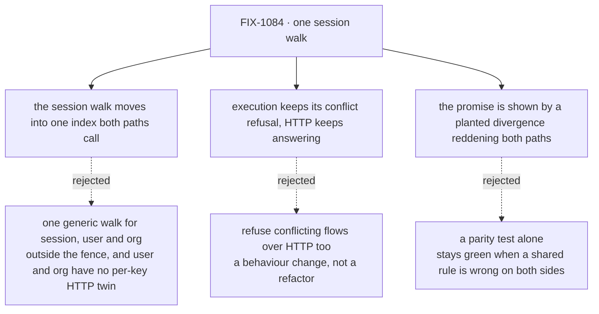

# FIX-1084 · Decisions

[Spec](SPEC.md) · **Decisions** · [Rules](BUSINESS-RULES.md) · [Plan](PLAN.md) · [Docs](DOCS.md)

A behaviour-preserving refactor, fenced before it was specced: *extract and share the
session-shared-key routing only; don't change ownership or routing semantics.* Nothing here is a
business decision, so there are no cards. What was decided is recorded so nobody re-derives it.

## The tree

Solid edges are what the spec does. Dashed edges lost, and the label says why.

## Decided, not asked

- **Only the session walk moves.** The fence says so, and it is also where the risk is: the HTTP
  routes resolve session keys one at a time, while user- and org-scoped HTTP reads go through the
  whole-scope resolver and never re-walk declarations per key.
- **The index reports a conflicting prefix; it does not throw.** Execution throws the existing
  error (same wording, the existing test matches it by regex). The HTTP helpers ignore the report,
  so a flow they answer today they still answer.
- **Declaration order is kept in the prefix list, duplicates included.** The HTTP tie-break for a
  conflicting flow is "first declared wins", and deduplicating the list would change it.
- **The flag predicate (`sharedToLineage === true`) lives once**, beside the index, and both the
  walk and execution's config-based resolution read it.
- **The scope-kind rule and the declaration-based scope id may collapse onto the lineage-scope
  helpers** (`sessionStorageScope`, `sessionResourceScopeId`), if it falls out cleanly. Both are
  already one-line copies that agree. The implementer decides; the goal check does not depend on it.
- **Names are the implementer's.** The issue's `sessionRoutingIndex` is a fine starting point.
- **No changeset.** Nothing a downstream consumer sees changes (BP-022).

## Considered and dropped

| Alternative | Why not |
|---|---|
| Close as done: the tie-break (`resolveOwnershipFlag`) and the lineage id (`resolveLineageId`) are already shared | The walk that feeds them is not. A planted flip in the HTTP walk reddens only HTTP tests (6 red, all HTTP-side), so a change can still land in one path |
| One generic walk for all three scopes, parameterised by flag | Removes more code, and touches `flowIsolation` routing the fence ruled out. Flagged as a follow-up |
| Leave both walks and add a parity test | A parity test compares the two paths, so it stays green when both are wrong the same way, and it does nothing to stop the next edit landing in one copy |
| Execution calls the HTTP helpers directly per key | Each HTTP helper rebuilds the buckets on every call. Execution builds them once per context and should keep doing so |

## Settled

- **The two copies agree today on every shape both can see** — **CONFIRMED**: 12/12 probes across
  7 declaration shapes resolve to the same, expected address on both paths; a flipped HTTP answer
  makes the check fail. The one asymmetry (conflicting prefixes: execution refuses, HTTP answers)
  has no execution address to disagree with. ([POC](poc/parity-today/README.md))
- **The rule is still duplicated on `main`** — **CONFIRMED**: inverting the prefix flag in the
  HTTP copy turned 6 HTTP-side tests red and left every execution test green.
  ([POC → The red state](poc/parity-today/README.md#the-red-state-recorded-not-scripted))

## How it got here

- **Draft** — spot-checked `main`: the Workstream name is gone (`sharedToLineage` now) and the
  tie-break is already shared, but the declaration walk is still two copies; framed as moving that
  walk into one index both paths call, shown by a planted divergence that reddens both. One PR.

**Open: none.**
