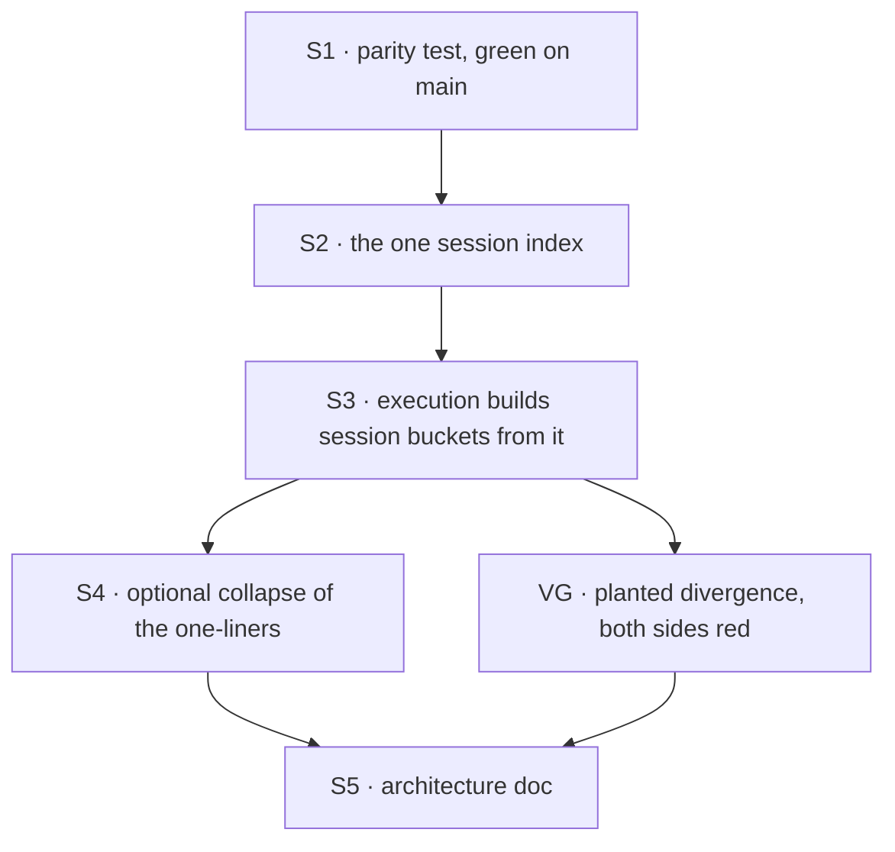

# FIX-1084 · Plan

[Spec](SPEC.md) · [Decisions](DECISIONS.md) · [Rules](BUSINESS-RULES.md) · **Plan** · [Docs](DOCS.md)

Written for the implementing agent. IDs cross-reference [BUSINESS-RULES.md](BUSINESS-RULES.md)
(BR-n). `tdd`, refactor shape: characterise first, then move code under green. One PR.

## Surfaces

| ID | Package · role | Change | Rules |
|---|---|---|---|
| S1 | `engine` · test | **Add** a parity characterisation test from [`poc/parity-today/`](poc/parity-today/README.md): per probe, the absolute address on each path, plus the conflicting-prefix case (execution refuses, HTTP answers). Land it green on today's code first | BR-1 to BR-5 |
| S2 | `engine` · `resources/lineage-scope.ts` | Export one session routing index built from a flow's resources: buckets (singles, prefixes in declaration order), whether anything is shared, and any prefix whose collections disagree on sharing. Export the flag predicate. The existing private walk becomes this | BR-4 BR-5 BR-7 |
| S3 | `engine` · `context/createExecutionContext.ts` | Session buckets come from S2. Throw the existing conflict error from S2's report. The session flag predicate is S2's, in bucket building and in config-based scope-id resolution alike. User and org keep `buildScopeBuckets` as is | BR-4 BR-7 BR-9 |
| S4 | `engine` · `createExecutionContext.ts`, optional | Session branches of the scope-kind and config-based scope-id resolution call the lineage-scope helpers, if clean (DECISIONS → Decided) | BR-1 |
| S5 | `docs/architecture/state-and-scopes.md` | Reconcile "Where resolution happens" per [DOCS.md](DOCS.md) | — |

Removed: execution's session-specific walk (its session call to `buildScopeBuckets` and its local
`sharedToLineage` predicate).

## Sequence



## Checks

| ID | Runs after | Passes when |
|---|---|---|
| V0 | before S1 | The red state reproduces on the base commit: invert the collection-prefix flag in the HTTP walk, run the three lineage test files, and only HTTP-side tests fail. Record the counts, revert. If execution tests also fail, the base already changed: stop and re-read |
| V1 | S1 | Parity test green on the unchanged code |
| V2 | S3 | Conflicting-prefix flow: execution rejects with `/conflicting sharedToLineage/`; the HTTP helper returns the first declaration's address |
| V3 | S3, S4 | V1 still green; the three lineage test files unedited (`git diff --stat` on them is empty) and green; full `pnpm --filter @flow-state-dev/engine test` and `typecheck` green |
| VG | S3 | [The goal](SPEC.md#the-goal-and-how-well-know-its-met): plant the V0 inversion in S2's index; at least one HTTP-side and one execution-side test fail (for example the broad-route get-state test and "shares collection instances across the lineage"). Revert. Quote both runs in the PR |
| V4 | S3 | `grep` over `packages/engine/src` shows one session declaration walk and one `sharedToLineage === true` read (S2's predicate); `createExecutionContext` has no local `sharedToLineage` read, for buckets or for scope ids |

## Pinned names

None. The issue's `sessionRoutingIndex` is a suggestion.

## Guardrails

| Rule | Because |
|---|---|
| One probe manifest: S1 does not fork a second copy of the POC's `shapes[]` matrix. The engine test owns the probes and assertions; the POC stays retained evidence | Two manifests drift, and drift between copies is the failure this issue removes |
| Characterise before moving code, and never edit an existing lineage test | The issue's own scope line: a test that needs editing means the refactor overreached |
| Keep the prefix list in declaration order with duplicates | The HTTP tie-break on conflicting flows is first-declared-wins, and that is observable today (BR-4) |
| Execution still builds its buckets once per context | The HTTP helpers rebuild per call; copying that into execution would add a walk per key read |
| Throw only in execution | Refusing over HTTP too is a behaviour change, out of this issue |
| Keep the null-prototype map and canonical storage keys from the full session config map | An accessor named `__proto__` and unaliased singles (FIX-591) both depend on it |

## Docs

Reconcile [DOCS.md](DOCS.md) after V3; it is one internal architecture paragraph. No site docs.

## Sketch · pseudocode, illustrative

```
session routing index (flow resources):
    for each session-scoped declaration, in order:
        flag = declared shared to lineage
        collection  -> prefix list gets (pattern prefix + "/", or "" ; flag)
                       remember prefix -> flag; a second, different flag is a conflict
        single      -> singles gets (canonical storage key ; flag)
    return buckets, anything shared, conflicts

HTTP helpers:      index -> tie-break -> lineage or session        (unchanged shape)
execution context: index -> throw on conflict -> same tie-break    (session only)
```

**POC:** [`poc/parity-today/`](poc/parity-today/README.md). The premise held: 12/12 probes agree
and match the expected address; the flip control fails. It also produced the red state V0 repeats.

## At implement time

- Re-run V0 on the base commit. If another change has already unified the walk, stop and report.
- Check `docs/architecture/state-and-scopes.md` for edits since this spec; reconcile S5 against
  the current text.

## Follow-ups

- The user and org `flowIsolation` buckets are still built by a loop shaped like the session one.
  No HTTP per-key twin, so no split-brain, but a generic walk would remove it. Out of the fence;
  `improve-codebase-architecture`.
- `sessionResourceScopeId` has no callers today (per the architecture doc). S4 may give it one; if
  not, it is dead code to mention, not delete, here.
- Conflicting-prefix collections could be refused when the flow is defined, so HTTP and execution
  refuse together. A behaviour change; its own issue.

## Notes from review

Recorded verbatim for the implementer to weigh against real code. Not folded into the design.

- **Cursor (review 5372028600):** "The V0 / “red state” ritual (invert HTTP walk → run three test files → 6 HTTP-only failures) appears in SPEC, PLAN, DECISIONS Settled, and the POC README. **PLAN Checks (V0, VG) should be the single step-by-step owner**; elsewhere one sentence + link is enough."
- **Cursor:** "DECISIONS’ mermaid tree largely duplicates the “Considered and dropped” table — the table is enough; the diagram is optional trim."
- **Cursor (SPEC.md line 50):** "This row repeats PLAN V0 in full. For maintainability, a pointer to **PLAN.md → V0** (canonical checklist) plus “record counts in the implementation PR” would trim drift if file names or counts change."
- **Cursor (PLAN.md S2):** "Smallest S2 surface may be **export today’s private `sessionOwnership` + conflict report** (execution’s `prefixFlag` logic), rather than introducing a parallel `sessionRoutingIndex` type unless naming clarity wins. Same walk, less new API — optional implementer note, not a spec requirement."
- **Cursor:** "HTTP still rebuilds the index per `sessionKeyScopeId` call; FIX-1084 is correctness/dedup, not HTTP amortization. Pre-existing: `resource-routes.ts` sometimes calls `sessionKeyScopeId` twice on one request; whole-scope session reads can walk twice via `readSessionScopeWithLineage`. Memoization or passing a built index per request would be perf wins **without** widening this fence."
- **Second-look (PR comment 5919754871), item 1:** "add one small exported helper for the collection storage prefix (pattern prefix plus `/`, or `""`). The index and the user/org builder both call it. That is about 3 lines and removes the one piece of real rule logic still duplicated beside the new index." (The BR-7 / V4 overclaim itself was corrected in-spec; the helper is the implementer's call.)
- **Second-look, item 2:** "if the implementer finds the generic form falls out with no signature contortions (the index takes `flagOf` and scope), doing it here is smaller than leaving a twin loop. Leave that to them."
- **Second-look, item 3:** "`sessionResourceScopeId` and `sessionKeyScopeId` both take a `tenantId` parameter they never read. The plan already touches these signatures (S4). Dropping the param is cheap now, and it would be a wider change once more callers exist. The same applies to `resource-routes.ts`, which passes `ctx.tenantId` at about 6 call sites."
- **Second-look, item 3:** "Once the index is one exported value, a `WeakMap` keyed on `flow.resources` would make per-request resolution O(1) builds. It isn't needed for the goal, so skip it here unless a hot route shows up in profiling."
