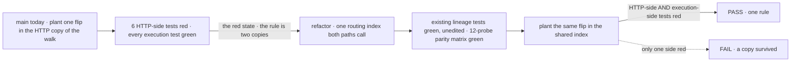

# FIX-1084 · Session-shared-key routing rule is implemented twice (HTTP routes vs. execution context), not derived from one place

**Spec** · [Decisions](DECISIONS.md) · [Rules](BUSINESS-RULES.md) · [Plan](PLAN.md) · [Docs](DOCS.md)

Improvement · refactor, behaviour-preserving · `packages/engine` only · small · 1 PR · no epic ·
follows [FIX-1068](https://github.com/fixpoint-labs/flow-state-dev/pull/1180)

## Four people, before and after

| Someone who… | Today | After |
|---|---|---|
| **writes a block that reads a lineage-shared resource** | Reads the row the HTTP routes also address, because two copies of the rule happen to agree | Reads the same row, because there is one rule |
| **reads or writes that resource over HTTP** (the resource and state routes) | Same answer as the block, by the same coincidence | Same answer, by construction |
| **changes which session a key belongs to** (a new routing flag, a prefix-matching tweak) | Has to edit two copies. Editing only the HTTP one turns only the HTTP tests red, so the miss can ship | Edits one place. The HTTP tests and the execution tests both go red on a wrong edit |
| **declares two collections on one prefix with conflicting sharing** | Actions refuse the flow; the HTTP routes still answer | Unchanged, both halves |

## The goal, and how we'll know it's met

**Which storage address a session-scoped key resolves to (the running session, or the lineage it
shares) is decided by one piece of code that both the HTTP routes and the execution context call,
so one wrong edit to that rule turns both paths' tests red, and every key resolves where it does
today.**

| Is it the right goal? | |
|---|---|
| **The real need** | "The shared-key/prefix-derivation rule exists in exactly one place, consumed by both the HTTP routes and the execution context, so a future change to the rule cannot land in only one of the two paths." Zero behaviour change (the issue) |
| **Smaller, and rejected** | Only the tie-break rule shared. That is already true on `main`: `resolveOwnershipFlag` and `resolveLineageId` are each called by both paths. The declaration walk that feeds them is still written twice, and a planted flip there reddens the HTTP tests alone (evidence below). Sharing the tie-break was not enough to meet the need |
| **Bigger, and not this issue's** | The same walk for user- and org-scoped `flowIsolation` buckets. Those have no HTTP twin that routes per key, so they have no split-brain to close. Fenced out, flagged as a follow-up |
| **Not done if** | Any key resolves to a different address, or scope kind, on either path · an existing test is edited · a planted divergence in the shared rule still leaves one path's tests green · the HTTP routes start refusing a flow they answer today · execution stops refusing a flow it refuses today |

The same planted edit is the probe before and after: today it proves there are two copies, and
after it proves there is one.

| How we verify | |
|---|---|
| **Goal check** | Plant a divergence in the shared routing index (invert the sharing flag on collection prefixes) and run `packages/engine/test/shared-to-lineage*.test.ts` plus the promoted parity matrix |
| **Signal** | At least one HTTP-route or whole-scope-read test **and** at least one execution-path test (eager bucket scan or `ctx.resources` read) fail. Revert: all green, with the three existing lineage test files unedited |
| **Input** | The 12-probe declaration matrix in [`poc/parity-today/`](poc/parity-today/README.md): shared and private singles, an unaliased single, static and empty prefixes, a private prefix nested under a shared one in both declaration orders, two collections on one prefix |
| **Anti-game** | The parity matrix asserts each path's absolute address per probe, not only that they agree, so a rule that is wrong the same way on both sides still fails |
| **Control that must fail** | Run on `main` before the refactor: the same planted flip in the HTTP copy leaves every execution-path test green (recorded: 6 red, all HTTP-side, 19 green). If that red state cannot be produced, the check is not reaching the duplication |

## What changes

Read the left column: two walks become one, and everything to the right of it was already shared.

**How:** move the session walk (which declarations are session-scoped, the sharing flag, singles by
canonical storage key, collections by pattern prefix) into one exported index in
`resources/lineage-scope.ts`. The execution context builds its session buckets from it and keeps
its own conflict refusal. User and org buckets are untouched.

## What stays as it is

- **Every address.** No resource, collection instance or key moves between the session and
  lineage namespaces, on either path.
- **The refusal.** Execution still refuses two collections on one prefix with conflicting
  sharing, with the same message. The HTTP routes still answer for such a flow, first declaration
  winning the tie, as they do today ([BR-4](BUSINESS-RULES.md#conflicts)).
- **User and org routing** (`flowIsolation`), the public API, and the docs site.

## Sign off

**[The goal](#the-goal-and-how-well-know-its-met), at that size:** one session walk, both paths,
no address moves. If wrong: we either leave the walk duplicated and the issue open, or widen a
refactor into user/org routing the fence ruled out.

No decision cards. The calls this spec makes are the implementer's or already made by the fence;
they are recorded in [DECISIONS.md → Decided, not asked](DECISIONS.md#decided-not-asked).

**Open: none.** The cases: [BUSINESS-RULES.md](BUSINESS-RULES.md). The build: [PLAN.md](PLAN.md).
