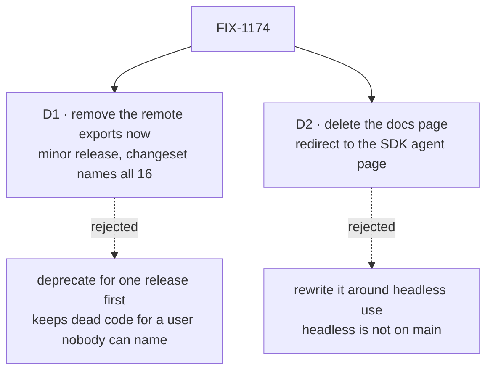

# FIX-1174 · Decisions

[Spec](SPEC.md) · **Decisions** · [Rules](BUSINESS-RULES.md) · [Plan](PLAN.md) · [Docs](DOCS.md)

Two decisions are the sign-off surface. Everything else here is context for them.

## The tree

Solid edges are what you're signing. Dashed edges lost, and the label says why.

## D1 · The remote exports are removed outright in a `minor` release, with a changeset naming all sixteen

| | |
|---|---|
| **Instead of** | Marking them `@deprecated` for one release and removing them in the next — the precedent the package root's envelope aliases set |
| **Because** | Nobody we can find is on the other side. No tracked file outside the package imports `/cli` (the scan), the path is labelled experimental, and it only runs under a pseudo-terminal wrapper. A deprecation release keeps sixteen names, their tests and their docs alive for a user nobody can name. The package is pre-1.0, where a `minor` is the version bump that signals a break (BP-022). Removing what earns nothing is tenet 3 |
| **Locks in** | From the next minor on, `/cli` exports only the resolver seam. Anyone pinned to 0.1.x keeps the path until they upgrade; an outside user who upgrades gets an import error, and the changeset is their only notice |

It comes down to who is on the other side: nobody we can find, so a warning release warns no one.

**What would change my mind:** evidence of a real outside user of `/cli` — an issue, a
dependent package, a message. Then deprecate for one release first; the rest of the plan is
unchanged. The package shows about 440 downloads a month, which counts every install of any
entry point and cannot separate `/cli` from `/sdk`.

## D2 · The remote-dispatch docs page is deleted and its address redirected to the SDK agent page

| | |
|---|---|
| **Instead of** | Retitling and rewriting the page around headless use, which the issue offered as the other option |
| **Because** | The headless path the issue describes (`runClaudeHeadless`) is not on `main`: it lived on a Conductor pull request that closed unmerged. A rewrite would document a feature that does not ship. What is left in `/cli` — a resolver seam nothing in the package consumes any more — is not a docs-site topic |
| **Locks in** | The Tools sidebar has one Claude Code page. The remaining resolver seam is documented in the package README only. The old URL keeps working through the site's existing redirect list |

It comes down to whether the subject ships: headless isn't on `main`, so a rewrite documents nothing real.

**What would change my mind:** the headless path landing on `main` before this is implemented.
Then its own issue writes a headless page, and this one still deletes the remote page.

## Decided, not asked

- **The `/cli` subpath stays, exporting the resolver seam and the shared envelope re-exports.**
  The coordinator fenced the resolver; dropping the subpath would break its callers too.
- **The resolver's own doc comments are left as they are**, though they mention "the dispatch
  block". The fence says untouched; the stale wording is a follow-up.
- **Two doc comments outside the fence are corrected**: the SDK capability's header ("Mirrors
  `createClaudeCliCapability`") and core's harness-source example (`claude-code/cli-remote`).
  Provenance after a removal (BP-034), comment-only.
- **The package description** (`package.json`) and the repo's package map in `CLAUDE.md` stop
  saying "dispatch cloud coding tasks". Otherwise the first line a reader sees describes the
  removed path.
- **No replacement is offered.** The `/sdk` agent is named as the nearest thing, and the release
  note says plainly it is not a drop-in.

## Considered and dropped

| Alternative | Why not |
|---|---|
| Remove the whole `/cli` subpath | Outside the fence: the resolver seam lives there |
| Keep the page with an "experimental, being removed" banner | Documents a path we are deleting in the same release |
| Remove only source and tests, leave docs for a follow-up | The half a reader sees is the docs; the issue asks for both |

## How it got here

- **Draft** — framed as dead-code removal with one docs call; found the issue's headless premise
  is not on `main`, so the docs call became delete-and-redirect; one PR, changeset `minor`.

**Open: none.**
