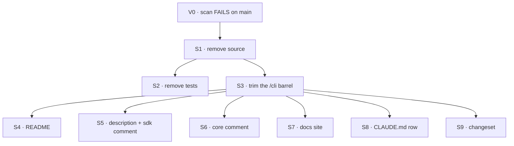

# FIX-1174 · Plan

[Spec](SPEC.md) · [Decisions](DECISIONS.md) · [Rules](BUSINESS-RULES.md) · **Plan** · [Docs](DOCS.md)

Written for the implementing agent. IDs cross-reference [BUSINESS-RULES.md](BUSINESS-RULES.md)
(BR-n) and [DECISIONS.md](DECISIONS.md) (D-n). Removal, so no `tdd` red-green loop: the red state
is the reference scan failing on today's `main`. One PR.

## Surfaces

| ID | Package · file or role | Change | Rules |
|---|---|---|---|
| S1 | `claude-code` · `src/cli/` | **Remove** `dispatch.ts`, `capability.ts`, `parse-output.ts`, `pty-exec.ts`, `types.ts`, `errors.ts` | BR-1 |
| S2 | `claude-code` · `test/` | **Remove** `dispatch.spec.ts`, `capability.spec.ts`, `parse-output.spec.ts`, `pty-exec.spec.ts` | BR-3 |
| S3 | `claude-code` · `src/cli/index.ts` | Keep only the resolver-seam exports and the shared-envelope re-exports; rewrite the header comment to say that | BR-1 BR-4 |
| S4 | `claude-code` · `README.md` | Remove the CLI quick start, "How it works (CLI)", the TTY section, the remote handle under "Session state", "Limitations" and "Choosing `/cli` or `/sdk`"; rewrite the intro; keep the SDK sections intact — several are H3s under "Session state" and need a parent heading. Content in [DOCS.md](DOCS.md) | BR-2 |
| S5 | `claude-code` · `package.json` `description` · `src/sdk/capability.ts` header | Describe the package without the remote path; drop the "Mirrors `createClaudeCliCapability`" line (comment only) | BR-2 |
| S6 | `core` · `src/types/harness.ts` | Comment only: drop `claude-code/cli-remote` from the `HarnessSource` examples | BR-2 |
| S7 | `apps/docs` | **Remove** `docs/tools/claude-code-cli.md` and its `sidebars.ts` entry; add the redirect to `docusaurus.config.ts`; edit four linking pages per [DOCS.md](DOCS.md) (D2) | BR-7 BR-8 BR-9 |
| S8 | repo · `CLAUDE.md` package map | The `@flow-state-dev/claude-code` row stops saying "dispatch cloud coding tasks" | BR-2 |
| S9 | `.changeset/` | One `minor` fragment for `@flow-state-dev/claude-code`, text in [DOCS.md](DOCS.md) (D1) | BR-10 |

**Fenced — do not edit:** `src/cli/resolve-cli.ts`, `test/resolve-cli.spec.ts`, anything headless
or Conductor.

## Sequence

## Checks

| ID | Runs after | Passes when |
|---|---|---|
| V0 | before S1 | `bash specs/issues/FIX-1174/poc/reference-scan/scan.sh` **FAILS** on the branch point (re-derive the count at implement time; it drifts) — the control that must fail |
| V1 | S3 | `/cli`'s barrel exports exactly the resolver seam and the shared re-exports; no removed name resolves |
| V2 | S4–S8 | The scan **PASSES** (0 live files), and `scan.sh --control` **FAILS** listing exactly the planted file |
| V3 | S2 S3 | `pnpm --filter @flow-state-dev/claude-code test` and `… typecheck` green (the typecheck includes `tsconfig.test-d.json`) |
| V4 | S3 | `git diff origin/main -- packages/claude-code/src/cli/resolve-cli.ts packages/claude-code/test/resolve-cli.spec.ts` is empty |
| V5 | S3 | Typecheck and test green for every dependent: `@flow-state-dev/integration-tests`, `@flow-state-dev/conductor` (`labs/`), `@flow-state-dev/fsd-coding-skill` (`labs/`), and `@flow-state-dev/goals` (typecheck only; it has no test script); plus `pnpm --filter @flow-state-dev/core typecheck` after S6. Re-derive the dependent list with a search for `"@flow-state-dev/claude-code"` in `package.json` files rather than trusting this one |
| V6 | S7 | `pnpm --filter @flow-state-dev/docs build` green with `onBrokenLinks: "throw"` unchanged; the build output holds a redirect page for `/docs/tools/claude-code-cli` pointing at `/docs/tools/claude-code-sdk` |
| V7 | S9 | The changeset names all sixteen removed exports and matches [DOCS.md](DOCS.md) |

The second path (BP-035): a caller of the old names, which is exactly what `--control` plants.

## Pinned names

| Where | Name | Why pinned |
|---|---|---|
| Redirect target | `/docs/tools/claude-code-sdk` | Public URL; D2 |
| Changeset bump | `minor` | Pre-1.0 break signal; D1 |

## Guardrails

| Rule | Because |
|---|---|
| Change no behaviour; if removal turns out to need one, stop and raise it | The coordinator scoped this as subtraction only; a behaviour change needs its own gate |
| Leave the fenced files byte-identical, including their stale comments | The fence is explicit; V4 proves it |
| Don't relax `onBrokenLinks` or add an ignore to make the docs build pass | A relaxed check is how a dangling link ships; fix the link |
| Don't touch changelogs or `docs/internal/archive/` | History; the scan allows it on purpose |

## Docs

Publish [DOCS.md](DOCS.md) in the same PR as the removal (S4, S7, S9). No new page.

## POC

**`poc/reference-scan/scan.sh`** — the spec's factual base as an executable check. It reads
every tracked file (`git ls-files`, a totality scan rather than a list of known sites) for the
sixteen names, the session key, the handle source string and the docs phrases. At spec time it
reported **20 live files** and 5 history files; its `--control` run planted one unlisted import
and reported it (21). It found one mention the hand search missed: the SDK capability's header
comment (now S5). The premise — no code consumer outside the package — held: the only live hits
outside `packages/claude-code` are docs, the sidebar and one core comment.

## At implement time

- Re-check that no open PR has started importing `/cli` or linking the page; rerun V0 first.
- If the headless path has landed on `main` since, D2 still deletes this page; say so on the PR.

## Follow-ups

- `src/cli/resolve-cli.ts` now has no consumer in the package and its header still describes
  "the dispatch block". Whether the seam stays, and how it is described, belongs to whoever owns
  the headless path. Flag to the coordinator; not in scope (fenced).

## Notes from review

Recorded verbatim for the implementer to weigh against real code; not folded into the design.

- **cursor[bot], review summary:** "BR-1 through BR-10 and V0 through V7 largely restate the goal in `SPEC.md`; one check table in `PLAN.md` may be enough for implementers. Five linked docs plus three SVGs is template-heavy for a deletion issue but internally consistent."
- **cursor[bot], PLAN.md (V2 / scan):** "If this script is wired to CI: per-file `grep` is slow at repo scale; one `git grep -E` plus the history filter preserves semantics and is much cheaper."
- **cursor[bot], PLAN.md (Follow-ups):** "After removal, `/cli` is mostly a fenced resolver seam with stale dispatch wording. If implement-time search still finds zero importers, re-ask whether keeping `/cli` earns anything vs deleting the subpath in a follow-up."
- **PR comment (second look), finding 1:** "After this PR, `/cli` exists only to export `defaultResolveClaudeCli` / `defaultClaudeCliExec` — a spawn-based resolver with **no consumer in the repo** … **Recommendation:** ask whoever fenced it (PLAN → Follow-ups) *now*, before merge, whether the seam ships to the headless owner's branch instead of staying on `main`. If the answer is \"keep\", fine, but record it in DECISIONS as a decision (D3), not only a fence … **What would change my mind:** a concrete, scheduled headless PR that imports it." *(Triage: already in DECISIONS → Settled as a coordinator fence, with "remove the whole `/cli` subpath" under what lost; raised to the coordinator as the follow-up above.)*
- **PR comment (second look), smaller notes:** "`shared/` still exports `RemoteAgentTaskHandle`/`RemoteAgentSource`/`RemoteAgentStatus` (re-exported from the root and `/sdk`). After removal the only producer of a *remote* handle is gone. Not this PR's job, but say in the PR whether that envelope is intentionally kept as the headless path's contract, otherwise it's the next dead-surface cleanup." · "S3 keeps \"the shared-envelope re-exports\" on `/cli`. Root and `/sdk` already export them; on an entry reduced to the resolver seam they're redundant. Consider dropping them with the rest (only matters if the seam stays)." · "D1's evidence (\"~440 downloads/month, can't separate `/cli` from `/sdk`\") is weak in either direction. The changeset text is the only notice, so make sure it says the `/sdk` agent isn't a drop-in (already in SPEC; confirm it lands in the fragment)." · "BP-035 second path: … Also grep `apps/kitchen-sink` and `goals/` for `claude-code/cli` type-only or dynamic imports; `git ls-files` scanning covers it, but confirm the scan's name list includes `ClaudeCliNotFoundError`/`ClaudeRemoteDispatchError` (they're in the barrel)." *(The scan's pattern does include both error names.)*
